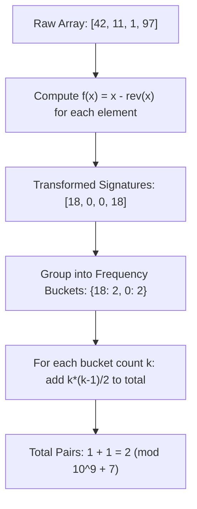

# Guided Example: Count Nice Pairs in an Array

We trace the step-by-step evaluation of nice pairs via algebraic separation and hash-map frequency counting on a representative problem instance:

- **Input:** `nums = [42, 11, 1, 97]`
- **Required Output:** `2`

This instance demonstrates how rearranging a coupled relation between two indices into independent individual signatures transforms an $\mathcal{O}(n^2)$ pair comparison problem into an $\mathcal{O}(n)$ hash-based frequency aggregation.

---

## 1. Instance & Teaching Goal

We are given an array of non-negative integers `nums`. Let $\text{rev}(x)$ denote the integer formed by reversing the decimal digits of $x$ (for example, $\text{rev}(123) = 321$ and $\text{rev}(120) = 21$).
A pair of indices $(i, j)$ is called **nice** if:
1. $0 \le i < j < n$
2. $\text{nums}[i] + \text{rev}(\text{nums}[j]) = \text{nums}[j] + \text{rev}(\text{nums}[i])$

We want to count the total number of nice pairs modulo $10^9 + 7$.

For the input array `nums = [42, 11, 1, 97]`:
- Pair $(0, 3)$: $\text{nums}[0] = 42, \text{nums}[3] = 97$.
  $$\text{nums}[0] + \text{rev}(\text{nums}[3]) = 42 + 79 = 121$$
  $$\text{nums}[3] + \text{rev}(\text{nums}[0]) = 97 + 24 = 121$$
  This pair is nice.
- Pair $(1, 2)$: $\text{nums}[1] = 11, \text{nums}[2] = 1$.
  $$\text{nums}[1] + \text{rev}(\text{nums}[2]) = 11 + 1 = 12$$
  $$\text{nums}[2] + \text{rev}(\text{nums}[1]) = 1 + 11 = 12$$
  This pair is nice.

No other pairs satisfy the condition, so the total count is $2$.

The teaching goal is to demonstrate that testing all pairs $(i, j)$ directly requires quadratic time $\mathcal{O}(n^2)$. By algebraically isolating all terms containing index $i$ on one side and all terms containing index $j$ on the other, each element is transformed into an independent invariant signature $f(x) = x - \text{rev}(x)$, allowing an optimal $\mathcal{O}(n)$ solution.

---

## 2. Conceptual Foundation & Invariants

### Algebraic Decoupling

The defining condition is:
$$\text{nums}[i] + \text{rev}(\text{nums}[j]) = \text{nums}[j] + \text{rev}(\text{nums}[i])$$

Subtract $\text{rev}(\text{nums}[j])$ and $\text{rev}(\text{nums}[i])$ from both sides:
$$\text{nums}[i] - \text{rev}(\text{nums}[i]) = \text{nums}[j] - \text{rev}(\text{nums}[j])$$

Define the univariate mapping:
$$f(x) = x - \text{rev}(x)$$

The condition for $(i, j)$ to be a nice pair is therefore equivalent to:
$$f(\text{nums}[i]) = f(\text{nums}[j])$$

### Decoupled Pair Invariant Theorem

> **Algebraic Decoupling & Difference Hash Invariant Theorem.**
> A pair of indices $(i, j)$ with $i < j$ forms a nice pair if and only if $f(\text{nums}[i]) = f(\text{nums}[j])$, where $f(x) = x - \text{rev}(x)$.
> The equality relation partitions the array indices into disjoint equivalence classes according to their signature value $d = f(\text{nums}[k])$.
> If an equivalence class for signature $d$ contains $k$ indices, any two distinct indices in this class form a nice pair. The number of nice pairs contributed by this class is:
> $$\binom{k}{2} = \frac{k(k - 1)}{2}$$
> The total number of nice pairs across all equivalence classes is:
> $$\sum_{d} \binom{k_d}{2} \pmod{10^9 + 7}$$

---

## 3. Step-by-Step Worked Execution

We trace the algorithm on `nums = [42, 11, 1, 97]`.

---

### Step 1: Compute Signatures for Each Element

We evaluate $x$, $\text{rev}(x)$, and $f(x) = x - \text{rev}(x)$ sequentially:

1. **Element at index $0$:** $x = 42$
   - Reverse digits: $\text{rev}(42) = 24$
   - Signature: $f(42) = 42 - 24 = 18$

2. **Element at index $1$:** $x = 11$
   - Reverse digits: $\text{rev}(11) = 11$
   - Signature: $f(11) = 11 - 11 = 0$

3. **Element at index $2$:** $x = 1$
   - Reverse digits: $\text{rev}(1) = 1$
   - Signature: $f(1) = 1 - 1 = 0$

4. **Element at index $3$:** $x = 97$
   - Reverse digits: $\text{rev}(97) = 79$
   - Signature: $f(97) = 97 - 79 = 18$

Transformed array of signatures: `[18, 0, 0, 18]`.

---

### Step 2: Build Frequency Distribution

Group the signatures into a frequency hash map:
- Signature $18$: occurs at indices $\{0, 3\} \implies \text{frequency } k_{18} = 2$
- Signature $0$: occurs at indices $\{1, 2\} \implies \text{frequency } k_0 = 2$

---

### Step 3: Compute Pair Combinations

For each signature bucket with count $k$:
- **Bucket $d = 18$ with $k = 2$:**
  $$\text{Pairs} = \frac{2 \times (2 - 1)}{2} = \frac{2}{2} = 1$$
  (Corresponds to index pair $(0, 3)$)

- **Bucket $d = 0$ with $k = 2$:**
  $$\text{Pairs} = \frac{2 \times (2 - 1)}{2} = \frac{2}{2} = 1$$
  (Corresponds to index pair $(1, 2)$)

---

### Step 4: Sum and Modulo

- Accumulate all combinations:
  $$\text{Total} = 1 + 1 = 2$$
- Take modulo $10^9 + 7$:
  $$2 \pmod{10^9 + 7} = 2$$

Final output: **`2`**.

---

## 4. Complete Execution Trace

| Index $i$ | Value $\text{nums}[i]$ | Reversed $\text{rev}(\text{nums}[i])$ | Signature $f(\text{nums}[i])$ | Hash Map State after Element | New Pairs Added Online |
|:---:|:---:|:---:|:---:|:---|:---:|
| $0$ | $42$ | $24$ | $18$ | $\{18: 1\}$ | $0$ |
| $1$ | $11$ | $11$ | $0$ | $\{18: 1, 0: 1\}$ | $0$ |
| $2$ | $1$ | $1$ | $0$ | $\{18: 1, 0: 2\}$ | $1$ (with index $1$) |
| $3$ | $97$ | $79$ | $18$ | $\{18: 2, 0: 2\}$ | $1$ (with index $0$) |

Total online sum of added pairs: $0 + 0 + 1 + 1 = 2$.

---

## 5. Algorithmic Correctness

**Soundness.** For any pair $(i, j)$ with $i < j$, the equality $\text{nums}[i] - \text{rev}(\text{nums}[i]) = \text{nums}[j] - \text{rev}(\text{nums}[j])$ is mathematically identical to $\text{nums}[i] + \text{rev}(\text{nums}[j]) = \text{nums}[j] + \text{rev}(\text{nums}[i])$ via elementary field axioms of addition and subtraction. Every pair of indices within the same signature bucket satisfies the nice-pair definition.

**Completeness.** Two indices $i$ and $j$ in different signature buckets satisfy $f(\text{nums}[i]) \neq f(\text{nums}[j])$, which directly implies $\text{nums}[i] + \text{rev}(\text{nums}[j]) \neq \text{nums}[j] + \text{rev}(\text{nums}[i])$. Thus, no valid nice pair can span across different signature buckets, and all valid pairs are captured by summing $\binom{k}{2}$ over every bucket.

---

## 6. Traps This Instance Exposes

- **Quadratic Comparison Timeout:** Checking all pairs via nested loops takes $\mathcal{O}(n^2)$ time. For $n = 10^5$, this requires $5 \times 10^9$ operations, causing a time limit exceeded.
- **Negative Differences:** $x - \text{rev}(x)$ can be negative (e.g. for $x = 13$, $\text{rev}(x) = 31$, so $f(x) = 13 - 31 = -18$). The hash table must safely accommodate negative integer keys without array indexing errors.
- **Trailing Zeros in Numbers:** For $x = 120$, $\text{rev}(x) = 21$. Reversing must properly treat leading zeros in the reversed number, producing the integer $21$, so $f(120) = 120 - 21 = 99$.
- **Modular Arithmetic:** The total count can grow up to $\binom{10^5}{2} \approx 5 \times 10^9$, which exceeds a 32-bit signed integer. The sum must be reduced modulo $10^9 + 7$.

---

## 7. Complexity Derivation

- **Time Complexity:** $\mathcal{O}(n \log_{10} M)$, where $n$ is the number of elements in `nums` and $M = \max(\text{nums}) \le 10^9$. For each element, extracting decimal digits to compute $\text{rev}(x)$ takes $\mathcal{O}(\log_{10} M) \le 10$ operations. Hash map lookups and insertions operate in $\mathcal{O}(1)$ average time, resulting in overall $\mathcal{O}(n)$ time.
- **Auxiliary Space Complexity:** $\mathcal{O}(n)$ to store the frequency map of at most $n$ distinct difference signatures.
