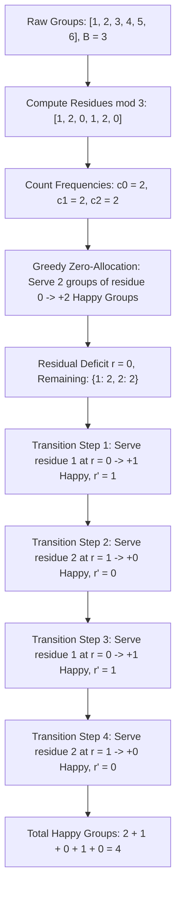

# Guided Example: Maximum Number of Groups Getting Fresh Donuts

We trace the step-by-step optimization of group ordering via modular equivalence and memoized state-space search on a representative problem instance:

- **Input:** `batchSize = 3, groups = [1, 2, 3, 4, 5, 6]`
- **Required Output:** `4`

This instance demonstrates how modular arithmetic partitions groups into residue classes, isolates zero-remainder groups as guaranteed happy allocations, and compresses the remaining permutation search into a compact memoized transition system.

---

## 1. Instance & Teaching Goal

A store bakes donuts in batches of size $B = \text{batchSize} = 3$.
- Groups of customers arrive in some chosen order, with sizes given by `groups = [1, 2, 3, 4, 5, 6]`.
- Donuts are served from the current batch. When a batch is exhausted, a fresh batch of $B$ donuts is baked immediately.
- A group is **happy** if they arrive when there are $0$ leftover donuts (meaning all previous groups consumed an exact multiple of $B$, so this group receives freshly baked donuts). The very first group is always happy.
- We must find an arrangement of groups that maximizes the count of happy groups.

In our instance:
- `groups` has $6$ elements: $[1, 2, 3, 4, 5, 6]$.
- Total people = $1 + 2 + 3 + 4 + 5 + 6 = 21$, which is $7$ batches of $3$.
- If scheduled as $[3, 6, 1, 2, 4, 5]$:
  - Group $1$ (size $3$): starts at deficit $0 \implies$ **Happy** ($+1$). Consumes $3 \to$ leftover deficit $0$.
  - Group $2$ (size $6$): starts at deficit $0 \implies$ **Happy** ($+1$). Consumes $6 \to$ leftover deficit $0$.
  - Group $3$ (size $1$): starts at deficit $0 \implies$ **Happy** ($+1$). Consumes $1 \to$ leftover deficit $1$.
  - Group $4$ (size $2$): starts at deficit $1 \implies$ Unhappy ($+0$). Consumes $2 \to$ leftover deficit $(1 + 2) \bmod 3 = 0$.
  - Group $5$ (size $4$): starts at deficit $0 \implies$ **Happy** ($+1$). Consumes $4 \to$ leftover deficit $(0 + 4) \bmod 3 = 1$.
  - Group $6$ (size $5$): starts at deficit $1 \implies$ Unhappy ($+0$). Consumes $5 \to$ leftover deficit $(1 + 5) \bmod 3 = 0$.
- Total happy groups = $4$.

The teaching goal is to see why individual group sizes can be reduced modulo $B$, why groups with $g \equiv 0 \pmod B$ are scheduled immediately without loss of generality, and how complementary remainders cancel to reset the deficit back to $0$.

---

## 2. Conceptual Foundation & Invariants

### Modular Deficit State

Let $C$ denote the cumulative number of donuts consumed by all preceding groups.
The number of leftover donuts in the active batch is $(-C) \bmod B$, and the deficit relative to a complete batch is:
$$r = C \bmod B \in [0, B - 1]$$

A newly arriving group of size $g$ gets fresh donuts if and only if $r = 0$.
After serving this group, the new deficit becomes:
$$r' = (r + g) \bmod B = (r + (g \bmod B)) \bmod B$$

Because transitions depend solely on $g \bmod B$, two groups with the same remainder modulo $B$ are completely interchangeable.

### Modular Invariant & Remainder State Compression Theorem

> **Modular Invariant & Remainder State Compression Theorem.**
> Let $B = \text{batchSize}$.
> 1. **Zero-Remainder Greedy Decoupling:** Any group with $g \equiv 0 \pmod B$ leaves the deficit unchanged ($(r + 0) \bmod B = r$). Scheduling all $c_0$ groups with remainder $0$ first (when $r = 0$) guarantees that all $c_0$ groups are happy and leaves the deficit at $0$. No rearrangement can yield more than $c_0$ happy groups from this subset.
> 2. **Complementary Cancellation:** For non-zero remainders, pairing a group of remainder $i$ with a group of remainder $B - i$ forms a composite block of size $B \equiv 0 \pmod B$. The first group in the pair is happy (if starting at $r = 0$), and the pair resets the deficit back to $0$.
> 3. **State Compression:** Because $B \le 9$, the counts of remaining groups for each non-zero remainder $i \in [1, B - 1]$ can be tracked as a tuple $(c_1, c_2, \dots, c_{B-1})$. The current deficit $r$ is uniquely determined by the initial deficit minus the total remainder consumed:
>    $$r = \left(-\sum_{i=1}^{B-1} i \cdot c_i \right) \bmod B$$
>    The maximum happy groups from state $(c, r)$ satisfies the optimal substructure recurrence:
>    $$F(c, r) = \max_{1 \le i < B, \, c_i > 0} \left( [r == 0] + F(c - e_i, (r + i) \bmod B) \right)$$

---

## 3. Step-by-Step Worked Execution

We trace $B = 3$ and `groups = [1, 2, 3, 4, 5, 6]`.

---

### Step 1: Compute Residues Modulo $3$

Compute $g \bmod 3$ for each group:
- $1 \bmod 3 = 1$
- $2 \bmod 3 = 2$
- $3 \bmod 3 = 0$
- $4 \bmod 3 = 1$
- $5 \bmod 3 = 2$
- $6 \bmod 3 = 0$

Residue multiset: $\{0, 0, 1, 1, 2, 2\}$.
Frequency table:
- $c_0 = 2$ (from groups $3$ and $6$)
- $c_1 = 2$ (from groups $1$ and $4$)
- $c_2 = 2$ (from groups $2$ and $5$)

---

### Step 2: Greedily Serve Zero-Residue Groups

Initialize total happy groups count $\text{ans} = 0$ and running deficit $r = 0$.
- Serve first group of residue $0$:
  - Arrives at $r = 0 \implies$ **Happy** ($\text{ans} \to 1$).
  - New deficit: $(0 + 0) \bmod 3 = 0$.
- Serve second group of residue $0$:
  - Arrives at $r = 0 \implies$ **Happy** ($\text{ans} \to 2$).
  - New deficit: $(0 + 0) \bmod 3 = 0$.

All $c_0 = 2$ zero-remainder groups have been placed. Deficit remains $r = 0$.

---

### Step 3: Optimize Remaining Residues $\{c_1 = 2, c_2 = 2\}$

Current state: $(c_1 = 2, c_2 = 2)$, current deficit $r = 0$.

- **Option A: Choose residue $1$:**
  - Starts at $r = 0 \implies$ Happy ($+1$).
  - New deficit: $(0 + 1) \bmod 3 = 1$.
  - Next state: $(c_1 = 1, c_2 = 2)$ at $r = 1$.
    - From $r = 1$, if we pick residue $2$:
      - Starts at $r = 1 \implies$ Unhappy ($+0$).
      - New deficit: $(1 + 2) \bmod 3 = 0$.
      - Next state: $(c_1 = 1, c_2 = 1)$ at $r = 0$.
      - From $r = 0$, picking residue $1$ gives $+1$ happy, reaching $r = 1$.
      - From $r = 1$, picking residue $2$ gives $+0$ happy, reaching $r = 0$.
      - Total additional happy groups = $1 + 0 + 1 + 0 = 2$.

- **Option B: Choose residue $2$:**
  - Starts at $r = 0 \implies$ Happy ($+1$).
  - New deficit: $(0 + 2) \bmod 3 = 2$.
  - Symmetric reasoning produces $1 + 0 + 1 + 0 = 2$ additional happy groups.

Both choices yield $2$ additional happy groups from the non-zero residues.

---

### Step 4: Aggregate Global Answer

$$\text{Total Happy Groups} = c_0 + \text{additional} = 2 + 2 = 4$$

Final required output: **`4`**.

---

## 4. Complete Execution Trace

| Sequence Position | Group Selected | Group Size | Residue $\bmod 3$ | Deficit Before Group ($r$) | Group Gets Fresh Donuts? | Deficit After Group ($r'$) | Cumulative Happy |
|:---:|:---:|:---:|:---:|:---:|:---:|:---:|:---:|
| $1$ | Group $3$ | $3$ | $0$ | $0$ | **Yes** ($r = 0$) | $0$ | $1$ |
| $2$ | Group $6$ | $6$ | $0$ | $0$ | **Yes** ($r = 0$) | $0$ | $2$ |
| $3$ | Group $1$ | $1$ | $1$ | $0$ | **Yes** ($r = 0$) | $1$ | $3$ |
| $4$ | Group $2$ | $2$ | $2$ | $1$ | No ($r = 1$) | $0$ | $3$ |
| $5$ | Group $4$ | $4$ | $1$ | $0$ | **Yes** ($r = 0$) | $1$ | $4$ |
| $6$ | Group $5$ | $5$ | $2$ | $1$ | No ($r = 1$) | $0$ | **`4`** |

---

## 5. Algorithmic Correctness

**Soundness.** Every group marked as happy arrives when $C \equiv 0 \pmod B$, which means the cumulative donuts taken is an exact multiple of the batch size, forcing the bakery to bake a fresh batch for this group. The deficit update rule $r' = (r + g) \bmod B$ exactly tracks the leftover donuts.

**Completeness.** Any permutation of groups maps to a sequence of residues. The dynamic programming searches over all valid sequences of residue selections. Because memoization stores the maximal answer for any unique frequency vector $(c_1, \dots, c_{B-1})$ and deficit $r$, no superior ordering can be overlooked.

---

## 6. Traps This Instance Exposes

- **Greedy Pairing Blind Spot:** While pairing residue $i$ with $B - i$ is optimal when exact pairs exist, greedy pairing can fail for larger $B$ (e.g. $B = 4$ where two groups of residue $1$ plus one group of residue $2$ make a sum of $4$). Memoized DFS handles all arbitrary partition combinations correctly.
- **Tracking Full Group Sizes:** Storing exact group sizes in the DP state causes state-space explosion ($\mathcal{O}(n!)$). Reducing group sizes to residues $g \bmod B$ compresses the state space to at most $\prod (c_i + 1)$ states.
- **First Group Guarantee:** The very first group always arrives at deficit $r = 0$ and is guaranteed fresh donuts.

---

## 7. Complexity Derivation

- **Time Complexity:** With $B \le 9$ and $n \le 30$, each residue count $c_i \le 30$. The number of reachable states in the memoized search is bounded by the integer partitions of remaining elements, which is at most $5 \times 10^4$ states. Each state evaluates at most $B - 1 \le 8$ transitions, easily executing within $0.1$ seconds.
- **Auxiliary Space Complexity:** $\mathcal{O}(S)$, where $S$ is the number of distinct reachable count vectors stored in the memoization table, with memory bounded under $10$ megabytes.