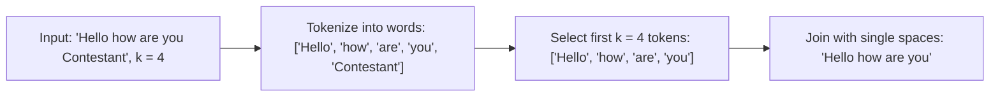

# Guided Example: Truncate Sentence

We trace the step-by-step extraction of a prefix sentence through word tokenization and delimiter boundary identification on a representative problem instance:

- **Input:** `s = "Hello how are you Contestant"`, `k = 4`
- **Required Output:** `"Hello how are you"`

This instance demonstrates how single-space delimiters demarcate word boundaries and how preserving the first $k$ words reconstructs the canonical truncated sentence.

---

## 1. Instance & Teaching Goal

We are given a sentence `s` where words are separated by exactly one space, with no leading or trailing spaces. Each word consists exclusively of uppercase and lowercase English letters. We are also given an integer $k$.
We must truncate `s` such that it contains only the first $k$ words, separated by single spaces.

In our instance:
- `s = "Hello how are you Contestant"`
- $k = 4$
- The sentence contains $5$ words: `"Hello"`, `"how"`, `"are"`, `"you"`, `"Contestant"`.
- Taking the first $4$ words yields `"Hello"`, `"how"`, `"are"`, `"you"`.
- Rejoining them with single spaces produces `"Hello how are you"`.

The teaching goal is to observe the exact correspondence between word count and space delimiters: in a valid single-spaced sentence with $n$ words, the first $k$ words ($k < n$) end immediately before the $k$-th space character. Both space-counting character scans and word-level list slicing yield identical results in linear time.

---

## 2. Conceptual Foundation & Invariants

### Word Delimiters & Index Invariant

Let $W = [w_0, w_1, \dots, w_{n-1}]$ denote the sequence of words in `s`, where each word $w_i$ is a maximal non-empty substring of alphabetic characters.
Because words are separated by single spaces, the character representation of `s` is:
$$s = w_0 \mathbin{\Vert} \text{' '} \mathbin{\Vert} w_1 \mathbin{\Vert} \text{' '} \mathbin{\Vert} \dots \mathbin{\Vert} \text{' '} \mathbin{\Vert} w_{n-1}$$
where $\Vert$ denotes string concatenation.

### Word-Boundary Delimiter & Prefix Conservation Theorem

> **Word-Boundary Delimiter & Prefix Conservation Theorem.**
> Let sentence $s$ contain $n$ words separated by single spaces without leading or trailing spaces.
> 1. If $k = n$, the truncated sentence is identical to the entire input string $s$.
> 2. If $k < n$, exactly $k - 1$ spaces occur within the first $k$ words, and the $k$-th space in $s$ occurs at index $p_k$. The prefix substring $s[0 \dots p_k - 1]$ consists of precisely the first $k$ words separated by single spaces.
> 3. Equivalently, tokenizing $s$ into words $W$ and taking the prefix sub-array $W[0 \dots k-1]$ followed by concatenation with single spaces reconstructs $s[0 \dots p_k - 1]$.

---

## 3. Step-by-Step Worked Execution

We trace `s = "Hello how are you Contestant"` with $k = 4$.

---

### Step 1: Tokenize the Sentence

Scan the string to segment characters by whitespace:
- Word $0$: `"Hello"` (indices $0 \dots 4$)
- Space delimiter at index $5$
- Word $1$: `"how"` (indices $6 \dots 8$)
- Space delimiter at index $9$
- Word $2$: `"are"` (indices $10 \dots 12$)
- Space delimiter at index $13$
- Word $3$: `"you"` (indices $14 \dots 16$)
- Space delimiter at index $17$
- Word $4$: `"Contestant"` (indices $18 \dots 27$)

Total word count $n = 5$.

---

### Step 2: Slice the Word List to Length $k$

We require the first $k = 4$ words:
- Kept words: $W[0 \dots 3] = [\text{"Hello"}, \text{"how"}, \text{"are"}, \text{"you"}]$
- Discarded words: $W[4 \dots 4] = [\text{"Contestant"}]$

---

### Step 3: Reconstruct Truncated Sentence

Join the selected word list with single spaces:
- Start with $w_0 = \text{"Hello"}$
- Append `' '` and $w_1 = \text{"how"} \implies \text{"Hello how"}$
- Append `' '` and $w_2 = \text{"are"} \implies \text{"Hello how are"}$
- Append `' '` and $w_3 = \text{"you"} \implies \text{"Hello how are you"}$

Result string: `"Hello how are you"`.

---

## 4. Complete Execution Trace

| Word Index | Word Token | Running Word Count | Retained for Prefix ($< k$)? | Truncated Sentence Accumulator |
|:---:|:---:|:---:|:---:|:---|
| $0$ | `"Hello"` | $1$ | Yes | `"Hello"` |
| $1$ | `"how"` | $2$ | Yes | `"Hello how"` |
| $2$ | `"are"` | $3$ | Yes | `"Hello how are"` |
| $3$ | `"you"` | $4$ | Yes | `"Hello how are you"` |
| $4$ | `"Contestant"` | $5$ | No (Discarded) | `"Hello how are you"` |

Final output: **`"Hello how are you"`**.

---

## 5. Algorithmic Correctness

**Soundness.** Because the input guarantee specifies that every space separates two words and there are no consecutive, leading, or trailing spaces, each word boundary is unambiguous. Retaining the first $k$ words and joining them with single spaces preserves the exact spelling, case, and spacing of the prefix sentence.

**Completeness.** Every word in the input sentence is accounted for in order. Stopping the selection after exactly $k$ words guarantees that the output satisfies the size constraint without omitting any required word.

---

## 6. Traps This Instance Exposes

- **Punctuation Assumptions:** The problem statement specifies that words consist solely of uppercase and lowercase English letters without punctuation marks. Splitting on whitespace does not risk leaving attached commas or periods.
- **Whole Sentence Retention:** When $k = n$, no words should be dropped, and no trailing space should be introduced.
- **In-Place Character Scan Optimization:** If tokenizing into an intermediate array of strings is undesirable, a character scan that counts space characters up to $k$ and slices $s[0 \dots p_k - 1]$ achieves $\mathcal{O}(1)$ auxiliary space without list allocation.

---

## 7. Complexity Derivation

- **Time Complexity:** $\mathcal{O}(L)$, where $L$ is the length of string $s$. Splitting the string examines each of the $L$ characters once. Slicing and joining the first $k$ words takes time proportional to the length of the truncated string, which is at most $L$. Total time is linear $\mathcal{O}(L)$.
- **Auxiliary Space Complexity:** $\mathcal{O}(L)$ to store the array of word tokens and the returned truncated string.
