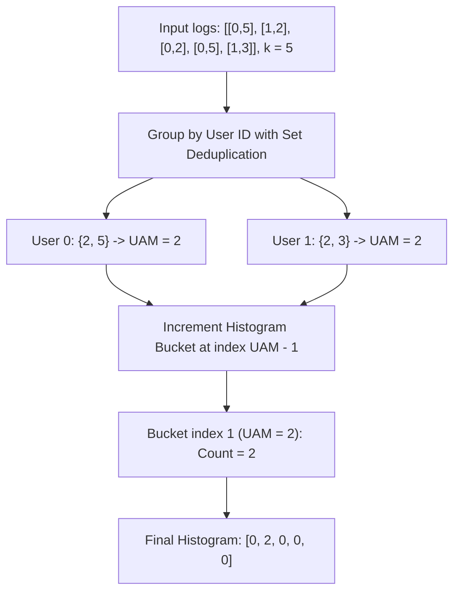

# Guided Example: Finding the Users Active Minutes

We trace the step-by-step evaluation of user active minutes via set-based deduplication and histogram bucket aggregation on a representative problem instance:

- **Input:** `logs = [[0, 5], [1, 2], [0, 2], [0, 5], [1, 3]], k = 5`
- **Required Output:** `[0, 2, 0, 0, 0]`

This instance demonstrates how multiple actions by the same user within the same minute are deduplicated, how distinct active minutes are counted per user, and how the resulting user active minutes are binned into a 1-indexed frequency histogram.

---

## 1. Instance & Teaching Goal

We are given a 2D integer array `logs` where each record $[\text{ID}_i, \text{time}_i]$ indicates that the user with identifier $\text{ID}_i$ performed an action at minute $\text{time}_i$. Multiple actions can occur at the same minute.
We are also given an integer $k$.

Definitions:
- The **User Active Minutes (UAM)** for a given user is the number of **unique** minutes in which that user performed at least one action.
- We must return a 1-indexed array of length $k$, represented as a 0-indexed list $\text{ans}$ of length $k$, where $\text{ans}[j - 1]$ is the number of users whose UAM equals $j$ for $1 \le j \le k$.

In our instance:
- `logs = [[0, 5], [1, 2], [0, 2], [0, 5], [1, 3]]`
- $k = 5$
- User $0$ performed actions at minutes $5$, $2$, and $5$. The unique minutes are $\{2, 5\}$, so $\text{UAM}(0) = 2$.
- User $1$ performed actions at minutes $2$ and $3$. The unique minutes are $\{2, 3\}$, so $\text{UAM}(1) = 2$.
- Both users have a UAM of $2$. No users have UAM equal to $1$, $3$, $4$, or $5$.
- Result histogram: `[0, 2, 0, 0, 0]`.

The teaching goal is to decouple the problem into two sequential phases: first, grouping and set-deduplicating timestamps by user ID; second, computing the size of each user's unique minute set and incrementing the corresponding bucket in the frequency array.

---

## 2. Conceptual Foundation & Invariants

### User Activity Projection & Deduplication

Let $\mathcal{L} = \{(\text{ID}_i, \text{time}_i)\}$ denote the log entries.
For each distinct user $u$, define their active minute set:
$$M_u = \{ t : (u, t) \in \mathcal{L} \}$$

The cardinality $|M_u|$ represents the user's active minutes:
$$\text{UAM}(u) = |M_u|$$

Duplicate logs for the same user at the same minute (such as $[0, 5]$ appearing twice) do not increase $|M_u|$ because sets contain only unique elements.

### Relational Deduplication & Histogram Aggregation Theorem

> **Relational Deduplication & Histogram Aggregation Theorem.**
> Let $\mathcal{U}$ be the set of unique user IDs appearing in $\mathcal{L}$.
> The distribution of user activity across the population is given by the frequency histogram $H$ of length $k$:
> $$H[j - 1] = \sum_{u \in \mathcal{U}} [\text{UAM}(u) = j], \quad 1 \le j \le k$$
> where $[\cdot]$ is the Iverson indicator bracket.
> Because each log entry $(u, t)$ is processed once to update the set $M_u$ via a hash map, and each unique user's set cardinality $|M_u|$ increments exactly one bucket $H[|M_u| - 1]$, the two-phase aggregation is exact, deterministic, and executes in linear time with respect to the number of log entries.

---

## 3. Step-by-Step Worked Execution

We trace `logs = [[0, 5], [1, 2], [0, 2], [0, 5], [1, 3]]` with $k = 5$.

---

### Step 1: Initialize User Timestamp Sets

Create a hash map $D$ mapping user ID to a set of timestamps:
$$D = \{\}$$

---

### Step 2: Stream Log Records into the Hash Map

Process each log record $[\text{ID}, \text{time}]$:

1. **Log $0$:** `[0, 5]`
   - User $0$ is seen for the first time. Initialize set $\{5\}$.
   - State: $D = \{0: \{5\}\}$.

2. **Log $1$:** `[1, 2]`
   - User $1$ is seen for the first time. Initialize set $\{2\}$.
   - State: $D = \{0: \{5\}, 1: \{2\}\}$.

3. **Log $2$:** `[0, 2]`
   - User $0$ adds minute $2$.
   - State: $D = \{0: \{2, 5\}, 1: \{2\}\}$.

4. **Log $3$:** `[0, 5]`
   - User $0$ attempts to add minute $5$. Since $5 \in \{2, 5\}$, the set is unchanged.
   - State: $D = \{0: \{2, 5\}, 1: \{2\}\}$.

5. **Log $4$:** `[1, 3]`
   - User $1$ adds minute $3$.
   - State: $D = \{0: \{2, 5\}, 1: \{2, 3\}\}$.

All logs have been ingested.

---

### Step 3: Compute UAM and Accumulate Histogram

Initialize output histogram array of length $k = 5$ with all zeros:
$$\text{ans} = [0, 0, 0, 0, 0]$$

Iterate over each user in $D$:
- **User $0$:**
  - Unique minute set: $\{2, 5\}$
  - $\text{UAM} = |\{2, 5\}| = 2$
  - 0-indexed bucket: $\text{UAM} - 1 = 2 - 1 = 1$
  - Increment $\text{ans}[1]$ from $0 \to 1$.
  - State: $\text{ans} = [0, 1, 0, 0, 0]$.

- **User $1$:**
  - Unique minute set: $\{2, 3\}$
  - $\text{UAM} = |\{2, 3\}| = 2$
  - 0-indexed bucket: $\text{UAM} - 1 = 2 - 1 = 1$
  - Increment $\text{ans}[1]$ from $1 \to 2$.
  - State: $\text{ans} = [0, 2, 0, 0, 0]$.

All users processed.

---

### Step 4: Final Output

Output array: `[0, 2, 0, 0, 0]`.

---

## 4. Complete Execution Trace

| Log Index | Processed Record | Target User | Minute Recorded | User's Set After Insertion | Status / Observation |
|:---:|:---:|:---:|:---:|:---:|:---|
| $0$ | `[0, 5]` | User $0$ | $5$ | $\{5\}$ | New user registered |
| $1$ | `[1, 2]` | User $1$ | $2$ | $\{2\}$ | New user registered |
| $2$ | `[0, 2]` | User $0$ | $2$ | $\{2, 5\}$ | New minute added |
| $3$ | `[0, 5]` | User $0$ | $5$ | $\{2, 5\}$ | Duplicate minute ignored |
| $4$ | `[1, 3]` | User $1$ | $3$ | $\{2, 3\}$ | New minute added |

**User Summary & Histogram Mapping:**

| User ID | Unique Active Minutes Set | Cardinality ($\text{UAM}$) | Target Index ($\text{UAM} - 1$) | Histogram Bucket Updated |
|:---:|:---:|:---:|:---:|:---:|
| $0$ | $\{2, 5\}$ | $2$ | $1$ | $\text{ans}[1] \to 1$ |
| $1$ | $\{2, 3\}$ | $2$ | $1$ | $\text{ans}[1] \to 2$ |

Final result vector: **`[0, 2, 0, 0, 0]`**.

---

## 5. Algorithmic Correctness

**Soundness.** Mathematical sets strictly reject duplicate values. Inserting timestamps for a user into a hash set ensures that multiple actions occurring during the same minute contribute exactly $1$ to that user's active minutes count. Mapping a user with $\text{UAM} = j$ to index $j - 1$ correctly matches the 1-indexed definition of the histogram.

**Completeness.** Every log record is ingested, and every distinct user appearing in the logs is iterated over. Since all users with at least one action have $\text{UAM} \ge 1$, every active user is counted in the histogram.

---

## 6. Traps This Instance Exposes

- **Duplicate Minute Counting:** Counting raw log rows instead of unique minutes artificially inflates User $0$'s UAM to $3$, leading to an incorrect result of `[0, 1, 1, 0, 0]`.
- **1-Indexed to 0-Indexed Conversion:** UAM values range from $1$ to $k$, but array indices range from $0$ to $k - 1$. Failing to subtract $1$ causes out-of-bounds errors for $\text{UAM} = k$ and leaves index $0$ unused.
- **Cross-User Timestamp Collisions:** Both User $0$ and User $1$ acted at minute $2$. Active minutes are independent per user; actions by different users at the same minute do not interfere with each other.

---

## 7. Complexity Derivation

- **Time Complexity:** $\mathcal{O}(N + k)$, where $N$ is the number of elements in `logs`. Iterating through `logs` takes $\mathcal{O}(N)$ time with $\mathcal{O}(1)$ average set insertion time. Iterating through all users to populate the histogram takes $\mathcal{O}(U)$ time where $U \le N$ is the number of unique users. Initializing the histogram of size $k$ takes $\mathcal{O}(k)$ time. Overall time is $\mathcal{O}(N + k)$.
- **Auxiliary Space Complexity:** $\mathcal{O}(N + k)$ to store the hash map of timestamp sets for all users and the histogram array of size $k$.
