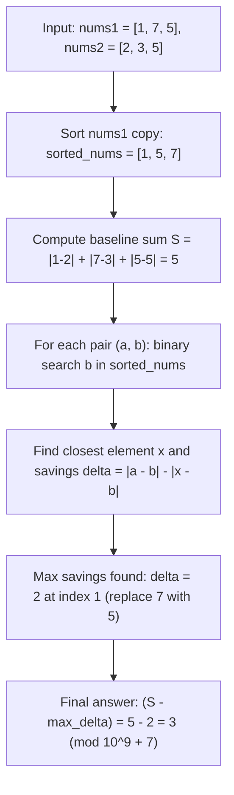

# Guided Example: Minimum Absolute Sum Difference

We trace the step-by-step optimization of absolute sum differences via sorted bisection and nearest-neighbor replacement on a representative problem instance:

- **Input:** `nums1 = [1, 7, 5], nums2 = [2, 3, 5]`
- **Required Output:** `3`

This instance demonstrates how replacing at most one element of `nums1` with any other element from `nums1` achieves the maximum possible reduction by locating the closest numeric neighbor in a sorted copy using binary search.

---

## 1. Instance & Teaching Goal

We are given two positive integer arrays `nums1` and `nums2`, both of length $n$.
The **absolute sum difference** is defined as:
$$S = \sum_{i=0}^{n-1} |\text{nums1}[i] - \text{nums2}[i]|$$

We are allowed to replace at most **one** element of `nums1` with **any** other element present in `nums1`. We want to minimize the final absolute sum difference modulo $10^9 + 7$.

In our instance:
- `nums1 = [1, 7, 5]`
- `nums2 = [2, 3, 5]`
- Initial absolute differences:
  - Index $0$: $|1 - 2| = 1$
  - Index $1$: $|7 - 3| = 4$
  - Index $2$: $|5 - 5| = 0$
- Initial total sum: $S = 1 + 4 + 0 = 5$.
- If we replace $\text{nums1}[1] = 7$ with $5$ (which already exists in `nums1` at index $2$), the new difference at index $1$ becomes $|5 - 3| = 2$.
- The new sum is $1 + 2 + 0 = 3$. This is the minimum achievable sum.

The teaching goal is to recognize that replacing element $\text{nums1}[k]$ with $x \in \text{nums1}$ reduces the sum by $|a_k - b_k| - |x - b_k|$. Maximizing this reduction for a fixed target $b_k$ requires finding the value $x \in \text{nums1}$ closest to $b_k$. Sorting a copy of `nums1` enables locating the optimal replacement in $\mathcal{O}(\log n)$ time per element via binary search.

---

## 2. Conceptual Foundation & Invariants

### Reduction Objective & Algebraic Decomposition

Let $a_i = \text{nums1}[i]$ and $b_i = \text{nums2}[i]$.
The baseline sum without any replacements is:
$$S = \sum_{i=0}^{n-1} |a_i - b_i|$$

If we choose index $k$ and replace $a_k$ with $x \in \text{nums1}$, the only term in the sum that changes is index $k$:
$$S_{\text{new}} = S - |a_k - b_k| + |x - b_k| = S - (|a_k - b_k| - |x - b_k|)$$

Define the savings $\Delta(k, x)$ obtained by replacing $a_k$ with $x$:
$$\Delta(k, x) = |a_k - b_k| - |x - b_k|$$

To minimize $S_{\text{new}}$, we must maximize $\Delta(k, x)$ over all $k \in [0, n - 1]$ and all $x \in \text{nums1}$.
For a fixed index $k$, the term $|a_k - b_k|$ is constant, so maximizing $\Delta(k, x)$ is equivalent to minimizing $|x - b_k|$ over all available values $x \in \text{nums1}$.

### Nearest Neighbor Bisection & Maximal Gain Invariant Theorem

> **Nearest Neighbor Bisection & Maximal Gain Invariant Theorem.**
> Let $A_{\text{sorted}}$ be the array of all elements of `nums1` arranged in non-decreasing order.
> For any real query $b_k$, the function $g(x) = |x - b_k|$ is convex and strictly decreases for $x \le b_k$ and strictly increases for $x \ge b_k$.
> Consequently, the global minimizer of $|x - b_k|$ over the discrete set $A_{\text{sorted}}$ is restricted to at most two candidates:
> 1. The smallest element in $A_{\text{sorted}}$ greater than or equal to $b_k$ (the successor, located at the lower-bound insertion index $p = \text{bisect\_left}(A_{\text{sorted}}, b_k)$).
> 2. The largest element in $A_{\text{sorted}}$ strictly smaller than $b_k$ (the predecessor, located at index $p - 1$).
>
> Testing these two candidates identifies $\min_{x \in \text{nums1}} |x - b_k|$ in $\mathcal{O}(\log n)$ time. Evaluating all $n$ indices yields the maximal overall savings:
> $$\Delta^* = \max_{0 \le k < n} \left( |a_k - b_k| - \min_{x \in \text{nums1}} |x - b_k| \right)$$
> The minimal absolute sum difference is $(S - \Delta^*) \pmod{10^9 + 7}$.

---

## 3. Step-by-Step Worked Execution

We trace `nums1 = [1, 7, 5]` and `nums2 = [2, 3, 5]`.

---

### Step 1: Sort `nums1` and Compute Baseline Differences

1. Create sorted copy of `nums1`:
   $$A_{\text{sorted}} = [1, 5, 7]$$

2. Compute original absolute difference at each index:
   - Index $0$: $|1 - 2| = 1$
   - Index $1$: $|7 - 3| = 4$
   - Index $2$: $|5 - 5| = 0$

3. Total baseline sum:
   $$S = 1 + 4 + 0 = 5$$

Initialize maximum savings $\Delta^* = 0$.

---

### Step 2: Binary Search Closest Replacement for Index $0$

- Original pair: $a_0 = 1, b_0 = 2$, with $d_1 = |1 - 2| = 1$.
- Search target $b_0 = 2$ in $A_{\text{sorted}} = [1, 5, 7]$:
  - Lower bound insertion index: $p = 1$ ($A_{\text{sorted}}[1] = 5 \ge 2$).
  - Candidate successor ($p = 1$): $x = 5 \implies |5 - 2| = 3$.
  - Candidate predecessor ($p - 1 = 0$): $x = 1 \implies |1 - 2| = 1$.
- Minimum distance achievable:
  $$d_2 = \min(3, 1) = 1$$
- Savings at index $0$:
  $$\Delta_0 = d_1 - d_2 = 1 - 1 = 0$$
- Running maximum savings: $\Delta^* = \max(0, 0) = 0$.

---

### Step 3: Binary Search Closest Replacement for Index $1$

- Original pair: $a_1 = 7, b_1 = 3$, with $d_1 = |7 - 3| = 4$.
- Search target $b_1 = 3$ in $A_{\text{sorted}} = [1, 5, 7]$:
  - Lower bound insertion index: $p = 1$ ($A_{\text{sorted}}[1] = 5 \ge 3$).
  - Candidate successor ($p = 1$): $x = 5 \implies |5 - 3| = 2$.
  - Candidate predecessor ($p - 1 = 0$): $x = 1 \implies |1 - 3| = 2$.
- Minimum distance achievable:
  $$d_2 = \min(2, 2) = 2$$
- Savings at index $1$:
  $$\Delta_1 = d_1 - d_2 = 4 - 2 = 2$$
- Running maximum savings: $\Delta^* = \max(0, 2) = 2$.

---

### Step 4: Binary Search Closest Replacement for Index $2$

- Original pair: $a_2 = 5, b_2 = 5$, with $d_1 = |5 - 5| = 0$.
- Search target $b_2 = 5$ in $A_{\text{sorted}} = [1, 5, 7]$:
  - Exact match found at $p = 1$ ($A_{\text{sorted}}[1] = 5$).
  - Minimum distance: $d_2 = |5 - 5| = 0$.
- Savings at index $2$:
  $$\Delta_2 = d_1 - d_2 = 0 - 0 = 0$$
- Running maximum savings: $\Delta^* = \max(2, 0) = 2$.

---

### Step 5: Compute Final Reduced Sum

- Maximum savings across all indices: $\Delta^* = 2$.
- Final answer:
  $$\text{Result} = (S - \Delta^*) \bmod (10^9 + 7) = (5 - 2) \bmod (10^9 + 7) = 3$$

---

## 4. Complete Execution Trace

| Index $i$ | $a_i$ | $b_i$ | Original Diff $d_1$ | Closest $x \in \text{nums1}$ | New Diff $d_2$ | Savings $\Delta_i = d_1 - d_2$ | Running $\Delta^*$ |
|:---:|:---:|:---:|:---:|:---:|:---:|:---:|:---:|
| $0$ | $1$ | $2$ | $1$ | $1$ | $1$ | $0$ | $0$ |
| $1$ | $7$ | $3$ | $4$ | $5$ (or $1$) | $2$ | **$2$** | **$2$** |
| $2$ | $5$ | $5$ | $0$ | $5$ | $0$ | $0$ | $2$ |

- Baseline sum: $S = 1 + 4 + 0 = 5$
- Maximal savings: $\Delta^* = 2$
- Minimal sum difference: $5 - 2 =$ **`3`**.

---

## 5. Algorithmic Correctness

**Soundness.** Replacing at most one element of `nums1` with another element from `nums1` alters exactly one term in the sum. For every index $k$, the closest element to $b_k$ in `nums1` is provably one of the two elements immediately adjacent to the insertion point of $b_k$ in the sorted array. The reduction $d_1 - d_2$ represents the exact change in the total sum.

**Completeness.** Every index $k \in [0, n - 1]$ is tested as the single replacement candidate. For each index, the binary search considers all valid candidates in `nums1` and selects the best one. Therefore, no superior single replacement can exist.

---

## 6. Traps This Instance Exposes

- **Premature Modulo Reduction:** Taking modulo $10^9 + 7$ during the sum accumulation before subtracting $\Delta^*$ can cause negative numbers if $S \pmod M < \Delta^*$. The subtraction must use $(S - \Delta^* + M) \pmod M$.
- **Boundary Cases in Binary Search:** When the target $b_k$ is smaller than all elements in `nums1` ($p = 0$), there is no predecessor candidate $p - 1$. When $b_k$ is larger than all elements ($p = n$), there is no successor candidate $p$. Both bounds must be guarded.
- **Selecting from `nums2` Instead of `nums1`:** The replacement value $x$ must be chosen from `nums1`, not `nums2`.

---

## 7. Complexity Derivation

- **Time Complexity:** $\mathcal{O}(n \log n)$. Sorting a copy of `nums1` takes $\mathcal{O}(n \log n)$ time. The loop iterates $n$ times, performing a binary search of cost $\mathcal{O}(\log n)$ at each step. Total time is $\mathcal{O}(n \log n)$.
- **Auxiliary Space Complexity:** $\mathcal{O}(n)$ to store the sorted copy of `nums1`.