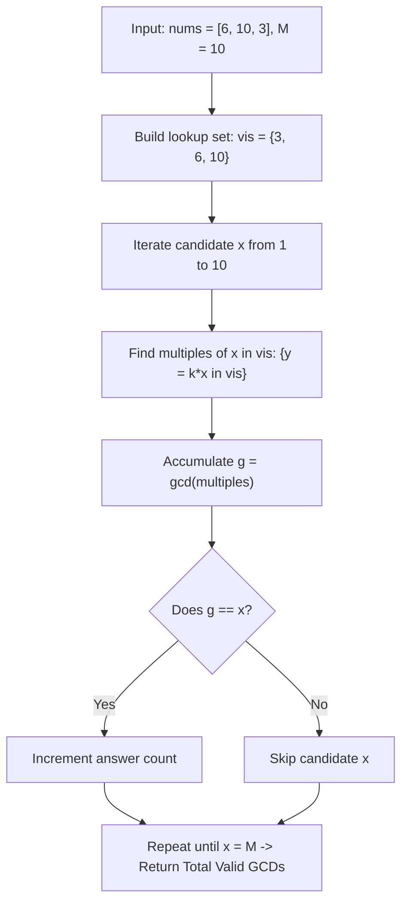

# Guided Example: Number of Different Subsequences GCDs

We trace the step-by-step counting of distinct subsequence greatest common divisors via harmonic multiple sieving on a representative problem instance:

- **Input:** `nums = [6, 10, 3]`
- **Required Output:** `5`

This instance demonstrates how reformulating a combinatorial search over $2^n$ subsequences into a divisibility sieve over candidate divisors in $[1, \max(\text{nums})]$ enables exact determination of all realizable GCDs in $\mathcal{O}(M \log M)$ time.

---

## 1. Instance & Teaching Goal

We are given an array `nums` of positive integers.
The greatest common divisor ($\gcd$) of a sequence is the largest positive integer that divides every element of the sequence.
A **subsequence** is obtained by deleting zero or more elements from the array.
We must return the number of **different** $\gcd$ values that can be produced by non-empty subsequences of `nums`.

In our instance:
- `nums = [6, 10, 3]`
- All non-empty subsequences and their respective $\gcd$ values:
  - `[6]` $\implies \gcd = 6$
  - `[10]` $\implies \gcd = 10$
  - `[3]` $\implies \gcd = 3$
  - `[6, 10]` $\implies \gcd = \gcd(6, 10) = 2$
  - `[6, 3]` $\implies \gcd = \gcd(6, 3) = 3$
  - `[10, 3]` $\implies \gcd = \gcd(10, 3) = 1$
  - `[6, 10, 3]` $\implies \gcd = \gcd(6, 10, 3) = 1$
- The set of distinct $\gcd$ values obtained is $\{1, 2, 3, 6, 10\}$.
- The cardinality of this set is $5$.

The teaching goal is to avoid enumerating the exponentially many $2^n - 1$ subsequences. Instead, we test each candidate integer $x \in [1, \max(\text{nums})]$ directly by accumulating the $\gcd$ of all multiples of $x$ present in the array.

---

## 2. Conceptual Foundation & Invariants

### Bounding the Candidate Domain

Let $M = \max(\text{nums})$.
Because the $\gcd$ of any non-empty subsequence cannot exceed any element in that subsequence, every possible subsequence $\gcd$ must be a positive integer in the bounded interval $[1, M]$.

### Subsequence GCD Existence Theorem

> **Subsequence GCD Existence Theorem (Harmonic Multiples Sieve Invariant).**
> A positive integer $x \le M$ is the greatest common divisor of some non-empty subsequence of `nums` if and only if the $\gcd$ of **all** elements in `nums` that are multiples of $x$ is equal to $x$:
> $$\gcd\left(\{ y \in \text{nums} : x \mid y \}\right) = x$$
>
> **Proof:**
> 1. *Necessity:* Suppose a subsequence $S \subseteq \text{nums}$ has $\gcd(S) = x$. By definition of common divisor, every element $s \in S$ must be divisible by $x$. Thus, $S \subseteq \{ y \in \text{nums} : x \mid y \}$.
> 2. *Monotonicity of GCD:* Appending additional multiples of $x$ to $S$ can only preserve or further restrict the set of common divisors. Because every added element is a multiple of $x$, $x$ remains a common divisor of the enlarged set.
> 3. *Sufficiency:* If $\gcd(S) = x$, then the $\gcd$ of all multiples of $x$ present in `nums` must divide $\gcd(S) = x$, while simultaneously being a multiple of $x$. Hence, the $\gcd$ of all multiples of $x$ in `nums` must equal $x$.
>
> Therefore, to verify if $x$ can be formed, we do not need to test subsets of multiples; we simply compute the running $\gcd$ across all multiples of $x$ present in `nums` and check if it reaches $x$.

---

## 3. Step-by-Step Worked Execution

We trace `nums = [6, 10, 3]` where $M = 10$.
The presence set is $\text{vis} = \{3, 6, 10\}$.
We test each integer $x \in [1, 10]$:

---

### Step 1: Evaluate Candidates $x = 1, 2, 3$

- **Candidate $x = 1$:**
  - Multiples of $1$ up to $10$: $1, 2, \dots, 10$.
  - Multiples present in $\text{vis}$: $3, 6, 10$.
  - Compute running $\gcd$:
    - First element $3$: $g = 3$.
    - Next element $6$: $g = \gcd(3, 6) = 3$.
    - Next element $10$: $g = \gcd(3, 10) = 1$.
  - Since $g == 1$, candidate $x = 1$ is **valid**! (Running count: $1$).

- **Candidate $x = 2$:**
  - Multiples of $2$ up to $10$: $2, 4, 6, 8, 10$.
  - Multiples present in $\text{vis}$: $6, 10$.
  - Compute running $\gcd$:
    - First element $6$: $g = 6$.
    - Next element $10$: $g = \gcd(6, 10) = 2$.
  - Since $g == 2$, candidate $x = 2$ is **valid**! (Running count: $2$).

- **Candidate $x = 3$:**
  - Multiples of $3$ up to $10$: $3, 6, 9$.
  - Multiples present in $\text{vis}$: $3, 6$.
  - Compute running $\gcd$:
    - First element $3$: $g = 3$.
    - Next element $6$: $g = \gcd(3, 6) = 3$.
  - Since $g == 3$, candidate $x = 3$ is **valid**! (Running count: $3$).

---

### Step 2: Evaluate Candidates $x = 4, 5$

- **Candidate $x = 4$:**
  - Multiples: $4, 8$.
  - Multiples present in $\text{vis}$: None.
  - $g = 0 \neq 4$. Candidate $x = 4$ is invalid.

- **Candidate $x = 5$:**
  - Multiples: $5, 10$.
  - Multiples present in $\text{vis}$: $10$.
  - Running $\gcd$: $g = 10$.
  - Since $g = 10 \neq 5$, candidate $x = 5$ is invalid.
    *(No subsequence can have $\gcd = 5$ because the only multiple available is $10$, which has $\gcd = 10$.)*

---

### Step 3: Evaluate Candidates $x = 6, 7, 8, 9, 10$

- **Candidate $x = 6$:**
  - Multiples present in $\text{vis}$: $6$.
  - Running $\gcd$: $g = 6 == 6$. Candidate $x = 6$ is **valid**! (Running count: $4$).

- **Candidate $x = 7, 8, 9$:**
  - No multiples present in $\text{vis}$. All invalid.

- **Candidate $x = 10$:**
  - Multiples present in $\text{vis}$: $10$.
  - Running $\gcd$: $g = 10 == 10$. Candidate $x = 10$ is **valid**! (Running count: $5$).

All candidates in $[1, 10]$ checked.
Total valid GCDs: **`5`**.

---

## 4. Complete Execution Trace

| Candidate $x$ | Multiples Tested ($k \cdot x \le 10$) | Multiples Found in `vis` | Running $\gcd$ Computation | Final $g$ | $g == x$? | Running Valid Count |
|:---:|:---:|:---:|:---|:---:|:---:|:---:|
| $1$ | $1, 2, \dots, 10$ | $3, 6, 10$ | $\gcd(3, 6)=3 \to \gcd(3, 10)=1$ | $1$ | **Yes** | $1$ |
| $2$ | $2, 4, 6, 8, 10$ | $6, 10$ | $\gcd(6, 10) = 2$ | $2$ | **Yes** | $2$ |
| $3$ | $3, 6, 9$ | $3, 6$ | $\gcd(3, 6) = 3$ | $3$ | **Yes** | $3$ |
| $4$ | $4, 8$ | None | None | $0$ | No | $3$ |
| $5$ | $5, 10$ | $10$ | $g = 10$ | $10$ | No | $3$ |
| $6$ | $6$ | $6$ | $g = 6$ | $6$ | **Yes** | $4$ |
| $7$ | $7$ | None | None | $0$ | No | $4$ |
| $8$ | $8$ | None | None | $0$ | No | $4$ |
| $9$ | $9$ | None | None | $0$ | No | $4$ |
| $10$ | $10$ | $10$ | $g = 10$ | $10$ | **Yes** | **`5`** |

---

## 5. Algorithmic Correctness

**Soundness.** Every counted $x$ has the property that the set of its multiples in `nums` yields $\gcd = x$. By taking those exact multiples as the subsequence, we obtain a concrete witness subsequence whose $\gcd$ is $x$.

**Completeness.** Suppose there exists some subsequence $S$ with $\gcd(S) = x$. Then every element in $S$ is a multiple of $x$. The set of all multiples of $x$ in `nums` contains $S$. Adding additional multiples of $x$ cannot increase the $\gcd$ nor introduce non-multiples of $x$. Therefore, the $\gcd$ of all multiples of $x$ must also equal $x$. The harmonic sieve will never miss any valid $x$.

---

## 6. Traps This Instance Exposes

- **Combinatorial Exploration:** Trying to generate all $2^n$ subsequences fails because $n$ can be up to $10^5$.
- **Early Break Optimization:** As soon as the running $\gcd$ reaches $x$, we can terminate the inner loop for candidate $x$ immediately because the $\gcd$ of positive multiples of $x$ cannot decrease below $x$.
- **Missing Single Multiples:** If only one multiple $y > x$ exists for candidate $x$ (such as $x = 5$ with single multiple $10$), the running $\gcd$ is $10 \neq 5$, correctly rejecting $5$.

---

## 7. Complexity Derivation

- **Time Complexity:** $\mathcal{O}(M \log M)$, where $M = \max(\text{nums}) \le 2 \times 10^5$. The outer loop runs $M$ times. The inner loop steps through multiples $x, 2x, 3x, \dots \le M$, executing $\sum_{x=1}^M \lfloor M / x \rfloor \approx M \ln M$ total iterations. Each iteration involves an $\mathcal{O}(\log M)$ Euclidean $\gcd$ operation, well within standard time limits.
- **Auxiliary Space Complexity:** $\mathcal{O}(M)$ or $\mathcal{O}(n)$ to store the existence hash set or boolean frequency array for `nums`.
