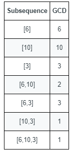

### 1. Description

You are given an array `nums` that consists of positive integers.

The **GCD** of a sequence of numbers is defined as the greatest integer that divides **all** the numbers in the sequence evenly.

- For example, the GCD of the sequence `[4,6,16]` is `2`.

A **subsequence** of an array is a sequence that can be formed by removing some elements (possibly none) of the array.

- For example, `[2,5,10]` is a subsequence of `[1,2,1,**<u>2</u>**,4,1,<u>**5**</u>,<u>**10**</u>]`.

Return *the **number** of **different** GCDs among all **non-empty** subsequences of* `nums`.

### 2. Function Contract

**Inputs**

- `nums`: Input parameter (`List[int]`).

**Return value**

- Returns `int`.

### 3. Examples

#### Example 1

- **Input:** `nums = [6,10,3]`
- **Output:** `5`
- **Explanation:** The figure shows all the non-empty subsequences and their GCDs.
The different GCDs are 6, 10, 3, 2, and 1.

#### Example 2

- **Input:** `nums = [5,15,40,5,6]`
- **Output:** `7`

### 4. Constraints

- $1 \le \text{nums.length} \le 10^{5}$

- $1 \le \text{nums}[i] \le 2 * 10^{5}$
