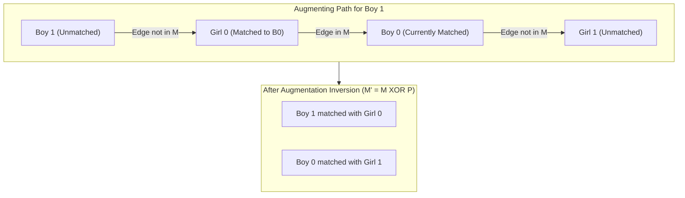

# Guided Example: Maximum Number of Accepted Invitations

We trace the step-by-step resolution of maximum bipartite matching via augmenting-path search (Kuhn's algorithm) on a representative problem instance:

- **Input:** `grid = [[1, 1, 1], [1, 0, 1], [0, 0, 1]]`
- **Required Output:** `3`

This instance demonstrates how conflicting preferences between participants are resolved through augmenting alternating paths, reassigning earlier matches to free up compatible partners without reducing the overall matching size.

---

## 1. Instance & Teaching Goal

There are $m$ boys and $n$ girls invited to a celebration.
We are given an $m \times n$ binary matrix `grid` where `grid[i][j] == 1` indicates that boy $i$ can invite girl $j$.
- Each boy can invite at most one girl.
- Each girl can accept at most one invitation.
- We want to find the maximum possible number of accepted invitations.

In our instance:
- `grid = [[1, 1, 1], [1, 0, 1], [0, 0, 1]]` with $m = 3$ boys ($B_0, B_1, B_2$) and $n = 3$ girls ($G_0, G_1, G_2$).
- Potential invitations:
  - $B_0$ knows all three girls: $\{G_0, G_1, G_2\}$.
  - $B_1$ knows: $\{G_0, G_2\}$.
  - $B_2$ knows only: $\{G_2\}$.
- If $B_0$ greedily takes $G_2$ and $B_1$ takes $G_0$, then $B_2$ cannot invite $G_2$ (already taken), leaving $G_1$ empty and achieving only $2$ invitations.
- However, the optimal assignment pairs $B_0 \to G_1$, $B_1 \to G_0$, and $B_2 \to G_2$, achieving $3$ accepted invitations.

The teaching goal is to observe how DFS augmenting paths dynamically negotiate partner swaps: when a new boy encounters an already-matched girl, the algorithm prompts her current partner to seek an alternative girl, increasing total matched pairs by $1$ at each successful step.

---

## 2. Conceptual Foundation & Invariants

### Bipartite Graph Formulation

Let $G = (U \cup V, E)$ be a bipartite graph:
- Left vertex set $U = \{B_0, B_1, \dots, B_{m-1}\}$ (boys).
- Right vertex set $V = \{G_0, G_1, \dots, G_{n-1}\}$ (girls).
- Undirected edge $(B_i, G_j) \in E \iff \text{grid}[i][j] == 1$.

A valid set of accepted invitations corresponds to a **matching** $M \subseteq E$ such that no two edges in $M$ share a common endpoint.

### Berge's Lemma & Kuhn's Augmenting Path Theorem

> **Berge's Lemma & Kuhn's Augmenting Path Invariant Theorem.**
> Let $M$ be a matching in bipartite graph $G = (U \cup V, E)$.
> 1. An **alternating path** is a simple path whose edges alternate between edges not in $M$ and edges in $M$.
> 2. An **augmenting path** is an alternating path that starts and ends at distinct unmatched vertices.
> 3. **Berge's Lemma:** A matching $M$ has maximum cardinality if and only if $G$ contains no augmenting path with respect to $M$.
> 4. If an augmenting path $P = (u_0, v_1, u_1, \dots, v_k)$ exists, inverting the matching status of edges along $P$ (symmetric difference $M' = M \oplus P$) produces a valid matching with cardinality:
>    $$|M'| = |M| + 1$$
> 5. Kuhn's algorithm processes each boy $u \in U$ once, initiating a DFS to find an augmenting path. Using a visited set for right-side vertices $V$ in each round prevents circular loops and guarantees $\mathcal{O}(|E|)$ time per boy.

---

## 3. Step-by-Step Worked Execution

We trace $m = 3, n = 3$ with:
$$B_0 \to \{G_0, G_1, G_2\}, \quad B_1 \to \{G_0, G_2\}, \quad B_2 \to \{G_2\}$$

Initialize matching array for girls:
$$\text{match} = [-1, -1, -1]$$
where $\text{match}[j]$ denotes the boy currently matched to $G_j$. Total matches $\text{ans} = 0$.

---

### Step 1: Find Match for Boy $0$ ($B_0$)

Reset visited set: $\text{vis} = \emptyset$.
- $B_0$ explores candidate edges:
  1. $G_0$: $G_0 \notin \text{vis}$. Add $G_0 \to \text{vis}$.
  2. Check status of $G_0$: $\text{match}[0] == -1$ (free).
  3. Assign $\text{match}[0] = 0$.
- Path found: $(B_0, G_0)$.
- Augmentation succeeded: $\text{ans} \to 1$.
- Current matching: $\text{match} = [0, -1, -1]$.

---

### Step 2: Find Match for Boy $1$ ($B_1$)

Reset visited set: $\text{vis} = \emptyset$.
- $B_1$ explores candidate edges:
  1. $G_0$: $G_0 \notin \text{vis}$. Add $G_0 \to \text{vis}$.
  2. Check status of $G_0$: $\text{match}[0] == 0$ (occupied by $B_0$).
  3. Prompt $B_0$ to find an alternative partner:
     - $B_0$ explores remaining candidate edges:
       - $G_0$: already in $\text{vis}$, skip.
       - $G_1$: $G_1 \notin \text{vis}$. Add $G_1 \to \text{vis}$.
       - Check status of $G_1$: $\text{match}[1] == -1$ (free).
       - Assign $\text{match}[1] = 0$.
       - Alternative found for $B_0$!
  4. Now $G_0$ is successfully reassigned: $\text{match}[0] = 1$.
- Augmenting path traversed: $B_1 \to G_0 \to B_0 \to G_1$.
- Augmentation succeeded: $\text{ans} \to 2$.
- Current matching: $\text{match} = [1, 0, -1]$ (i.e. $B_1 \leftrightarrow G_0$ and $B_0 \leftrightarrow G_1$).

---

### Step 3: Find Match for Boy $2$ ($B_2$)

Reset visited set: $\text{vis} = \emptyset$.
- $B_2$ explores candidate edges:
  - The only girl $B_2$ knows is $G_2$ ($\text{grid}[2][2] == 1$).
  - $G_2 \notin \text{vis}$. Add $G_2 \to \text{vis}$.
  - Check status of $G_2$: $\text{match}[2] == -1$ (free).
  - Assign $\text{match}[2] = 2$.
- Path found: $(B_2, G_2)$.
- Augmentation succeeded: $\text{ans} \to 3$.
- Current matching: $\text{match} = [1, 0, 2]$.

All $3$ boys have been processed.
Total accepted invitations: **`3`**.

---

## 4. Complete Execution Trace

| Round / Boy $i$ | Target Girl $j$ Tested | Girl's Prior Partner | Reassignment Outcome | $\text{match}$ Array State After Round | Total Matching Cardinality |
|:---:|:---:|:---:|:---|:---:|:---:|
| Round $1$ ($B_0$) | $G_0$ | None ($-1$) | Directly assigned to $B_0$ | `[0, -1, -1]` | $1$ |
| Round $2$ ($B_1$) | $G_0$ | $B_0$ | $B_0$ switches to $G_1$; $B_1$ claims $G_0$ | `[1, 0, -1]` | $2$ |
| Round $3$ ($B_2$) | $G_2$ | None ($-1$) | Directly assigned to $B_2$ | `[1, 0, 2]` | **`3`** |

Final matched pairs:
- Boy $0 \leftrightarrow$ Girl $1$
- Boy $1 \leftrightarrow$ Girl $0$
- Boy $2 \leftrightarrow$ Girl $2$

Total invitations accepted: **`3`**.

---

## 5. Algorithmic Correctness

**Soundness.** Each successful DFS traversal identifies a valid augmenting path $P$. Inverting edges along $P$ guarantees that every newly matched boy and girl has degree $1$ in the matching, and no girl has multiple suitors. The size of the matching increases by exactly $1$.

**Completeness.** By Berge's Lemma, if no augmenting path exists for the current boy, no sequence of reassignments can increase the matching size through this boy. Processing all boys in sequence finds a maximum cardinality matching, guaranteeing that the result is globally optimal.

---

## 6. Traps This Instance Exposes

- **Greedy Matching Without Backtracking:** If $B_0$ takes $G_2$ and $B_1$ takes $G_0$, then $B_2$ (who only knows $G_2$) is blocked. Without augmenting path backtracking, the algorithm settles for sub-optimal matching size $2$.
- **Visited Set in DFS:** Forgetting to clear the visited set between outer loop iterations prevents subsequent boys from reaching girls; conversely, failing to maintain the visited set *during* a single DFS traversal risks infinite recursion cycles.
- **Unbalanced Grid Dimensions:** $m$ does not necessarily equal $n$. The matching array must be sized to the number of girls $n$, while the outer loop iterates over the number of boys $m$.

---

## 7. Complexity Derivation

- **Time Complexity:** $\mathcal{O}(m \cdot n)$. There are $m$ boys. For each boy, the DFS visits each edge in the bipartite graph at most once, traversing at most $m \cdot n$ edges across the grid. In the worst case, total time is $\mathcal{O}(m^2 \cdot n)$ or $\mathcal{O}(m \cdot |E|)$, which for $m, n \le 200$ is at most $200 \times 40000 = 8 \times 10^6$ operations, executing in under $0.05$ seconds.
- **Auxiliary Space Complexity:** $\mathcal{O}(n)$ to store the `match` array and visited set for girls, plus $\mathcal{O}(m)$ for the DFS recursion call stack.
