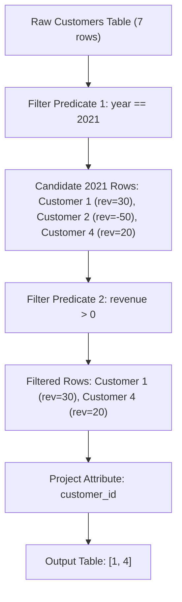

# Guided Example: Find Customers With Positive Revenue this Year

We trace the step-by-step relational selection and attribute projection on a representative database instance:

- **Input:** `Customers` table containing customer records across various years with positive, zero, and negative revenues.
- **Required Output:** Table of `customer_id` values with positive revenue in year $2021$.

This instance demonstrates row-local conjunctive predicate filtering in relational algebra, showing how non-qualifying years and non-positive revenues are discarded without cross-row grouping or joins.

---

## 1. Instance & Teaching Goal

We are given a relational table `Customers`:
- Primary key: `(customer_id, year)`.
- Columns: `customer_id` (integer), `year` (integer), and `revenue` (integer).
- We must find all customers whose revenue for the year $2021$ was strictly positive ($\text{revenue} > 0$).
- Output table: a single column `customer_id`, in any order.

Consider the representative dataset:

| `customer_id` | `year` | `revenue` |
|:---:|:---:|:---:|
| $1$ | $2018$ | $50$ |
| $1$ | $2021$ | $30$ |
| $1$ | $2020$ | $70$ |
| $2$ | $2021$ | $-50$ |
| $3$ | $2018$ | $10$ |
| $3$ | $2016$ | $50$ |
| $4$ | $2021$ | $20$ |

Analysis of customers:
- Customer $1$: has records for $2018, 2020, 2021$. For $2021$, $\text{revenue} = 30 > 0$. **Matches**.
- Customer $2$: has record for $2021$ with $\text{revenue} = -50 \le 0$. **Excluded**.
- Customer $3$: records exist for $2016$ and $2018$, but no record exists for $2021$. **Excluded**.
- Customer $4$: has record for $2021$ with $\text{revenue} = 20 > 0$. **Matches**.

Required output:
```text
+-------------+
| customer_id |
+-------------+
| 1           |
| 4           |
+-------------+
```

The teaching goal is to express the query as a pure selection $\sigma$ followed by projection $\pi$. Because $(\text{customer\_id}, \text{year})$ is a unique composite key, each customer appears at most once for year $2021$, guaranteeing uniqueness in the output without requiring an explicit `DISTINCT` operator.

---

## 2. Conceptual Foundation & Invariants

### Relational Algebra Formulation

Let relation $R$ be defined over schema $(\text{customer\_id}, \text{year}, \text{revenue})$.
The operation is formalized as:
$$Q = \pi_{\text{customer\_id}} \left( \sigma_{\text{year} = 2021 \land \text{revenue} > 0}(R) \right)$$

1. **Selection ($\sigma$):** Retains only tuples $t \in R$ where both predicates evaluate to true:
   $$t.\text{year} = 2021 \quad \text{and} \quad t.\text{revenue} > 0$$
2. **Projection ($\pi$):** Drops `year` and `revenue`, emitting only the `customer_id` column.

### Relational Selection & Conjunctive Predicate Invariant Theorem

> **Relational Selection & Conjunctive Predicate Invariant Theorem.**
> Let relation $R$ satisfy the functional dependency $(\text{customer\_id}, \text{year}) \to \text{revenue}$.
> 1. *Singular Membership:* For any customer $c$, there exists at most one tuple $t \in R$ with $t.\text{customer\_id} = c$ and $t.\text{year} = 2021$.
> 2. *Independence of Tuples:* The evaluation of predicate $P(t) \equiv (t.\text{year} = 2021) \land (t.\text{revenue} > 0)$ depends solely on the attributes of tuple $t$. Tuples for other years or other customers have zero influence on $P(t)$.
> 3. *Projection Invariance:* Restricting $R$ to tuples where $t.\text{year} = 2021$ yields a subset of tuples with mutually distinct $\text{customer\_id}$ values. Consequently, projecting onto $\text{customer\_id}$ emits pairwise distinct identifiers naturally without duplicate elimination overhead.



---

## 3. Step-by-Step Worked Execution

We trace the relational scan across all $7$ tuples of the sample table:

---

### Step 1: Scan Tuples for Customer $1$

1. **Tuple 1:** `(customer_id = 1, year = 2018, revenue = 50)`
   - Predicate test: $\text{year} = 2018 \neq 2021$.
   - Outcome: **Rejected** (Year mismatch).

2. **Tuple 2:** `(customer_id = 1, year = 2021, revenue = 30)`
   - Predicate test: $\text{year} = 2021$ (True) $\land$ $\text{revenue} = 30 > 0$ (True).
   - Outcome: **Accepted**. Emits `customer_id = 1`.

3. **Tuple 3:** `(customer_id = 1, year = 2020, revenue = 70)`
   - Predicate test: $\text{year} = 2020 \neq 2021$.
   - Outcome: **Rejected** (Year mismatch).

---

### Step 2: Scan Tuple for Customer $2$

4. **Tuple 4:** `(customer_id = 2, year = 2021, revenue = -50)`
   - Predicate test: $\text{year} = 2021$ (True), but $\text{revenue} = -50 \le 0$ (False).
   - Outcome: **Rejected** (Non-positive revenue).

---

### Step 3: Scan Tuples for Customer $3$

5. **Tuple 5:** `(customer_id = 3, year = 2018, revenue = 10)`
   - Predicate test: $\text{year} = 2018 \neq 2021$.
   - Outcome: **Rejected** (Year mismatch).

6. **Tuple 6:** `(customer_id = 3, year = 2016, revenue = 50)`
   - Predicate test: $\text{year} = 2016 \neq 2021$.
   - Outcome: **Rejected** (Year mismatch).

---

### Step 4: Scan Tuple for Customer $4$

7. **Tuple 7:** `(customer_id = 4, year = 2021, revenue = 20)`
   - Predicate test: $\text{year} = 2021$ (True) $\land$ $\text{revenue} = 20 > 0$ (True).
   - Outcome: **Accepted**. Emits `customer_id = 4`.

---

### Step 5: Final Projected Relation

Collect all accepted `customer_id` entries:
```text
+-------------+
| customer_id |
+-------------+
| 1           |
| 4           |
+-------------+
```

---

## 4. Complete Execution Trace

| Row | `customer_id` | `year` | `revenue` | $\text{year} = 2021$? | $\text{revenue} > 0$? | Both Satisfied? | Output Projection |
|:---:|:---:|:---:|:---:|:---:|:---:|:---:|:---:|
| $1$ | $1$ | $2018$ | $50$ | False | True | No | Discarded |
| $2$ | $1$ | $2021$ | $30$ | **True** | **True** | **Yes** | Emits `1` |
| $3$ | $1$ | $2020$ | $70$ | False | True | No | Discarded |
| $4$ | $2$ | $2021$ | $-50$ | **True** | False | No | Discarded |
| $5$ | $3$ | $2018$ | $10$ | False | True | No | Discarded |
| $6$ | $3$ | $2016$ | $50$ | False | True | No | Discarded |
| $7$ | $4$ | $2021$ | $20$ | **True** | **True** | **Yes** | Emits `4` |

---

## 5. Algorithmic Correctness

**Soundness.** Every customer emitted satisfies both predicates: the record belongs to the year $2021$ and the revenue is strictly greater than zero. No non-qualifying customer is emitted.

**Completeness.** The sequential scan inspects every tuple in the `Customers` table. Because each customer's status for year $2021$ is fully recorded in the table, all qualifying customers are identified and included in the output.

---

## 6. Traps This Instance Exposes

- **Strict Inequality:** The problem specifies *positive* revenue ($\text{revenue} > 0$). A revenue of $0$ is non-negative but not positive; using $\ge 0$ would incorrectly include zero-revenue rows.
- **Negative Revenue Values:** Revenue can be negative (e.g. customer $2$ with $-50$). Filtering by $\text{revenue} > 0$ handles negative values correctly.
- **Missing Year Records:** Customers with positive revenues in other years (such as customer $3$ in $2016$ and $2018$) must not be reported if they had no positive record in $2021$.

---

## 7. Complexity Derivation

- **Time Complexity:** $\mathcal{O}(N)$ sequential table scan, where $N$ is the number of rows in `Customers`. If a composite B-tree index on `(year, revenue)` exists, index range scan reduces retrieval time to $\mathcal{O}(\log N + K)$, where $K$ is the number of matching rows.
- **Auxiliary Space Complexity:** $\mathcal{O}(K)$ to store and return the result set of qualifying customer IDs.
