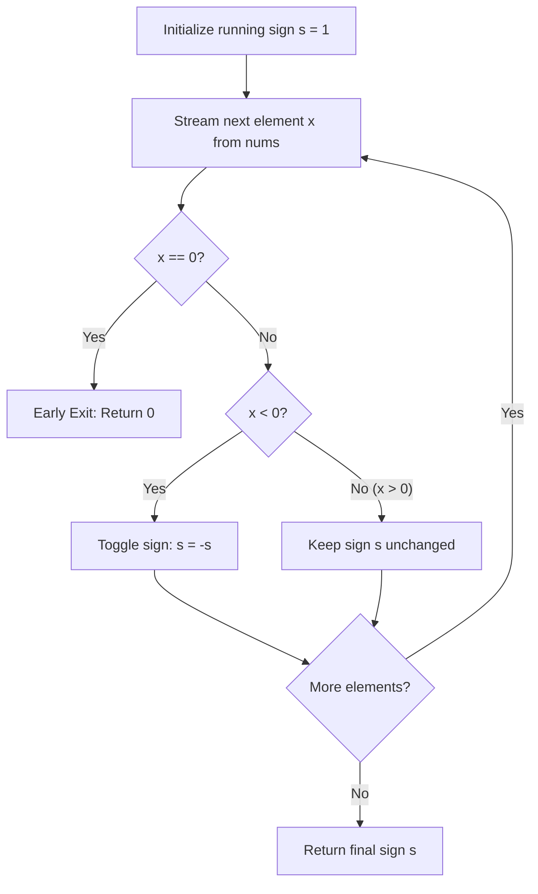

# Guided Example: Sign of the Product of an Array

We trace the step-by-step evaluation of the sign of an array product via sign homomorphism and negative-parity tracking on a representative problem instance:

- **Input:** `nums = [-1, -2, -3, -4, 3, 2, 1]`
- **Required Output:** `1`

This instance demonstrates how tracking the parity of negative numbers and short-circuiting on zero avoids integer overflow from computing large numerical products.

---

## 1. Instance & Teaching Goal

We are given an integer array `nums`.
The sign function $\text{signFunc}(x)$ is defined as:
- $1$ if $x > 0$
- $-1$ if $x < 0$
- $0$ if $x == 0$

Let $P = \prod_{i=0}^{n-1} \text{nums}[i]$ be the product of all values in `nums`. We must return $\text{signFunc}(P)$.

In our instance:
- `nums = [-1, -2, -3, -4, 3, 2, 1]`
- The array has $7$ elements.
- The actual numerical product is:
  $$P = (-1) \times (-2) \times (-3) \times (-4) \times 3 \times 2 \times 1 = 24 \times 6 = 144$$
- Since $P = 144 > 0$, $\text{signFunc}(144) = 1$.

The teaching goal is to recognize that directly calculating the product $P$ can cause integer overflow when array elements are large or the array has many entries (e.g. $1000$ elements). By exploiting the algebraic fact that the sign of a product depends exclusively on whether a zero is present and the parity of the count of negative numbers, we determine the answer in a single pass without computing large numbers.

---

## 2. Conceptual Foundation & Invariants

### Sign Homomorphism

The sign function is a homomorphism over the multiplicative monoid of real numbers:
$$\text{sgn}(x \cdot y) = \text{sgn}(x) \cdot \text{sgn}(y)$$

Extending this to a product of $n$ factors:
$$\text{sgn}\left(\prod_{i=0}^{n-1} x_i\right) = \prod_{i=0}^{n-1} \text{sgn}(x_i)$$

Each element $x_i$ contributes to the product sign according to its own sign:
1. **Zero as Absorbing Element:** If any $x_i = 0$, then $\text{sgn}(x_i) = 0$, which immediately sets the entire product sign to $0$. We can terminate immediately upon encountering any $0$.
2. **Positive Elements as Multiplicative Identity:** If $x_i > 0$, then $\text{sgn}(x_i) = 1$. Multiplying by $1$ leaves the running sign unchanged.
3. **Negative Elements as Inversion Operators:** If $x_i < 0$, then $\text{sgn}(x_i) = -1$. Each negative element toggles the sign ($+1 \leftrightarrow -1$).

### Sign Homomorphism & Negative Parity Invariant Theorem

> **Sign Homomorphism & Negative Parity Invariant Theorem.**
> Let $A = [x_0, x_1, \dots, x_{n-1}]$ be an array of integers.
> 1. If $0 \in A$, then $\text{sgn}(\prod x_i) = 0$.
> 2. If $0 \notin A$, let $C = |\{ i : x_i < 0 \}|$ be the total count of negative elements in $A$. Then:
>    $$\text{sgn}\left(\prod_{i=0}^{n-1} x_i\right) = (-1)^C = \begin{cases} 1 & \text{if } C \equiv 0 \pmod 2, \\ -1 & \text{if } C \equiv 1 \pmod 2. \end{cases}$$
> Initializing a sign accumulator $s = 1$ and inverting $s \to -s$ for every $x_i < 0$ guarantees that after scanning all elements, $s = (-1)^C$, computing the exact sign in $\mathcal{O}(n)$ time and $\mathcal{O}(1)$ space.

---

## 3. Step-by-Step Worked Execution

We trace `nums = [-1, -2, -3, -4, 3, 2, 1]`.
Initialize sign accumulator:
$$s = 1$$

---

### Step 1: Process Element $0$ ($x = -1$)
- Check value: $-1 \neq 0$ and $-1 < 0$.
- Update sign:
  $$s \to s \times (-1) = 1 \times (-1) = -1$$
- Running sign: $-1$.

---

### Step 2: Process Element $1$ ($x = -2$)
- Check value: $-2 \neq 0$ and $-2 < 0$.
- Update sign:
  $$s \to s \times (-1) = (-1) \times (-1) = 1$$
- Running sign: $1$.

---

### Step 3: Process Element $2$ ($x = -3$)
- Check value: $-3 \neq 0$ and $-3 < 0$.
- Update sign:
  $$s \to s \times (-1) = 1 \times (-1) = -1$$
- Running sign: $-1$.

---

### Step 4: Process Element $3$ ($x = -4$)
- Check value: $-4 \neq 0$ and $-4 < 0$.
- Update sign:
  $$s \to s \times (-1) = (-1) \times (-1) = 1$$
- Running sign: $1$.

---

### Step 5: Process Element $4$ ($x = 3$)
- Check value: $3 > 0$.
- Multiplicative identity: sign remains $s = 1$.

---

### Step 6: Process Element $5$ ($x = 2$)
- Check value: $2 > 0$.
- Multiplicative identity: sign remains $s = 1$.

---

### Step 7: Process Element $6$ ($x = 1$)
- Check value: $1 > 0$.
- Multiplicative identity: sign remains $s = 1$.

All elements processed. Final result: **`1`**.

---

## 4. Complete Execution Trace

| Index $i$ | Value $\text{nums}[i]$ | Condition Met | Action on Sign | Running Sign $s$ | Negative Count $C$ |
|:---:|:---:|:---:|:---:|:---:|:---:|
| Start | — | Initial state | Base identity | $1$ | $0$ |
| $0$ | $-1$ | $< 0$ | Toggle sign | $-1$ | $1$ |
| $1$ | $-2$ | $< 0$ | Toggle sign | $1$ | $2$ |
| $2$ | $-3$ | $< 0$ | Toggle sign | $-1$ | $3$ |
| $3$ | $-4$ | $< 0$ | Toggle sign | $1$ | $4$ |
| $4$ | $3$ | $> 0$ | No change | $1$ | $4$ |
| $5$ | $2$ | $> 0$ | No change | $1$ | $4$ |
| $6$ | $1$ | $> 0$ | No change | $1$ | $4$ |

Final emitted sign: **`1`**.

---

## 5. Algorithmic Correctness

**Soundness.** Multiplication of signs preserves the exact algebraic sign of the product of real numbers. Because positive numbers do not alter sign, negative numbers each flip the sign by a factor of $-1$, and zero produces an overall product of zero, the accumulated value $s$ is identical to $\text{signFunc}(\prod x_i)$.

**Completeness.** Every element in `nums` is inspected. If a zero exists, it is detected and triggers an immediate return of $0$. If no zero exists, all elements are processed, correctly reflecting the total count of negative numbers.

---

## 6. Traps This Instance Exposes

- **Arithmetic Overflow:** Computing the product of an array with $1000$ values of magnitude $100$ produces a number on the order of $10^{2000}$, which exceeds standard fixed-width 64-bit integer limits and wastes CPU memory in arbitrary-precision arithmetic.
- **Missing Early Exit on Zero:** Scanning the entire array after encountering a zero is redundant; returning $0$ immediately saves unnecessary iterations.
- **Negative Sign Inversion:** Miscounting the number of negative numbers or confusing $(-1)^{\text{even}} = 1$ with $(-1)^{\text{odd}} = -1$.

---

## 7. Complexity Derivation

- **Time Complexity:** $\mathcal{O}(n)$, where $n$ is the number of elements in `nums`. We perform a single loop over `nums` with $\mathcal{O}(1)$ operations per element.
- **Auxiliary Space Complexity:** $\mathcal{O}(1)$, requiring only a single scalar variable to track the running sign.
