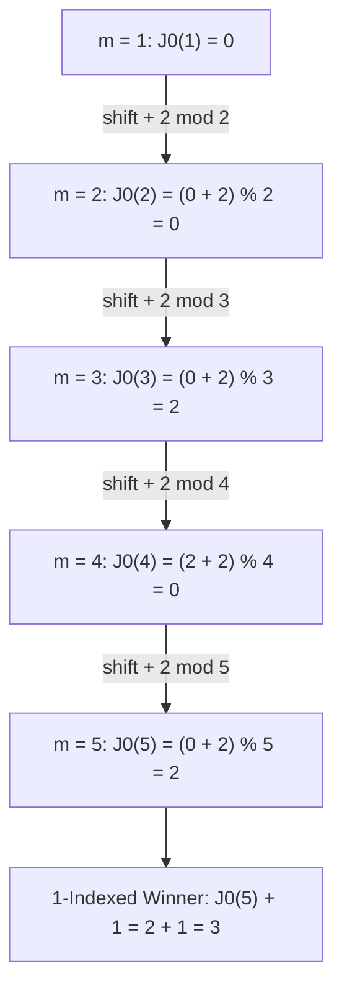

# Guided Example: Find the Winner of the Circular Game

We trace the step-by-step resolution of the circular elimination game (Josephus Problem) via dynamic index shifting on a representative problem instance:

- **Input:** `n = 5, k = 2`
- **Required Output:** `3`

This instance demonstrates both physical circular simulation and bottom-up mathematical recurrence, showing how tracking the survivor's relative index in a shrinking circle determines the winner in $\mathcal{O}(n)$ time without simulation overhead.

---

## 1. Instance & Teaching Goal

There are $n = 5$ friends sitting in a circle labeled $1, 2, 3, 4, 5$ in clockwise order.
The game proceeds as follows:
1. Start counting at friend $1$.
2. Count $k = 2$ friends clockwise (including the starting friend).
3. The $k$-th friend counted is eliminated from the circle.
4. Counting resumes from the friend immediately clockwise of the eliminated friend.
5. Repeat until only $1$ friend remains. This friend is declared the winner.

Physical trace of eliminations:
- Round $1$: Start at $1$. Count $2$ $\implies [1, 2]$. Friend $2$ is eliminated. Remaining: $[1, 3, 4, 5]$. Next start: $3$.
- Round $2$: Start at $3$. Count $2$ $\implies [3, 4]$. Friend $4$ is eliminated. Remaining: $[1, 3, 5]$. Next start: $5$.
- Round $3$: Start at $5$. Count $2$ $\implies [5, 1]$. Friend $1$ is eliminated. Remaining: $[3, 5]$. Next start: $3$.
- Round $4$: Start at $3$. Count $2$ $\implies [3, 5]$. Friend $5$ is eliminated. Remaining: $[3]$.

Sole survivor: Friend **`3`**.

The teaching goal is to recognize that physical simulation via array deletion takes $\mathcal{O}(n^2)$ time. By formulating the problem in 0-indexed modular arithmetic, we derive the Josephus recurrence $J(m) = (J(m - 1) + k) \bmod m$, solving for the survivor bottom-up in strictly $\mathcal{O}(n)$ time and $\mathcal{O}(1)$ auxiliary space.

---

## 2. Conceptual Foundation & Invariants

### Re-Indexing Under Circular Elimination

Consider $m$ participants indexed $0, 1, \dots, m - 1$.
The first person eliminated is at index $(k - 1) \bmod m$.
The person immediately following them, at index $k \bmod m$, becomes the starting point of the next round:

$$\begin{array}{rccccccc}
\text{Old Index:} & k \bmod m & (k+1) \bmod m & \dots & (k-2) \bmod m \\
\text{New Index in } (m-1) \text{ circle:} & 0 & 1 & \dots & m - 2
\end{array}$$

If person $x$ has index $x'$ in the reduced $(m - 1)$-person game, their original index in the $m$-person game was:
$$x = (x' + k) \bmod m$$

### Josephus Permutation Invariant & Index Shift Recurrence Theorem

> **Josephus Permutation Invariant & Index Shift Recurrence Theorem.**
> Let $J_0(m, k)$ denote the 0-indexed position of the survivor in a game of $m$ people with step size $k$.
> 1. **Base Case:** With $m = 1$, the sole participant is at index $0$:
>    $$J_0(1, k) = 0$$
> 2. **Inductive Step:** For any $m \ge 2$, the survivor's position in the $m$-person circle is obtained by shifting the survivor's position in the $(m - 1)$-person circle by $k$ positions modulo $m$:
>    $$J_0(m, k) = (J_0(m - 1, k) + k) \bmod m$$
> 3. **1-Indexed Conversion:** Converting the survivor's 0-indexed label $J_0(n, k)$ back to the problem's 1-indexed friend numbering:
>    $$\text{Winner}(n, k) = J_0(n, k) + 1$$

---

## 3. Step-by-Step Worked Execution

We trace the bottom-up recurrence for $n = 5, k = 2$.

---

### Step 1: Base Case ($m = 1$)
When only $1$ person remains, they occupy index $0$ in that 1-person circle:
$$J_0(1, 2) = 0$$

---

### Step 2: Step to $m = 2$
Add the 2nd person back into the circle:
$$J_0(2, 2) = (J_0(1, 2) + 2) \bmod 2 = (0 + 2) \bmod 2 = 0$$
The survivor was at index $0$ when $2$ people remained.

---

### Step 3: Step to $m = 3$
Add the 3rd person back into the circle:
$$J_0(3, 2) = (J_0(2, 2) + 2) \bmod 3 = (0 + 2) \bmod 3 = 2$$
The survivor was at index $2$ when $3$ people remained.

---

### Step 4: Step to $m = 4$
Add the 4th person back into the circle:
$$J_0(4, 2) = (J_0(3, 2) + 2) \bmod 4 = (2 + 2) \bmod 4 = 0$$
The survivor was at index $0$ when $4$ people remained.

---

### Step 5: Step to $m = 5$ (Full Circle)
Add the 5th person back into the circle:
$$J_0(5, 2) = (J_0(4, 2) + 2) \bmod 5 = (0 + 2) \bmod 5 = 2$$
The survivor occupies 0-indexed position $2$ in the initial circle of $5$ friends.

---

### Step 6: Convert to 1-Indexed Label
Friends are numbered $1, 2, 3, 4, 5$:
$$\text{Winner} = J_0(5, 2) + 1 = 2 + 1 = 3$$

Final output: **`3`**.

---

## 4. Complete Execution Trace

| Circle Size $m$ | Previous Index $J_0(m - 1)$ | Offset $+ k$ | Modulo $m$ Evaluation | Survivor 0-Index $J_0(m)$ | Corresponding 1-Indexed Friend |
|:---:|:---:|:---:|:---:|:---:|:---:|
| $1$ | — | — | Base Case | $0$ | Friend $1$ |
| $2$ | $0$ | $+ 2$ | $(0 + 2) \bmod 2 = 0$ | $0$ | Friend $1$ |
| $3$ | $0$ | $+ 2$ | $(0 + 2) \bmod 3 = 2$ | $2$ | Friend $3$ |
| $4$ | $2$ | $+ 2$ | $(2 + 2) \bmod 4 = 0$ | $0$ | Friend $1$ |
| $5$ | $0$ | $+ 2$ | $(0 + 2) \bmod 5 = 2$ | $2$ | **Friend $3$** |

Result: **`3`**.

---

## 5. Algorithmic Correctness

**Soundness.** Re-indexing each round by subtracting the eliminated person's offset creates an isomorphic subproblem with $m - 1$ players. Inverting this mapping by adding $k$ modulo $m$ tracks the exact trajectory of the winning individual back to their initial position in the starting circle.

**Completeness.** The recurrence evaluates every circle size from $1$ up to $n$ deterministically. Because the rules of elimination are deterministic and depend only on $n$ and $k$, the survivor is uniquely determined.

---

## 6. Traps This Instance Exposes

- **0-Indexed vs. 1-Indexed Offsets:** Modulo arithmetic naturally operates over $[0, m - 1]$. Applying $(J + k) \bmod m$ directly to 1-indexed numbers produces $0$ when the sum is a multiple of $m$. Operating throughout in 0-indexed notation and adding $1$ at the end completely avoids this off-by-one trap.
- **Physical Simulation Inefficiency:** Using an array and removing elements with `pop(index)` shifts elements on each deletion, requiring $\mathcal{O}(n^2)$ time. The mathematical recurrence eliminates all array manipulation.
- **Large Step Size $k$:** When $k > n$, counting wraps around the circle multiple times. The modulo operator automatically handles any $k \ge n$.

---

## 7. Complexity Derivation

- **Time Complexity:** $\mathcal{O}(n)$. The recurrence iterates $n - 1$ times from $m = 2$ to $n$, performing one addition and one modulo operation per iteration.
- **Auxiliary Space Complexity:** $\mathcal{O}(1)$ iterative space, using only a single integer accumulator to track the survivor's index.
