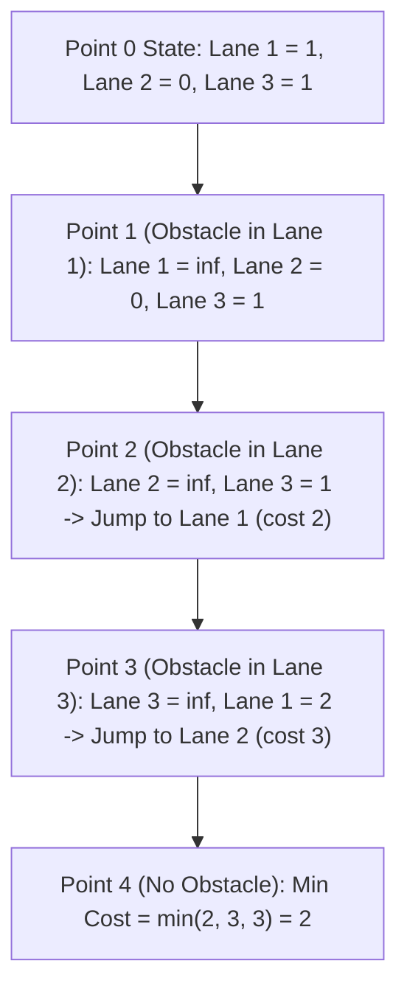

# Guided Example: Minimum Sideway Jumps

We trace the step-by-step dynamic programming evaluation of minimum side jumps on a representative problem instance:

- **Input:** `obstacles = [0, 1, 2, 3, 0]`
- **Required Output:** `2`

This instance features alternating obstacles across all three lanes, illustrating how forward movements in the same lane cost zero jumps while blocked lanes trigger side-jump relaxation to open parallel lanes.

---

## 1. Instance & Teaching Goal

There is a $3$-lane road consisting of $n + 1$ points labeled from $0$ to $n$.
- A frog starts at point $0$ on **lane 2** (the middle lane).
- An array `obstacles` of length $n + 1$ indicates that point $i$ contains an obstacle in lane `obstacles[i]`. If `obstacles[i] == 0`, there is no obstacle at point $i$. At most one lane has an obstacle at any point.
- Moving forward from point $i$ to $i + 1$ within the same lane costs **0** side jumps, provided no obstacle occupies that lane at point $i + 1$.
- At any point, the frog can make a **side jump** to any other lane at the same point that does not have an obstacle. Each side jump costs **1** jump.
- We must find the minimum number of side jumps to reach any lane at point $n$.

In our instance:
- `obstacles = [0, 1, 2, 3, 0]` ($n = 4$).
- Point $0$: no obstacles. Frog starts in lane $2$.
- Point $1$: obstacle on lane $1$.
- Point $2$: obstacle on lane $2$.
- Point $3$: obstacle on lane $3$.
- Point $4$: no obstacles. Target destination.

Physical route:
1. Start at point $0$, lane $2$ ($0$ side jumps).
2. Move forward to point $1$, lane $2$ ($0$ side jumps).
3. Lane $2$ is blocked at point $2$, so make **Side Jump 1** to lane $3$ at point $1$ or $2$ ($1$ total jump).
4. Move forward to point $2$, lane $3$ ($1$ total jump).
5. Lane $3$ is blocked at point $3$, so make **Side Jump 2** to lane $1$ ($2$ total jumps).
6. Move forward to point $3$, lane $1$, and then forward to point $4$, lane $1$ ($2$ total jumps).

Minimum side jumps required: **`2`**.

The teaching goal is to maintain the minimum cost to occupy each of the $3$ lanes at the current point, invalidate the lane with an obstacle by assigning cost $\infty$, and update the remaining lanes with potential sideway jumps ($\min(\text{lane costs}) + 1$).

---

## 2. Conceptual Foundation & Invariants

### 3-Lane State Representation

Let $f[j]$ denote the minimum number of side jumps to reach the current point in lane $j \in \{1, 2, 3\}$.
- At point $0$, the frog starts in lane $2$.
  - Lane $2$: cost $0$.
  - Lane $1$: reachable by $1$ side jump from lane $2$ $\implies$ cost $1$.
  - Lane $3$: reachable by $1$ side jump from lane $2$ $\implies$ cost $1$.
  - Initial vector: $f = [1, 0, 1]$ (for lanes $1, 2, 3$).

### Lane Preservation & Instantaneous Sideway Jump Invariant Theorem

> **Lane Preservation & Instantaneous Sideway Jump Invariant Theorem.**
> Let $f_{i-1}$ be the optimal cost vector at point $i - 1$. When advancing to point $i$:
> 1. **Forward Arrival:** Continuing forward along the same lane incurs zero jumps. If lane $j$ has an obstacle at point $i$ ($\text{obstacles}[i] == j$), that lane cannot be entered or maintained:
>    $$f_i^{\text{pre}}[j] = \begin{cases} \infty & \text{if } \text{obstacles}[i] == j, \\ f_{i-1}[j] & \text{otherwise}. \end{cases}$$
> 2. **Sideway Jump Relaxation:** A frog at point $i$ can jump from any reachable lane to any unblocked lane at an additional cost of $1$. The minimum cost among all reachable lanes at point $i$ is:
>    $$m = \min_{1 \le k \le 3} f_i^{\text{pre}}[k]$$
>    For every unblocked lane $j \neq \text{obstacles}[i]$, the cost becomes:
>    $$f_i[j] = \min(f_i^{\text{pre}}[j], \, m + 1)$$
> 3. After point $n$, the global minimum is $\min(f_n[1], f_n[2], f_n[3])$. Because transitions depend only on the immediately preceding point, space compresses to $\mathcal{O}(1)$.

---

## 3. Step-by-Step Worked Execution

We trace `obstacles = [0, 1, 2, 3, 0]`.
Initialize vector for lanes $[1, 2, 3]$:
$$f = [1, 0, 1]$$

---

### Step 1: Advance to Point $1$ (Obstacle in Lane $1$)
- Obstacle: $v = 1$.
- Forward arrival:
  - Lane $1$: blocked $\implies f[1] = \infty$.
  - Lane $2$: unblocked $\implies f[2] = 0$.
  - Lane $3$: unblocked $\implies f[3] = 1$.
  - Pre-jump state: $f^{\text{pre}} = [\infty, 0, 1]$.
- Sideway jump relaxation:
  - Minimum reachable cost: $m = \min(\infty, 0, 1) = 0$ (achieved in lane $2$).
  - Jump threshold: $m + 1 = 1$.
  - Lane $1$: blocked, remains $\infty$.
  - Lane $2$: $\min(0, 1) = 0$.
  - Lane $3$: $\min(1, 1) = 1$.
- State after Point $1$: $f = [\infty, 0, 1]$.

---

### Step 2: Advance to Point $2$ (Obstacle in Lane $2$)
- Obstacle: $v = 2$.
- Forward arrival:
  - Lane $1$: unblocked $\implies f[1] = \infty$.
  - Lane $2$: blocked $\implies f[2] = \infty$.
  - Lane $3$: unblocked $\implies f[3] = 1$.
  - Pre-jump state: $f^{\text{pre}} = [\infty, \infty, 1]$.
- Sideway jump relaxation:
  - Minimum reachable cost: $m = \min(\infty, \infty, 1) = 1$ (achieved in lane $3$).
  - Jump threshold: $m + 1 = 2$.
  - Lane $1$: $\min(\infty, 2) = 2$.
  - Lane $2$: blocked, remains $\infty$.
  - Lane $3$: $\min(1, 2) = 1$.
- State after Point $2$: $f = [2, \infty, 1]$.

---

### Step 3: Advance to Point $3$ (Obstacle in Lane $3$)
- Obstacle: $v = 3$.
- Forward arrival:
  - Lane $1$: unblocked $\implies f[1] = 2$.
  - Lane $2$: unblocked $\implies f[2] = \infty$.
  - Lane $3$: blocked $\implies f[3] = \infty$.
  - Pre-jump state: $f^{\text{pre}} = [2, \infty, \infty]$.
- Sideway jump relaxation:
  - Minimum reachable cost: $m = \min(2, \infty, \infty) = 2$ (achieved in lane $1$).
  - Jump threshold: $m + 1 = 3$.
  - Lane $1$: $\min(2, 3) = 2$.
  - Lane $2$: $\min(\infty, 3) = 3$.
  - Lane $3$: blocked, remains $\infty$.
- State after Point $3$: $f = [2, 3, \infty]$.

---

### Step 4: Advance to Point $4$ (Obstacle $v = 0$, Clear Road)
- Obstacle: $v = 0$ (none).
- Forward arrival:
  - $f^{\text{pre}} = [2, 3, \infty]$.
- Sideway jump relaxation:
  - Minimum reachable cost: $m = \min(2, 3, \infty) = 2$.
  - Jump threshold: $m + 1 = 3$.
  - Lane $1$: $\min(2, 3) = 2$.
  - Lane $2$: $\min(3, 3) = 3$.
  - Lane $3$: $\min(\infty, 3) = 3$.
- State after Point $4$: $f = [2, 3, 3]$.

---

### Step 5: Final Result Extraction
Minimum side jumps across all three lanes at point $4$:
$$\min(f) = \min(2, 3, 3) = 2$$

Final output: **`2`**.

---

## 4. Complete Execution Trace

| Point $i$ | Obstacle Lane $v$ | Lane 1 Cost ($f[1]$) | Lane 2 Cost ($f[2]$) | Lane 3 Cost ($f[3]$) | Minimal Lane Cost $m$ | Notes / Optimal Actions |
|:---:|:---:|:---:|:---:|:---:|:---:|:---|
| $0$ | $0$ | $1$ | $0$ | $1$ | $0$ | Start on Lane 2 with 0 jumps |
| $1$ | $1$ | $\infty$ | $0$ | $1$ | $0$ | Lane 1 blocked; stay in Lane 2 |
| $2$ | $2$ | $2$ | $\infty$ | $1$ | $1$ | Lane 2 blocked; Lane 3 optimal ($1$ jump) |
| $3$ | $3$ | $2$ | $3$ | $\infty$ | $2$ | Lane 3 blocked; Lane 1 optimal ($2$ jumps) |
| $4$ | $0$ | $2$ | $3$ | $3$ | **`2`** | Destination reached; minimum cost is $2$ |

---

## 5. Algorithmic Correctness

**Soundness.** A frog cannot occupy a lane containing an obstacle at the current point, so setting its cost to $\infty$ correctly prohibits invalid states. Any jump from a valid lane to an unblocked lane incurs exactly $+1$ jump. Taking the minimum over all valid moves ensures that every recorded cost is physically achievable.

**Completeness.** At each step, all forward moves and all possible side jumps are considered. Because $3$ is small and fixed, enumerating all lane transitions at each point explores the entire reachable space without missing any candidate path.

---

## 6. Traps This Instance Exposes

- **Greedy Lookahead Misdirection:** Jumping to a lane without checking subsequent obstacles can lead into an immediate trap. Dynamic programming computes the optimal cost without requiring heuristic lookahead.
- **Side Jumps at Point 0:** The frog can jump sideways at point $0$ before moving forward, which is why initial costs for lanes $1$ and $3$ are $1$, not $\infty$.
- **Simultaneous Multiple Jumps:** Jumping from lane $A \to B \to C$ at the same point would cost $2$ jumps, which is never strictly better than jumping directly from $A \to C$ in $1$ jump. Thus, a single relaxation step ($m + 1$) per point suffices.

---

## 7. Complexity Derivation

- **Time Complexity:** $\mathcal{O}(n)$, where $n$ is the length of the road (`len(obstacles) - 1`). For each of the $n$ points, we evaluate a constant number of lane checks ($3$ lanes), performing $\mathcal{O}(1)$ operations per point.
- **Auxiliary Space Complexity:** $\mathcal{O}(1)$, storing only a fixed array of size $3$ to hold lane costs.
