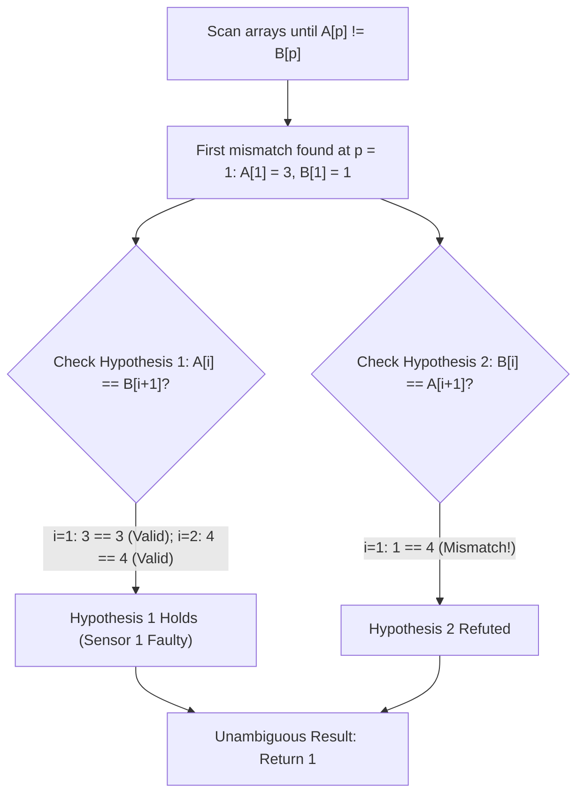

# Guided Example: Faulty Sensor

We trace the step-by-step identification of a defective sensor via prefix agreement and asymmetric shift alignment on a representative problem instance:

- **Input:** `sensor1 = [2, 3, 4, 5]`, `sensor2 = [2, 1, 3, 4]`
- **Required Output:** `1`

This instance demonstrates how a single dropped observation shifts subsequent readings by one position, enabling hypothesis testing between candidate defect alignments to pinpoint the faulty sensor in linear time.

---

## 1. Instance & Teaching Goal

Two sensors collect data in an experiment, recording arrays `sensor1` and `sensor2` of identical length $n$.
Under normal operation, both sensors produce identical data streams.
However, exactly **one** sensor is faulty:
- The faulty sensor dropped exactly one data point during collection.
- All subsequent data points in that sensor were shifted to the left by one position.
- The faulty sensor appended an arbitrary value at its last index ($n - 1$).

We must determine which sensor is faulty:
- Return `1` if `sensor1` is definitely the faulty sensor.
- Return `2` if `sensor2` is definitely the faulty sensor.
- Return `-1` if it is impossible to determine (both hypotheses are plausible, or the dropped value occurred at the very last index).

In our instance:
- `sensor1 = [2, 3, 4, 5]` ($n = 4$)
- `sensor2 = [2, 1, 3, 4]` ($n = 4$)
- Index $0$: $\text{sensor1}[0] = 2 = \text{sensor2}[0]$. Both agree.
- Index $1$: $\text{sensor1}[1] = 3 \neq \text{sensor2}[1] = 1$. First disagreement at $p = 1$.
- If Sensor 1 is faulty, it dropped the true value $1$ that Sensor 2 recorded at index $1$. Then Sensor 1's subsequent elements should match Sensor 2 shifted by $1$:
  - $\text{sensor1}[1] \stackrel{?}{=} \text{sensor2}[2] \implies 3 == 3$ (True).
  - $\text{sensor1}[2] \stackrel{?}{=} \text{sensor2}[3] \implies 4 == 4$ (True).
  Sensor 1 satisfies the defect condition.
- If Sensor 2 were faulty, it would have dropped the value $3$ recorded by Sensor 1. Then Sensor 2's subsequent elements should match Sensor 1 shifted by $1$:
  - $\text{sensor2}[1] \stackrel{?}{=} \text{sensor1}[2] \implies 1 == 4$ (False).
  Sensor 2 cannot be the faulty sensor.
- Therefore, Sensor 1 is unambiguously faulty.

The teaching goal is to recognize that scanning to the first mismatch isolates the dropout candidate index, after which testing the two parallel shift alignments determines the faulty sensor.

---

## 2. Conceptual Foundation & Invariants

### Common Prefix and Dropout Invariant

Let $A = \text{sensor1}$ and $B = \text{sensor2}$.
1. Prior to the dropout, both sensors observe the same data. The common prefix satisfies:
   $$A[i] = B[i], \quad \forall 0 \le i < p$$
   where $p$ is the index of the first mismatch.
2. At index $p$, one sensor recorded the true observation, while the other sensor dropped it and recorded the next available observation instead.

### Single Element Dropout & Asymmetric Shift Invariant Theorem

> **Single Element Dropout & Asymmetric Shift Invariant Theorem.**
> Let $p$ be the minimal index where $A[p] \neq B[p]$.
> - **Hypothesis 1 ($A$ is faulty):** Sensor $B$ represents the true sequence. Sensor $A$ skipped $B[p]$, shifting its subsequent values left:
>   $$A[i] = B[i + 1], \quad \forall p \le i < n - 1$$
> - **Hypothesis 2 ($B$ is faulty):** Sensor $A$ represents the true sequence. Sensor $B$ skipped $A[p]$, shifting its subsequent values left:
>   $$B[i] = A[i + 1], \quad \forall p \le i < n - 1$$
>
> Testing each hypothesis over $i \in [p, n - 2]$ yields:
> 1. If $A[i + 1] \neq B[i]$ for some $i$, then $B$ cannot be shifted relative to $A$, refuting Hypothesis 2; if Hypothesis 1 holds, return `1`.
> 2. If $A[i] \neq B[i + 1]$ for some $i$, then $A$ cannot be shifted relative to $B$, refuting Hypothesis 1; if Hypothesis 2 holds, return `2`.
> 3. If neither hypothesis is refuted (or $p = n - 1$), both sensors could plausibly be the faulty sensor; return `-1`.

---

## 3. Step-by-Step Worked Execution

We trace `sensor1 = [2, 3, 4, 5]` and `sensor2 = [2, 1, 3, 4]` ($n = 4$).

---

### Step 1: Find the First Disagreement Index $p$

Initialize pointer $i = 0$. Compare $A[i]$ with $B[i]$:
- $i = 0$:
  $$A[0] = 2, \quad B[0] = 2 \implies \text{Match. Increment } i \to 1$$
- $i = 1$:
  $$A[1] = 3, \quad B[1] = 1 \implies 3 \neq 1 \implies \text{Mismatch!}$$

Stop prefix scan at $p = 1$.

---

### Step 2: Test Shift Alignments from Index $p = 1$ to $n - 2 = 2$

We evaluate the two shift relationships across the remaining interior indices:

#### Position $i = 1$:
- Test Hypothesis 2: Does $B[1] == A[2]$?
  $$B[1] = 1, \quad A[2] = 4 \implies 1 \neq 4$$
  Hypothesis 2 fails! Sensor 2 is **not** the faulty sensor.
- Test Hypothesis 1: Does $A[1] == B[2]$?
  $$A[1] = 3, \quad B[2] = 3 \implies 3 == 3$$
  Hypothesis 1 remains valid.

#### Position $i = 2$:
- Test Hypothesis 1: Does $A[2] == B[3]$?
  $$A[2] = 4, \quad B[3] = 4 \implies 4 == 4$$
  Hypothesis 1 remains valid.

All interior positions verified.

---

### Step 3: Conclude Faulty Sensor

- Hypothesis 1 is fully satisfied across all remaining indices.
- Hypothesis 2 was refuted at index $1$.
- Conclusion: Sensor 1 is definitely the faulty sensor.

Emitted result: **`1`**.

---

## 4. Complete Execution Trace

| Index $i$ | $A[i]$ (`sensor1`) | $B[i]$ (`sensor2`) | Equality Check | Hypothesis 1 ($A[i] \stackrel{?}{=} B[i+1]$) | Hypothesis 2 ($B[i] \stackrel{?}{=} A[i+1]$) | Status |
|:---:|:---:|:---:|:---:|:---:|:---:|:---|
| $0$ | $2$ | $2$ | $2 == 2$ | — | — | Common prefix agreement |
| $1$ | $3$ | $1$ | $3 \neq 1$ | $A[1] == B[2] \implies 3 == 3$ (True) | $B[1] == A[2] \implies 1 == 4$ (False) | First mismatch; Hyp 2 refuted |
| $2$ | $4$ | $3$ | — | $A[2] == B[3] \implies 4 == 4$ (True) | — | Hyp 1 confirmed |
| $3$ | $5$ | $4$ | — | Tail element (ignored) | Tail element (ignored) | Arbitrary value in faulty sensor |

Final result: **`1`**.

---

## 5. Algorithmic Correctness

**Soundness.** If Sensor 2 had dropped an element at index $p$, its suffix $B[p \dots n-2]$ would be an exact copy of $A[p+1 \dots n-1]$. Observing $B[1] \neq A[2]$ mathematically disproves that Sensor 2 was the faulty sensor. Meanwhile, $A[1 \dots 2] == B[2 \dots 3]$ proves that Sensor 1 matches the exact pattern of dropping element $B[1]$.

**Completeness.** There are only two possible faulty sensors. By checking both shifted relationships simultaneously across all affected indices, the algorithm eliminates any invalid hypothesis and returns $-1$ if and only if both hypotheses remain plausible.

---

## 6. Traps This Instance Exposes

- **Inspecting the Tail Element ($n - 1$):** The faulty sensor appends a completely arbitrary value at index $n - 1$. Comparing the last element directly can trigger false rejections; only indices up to $n - 2$ can be compared against the shifted counterpart.
- **Ambiguous Defect at Tail:** If the first disagreement occurs at $p = n - 1$, either sensor could have dropped its final value and replaced it with a random tail, so the answer must be $-1$.
- **Identical Shifted Sequences:** For arrays like `sensor1 = [1, 1, 1, 1]` and `sensor2 = [1, 1, 1, 2]`, shifting by $1$ leaves all ones unchanged, making both hypotheses valid. The algorithm must return `-1` in such symmetric cases.

---

## 7. Complexity Derivation

- **Time Complexity:** $\mathcal{O}(n)$, where $n$ is the length of the sensor arrays. The two pointers traverse the arrays in a single forward pass, examining each index at most twice.
- **Auxiliary Space Complexity:** $\mathcal{O}(1)$, using only scalar pointer variables.
