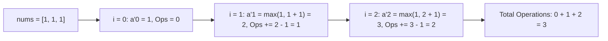

# Guided Example: Minimum Operations to Make the Array Increasing

We trace the step-by-step greedy adjustment of an array to strictly increasing order on a representative problem instance:

- **Input:** `nums = [1, 1, 1]`
- **Required Output:** `3`

This instance demonstrates how each element must be elevated to at least one greater than its predecessor, showing that choosing the pointwise minimal feasible integer at each index guarantees the global minimum number of increment operations.

---

## 1. Instance & Teaching Goal

We are given a 0-indexed integer array `nums`.
In one operation, we can choose any element in the array and increment its value by $1$.
An array $A$ is **strictly increasing** if:
$$A[0] < A[1] < A[2] < \dots < A[n-1]$$

We must find the minimum number of increment operations required to transform `nums` into a strictly increasing array.

In our instance:
- `nums = [1, 1, 1]` of length $n = 3$.
- Initial elements: $a_0 = 1, a_1 = 1, a_2 = 1$.
- At index $0$: $a'_0 = 1$ (no increment needed).
- At index $1$: must satisfy $a'_1 > a'_0 = 1$. The smallest valid integer is $2$.
  Increment operations: $2 - 1 = 1$.
- At index $2$: must satisfy $a'_2 > a'_1 = 2$. The smallest valid integer is $3$.
  Increment operations: $3 - 1 = 2$.
- Final modified array: $[1, 2, 3]$.
- Total operations: $0 + 1 + 2 = 3$.

The teaching goal is to recognize the greedy substructure: because operations can only increase numbers, raising an element any higher than $\max(a_i, a'_{i-1} + 1)$ incurs unnecessary operations immediately and forces subsequent elements to be even larger. Pointwise minimal elevation achieves global optimality.

---

## 2. Conceptual Foundation & Invariants

### Pointwise Minimum Formulation

Let $a_i$ be the original value at index $i$, and let $a'_i$ be the target value after increments.
The optimization constraints are:
1. $a'_i \ge a_i$ (elements can only increase).
2. $a'_i \ge a'_{i-1} + 1$ for all $i \ge 1$ (strict integer monotonicity).

Combining these two lower bounds gives the exact minimal feasible assignment:
$$a'_i = \max(a_i, \, a'_{i-1} + 1)$$

The operations added at index $i$ are:
$$\Delta_i = a'_i - a_i = \max(0, \, a'_{i-1} + 1 - a_i)$$

### Pointwise Minimal Monotonic Elevation Theorem

> **Pointwise Minimal Monotonic Elevation Theorem.**
> Let $A = [a_0, \dots, a_{n-1}]$ and let $A' = [a'_0, \dots, a'_{n-1}]$ be any strictly increasing array with $a'_i \ge a_i$ for all $i$.
> 1. *Prefix Monotonicity:* Any choice $a'_k > \max(a_k, a'_{k-1} + 1)$ strictly increases the sum $\sum (a'_i - a_i)$ at index $k$ while strengthening the lower bound $a'_{k+1} \ge a'_k + 1$ for all subsequent elements.
> 2. *Greedy Optimality:* Setting $a'_i = \max(a_i, a'_{i-1} + 1)$ minimizes the cost at step $i$ while providing the slackest possible constraint for $a'_{i+1}$. By mathematical induction, the pointwise minimum sequence $A^*$ minimizes the total sum of operations $\sum_{i=0}^{n-1} (a'_i - a_i)$.

---

## 3. Step-by-Step Worked Execution

We trace `nums = [1, 1, 1]`.
Initialize total operations $\text{ans} = 0$, and previous elevated element $p = 0$.

---

### Step 1: Process Index $0$ ($a_0 = 1$)
- First element: no predecessor constraint.
- Required minimum value:
  $$a'_0 = \max(a_0, \, p + 1) = \max(1, \, 0 + 1) = 1$$
- Operations added:
  $$\Delta_0 = \max(0, \, a'_0 - a_0) = \max(0, 1 - 1) = 0$$
- Update state:
  $$\text{ans} \to 0, \quad p \to 1$$

---

### Step 2: Process Index $1$ ($a_1 = 1$)
- Predecessor has value $p = 1$.
- Strict monotonicity requires $a'_1 \ge p + 1 = 1 + 1 = 2$.
- Required minimum value:
  $$a'_1 = \max(a_1, \, p + 1) = \max(1, 2) = 2$$
- Operations added:
  $$\Delta_1 = a'_1 - a_1 = 2 - 1 = 1$$
- Update state:
  $$\text{ans} \to 0 + 1 = 1, \quad p \to 2$$

---

### Step 3: Process Index $2$ ($a_2 = 1$)
- Predecessor has value $p = 2$.
- Strict monotonicity requires $a'_2 \ge p + 1 = 2 + 1 = 3$.
- Required minimum value:
  $$a'_2 = \max(a_2, \, p + 1) = \max(1, 3) = 3$$
- Operations added:
  $$\Delta_2 = a'_2 - a_2 = 3 - 1 = 2$$
- Update state:
  $$\text{ans} \to 1 + 2 = 3, \quad p \to 3$$

All elements processed. Final total operations: **`3`**.

---

## 4. Complete Execution Trace

| Index $i$ | Original $a_i$ | Predecessor $a'_{i-1}$ | Required Lower Bound ($a'_{i-1} + 1$) | Target $a'_i = \max(a_i, a'_{i-1} + 1)$ | Increments $\Delta_i$ | Cumulative Operations |
|:---:|:---:|:---:|:---:|:---:|:---:|:---:|
| $0$ | $1$ | — | — | $1$ | $0$ | $0$ |
| $1$ | $1$ | $1$ | $2$ | $2$ | $1$ | $1$ |
| $2$ | $1$ | $2$ | $3$ | $3$ | $2$ | **`3`** |

Final strictly increasing sequence: $[1, 2, 3]$ with **`3`** operations.

---

## 5. Algorithmic Correctness

**Soundness.** Every modified element satisfies $a'_i \ge a_i$ and $a'_i \ge a'_{i-1} + 1$, guaranteeing that the resulting sequence is strictly increasing and reachable via single increments.

**Completeness.** Since $a'_i = \max(a_i, a'_{i-1} + 1)$ is the mathematical infimum over all integers that satisfy both constraints, any other valid strictly increasing sequence $B$ must have $B[i] \ge a'_i$ for all $i$. Thus $\sum (B[i] - a_i) \ge \sum (a'_i - a_i)$, proving that the greedy choice achieves the global minimum.

---

## 6. Traps This Instance Exposes

- **Decrements Forbidden:** If decrements were permitted, smoothing the array could yield fewer operations. Because only $+1$ increments are allowed, values can never decrease below their original entries.
- **Strict vs. Non-Decreasing:** The condition is strictly increasing ($<$), not non-decreasing ($\le$). Adjacent identical values require at least $1$ increment.
- **Already Increasing Segments:** When $a_i > a'_{i-1}$, $\Delta_i = 0$. The algorithm must not force an increment when the natural array already increases.

---

## 7. Complexity Derivation

- **Time Complexity:** $\mathcal{O}(n)$, performing a single linear pass over the array with $\mathcal{O}(1)$ arithmetic operations per element.
- **Auxiliary Space Complexity:** $\mathcal{O}(1)$, using only two scalar variables to store the running operations count and the previous elevated value.
