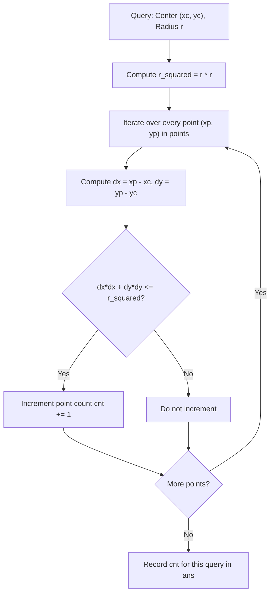

# Guided Example: Queries on Number of Points Inside a Circle

We trace the step-by-step evaluation of 2D circle containment queries via squared Euclidean norm comparisons on a representative problem instance:

- **Input:** `points = [[1, 3], [3, 3], [5, 3], [2, 2]], queries = [[2, 3, 1], [4, 3, 1], [1, 1, 2]]`
- **Required Output:** `[3, 2, 2]`

This instance demonstrates how squaring the geometric distance inequality eliminates floating-point error, evaluating circle membership through exact integer arithmetic.

---

## 1. Instance & Teaching Goal

We are given:
- An array `points` where each element $[x_i, y_i]$ represents a 2D integer point.
- An array `queries` where each element $[x_j, y_j, r_j]$ describes a closed circle centered at $(x_j, y_j)$ with radius $r_j$.
- A point is considered **inside** the circle if it lies strictly within the circle or directly on its boundary.
- We must return an array $\text{ans}$ where $\text{ans}[j]$ is the count of points inside the $j$-th circle.

In our instance:
- `points = [[1, 3], [3, 3], [5, 3], [2, 2]]` ($4$ points)
- Query $0$: Center $(2, 3)$, radius $r = 1$. Contains points $(1, 3), (3, 3), (2, 2)$. Count $= 3$.
- Query $1$: Center $(4, 3)$, radius $r = 1$. Contains points $(3, 3), (5, 3)$. Count $= 2$.
- Query $2$: Center $(1, 1)$, radius $r = 2$. Contains points $(1, 3), (2, 2)$. Count $= 2$.
- Expected answer: `[3, 2, 2]`.

The teaching goal is to express circle containment using the algebraic condition $(x_i - x_j)^2 + (y_i - y_j)^2 \le r_j^2$. Avoiding the square root operation ($\sqrt{\cdot}$) maintains exact integer precision and accelerates per-point evaluation.

---

## 2. Conceptual Foundation & Invariants

### Exact Squared Distance Comparison

The standard Euclidean distance between point $(x_p, y_p)$ and circle center $(x_c, y_c)$ is:
$$d = \sqrt{(x_p - x_c)^2 + (y_p - y_c)^2}$$

The point lies inside or on the boundary of a circle of radius $r$ if and only if $d \le r$.
Because both $d \ge 0$ and $r \ge 0$, squaring both sides preserves the inequality:
$$d^2 \le r^2 \iff (x_p - x_c)^2 + (y_p - y_c)^2 \le r^2$$

### Euclidean Disk Membership & Integer Norm Invariant Theorem

> **Euclidean Disk Membership & Integer Norm Invariant Theorem.**
> Let $(x_p, y_p) \in \mathbb{Z}^2$ be a point and let $(x_c, y_c, r) \in \mathbb{Z}^2 \times \mathbb{Z}^+$ define a closed disk.
> 1. *Precision Invariance:* The function $f(x_p, y_p) = (x_p - x_c)^2 + (y_p - y_c)^2 - r^2$ is an integer-valued polynomial.
> 2. *Equivalence:*
>    - $f(x_p, y_p) < 0 \iff$ Point is strictly inside the circle.
>    - $f(x_p, y_p) = 0 \iff$ Point is on the circle boundary.
>    - $f(x_p, y_p) > 0 \iff$ Point is strictly outside the circle.
> 3. *Decoupled Independence:* Queries are mutually independent. Testing each of the $P$ points against each of the $Q$ queries performs $P \times Q$ evaluations in $\mathcal{O}(P \cdot Q)$ time without floating-point precision loss.

---

## 3. Step-by-Step Worked Execution

We trace the evaluation across the $3$ queries with points:
$$P_0 = (1, 3), \quad P_1 = (3, 3), \quad P_2 = (5, 3), \quad P_3 = (2, 2)$$

---

### Step 1: Evaluate Query $0$ — Center $(2, 3)$, Radius $r = 1$ ($r^2 = 1$)

- Point $P_0 = (1, 3)$:
  $$(1 - 2)^2 + (3 - 3)^2 = (-1)^2 + 0^2 = 1 + 0 = 1 \le 1 \implies \text{Inside!}$$
- Point $P_1 = (3, 3)$:
  $$(3 - 2)^2 + (3 - 3)^2 = 1^2 + 0^2 = 1 + 0 = 1 \le 1 \implies \text{Inside!}$$
- Point $P_2 = (5, 3)$:
  $$(5 - 2)^2 + (3 - 3)^2 = 3^2 + 0^2 = 9 + 0 = 9 > 1 \implies \text{Outside.}$$
- Point $P_3 = (2, 2)$:
  $$(2 - 2)^2 + (2 - 3)^2 = 0^2 + (-1)^2 = 0 + 1 = 1 \le 1 \implies \text{Inside!}$$

Query $0$ count: $1 + 1 + 0 + 1 = 3$.

---

### Step 2: Evaluate Query $1$ — Center $(4, 3)$, Radius $r = 1$ ($r^2 = 1$)

- Point $P_0 = (1, 3)$:
  $$(1 - 4)^2 + (3 - 3)^2 = (-3)^2 + 0 = 9 > 1 \implies \text{Outside.}$$
- Point $P_1 = (3, 3)$:
  $$(3 - 4)^2 + (3 - 3)^2 = (-1)^2 + 0 = 1 \le 1 \implies \text{Inside!}$$
- Point $P_2 = (5, 3)$:
  $$(5 - 4)^2 + (3 - 3)^2 = 1^2 + 0 = 1 \le 1 \implies \text{Inside!}$$
- Point $P_3 = (2, 2)$:
  $$(2 - 4)^2 + (2 - 3)^2 = (-2)^2 + (-1)^2 = 4 + 1 = 5 > 1 \implies \text{Outside.}$$

Query $1$ count: $0 + 1 + 1 + 0 = 2$.

---

### Step 3: Evaluate Query $2$ — Center $(1, 1)$, Radius $r = 2$ ($r^2 = 4$)

- Point $P_0 = (1, 3)$:
  $$(1 - 1)^2 + (3 - 1)^2 = 0^2 + 2^2 = 0 + 4 = 4 \le 4 \implies \text{Inside!}$$
- Point $P_1 = (3, 3)$:
  $$(3 - 1)^2 + (3 - 1)^2 = 2^2 + 2^2 = 4 + 4 = 8 > 4 \implies \text{Outside.}$$
- Point $P_2 = (5, 3)$:
  $$(5 - 1)^2 + (3 - 1)^2 = 4^2 + 2^2 = 16 + 4 = 20 > 4 \implies \text{Outside.}$$
- Point $P_3 = (2, 2)$:
  $$(2 - 1)^2 + (2 - 1)^2 = 1^2 + 1^2 = 1 + 1 = 2 \le 4 \implies \text{Inside!}$$

Query $2$ count: $1 + 0 + 0 + 1 = 2$.

---

### Step 4: Assemble Output Vector

$$\text{ans} = [3, 2, 2]$$

Final output: **`[3, 2, 2]`**.

---

## 4. Complete Execution Trace

| Query Index | Circle Center $(x_c, y_c)$ | Radius $r$ | Radius Squared $r^2$ | Point $P_k$ | Squared Distance $dx^2 + dy^2$ | $d^2 \le r^2$? | Query Count |
|:---:|:---:|:---:|:---:|:---:|:---:|:---:|:---:|
| $0$ | $(2, 3)$ | $1$ | $1$ | $(1, 3)$ | $(-1)^2 + 0^2 = 1$ | **Yes** | $1$ |
| $0$ | $(2, 3)$ | $1$ | $1$ | $(3, 3)$ | $1^2 + 0^2 = 1$ | **Yes** | $2$ |
| $0$ | $(2, 3)$ | $1$ | $1$ | $(5, 3)$ | $3^2 + 0^2 = 9$ | No | $2$ |
| $0$ | $(2, 3)$ | $1$ | $1$ | $(2, 2)$ | $0^2 + (-1)^2 = 1$ | **Yes** | **$3$** |
| $1$ | $(4, 3)$ | $1$ | $1$ | $(1, 3)$ | $(-3)^2 + 0^2 = 9$ | No | $0$ |
| $1$ | $(4, 3)$ | $1$ | $1$ | $(3, 3)$ | $(-1)^2 + 0^2 = 1$ | **Yes** | $1$ |
| $1$ | $(4, 3)$ | $1$ | $1$ | $(5, 3)$ | $1^2 + 0^2 = 1$ | **Yes** | **$2$** |
| $1$ | $(4, 3)$ | $1$ | $1$ | $(2, 2)$ | $(-2)^2 + (-1)^2 = 5$ | No | $2$ |
| $2$ | $(1, 1)$ | $2$ | $4$ | $(1, 3)$ | $0^2 + 2^2 = 4$ | **Yes** | $1$ |
| $2$ | $(1, 1)$ | $2$ | $4$ | $(3, 3)$ | $2^2 + 2^2 = 8$ | No | $1$ |
| $2$ | $(1, 1)$ | $2$ | $4$ | $(5, 3)$ | $4^2 + 2^2 = 20$ | No | $1$ |
| $2$ | $(1, 1)$ | $2$ | $4$ | $(2, 2)$ | $1^2 + 1^2 = 2$ | **Yes** | **$2$** |

Result vector: **`[3, 2, 2]`**.

---

## 5. Algorithmic Correctness

**Soundness.** Because the Euclidean metric is non-negative, $\sqrt{A} \le B \iff A \le B^2$ for any $B \ge 0$. Checking $(x_p - x_c)^2 + (y_p - y_c)^2 \le r^2$ is mathematically identical to checking Euclidean distance without introducing floating-point precision error.

**Completeness.** For every query, every point in `points` is tested. No candidate point is skipped, guaranteeing an exact count for every circle.

---

## 6. Traps This Instance Exposes

- **Floating-Point Imprecision:** Using `sqrt()` or `math.dist()` introduces floating-point rounding errors that can misclassify boundary points (e.g. evaluating $4.000000000000001 \le 4.0$ as false). Integer squaring completely prevents this defect.
- **Strict vs. Non-Strict Inequality:** Points lying exactly on the perimeter ($d^2 = r^2$) must be counted as inside the circle ($\le$, not $<$).
- **Coordinates Reversal:** Confusing $(x, y)$ coordinate positions between points and query circle centers.

---

## 7. Complexity Derivation

- **Time Complexity:** $\mathcal{O}(P \cdot Q)$, where $P$ is the number of points and $Q$ is the number of queries. For each query, we inspect all $P$ points, performing $\mathcal{O}(1)$ integer operations per point. With $P, Q \le 500$, $P \cdot Q \le 2.5 \times 10^5$, which executes in just a few milliseconds.
- **Auxiliary Space Complexity:** $\mathcal{O}(Q)$ to store the output array of query results.
