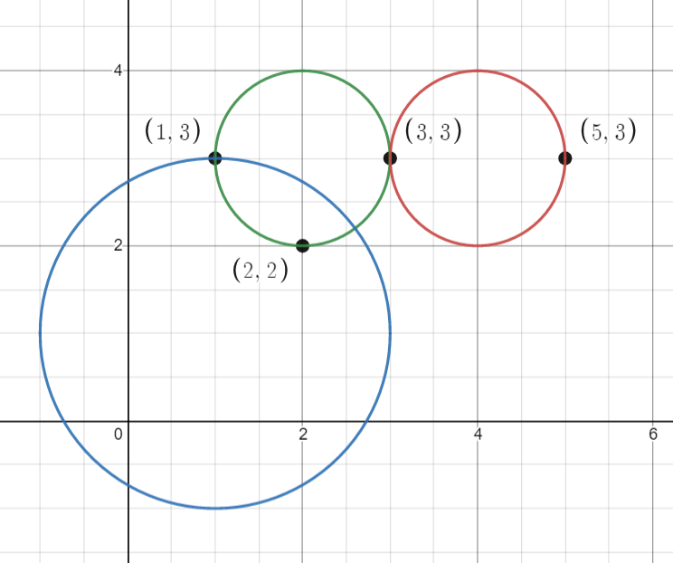
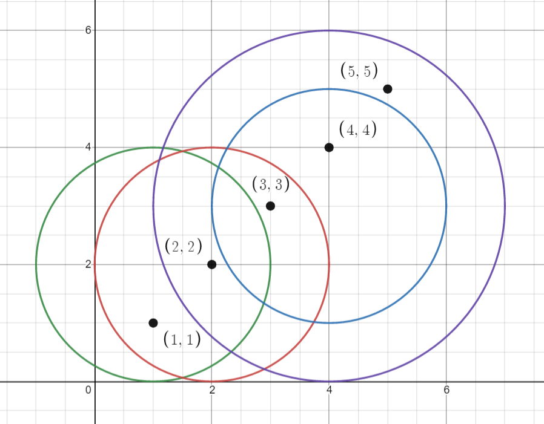

### 1. Description

You are given an array `points` where $\text{points}[i] = [x_{i}, y_{i}]$ is the coordinates of the $$i^{\text{th}}$$ point on a 2D plane. Multiple points can have the **same** coordinates.

You are also given an array `queries` where $\text{queries}[j] = [x_{j}, y_{j}, r_{j}]$ describes a circle centered at $(x_{j}, y_{j})$ with a radius of $r_{j}$.

For each query $\text{queries}[j]$, compute the number of points **inside** the $$j^{\text{th}}$$ circle. Points **on the border** of the circle are considered **inside**.

Return *an array *`answer`*, where *$\text{answer}[j]$* is the answer to the *$$j^{\text{th}}$$* query*.

### 2. Function Contract

**Inputs**

- `points`: Input parameter (`List[List[int]]`).
- `queries`: Input parameter (`List[List[int]]`).

**Return value**

- Returns `List[int]`.

### 3. Examples

#### Example 1

- **Input:** $points = [[1,3],[3,3],[5,3],[2,2]], queries = [[2,3,1],[4,3,1],[1,1,2]]$
- **Output:** `[3,2,2]`
- **Explanation:** The points and circles are shown above.
queries[0] is the green circle, queries[1] is the red circle, and queries[2] is the blue circle.

#### Example 2

- **Input:** $points = [[1,1],[2,2],[3,3],[4,4],[5,5]], queries = [[1,2,2],[2,2,2],[4,3,2],[4,3,3]]$
- **Output:** `[2,3,2,4]`
- **Explanation:** The points and circles are shown above.
queries[0] is green, queries[1] is red, queries[2] is blue, and queries[3] is purple.

### 4. Constraints

- $1 \le \text{points.length} \le 500$

- $\text{points}[i].length = 2$

- $0 \le x_​​​​​​i, y_​​​​​​i \le 500$

- $1 \le \text{queries.length} \le 500$

- $\text{queries}[j].length = 3$

- $0 \le x_{j}, y_{j} \le 500$

- $1 \le r_{j} \le 500$

- All coordinates are integers.

**Follow up:** Could you find the answer for each query in better complexity than `O(n)`?
