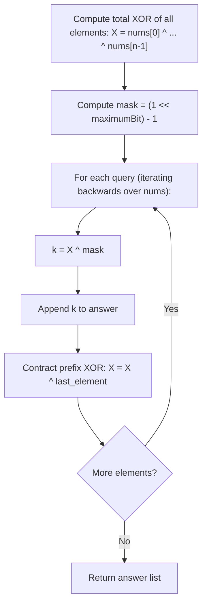

# Guided Example: Maximum XOR for Each Query

We trace the step-by-step resolution of maximum XOR queries via bitwise complementation and prefix XOR contraction on a representative problem instance:

- **Input:** `nums = [0, 1, 1, 3], maximumBit = 2`
- **Required Output:** `[0, 3, 2, 3]`

This instance demonstrates how setting $k$ to the bitwise complement of the cumulative prefix XOR up to $2^{\text{maximumBit}} - 1$ guarantees the maximum possible XOR value, and how self-inversion ($x \oplus x = 0$) updates the prefix XOR in $\mathcal{O}(1)$ time as elements are removed.

---

## 1. Instance & Teaching Goal

We are given a sorted array `nums` of $n$ non-negative integers and an integer `maximumBit`.
We perform $n$ queries sequentially:
1. Find a non-negative integer $k < 2^{\text{maximumBit}}$ that maximizes:
   $$\text{nums}[0] \oplus \text{nums}[1] \oplus \dots \oplus \text{nums}[\text{end}] \oplus k$$
2. Record $k$ as the answer for this query.
3. Remove the last element from the current array.
Return an array $\text{ans}$ containing the answers for all $n$ queries.

In our instance:
- `nums = [0, 1, 1, 3]` ($n = 4$)
- `maximumBit = 2`, so $k < 2^2 = 4$. The allowed values for $k$ are $\{0, 1, 2, 3\}$.
- Query $0$ (elements $[0, 1, 1, 3]$):
  - Cumulative prefix XOR: $X = 0 \oplus 1 \oplus 1 \oplus 3 = 3 = (11)_2$.
  - To maximize $X \oplus k$, choose $k = 0 \implies 3 \oplus 0 = 3$. Record $k = 0$.
  - Remove $3$.
- Query $1$ (elements $[0, 1, 1]$):
  - Cumulative prefix XOR: $X = 0 \oplus 1 \oplus 1 = 0 = (00)_2$.
  - Choose $k = 3 \implies 0 \oplus 3 = 3$. Record $k = 3$.
  - Remove $1$.
- Query $2$ (elements $[0, 1]$):
  - Cumulative prefix XOR: $X = 0 \oplus 1 = 1 = (01)_2$.
  - Choose $k = 2 \implies 1 \oplus 2 = 3$. Record $k = 2$.
  - Remove $1$.
- Query $3$ (element $[0]$):
  - Cumulative prefix XOR: $X = 0 = (00)_2$.
  - Choose $k = 3 \implies 0 \oplus 3 = 3$. Record $k = 3$.
  - Remove $0$.

Output: `[0, 3, 2, 3]`.

The teaching goal is to recognize that the theoretical maximum possible value of $X \oplus k$ for $k < 2^B$ is the all-ones bitmask $2^B - 1$. The unique optimal integer $k$ is given in closed form by $k = X \oplus (2^B - 1)$. As elements are popped from the end, the prefix XOR updates in $\mathcal{O}(1)$ time via $X \to X \oplus \text{last}$.

---

## 2. Conceptual Foundation & Invariants

### Bitwise Inversion and Target Mask

Let $B = \text{maximumBit}$.
Any integer $k < 2^B$ can independently determine the lowest $B$ bits (bits $0, 1, \dots, B - 1$).
The maximal possible number formed by $B$ bits is the bitmask with all $1$s:
$$\text{mask} = 2^B - 1$$

Let $X$ be the cumulative XOR of the active prefix:
$$X = \bigoplus_{i=0}^{m-1} \text{nums}[i]$$

We want to choose $k$ such that $(X \oplus k) \ \& \ \text{mask} = \text{mask}$.
XORing both sides with $X$:
$$k = X \oplus \text{mask}$$
Because $\text{mask} = 2^B - 1$, each bit of $k$ at position $b \in [0, B - 1]$ is:
$$k_b = X_b \oplus 1 = \begin{cases} 1 & \text{if } X_b = 0, \\ 0 & \text{if } X_b = 1. \end{cases}$$
Thus, $k$ flips every bit of $X$, guaranteeing $X \oplus k = \text{mask}$.

### Bitwise Complement & Prefix XOR Self-Inverse Invariant Theorem

> **Bitwise Complement & Prefix XOR Self-Inverse Invariant Theorem.**
> Let $B = \text{maximumBit}$ and $\text{mask} = 2^B - 1$.
> 1. *Closed-Form Optimality:* For any cumulative XOR $X$, setting $k = X \oplus \text{mask}$ achieves the maximum possible value $X \oplus k = \text{mask}$, with $0 \le k \le \text{mask} < 2^B$.
> 2. *Prefix Contraction via Self-Inversion:* The XOR operator is its own inverse:
>    $$(A \oplus x) \oplus x = A \oplus (x \oplus x) = A \oplus 0 = A$$
>    When the last element $x$ is removed from the array, the new prefix XOR is obtained in $\mathcal{O}(1)$ time via:
>    $$X' = X \oplus x$$
> 3. Evaluating all $n$ queries by contracting the total XOR from right to left computes the complete answer array in $\mathcal{O}(n)$ time and $\mathcal{O}(1)$ auxiliary space.

---

## 3. Step-by-Step Worked Execution

We trace `nums = [0, 1, 1, 3]` and `maximumBit = 2`.
Target mask:
$$\text{mask} = 2^2 - 1 = 4 - 1 = 3 = (11)_2$$

---

### Step 1: Precompute Total Prefix XOR
Compute the XOR sum of all $4$ elements:
$$X = 0 \oplus 1 \oplus 1 \oplus 3 = 3 = (11)_2$$

---

### Step 2: Query $0$ (Active Array $[0, 1, 1, 3]$)
- Current prefix XOR: $X = 3 = (11)_2$.
- Compute optimal $k$:
  $$k = X \oplus \text{mask} = 3 \oplus 3 = 0 = (00)_2$$
- Maximized XOR: $X \oplus k = 3 \oplus 0 = 3$.
- Append $k = 0 \implies \text{ans} = [0]$.
- Remove last element $x = 3$:
  $$X \to X \oplus 3 = 3 \oplus 3 = 0 = (00)_2$$

---

### Step 3: Query $1$ (Active Array $[0, 1, 1]$)
- Current prefix XOR: $X = 0 = (00)_2$.
- Compute optimal $k$:
  $$k = X \oplus \text{mask} = 0 \oplus 3 = 3 = (11)_2$$
- Maximized XOR: $X \oplus k = 0 \oplus 3 = 3$.
- Append $k = 3 \implies \text{ans} = [0, 3]$.
- Remove last element $x = 1$:
  $$X \to X \oplus 1 = 0 \oplus 1 = 1 = (01)_2$$

---

### Step 4: Query $2$ (Active Array $[0, 1]$)
- Current prefix XOR: $X = 1 = (01)_2$.
- Compute optimal $k$:
  $$k = X \oplus \text{mask} = 1 \oplus 3 = 2 = (10)_2$$
- Maximized XOR: $X \oplus k = 1 \oplus 2 = 3$.
- Append $k = 2 \implies \text{ans} = [0, 3, 2]$.
- Remove last element $x = 1$:
  $$X \to X \oplus 1 = 1 \oplus 1 = 0 = (00)_2$$

---

### Step 5: Query $3$ (Active Array $[0]$)
- Current prefix XOR: $X = 0 = (00)_2$.
- Compute optimal $k$:
  $$k = X \oplus \text{mask} = 0 \oplus 3 = 3 = (11)_2$$
- Maximized XOR: $X \oplus k = 0 \oplus 3 = 3$.
- Append $k = 3 \implies \text{ans} = [0, 3, 2, 3]$.
- Remove last element $x = 0$.

All queries completed.
Final output: **`[0, 3, 2, 3]`**.

---

## 4. Complete Execution Trace

| Query # | Active Elements | Prefix XOR $X$ | Binary $X$ | Mask ($2^2 - 1$) | Optimal $k = X \oplus \text{mask}$ | Max XOR Value | Element Removed |
|:---:|:---:|:---:|:---:|:---:|:---:|:---:|:---:|
| $0$ | $[0, 1, 1, 3]$ | $3$ | $(11)_2$ | $3$ | **$0$** | $3 \oplus 0 = 3$ | $3$ |
| $1$ | $[0, 1, 1]$ | $0$ | $(00)_2$ | $3$ | **$3$** | $0 \oplus 3 = 3$ | $1$ |
| $2$ | $[0, 1]$ | $1$ | $(01)_2$ | $3$ | **$2$** | $1 \oplus 2 = 3$ | $1$ |
| $3$ | $[0]$ | $0$ | $(00)_2$ | $3$ | **$3$** | $0 \oplus 3 = 3$ | $0$ |

Output vector: **`[0, 3, 2, 3]`**.

---

## 5. Algorithmic Correctness

**Soundness.** For each query, $k = X \oplus \text{mask}$ has bits that are the exact bitwise negation of $X$ within the lowest $B$ bits. Therefore, each of the lowest $B$ bits in $X \oplus k$ is $1$, producing the maximal possible value $2^B - 1$. Because $k \le \text{mask} = 2^B - 1 < 2^B$, $k$ strictly satisfies the range constraint.

**Completeness.** Recomputing the prefix XOR from scratch for each query would take $\mathcal{O}(n^2)$ time. Using the self-inverse property $X' = X \oplus x$ computes the exact prefix XOR of the truncated subarray in $\mathcal{O}(1)$ time without re-scanning the array, ensuring both efficiency and completeness.

---

## 6. Traps This Instance Exposes

- **Higher Bits in Prefix XOR:** If elements in `nums` have bits beyond $\text{maximumBit}$, the mask $(2^{\text{maximumBit}} - 1)$ isolates the relevant bits. Setting $k = X \oplus \text{mask}$ keeps higher bits in $k$ at $0$, ensuring $k < 2^{\text{maximumBit}}$.
- **Recomputing Prefix XOR from Scratch:** Iterating over the array for every query causes a quadratic $\mathcal{O}(n^2)$ time complexity. Contraction from the full XOR in reverse order achieves $\mathcal{O}(n)$ time.
- **Order of Returned Answers:** Queries are answered from the full array down to a single element. The results must match the query order, not reverse order.

---

## 7. Complexity Derivation

- **Time Complexity:** $\mathcal{O}(n)$, where $n$ is the length of `nums`. Computing the initial total XOR takes $\mathcal{O}(n)$ time. Each of the $n$ queries requires $\mathcal{O}(1)$ bitwise operations to compute $k$ and update $X$. Total runtime is strictly linear $\mathcal{O}(n)$.
- **Auxiliary Space Complexity:** $\mathcal{O}(n)$ to store the output array of $n$ answers.
