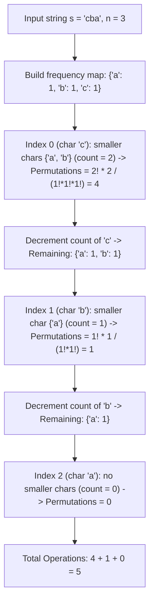

# Guided Example: Minimum Number of Operations to Make String Sorted

We trace the step-by-step calculation of the minimum operations to sort a string via combinatorial lexicographical rank and multinomial coefficients on a representative problem instance:

- **Input:** `s = "cba"`
- **Required Output:** `5`

This instance reveals how the four-step string transformation is mathematically isomorphic to generating the previous lexicographical permutation, converting an exponential step-by-step simulation into an $\mathcal{O}(n \cdot |\Sigma|)$ rank computation.

---

## 1. Instance & Teaching Goal

We are given a string `s`. We repeatedly perform the following operation until `s` is sorted in non-decreasing order:
1. Find the largest index $i$ ($1 \le i < n$) such that $s[i] < s[i - 1]$.
2. Find the largest index $j$ ($i \le j < n$) such that $s[k] < s[i - 1]$ for all $k \in [i, j]$.
3. Swap $s[i - 1]$ and $s[j]$.
4. Reverse the suffix starting at index $i$.

We must return the number of operations required modulo $10^9 + 7$.

In our instance:
- `s = "cba"` of length $n = 3$.
- Step-by-step physical operations:
  - Operation 1: $i = 2, j = 2$. Swap $s[1]$ (`'b'`) and $s[2]$ (`'a'`) $\to$ `"cab"`. Reverse suffix from $2 \to$ `"cab"`.
  - Operation 2: $i = 1, j = 2$. Swap $s[0]$ (`'c'`) and $s[2]$ (`'b'`) $\to$ `"bac"`. Reverse suffix from $1 \to$ `"bca"`.
  - Operation 3: $i = 2, j = 2$. Swap $s[1]$ (`'c'`) and $s[2]$ (`'a'`) $\to$ `"bac"`. Reverse suffix from $2 \to$ `"bac"`.
  - Operation 4: $i = 1, j = 1$. Swap $s[0]$ (`'b'`) and $s[1]$ (`'a'`) $\to$ `"abc"`. Reverse suffix from $1 \to$ `"acb"`.
  - Operation 5: $i = 2, j = 2$. Swap $s[1]$ (`'c'`) and $s[2]$ (`'b'`) $\to$ `"abc"`. Reverse suffix from $2 \to$ `"abc"`.
- Total operations: $5$.

The teaching goal is to recognize that each operation transitions `s` to its immediate predecessor in lexicographical order. The number of operations to reach the sorted string `"abc"` is exactly the number of distinct permutations of `s` that are strictly smaller than `s`. We compute this rank directly using multinomial coefficients without simulating individual swaps.

---

## 2. Conceptual Foundation & Invariants

### Previous Permutation Equivalence

The four steps defined in the problem are identical to the standard `prev_permutation` algorithm:
1. Finding the rightmost descent $s[i] < s[i - 1]$ locates the rightmost position $i - 1$ whose character can be decreased.
2. Finding the largest $j$ locates the largest character to the right of $i - 1$ that is strictly smaller than $s[i - 1]$.
3. Swapping $s[i - 1]$ and $s[j]$ decreases the prefix.
4. Reversing the suffix sorts the remaining characters in descending order, making the suffix lexicographically as large as possible.

Thus, each operation moves exactly one step backward in the lexicographical ordering of all unique permutations of `s`. The process terminates when no descent exists—namely, when `s` is sorted in ascending order.

### Previous Lexicographical Permutation Invariant & Multinomial Rank Theorem

> **Previous Lexicographical Permutation Invariant & Multinomial Rank Theorem.**
> Let $s$ be a string of length $n$.
> 1. *Rank Invariance:* The number of operations to sort $s$ is the zero-indexed lexicographical rank of $s$ among all distinct permutations of the multiset of characters in $s$:
>    $$\text{Rank}(s) = |\{ p \in \text{Perm}(s) : p <_{\text{lex}} s \}|$$
> 2. *Prefix Divergence Counting:* At index $i \in [0, n - 1]$, let $c = s[i]$ and let $\text{cnt}$ be the remaining frequency multiset of characters in $s[i \dots n - 1]$.
>    If position $i$ is assigned any character $a < c$ that is present in $\text{cnt}$, the remaining $n - 1 - i$ positions can be arranged in:
>    $$\frac{(n - 1 - i)!}{\text{cnt}'[a]! \prod_{\sigma \neq a} \text{cnt}[\sigma]!} = \frac{(n - 1 - i)! \cdot \text{cnt}[a]}{\prod_{\sigma} \text{cnt}[\sigma]!}$$
>    distinct ways. Summing over all characters $a < c$:
>    $$\Delta_i = \frac{(n - 1 - i)! \cdot \sum_{a < c} \text{cnt}[a]}{\prod_{\sigma} \text{cnt}[\sigma]!} \pmod{10^9 + 7}$$
> 3. *Total Rank:* The total number of operations is:
>    $$\text{Rank}(s) = \sum_{i=0}^{n-1} \Delta_i \pmod{10^9 + 7}$$

---

## 3. Step-by-Step Worked Execution

We trace `s = "cba"` ($n = 3$) with modulo $10^9 + 7$.
Initial multiset: $\text{cnt} = \{\text{'a'}: 1, \text{'b'}: 1, \text{'c'}: 1\}$.
Initialize accumulator: $\text{ans} = 0$.

---

### Step 1: Process Index $0$ ($c = \text{'c'}$)
- Current character: $c = \text{'c'}$.
- Remaining length: $n - 1 - i = 3 - 1 - 0 = 2$.
- Characters in $\text{cnt}$ strictly smaller than `'c'`:
  - `'a'` with frequency $1$.
  - `'b'` with frequency $1$.
  - Total smaller characters: $m = 1 + 1 = 2$.
- Compute multinomial permutations:
  $$\Delta_0 = \frac{2! \times 2}{1! \times 1! \times 1!} = \frac{2 \times 2}{1} = 4$$
- Add to answer:
  $$\text{ans} \to 0 + 4 = 4$$
- Decrement count of `'c'`: $\text{cnt} = \{\text{'a'}: 1, \text{'b'}: 1\}$.

---

### Step 2: Process Index $1$ ($c = \text{'b'}$)
- Current character: $c = \text{'b'}$.
- Remaining length: $n - 1 - i = 3 - 1 - 1 = 1$.
- Characters in $\text{cnt}$ strictly smaller than `'b'`:
  - `'a'` with frequency $1$.
  - Total smaller characters: $m = 1$.
- Compute multinomial permutations:
  $$\Delta_1 = \frac{1! \times 1}{1! \times 1!} = \frac{1 \times 1}{1} = 1$$
- Add to answer:
  $$\text{ans} \to 4 + 1 = 5$$
- Decrement count of `'b'`: $\text{cnt} = \{\text{'a'}: 1\}$.

---

### Step 3: Process Index $2$ ($c = \text{'a'}$)
- Current character: $c = \text{'a'}$.
- Remaining length: $n - 1 - i = 3 - 1 - 2 = 0$.
- Characters in $\text{cnt}$ strictly smaller than `'a'`: None ($m = 0$).
- Permutations: $\Delta_2 = 0$.
- Decrement count of `'a'`: $\text{cnt} = \emptyset$.

All indices processed.
Total operations: **`5`**.

---

## 4. Complete Execution Trace

| Index $i$ | Target Character $c$ | Available Smaller Characters | Smaller Count $m$ | Remaining Positions $(n - 1 - i)$ | Suffix Permutations $\Delta_i$ | Cumulative Operations |
|:---:|:---:|:---:|:---:|:---:|:---:|:---:|
| $0$ | `'c'` | `'a'`, `'b'` | $2$ | $2$ | $\frac{2! \times 2}{1! \times 1! \times 1!} = 4$ | $4$ |
| $1$ | `'b'` | `'a'` | $1$ | $1$ | $\frac{1! \times 1}{1! \times 1!} = 1$ | $5$ |
| $2$ | `'a'` | None | $0$ | $0$ | $0$ | **`5`** |

Complete list of permutations lexicographically smaller than `"cba"`:
1. `"abc"` (Rank 0)
2. `"acb"` (Rank 1)
3. `"bac"` (Rank 2)
4. `"bca"` (Rank 3)
5. `"cab"` (Rank 4)

Number of preceding permutations: **`5`**.

---

## 5. Algorithmic Correctness

**Soundness.** Every operation replaces the string with its immediate predecessor in lexicographical order. The process terminates at the lexicographically first permutation (the sorted string). By induction, the number of steps required to reach the sorted string is identically the zero-based lexicographical rank of the string.

**Completeness.** Precomputing factorials and inverse factorials modulo $10^9 + 7$ enables exact calculation of the multinomial coefficient $\frac{L!}{\prod f_i!}$. Because each position $i$ partitions the set of smaller permutations by their first point of disagreement, every permutation smaller than $s$ is counted exactly once without overlap or omission.

---

## 6. Traps This Instance Exposes

- **Direct Simulation Explosion:** Simulating the operations directly is fatal: for $n = 3000$, the number of operations can exceed $10^{1000}$, resulting in infinite execution or time limit exceeded.
- **Duplicate Characters:** When duplicate characters are present, dividing by $\prod \text{cnt}[\sigma]!$ is essential to avoid overcounting permutations that differ only by swapping identical letters.
- **Modular Inverse Requirements:** Division in modular arithmetic requires computing the modular multiplicative inverse via Fermat's Little Theorem: $a^{-1} \equiv a^{M - 2} \pmod M$ for prime $M = 10^9 + 7$.

---

## 7. Complexity Derivation

- **Time Complexity:** $\mathcal{O}(n \cdot |\Sigma|)$, where $n$ is the length of `s` and $|\Sigma| \le 26$ is the alphabet size. Factorials and inverse factorials up to $n$ are precomputed in $\mathcal{O}(n \log (\text{mod}))$ or $\mathcal{O}(n)$ time. For each of the $n$ positions, we iterate over at most $26$ distinct characters to count smaller elements and divide by factorial frequencies. Total time is $\mathcal{O}(26 \cdot n) \approx 7.8 \times 10^4$ operations, completing in under $0.05$ seconds.
- **Auxiliary Space Complexity:** $\mathcal{O}(n)$ to store precomputed factorial and inverse factorial lookup tables.
