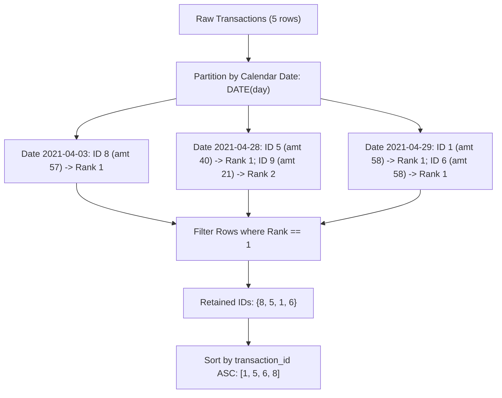

# Guided Example: Maximum Transaction Each Day

We trace the step-by-step evaluation of daily maximum transaction identification via window partitioning and rank filtering on a representative database instance:

- **Input:** `Transactions` table containing records across multiple calendar days with distinct and tied amounts.
- **Required Output:** Table of `transaction_id` values achieving the daily maximum amount, sorted in ascending order.

This instance demonstrates date-based partitioning, multi-way tie preservation through window ranking, and ascending primary key ordering.

---

## 1. Instance & Teaching Goal

We are given a relational table `Transactions`:
- Columns: `transaction_id` (integer, unique primary key), `day` (datetime), and `amount` (integer).
- We must find the transactions with the **maximum** `amount` on each respective calendar day. If multiple transactions on the same day tie for the maximum amount, all of them must be included.
- The result table must contain a single column `transaction_id` sorted in ascending order.

Consider the representative dataset:

| `transaction_id` | `day` | `amount` | Calendar Date |
|:---:|:---:|:---:|:---:|
| $8$ | `2021-04-03 15:57:28` | $57$ | `2021-04-03` |
| $9$ | `2021-04-28 08:47:25` | $21$ | `2021-04-28` |
| $1$ | `2021-04-29 13:28:30` | $58$ | `2021-04-29` |
| $5$ | `2021-04-28 16:39:59` | $40$ | `2021-04-28` |
| $6$ | `2021-04-29 23:39:28` | $58$ | `2021-04-29` |

Daily grouping analysis:
- Day `2021-04-03`: Only transaction $8$ ($57$). Maximum is $57 \implies$ include `8`.
- Day `2021-04-28`: Transactions $9$ ($21$) and $5$ ($40$). Maximum is $40 \implies$ include `5`.
- Day `2021-04-29`: Transactions $1$ ($58$) and $6$ ($58$). Both achieve the maximum $58 \implies$ include `1` and `6`.
- Sorting the qualifying IDs $\{8, 5, 1, 6\}$ in ascending order yields `1, 5, 6, 8`.

The teaching goal is to model daily grouping using the window ranking function $\text{RANK}() \text{ OVER (PARTITION BY DATE(day) ORDER BY amount DESC)}$. Unlike `ROW_NUMBER()`, `RANK()` assigns identical rank $1$ to all ties, preserving all joint maximums in a single pass.

---

## 2. Conceptual Foundation & Invariants

### Group Partitioning and Window Rank

Let relation $T$ represent transactions.
Extract the calendar date $D(t) = \text{DATE}(t.\text{day})$.
The relation partitions into equivalence classes $P_d = \{ t \in T : D(t) = d \}$.
Within each partition $P_d$, the maximum amount is:
$$M_d = \max_{t \in P_d} t.\text{amount}$$

The set of target transactions is:
$$\mathcal{W} = \{ t \in T : t.\text{amount} = M_{D(t)} \}$$

### Date Partition Grouping & Window Rank Maximality Theorem

> **Date Partition Grouping & Window Rank Maximality Theorem.**
> Let $t \in T$ be a transaction.
> Define the window ranking over calendar date partitions ordered by descending amount:
> $$\text{rk}(t) = \text{RANK}() \text{ OVER} \left( \text{PARTITION BY } \text{DATE}(t.\text{day}) \text{ ORDER BY } t.\text{amount DESC} \right)$$
> 1. *Rank Optimality:* For any transaction $t$, $\text{rk}(t) = 1 \iff t.\text{amount} = \max_{u \in P_{D(t)}} u.\text{amount}$.
> 2. *Tie Invariance:* If multiple transactions within the same partition $P_d$ share the identical maximum amount $M_d$, each receives $\text{rk} = 1$.
> 3. *Subordinate Pruning:* Any transaction with $t.\text{amount} < M_d$ receives rank strictly greater than $1$.
> Projecting $\pi_{\text{transaction\_id}}(\sigma_{\text{rk} = 1}(T))$ and ordering by `transaction_id` ASC computes the exact solution in $\mathcal{O}(N \log N)$ time.



---

## 3. Step-by-Step Worked Execution

We trace the evaluation across the $5$ transactions:

---

### Step 1: Partition Rows by Date and Rank by Amount Descending

We group records by date and evaluate rank within each partition:

1. **Partition `2021-04-03`:**
   - Transaction $8$: $\text{amount} = 57 \implies \text{Rank } 1$.

2. **Partition `2021-04-28`:**
   - Transaction $5$: $\text{amount} = 40 \implies \text{Rank } 1$.
   - Transaction $9$: $\text{amount} = 21 \implies \text{Rank } 2$.

3. **Partition `2021-04-29`:**
   - Transaction $1$: $\text{amount} = 58 \implies \text{Rank } 1$.
   - Transaction $6$: $\text{amount} = 58 \implies \text{Rank } 1$ (Tie with Transaction $1$).

---

### Step 2: Filter for Top-Ranked Tuples ($\text{rk} = 1$)

Evaluate predicate $\text{rk} = 1$:
- Transaction $8$: $\text{rk} = 1 \implies$ **Retained**.
- Transaction $5$: $\text{rk} = 1 \implies$ **Retained**.
- Transaction $9$: $\text{rk} = 2 \implies$ Discarded.
- Transaction $1$: $\text{rk} = 1 \implies$ **Retained**.
- Transaction $6$: $\text{rk} = 1 \implies$ **Retained**.

Set of qualifying IDs: $\{8, 5, 1, 6\}$.

---

### Step 3: Sort Qualifying Identifiers

Sort by `transaction_id` in ascending order:
$$1 < 5 < 6 < 8$$

Result table:
```text
+----------------+
| transaction_id |
+----------------+
| 1              |
| 5              |
| 6              |
| 8              |
+----------------+
```

---

## 4. Complete Execution Trace

| `transaction_id` | `day` Timestamp | Calendar Date | `amount` | Partition Rank | $\text{rk} == 1$? | Output Qualified? |
|:---:|:---:|:---:|:---:|:---:|:---:|:---:|
| $8$ | `2021-04-03 15:57:28` | `2021-04-03` | $57$ | $1$ | **Yes** | Included |
| $9$ | `2021-04-28 08:47:25` | `2021-04-28` | $21$ | $2$ | No | Excluded |
| $5$ | `2021-04-28 16:39:59` | `2021-04-28` | $40$ | $1$ | **Yes** | Included |
| $1$ | `2021-04-29 13:28:30` | `2021-04-29` | $58$ | $1$ | **Yes** | Included |
| $6$ | `2021-04-29 23:39:28` | `2021-04-29` | $58$ | $1$ | **Yes** | Included |

Ordered final emission: **`[1, 5, 6, 8]`**.

---

## 5. Algorithmic Correctness

**Soundness.** For each date, only transactions whose amounts equal the maximum amount for that date receive rank $1$. By filtering for $\text{rk} = 1$, every emitted row is a true daily maximum.

**Completeness.** Window ranking inspects every transaction. Because `RANK()` treats equal values equally, ties receive identical rank $1$. No qualifying maximum transaction is arbitrarily dropped or omitted.

---

## 6. Traps This Instance Exposes

- **Using `ROW_NUMBER()` Instead of `RANK()`:** `ROW_NUMBER()` assigns distinct consecutive integers to ties, arbitrarily picking one transaction and omitting other joint maximums (e.g. dropping either transaction $1$ or $6$).
- **Grouping on Full Datetime Instead of Date:** Partitioning by raw `day` fails because timestamps include hours, minutes, and seconds. Transactions must be partitioned by `DATE(day)`.
- **Omitting the Final Sort:** The problem requires sorting the output by `transaction_id` ascending. Forgetting `ORDER BY transaction_id` can cause test failures when rows are returned in partition order.

---

## 7. Complexity Derivation

- **Time Complexity:** $\mathcal{O}(N \log N)$, where $N$ is the number of rows in `Transactions`. Partitioning and sorting rows within partitions takes $\mathcal{O}(N \log N)$ time, and the final ordering of qualifying rows takes $\mathcal{O}(K \log K)$ where $K \le N$.
- **Auxiliary Space Complexity:** $\mathcal{O}(N)$ to store the intermediate ranked relation.
