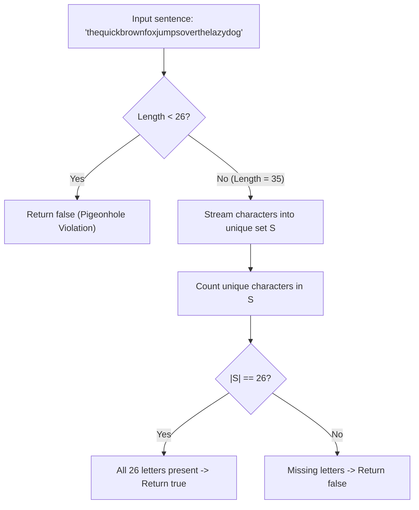

# Guided Example: Check if the Sentence Is Pangram

We trace the step-by-step verification of alphabet completeness via character set deduplication and bitmask presence on a representative problem instance:

- **Input:** `sentence = "thequickbrownfoxjumpsoverthelazydog"`
- **Required Output:** `true`

This instance demonstrates how checking if a string contains every letter of the 26-character English alphabet reduces to evaluating whether the cardinality of its unique character set equals 26.

---

## 1. Instance & Teaching Goal

A **pangram** is a sentence containing every letter of the lowercase English alphabet at least once.
We are given a string `sentence` composed exclusively of lowercase English letters.
We must return `true` if `sentence` is a pangram, and `false` otherwise.

In our instance:
- `sentence = "thequickbrownfoxjumpsoverthelazydog"`
- Character count: $35$ letters.
- The 26 letters of the English alphabet:
  $$\Sigma = \{\text{'a'}, \text{'b'}, \text{'c'}, \dots, \text{'z'}\}, \quad |\Sigma| = 26$$
- Tracing letters present in `"thequickbrownfoxjumpsoverthelazydog"`:
  - `a`: lazydog
  - `b`: brown
  - `c`: quick
  - `d`: dog
  - `e`: the, over
  - `f`: fox
  - `g`: dog
  - `h`: the
  - `i`: quick
  - `j`: jumps
  - `k`: quick
  - `l`: lazy
  - `m`: jumps
  - `n`: brown
  - `o`: brown, fox, over, dog
  - `p`: jumps
  - `q`: quick
  - `r`: brown, over
  - `s`: jumps
  - `t`: the
  - `u`: quick, jumps
  - `v`: over
  - `w`: brown
  - `x`: fox
  - `y`: lazy
  - `z`: lazy
- All $26$ letters appear at least once. The unique character set size is $26$.
- Output: `true`.

The teaching goal is to recognize that frequency details are irrelevant: only set membership matters. Because `sentence` contains only lowercase English characters, verifying that the unique character set cardinality is $26$ decides pangram status in linear time.

---

## 2. Conceptual Foundation & Invariants

### Set Cardinality Equivalence

Let $S$ denote the set of distinct characters in `sentence`:
$$S = \{ c \in \Sigma : c \text{ appears in } \text{sentence} \}$$

Because `sentence` is restricted to lowercase English letters, $S \subseteq \Sigma$.
Since $|\Sigma| = 26$, the subset $S$ is equal to $\Sigma$ if and only if its cardinality reaches $26$:
$$S = \Sigma \iff |S| = 26$$

### Alphabet Completeness & Set Cardinality Invariant Theorem

> **Alphabet Completeness & Set Cardinality Invariant Theorem.**
> Let $A$ be a string of length $n$ over an alphabet $\Sigma$ of size $K$.
> 1. *Length Necessary Condition:* If $n < K$, by the Pigeonhole Principle the string can contain at most $n < K$ distinct characters, immediately implying it cannot be a pangram.
> 2. *Unique Character Cardinality:* If $n \ge K$, let $S = \text{set}(A)$. The string contains every character in $\Sigma$ if and only if $|S| = K$.
> 3. *Bitmask Representation:* Alternatively, each character $c$ maps to bit offset $b = \text{ord}(c) - \text{ord}(\text{'a'}) \in [0, 25]$.
>    The cumulative bitwise OR:
>    $$\mu = \bigvee_{c \in A} (1 \ll (\text{ord}(c) - \text{ord}(\text{'a'})))$$
>    equals $(1 \ll 26) - 1$ if and only if $A$ is a pangram.
> The bitmask approach uses $\mathcal{O}(1)$ auxiliary space and allows early exit the instant $\mu$ reaches $(1 \ll 26) - 1$.

---

## 3. Step-by-Step Worked Execution

We trace `sentence = "thequickbrownfoxjumpsoverthelazydog"`.
Length $n = 35 \ge 26$, so alphabet completeness is possible.
Initialize empty set of observed characters:
$$S = \emptyset$$

---

### Step 1: Stream First Token `"the"`
- `'t'`: $S \to \{\text{'t'}\}$ (Size 1)
- `'h'`: $S \to \{\text{'t'}, \text{'h'}\}$ (Size 2)
- `'e'`: $S \to \{\text{'t'}, \text{'h'}, \text{'e'}\}$ (Size 3)

---

### Step 2: Stream Token `"quick"`
- `'q'`: add $\implies$ Size 4
- `'u'`: add $\implies$ Size 5
- `'i'`: add $\implies$ Size 6
- `'c'`: add $\implies$ Size 7
- `'k'`: add $\implies$ Size 8

---

### Step 3: Stream Token `"brown"`
- `'b'`, `'r'`, `'o'`, `'w'`, `'n'`: all new $\implies$ Size reaches 13

---

### Step 4: Stream Token `"fox"`
- `'f'`, `'o'` (duplicate, skipped), `'x'`: adds 2 new letters $\implies$ Size reaches 15

---

### Step 5: Stream Token `"jumps"`
- `'j'`, `'u'` (duplicate), `'m'`, `'p'`, `'s'`: adds 4 new letters $\implies$ Size reaches 19

---

### Step 6: Stream Token `"over"`
- `'o'` (duplicate), `'v'` (new), `'e'` (duplicate), `'r'` (duplicate): adds 1 new letter $\implies$ Size reaches 20

---

### Step 7: Stream Token `"the"`
- `'t'`, `'h'`, `'e'`: all already present in $S$, no size change $\implies$ Size remains 20

---

### Step 8: Stream Token `"lazy"`
- `'l'` (new), `'a'` (new), `'z'` (new), `'y'` (new): adds 4 new letters $\implies$ Size reaches 24

---

### Step 9: Stream Token `"dog"`
- `'d'` (new), `'o'` (duplicate), `'g'` (new): adds 2 new letters $\implies$ Size reaches 26

---

### Step 10: Evaluate Cardinality
- Total unique characters collected: $|S| = 26$.
- Compare with alphabet size: $26 == 26$.
- Result: **`true`**.

---

## 4. Complete Execution Trace

| Word Segment | Characters Ingested | New Letters Added to Set | Duplicate Letters Skipped | Running Unique Letters Count |
|:---|:---|:---|:---|:---:|
| `"the"` | `'t'`, `'h'`, `'e'` | `'t'`, `'h'`, `'e'` | None | $3$ |
| `"quick"` | `'q'`, `'u'`, `'i'`, `'c'`, `'k'` | `'q'`, `'u'`, `'i'`, `'c'`, `'k'` | None | $8$ |
| `"brown"` | `'b'`, `'r'`, `'o'`, `'w'`, `'n'` | `'b'`, `'r'`, `'o'`, `'w'`, `'n'` | None | $13$ |
| `"fox"` | `'f'`, `'o'`, `'x'` | `'f'`, `'x'` | `'o'` | $15$ |
| `"jumps"` | `'j'`, `'u'`, `'m'`, `'p'`, `'s'` | `'j'`, `'m'`, `'p'`, `'s'` | `'u'` | $19$ |
| `"over"` | `'o'`, `'v'`, `'e'`, `'r'` | `'v'` | `'o'`, `'e'`, `'r'` | $20$ |
| `"the"` | `'t'`, `'h'`, `'e'` | None | `'t'`, `'h'`, `'e'` | $20$ |
| `"lazy"` | `'l'`, `'a'`, `'z'`, `'y'` | `'l'`, `'a'`, `'z'`, `'y'` | None | $24$ |
| `"dog"` | `'d'`, `'o'`, `'g'` | `'d'`, `'g'` | `'o'` | **$26$** |

Set cardinality reaches $26$. Emitted result: **`true`**.

---

## 5. Algorithmic Correctness

**Soundness.** A mathematical set rejects duplicate elements. When all elements of `sentence` are added to a set, every distinct letter appears exactly once. Because the problem statement guarantees that `sentence` contains only lowercase English letters, the set size cannot exceed $26$. A size of $26$ proves that every letter from `'a'` through `'z'` was present.

**Completeness.** If any letter were missing from `sentence`, that letter would be absent from the set, forcing $|S| \le 25 < 26$, correctly triggering a `false` return value.

---

## 6. Traps This Instance Exposes

- **Pigeonhole Principle Violation:** If `len(sentence) < 26`, the sentence cannot possibly contain all 26 letters. Guarding with `if len(sentence) < 26: return False` allows an immediate $\mathcal{O}(1)$ rejection.
- **Counting Raw Length Instead of Set Size:** A sentence of length 35 is not necessarily a pangram (e.g. 35 copies of `'a'`). Deduplication via set or bitmask is strictly necessary.
- **Bitmask Integer Size:** A 32-bit integer comfortably holds 26 flags (bits 0 to 25), allowing constant-space bitwise operations without allocating hash sets.

---

## 7. Complexity Derivation

- **Time Complexity:** $\mathcal{O}(n)$, where $n$ is the length of `sentence`. We scan each character once. Set insertion takes $\mathcal{O}(1)$ average time.
- **Auxiliary Space Complexity:** $\mathcal{O}(|\Sigma|) = \mathcal{O}(1)$, as the set or bitmask stores at most $26$ distinct elements.
