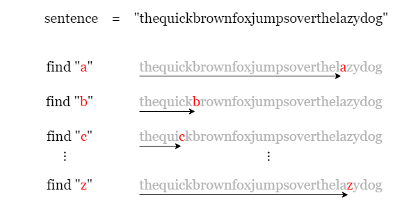
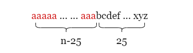
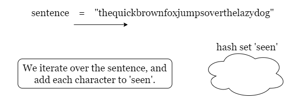
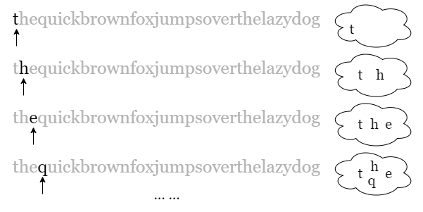
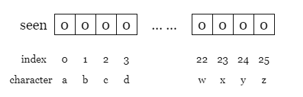
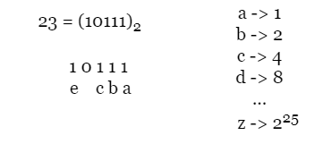

[TOC]

## Solution

---

### Overview

In the problem, we are given a sentence `sentence` containing only lowercase English letters. If a sentence contains all letters of the English alphabet, we call it a **pangram**.

For example: `thequickbrownfoxjumpsoverthelazydog` is a pangram since we can find all 26 alphabets in it, while `leetcode` is not since it doesn't contain some letters, such as `a`.

Our task is to check whether the given sentence `sentence` is a pangram. The problem is relatively simple and we propose several approaches, including a very interesting one.

---

### Approach 1: Find letters one by one

#### Intuition

We are asked to check whether `sentence` contains all 26 letters of the alphabet, so the most straightforward way is to check the presence of each letter one by one. We first iterate over `sentence` to find `a`, then we iterate again to find `b`, and so on. If we manage to find all 26 letters, then `sentence` is a pangram, otherwise, it is not.

Take the picture below as an example:



<br>

#### Algorithm

1) For each lowercase letter `currChar` from `a` to `z`, iterate over `sentence` to check if it contains the letter `currChar`.
2) If we cannot find one of the letters, return `False`. Otherwise, return `True` after we finish all the iterations.

#### Implementation

```python
class Solution:
    def checkIfPangram(self, sentence: str) -> bool:
        # We iterate over 'sentence' for 26 times, one for each letter 'curr_char'.
        for i in range(26):
            curr_char = chr(ord('a') + i)

            # If 'sentence' doesn't contain 'curr_char', it is not a pangram.
            if sentence.find(curr_char) == -1:
                return False

        # If we manage to find all 26 letters, it is a pangram.
        return True
```

#### Complexity Analysis

Let $n$ be the length of the input string `sentence`.

* Time complexity: $O(n)$

- We need to iterate over `sentence` for 26 times.
- Each iteration takes at most $O(n)$ time.
- To sum up, the overall time complexity is $O(n)$

* Space complexity: $O(1)$

- We just need to find letters one by one, thus the overall space complexity is $O(1)$.

<br/>

---

### Approach 2: Set

#### Intuition

In the previous approach, we iterate over `sentence` to look for only one character each time. Considering the following case, where we traversed most of the string before finding a letter between `b` and `z`.



Although the overall time complexity is still $O(n)$, there are many unnecessary iterations, can we accomplish the task in a single iteration?

Let's look for a more efficient way! Instead of looking for one letter per iteration, we can record the presence of all letters in one iteration.

We can use a hash set `seen` to store all the unique letters in `sentence` that we encounter,



In the iteration, we add every letter to `seen`.



Once we finish iterating, we know if `sentence` contains all 26 letters by checking the size of `seen`. Note that hash set has no duplicated elements, thus we don't need to worry that `seen` contains some same letters.

<br>

#### Algorithm

1) Initialize an empty hash set `seen`.
2) Iterate over `sentence`, and add every letter to `seen`.
3) Once we finish the iteration, check if the size of `seen` equals 26.

#### Implementation

```python
class Solution:
    def checkIfPangram(self, sentence: str) -> bool:
        # Add every letter of 'sentence' to hash set 'seen'.
        seen = set(sentence)

        # If the size of 'seen' is 26, then 'sentence' is a pangram.
        return len(seen) == 26
```

#### Complexity Analysis

Let $n$ be the length of the input string `sentence`.

* Time complexity: $O(n)$

- We only need one iteration over `sentence`.
- In each step, we add the current letter `currChar` to `seen`, which takes constant time.
- In summary, the overall time complexity is $O(1)$.

* Space complexity: $O(1)$

- We use a hash set `seen` to store all the **unique** letters we encounter. There are at most 26 unique lowercase letters, so the space complexity is $O(1)$.

<br/>

---

### Approach 3: Use Array as Counter

#### Intuition

Note that each letter of alphabets has its own ASCII code, we map their ASCII codes to a unique number.

$(ASCII\ of)\ a = 97$

$(ASCII\ of)\ b = 98$

$(ASCII\ of)\ c = 99$

$...$

$(ASCII\ of)\ z = 122$

Therefore we can just use an array `seen` of size 26 as the recorder, and map the ASCII codes to integers between `0` to `25` (inclusive) using:

$index\ of\ char = (ASCII\ of)\ char - (ASCII\ of)\ a$

**What is the mapped index of `c`?**

Using

$index\ of\ c = (ASCII\ of)\ c - (ASCII\ of)\ a = 2$

and we know that `2` is the index to record the presence of `c`.



There are multiple ways to record the presence of a letter, here we let the value on the mapped index equals `true`. Once we finish iterating, check if every value of `seen` is updated as `true`.

<br>

#### Algorithm

1) Initialize an empty array `seen` of size 26.
2) Iterate over `sentence`, for each character `currChar`, we let the value at the mapped index equal `true`.
3) Once we finish the iteration, check if every value of `seen` equal `true`.

#### Implementation

```python
class Solution:
    def checkIfPangram(self, sentence: str) -> bool:
        # Array 'seen' of size 26.
        seen = [False] * 26

        # For every letter 'currChar', we find its ASCII code,
        # and update value at the mapped index as true.
        for curr_char in sentence:
            seen[ord(curr_char) - ord('a')] = True

        # Once we finish iterating, check if 'seen' contains false.
        for status in seen:
            if not status:
                return False
        return True
```

#### Complexity Analysis

Let $n$ be the length of input string `sentence`.

* Time complexity: $O(n)$

- Similarly, we just need to traverse over `sentence` for once.
- In each step, we calculate the ASCII code of the current letter `currChar` and update the value at the mapped index in `seen`. This takes constant time.
- To sum up, the overall time complexity is $O(n)$.

* Space complexity: $O(1)$

- We use an array of size 26. Thus the space complexity is $O(1)$.

<br/>

---

### Approach 4: Bit Manipulation

#### Intuition

Instead of using an array or set, we can record the presence of all the letters in just one number, isn't that surprising! Let's see how it works.

In the previous approach, we used to map a letter `currChar` to an integer between `[0, 25]` using its ASCII code. Here we approach the problem with a similar idea.

Take a look at the following picture. We convert a number (Let's say `23`) to its binary representation (`10111`), it contains some bits of `1`s.

If we map every bit from low to high to a letter of alphabet, i.e. the first bit for `a`, the second bit for `b`, and so on, then we can use the value of each bit recording the presence/absence of the corresponding letter. Hence, `10111` means the presence of letters `a, b, c, e`, while `d` is absent since the value of the fourth bit is `0`.



Note that in binary representation, **left shifting by 1** equals **multiplying by 2**. Therefore:
- `1` in the lowest bit (standing for `a`) equals $1$.
- `1` in the second lowest bit (standing for `b`) equals $2$.
- `1` in the third lowest bit (standing for `c`) equals $4$.
- `1` in the 26th bit (standing for `z`) equals $2^{25}$.

**How do we record the presence of a letter?**

We have known $seen = 23$ represents the presence of `a, b, c, e`:

$23 = (10111)_{2} = 16 + 4 + 2 + 1$

Let's say we want to add letter `f` to it, here are the following steps:

- Find the corresponding bit for `f`:

$mappedIndex = (ASCII\ of)\ f - (ASCII\ of)\ a = 5$

- Left shift `1` by 5 bits to get the value representing the presence of `f`.

$currBit = 1 \ll 5 = 32$

- Use `OR` to record `currBit` in `seen`.

$seen\ |= 32$

- Finally, we get $seen = 55$:

$seen = 55 = (110111)_{2}$

We can tell that `seen` contains letter `f` now.

**How do we check if we have encountered all 26 letters?**

In the binary representation of `seen`, each unique letter stands for a bit of `1` i. Therfore, assuming we encounter all 26 letters, `seen` will have 26 bits of `1`, i.e.

$seen = \underbrace{111...111}_{26}$

Thus,

$seen + 1 = 1\underbrace{000...000}_{26} = (1 \ll 26)$.

Hence, we just need to check if $seen + 1$ equals `1 << 26`. Job is done!

<br>

#### Algorithm

1) Initialize the status of encountered letters as $seen = 0$.
2) Iterate over `sentence`, for each letter `currChar`:
- Find the mapped index `mappedIndex` using its ASCII code.
- Get the value representing the bit of `currChar` as $currBit = 1 << mappedIndex$.
- Add the `currBit` to `seen` by letting `seen |= currBit`.
3) Once we finish iterating, check if `seen` equals $(1 << 26) - 1$.

#### Implementation

```python
class Solution:
    def checkIfPangram(self, sentence: str) -> bool:
        # Initialize seen = 0 since we start with no letter.
        seen = 0

        # Iterate over 'sentence'.
        for curr_char in sentence:
            # Map each 'curr_char' to its index using its ASCII code.
            mapped_index = ord(curr_char) - ord('a')

            # 'curr_bit' represents the bit for 'curr_char'.
            curr_bit = 1 << mapped_index

            # Use 'OR' operation since we only add its bit for once.
            seen |= curr_bit

        # Once we finish iterating, check if 'seen' contains 26 bits of 1.
        return seen == (1 << 26) - 1
```

#### Complexity Analysis

Let $n$ be the length of the input string `sentence`.

* Time complexity: $O(n)$

- We need to traverse over `sentence` for once.
- In each step, we get the mapped index using the ASCII code of the current letter, and update `seen` using `OR` operation which takes constant time.
- To sum up, the overall time complexity is $O(n)$.

* Space complexity: $O(1)$

- We just need to update one number `seen` which take constant space.

<br/>