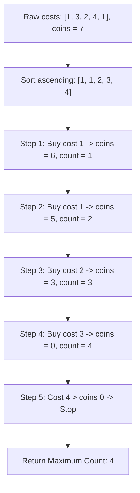

# Guided Example: Maximum Ice Cream Bars

We trace the step-by-step greedy selection of ice cream bars under budget constraints via sort-and-scan prefix accumulation on a representative problem instance:

- **Input:** `costs = [1, 3, 2, 4, 1], coins = 7`
- **Required Output:** `4`

This instance demonstrates the unit-profit knapsack principle, proving why purchasing the cheapest available bars in non-decreasing price order strictly maximizes the total count of acquired items.

---

## 1. Instance & Teaching Goal

We are given an integer array `costs` where `costs[i]` is the price of the $i$-th ice cream bar, and an integer `coins` representing our total budget.
Each bar can be bought at most once. We want to maximize the total number of ice cream bars we can purchase.

In our instance:
- `costs = [1, 3, 2, 4, 1]` ($5$ bars)
- Budget `coins = 7`
- The individual prices are $1, 3, 2, 4, 1$.
- If we sort the prices in ascending order: `[1, 1, 2, 3, 4]`.
- We greedily purchase the cheapest bars first:
  1. Price $1$: remaining coins $7 - 1 = 6$. Bars bought: $1$.
  2. Price $1$: remaining coins $6 - 1 = 5$. Bars bought: $2$.
  3. Price $2$: remaining coins $5 - 2 = 3$. Bars bought: $3$.
  4. Price $3$: remaining coins $3 - 3 = 0$. Bars bought: $4$.
  5. Price $4$: remaining coins $0 < 4$. Cannot afford.
- Maximum bars bought: **`4`**.

The teaching goal is to establish the classic exchange argument: because every bar counts equally toward the objective ($+1$ bar), any choice that replaces a cheaper bar with a more expensive one consumes more budget without increasing the item count. Ascending greedy selection is provably optimal.

---

## 2. Conceptual Foundation & Invariants

### Unit-Profit Knapsack Formulation

Let $x_i \in \{0, 1\}$ indicate whether bar $i$ is purchased.
The problem is formalized as:
$$\text{Maximize } \sum_{i=0}^{n-1} x_i \quad \text{subject to} \quad \sum_{i=0}^{n-1} x_i \cdot \text{costs}[i] \le \text{coins}$$

Because each item provides identical reward ($1$), the marginal utility per unit cost is $\frac{1}{\text{costs}[i]}$.
Items with smaller costs have strictly higher marginal efficiency.

### Unit-Weight Knapsack Greedy Optimality Theorem

> **Unit-Weight Knapsack Greedy Optimality Theorem (Exchange Invariant).**
> Let $C_{\text{sorted}} = [c_0, c_1, \dots, c_{n-1}]$ be the array of prices sorted such that $c_0 \le c_1 \le \dots \le c_{n-1}$.
> 1. *Exchange Property:* Suppose a feasible subset $S$ does not contain the cheapest unselected bar $c_k$, but contains some more expensive bar $c_j > c_k$. Replacing $c_j$ with $c_k$ preserves cardinality $|S|$ while reducing total expenditure by $c_j - c_k > 0$.
> 2. *Prefix Monotonicity:* An optimal subset of size $k$ exists if and only if the prefix sum of the first $k$ sorted elements satisfies:
>    $$\sum_{j=0}^{k-1} c_j \le \text{coins}$$
> 3. *Maximal Boundary:* The maximum achievable count is the unique index $k$ such that:
>    $$\sum_{j=0}^{k-1} c_j \le \text{coins} < \sum_{j=0}^k c_j$$
> Greedily purchasing bars in sorted order until $\text{coins} < c_k$ guarantees global optimality.

---

## 3. Step-by-Step Worked Execution

We trace `costs = [1, 3, 2, 4, 1]` with `coins = 7`.

---

### Step 1: Sort Prices Ascending
Sort the price list:
$$C_{\text{sorted}} = [1, 1, 2, 3, 4]$$
Initialize remaining budget $B = 7$ and purchased count $k = 0$.

---

### Step 2: Evaluate Bar $0$ ($c_0 = 1$)
- Check budget: $c_0 = 1 \le B = 7$.
- Deduct price:
  $$B \to 7 - 1 = 6$$
- Increment count: $k \to 1$.

---

### Step 3: Evaluate Bar $1$ ($c_1 = 1$)
- Check budget: $c_1 = 1 \le B = 6$.
- Deduct price:
  $$B \to 6 - 1 = 5$$
- Increment count: $k \to 2$.

---

### Step 4: Evaluate Bar $2$ ($c_2 = 2$)
- Check budget: $c_2 = 2 \le B = 5$.
- Deduct price:
  $$B \to 5 - 2 = 3$$
- Increment count: $k \to 3$.

---

### Step 5: Evaluate Bar $3$ ($c_3 = 3$)
- Check budget: $c_3 = 3 \le B = 3$.
- Deduct price:
  $$B \to 3 - 3 = 0$$
- Increment count: $k \to 4$.

---

### Step 6: Evaluate Bar $4$ ($c_4 = 4$)
- Check budget: $c_4 = 4 > B = 0$.
- Cannot afford bar $4$.
- Terminate loop.

Total bars purchased: **`4`**.

---

## 4. Complete Execution Trace

| Sorted Index $i$ | Bar Price $c_i$ | Budget Before Purchase | Affordable ($c_i \le B$)? | Budget After Purchase | Cumulative Bars Purchased |
|:---:|:---:|:---:|:---:|:---:|:---:|
| $0$ | $1$ | $7$ | **Yes** | $6$ | $1$ |
| $1$ | $1$ | $6$ | **Yes** | $5$ | $2$ |
| $2$ | $2$ | $5$ | **Yes** | $3$ | $3$ |
| $3$ | $3$ | $3$ | **Yes** | $0$ | **$4$** |
| $4$ | $4$ | $0$ | No | $0$ | $4$ |

Final result: **`4`**.

---

## 5. Algorithmic Correctness

**Soundness.** Every bar purchased is paid for within the available coin budget. Because each step deducts the bar's exact cost, the total spent never exceeds `coins`.

**Completeness.** Suppose an optimal solution buys $M$ bars. Since $C_{\text{sorted}}[0 \dots M-1]$ is the cheapest possible subset of size $M$, its sum is strictly less than or equal to the cost of any other subset of size $M$. If the budget allows purchasing $M$ bars, it must allow purchasing the first $M$ sorted bars. The greedy algorithm will therefore purchase at least $M$ bars, achieving the maximum.

---

## 6. Traps This Instance Exposes

- **Greedy by Highest Value:** Trying to buy expensive bars first quickly exhausts the budget while yielding very few items.
- **Dynamic Programming 0/1 Knapsack Overhead:** Running a standard $\mathcal{O}(n \cdot \text{coins})$ knapsack table is completely unnecessary and leads to memory limit exceeded when $\text{coins} \le 10^8$. The greedy strategy achieves $\mathcal{O}(n \log n)$ time.
- **Budget Exactly Zero:** When the remaining budget reaches $0$, all subsequent positive-cost bars must be rejected without negative coin balances.

---

## 7. Complexity Derivation

- **Time Complexity:** $\mathcal{O}(n \log n)$ using comparison-based sorting (or $\mathcal{O}(n + M)$ using counting sort where $M = \max(\text{costs}) \le 10^5$). The linear greedy scan executes in $\mathcal{O}(n)$ time.
- **Auxiliary Space Complexity:** $\mathcal{O}(1)$ beyond the sorting space (or $\mathcal{O}(M)$ for counting sort frequency buckets).
