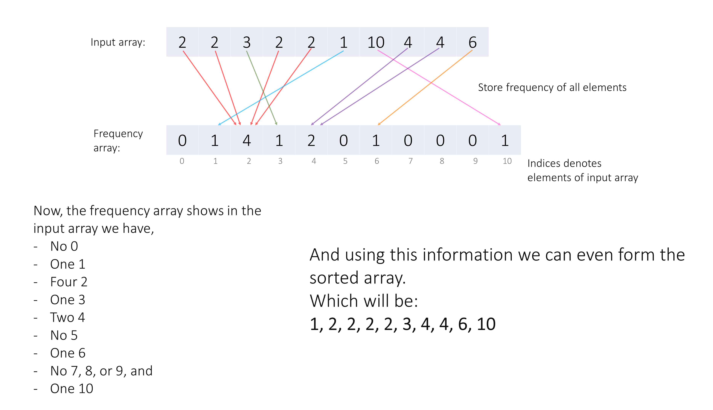

## Solution

---

### Approach 1: Sorting (Greedy)

#### Intuition

We are given some `coins` and an array `costs` of ice cream prices. We need to check the maximum number of ice creams we can buy with the given `coins`, where we can only select one ice cream once.

One way is to try every possibility. For each ice cream, we have two choices, take it (if we have enough coins), or don't take it. This means that there would be $O(2^n)$ possibilities, which is way too slow.

> Here, we will not show this solution as it is very inefficient and will result in **Time Limit Exceeded**.

But you can try it on your own for better learning.

Now if we look carefully we are asked to **maximize the number of ice creams we buy**. Each time we buy any ice cream we will decrease our remaining `coins`.

So, the most greedy way to maximize the number of ice creams is to buy the least expensive **ice cream**. If we buy the least expensive ice cream first, we will be left with more `coins` to buy more ice cream afterward.

Let's look at this with an example, say we have some ice creams costing $\text{[2, 3, 3, 1, 1, 4, 6]}$ and $\text{5}$ coins to buy them. Here, we have two ways to buy the maximum number of ice creams, i.e. buying ice creams costing $\text{[1, 1, 2]}$ or $\text{[1, 1, 3]}$. But when we bought the $\text{3}^{rd}$ ice cream, buying the ice cream costing $\text{2}$ will be considered a greedy step as we picked the one costing less, we don't know how much money we are left with but what we can guarantee is it will help in saving more coins for buying ice cream later (if we can buy).

Now consider the case if we were having one more ice cream costing $\text{2}$ and $\text{6}$ coins initially, if we bought ice creams costing $\text{[1, 1, 3]}$ then we will be left with only $\text{1}$ coin and can't buy more, but if we bought ice creams costing $\text{[1, 1, 2]}$, we can buy an additional ice cream costing $\text{2}$.

Thus, choosing the **least expensive ice cream** at every step is the **optimal** way to make sure we can maximize the number of ice creams we can buy.

> The core idea of the greedy strategy is to pick the best local choice at each step, which will lead to the globally optimal solution.

Thus, we can sort the `costs` array, and buy the cheapest ice creams in order, until either we are not able to buy the ice cream with the remaining `coins` or we have bought all the ice creams.

#### Algorithm

1. Sort the `costs` array in ascending order.

2. Initialize variables:

- `n`, length of the input array.

- `icecream`, integer to denote the index of current ice cream.

3. While there is an ice cream left and we have enough coins to buy it:

- Reduce the cost of current ice cream from our `coins`.

- Increment `icecream` by `1` to move on to the next ice cream.

4. Return `icecream`, which denotes the number of ice creams we bought.

#### Implementation

```python
class Solution:
    def maxIceCream(self, costs: List[int], coins: int) -> int:
        # Store ice cream costs in increasing order.
        costs.sort()
        n, icecream = len(costs), 0

        # Pick ice creams till we can.
        while icecream < n and costs[icecream] <= coins:
            # We can buy this icecream, reduce the cost from the coins.
            coins -= costs[icecream]
            icecream += 1

        return icecream
```

#### Complexity Analysis

Here, $n$ is the number of ice cream bars given.

* Time complexity: $O(n \cdot \log n)$

  - We sort the `costs` array, which will take $O(n \log n)$ time, and then iterate over it, in worst-case which may take $O(n)$ time.

  - In Swift, the parameters passed are constant thus we would need to copy the `coins` variable and `costs` array and it will take an additional $O(n)$ time.

  - Thus, overall we take $O(n \log n + n) = O(n \log n)$ time.

* Space complexity: $O(\log n)$ or $O(n)$

  - Some extra space is used when we sort the `costs` array in place. The space complexity of the sorting algorithm depends on the programming language.

- In Python, the sort() method sorts a list using the Timsort algorithm which has $O(n)$ additional space where $n$ is the number of the elements.

- In C++ and Swift, the sort() function is implemented as a hybrid of Quick Sort, Heap Sort, and Insertion Sort, with a worst-case space complexity of $O(\log n)$.

- In Java, Arrays.sort() is implemented using a variant of the Quick Sort algorithm which has a space complexity of $O(\log n)$.

- In JavaScript, the space complexity of sort() is $O(\log n)$.

  - In Swift, copying the `costs` array will also take an additional $O(n)$ space.

<br />

---

### Approach 2: Counting Sort (Greedy)

#### Intuition

We can further optimize the previous approach by using counting sort.

A comparison-based sorting method (like heapsort, mergesort, etc.) takes $(n \log n)$ time. However, using counting sort, we can access the elements in sorted order in linear time.

> Counting sort is a sorting technique that is based on the keys between specific ranges. We store each element's frequency in an array and thus using this new array we can access all elements in sorted order.

As the input array's element's range is not very large, we can use counting sort here.

If you are new to counting sort, then we recommend you take a look at it in our [Sorting Explore Card](https://leetcode.com/explore/learn/card/sorting/695/non-comparison-based-sorts/4437/).

The idea behind counting sort is that in an additional array `arrayFreq` we store the frequency of each element of the input array where `arrayFreq's` index denotes the element of the input array. Thus, in an indirect way when the indices of `arrayFreq` are accessed in increasing order, we also access the element of the input array in sorted order. You can get a brief idea from the following image.



Thus, instead of using a comparison-based sorting method to sort the `costs` array, we can sort it using counting sort, then buy the cheapest ice creams in order.

#### Algorithm

1. Initialize variables:

- `n`, length of the input array.

- `m`, maximum cost in the `costs` array.

- `icecreams`, number of ice creams we picked.

- `costsFrequency`, to store the frequency of each cost from the `costs` array.

2. Iterate over the `costs` array and store each element's frequency `costsFrequency`.

3. Iterate over each `cost` from `1` to `m`.

- For each cost, if there are ice creams and we have enough coins, then `count` the maximum number of ice creams we can pick.

- Reduce the cost of those picked ice creams from our `coins`.

- Add the count of those picked ice creams in the `icecreams` variable.

4. Return the number of ice creams we picked, i.e. the `icecreams` variable.

#### Implementation

```python
class Solution:
    def maxIceCream(self, costs: List[int], coins: int) -> int:
        n, icecreams = len(costs), 0
        m = max(costs)

        costsFrequency = [0] * (m + 1)
        for cost in costs:
            costsFrequency[cost] += 1

        for cost in range(1, m + 1):
            # No ice cream is present costing 'cost'.
            if not costsFrequency[cost]:
                continue
            # We don't have enough 'coins' to even pick one ice cream.
            if coins < cost:
                break

            # Count how many icecreams of 'cost' we can pick with our 'coins'.
            # Either we can pick all ice creams of 'cost' or we will be limited by remaining 'coins'.
            count = min(costsFrequency[cost], coins // cost)
            # We reduce price of picked ice creams from our coins.
            coins -= cost * count
            icecreams += count

        return icecreams
```

#### Complexity Analysis

Let $n$ be the length of the input array, and $m$ be the maximum element in it.

* Time complexity: $O(n + m)$

  - We once iterate on the input array to find the maximum element and then iterate once again to store the frequencies of its elements in `costsFrequency` array, thus it takes $O(2n)$ time.

  - We then iterate over the whole `costsFrequency` array which in the worst case can take $O(m)$ time.

  - Thus, overall we take $O(2n + m) = O(n + m)$ time.

* Space complexity: $O(m)$

  - We use an additional array `costsFrequency` of size $m$.