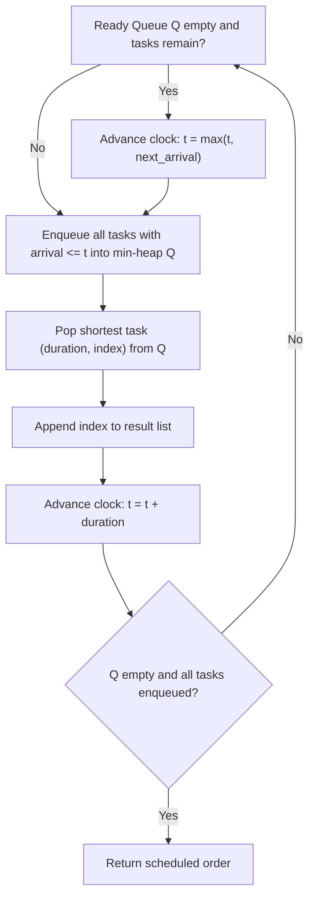

# Guided Example: Single-Threaded CPU

We trace the step-by-step event-driven scheduling of tasks using a min-heap priority queue and Shortest Processing Time First (SPTF) dispatching on a representative problem instance:

- **Input:** `tasks = [[1, 2], [2, 4], [3, 2], [4, 1]]`
- **Required Output:** `[0, 2, 3, 1]`

This instance demonstrates how an event-driven simulation jumps across idle periods, buffers newly arrived tasks into a ready priority queue, and selects tasks by shortest duration (with tie-breaking by initial task index).

---

## 1. Instance & Teaching Goal

We are given $n$ tasks labeled from $0$ to $n - 1$, where $\text{tasks}[i] = [\text{enqueueTime}_i, \text{processingTime}_i]$.
A single-threaded CPU processes tasks according to the following non-preemptive rules:
1. If the CPU is idle and no tasks are available, the CPU remains idle until the next task arrives.
2. If tasks are available, the CPU chooses the task with the **shortest processing time**. If there is a tie, it chooses the task with the **smallest index**.
3. Once started, a task runs to completion without interruption.
4. When a task finishes at time $t$, the CPU immediately selects the next task from all tasks that have arrived on or before time $t$.
We must return the order in which the CPU processes the tasks.

In our instance:
- Task $0$: arrives at $1$, takes $2$.
- Task $1$: arrives at $2$, takes $4$.
- Task $2$: arrives at $3$, takes $2$.
- Task $3$: arrives at $4$, takes $1$.
- Timeline:
  - Time $1$: Task $0$ is the only available task. CPU starts Task $0$, finishing at $1 + 2 = 3$.
  - Time $3$: Tasks $1$ (duration $4$) and $2$ (duration $2$) have arrived. Shortest is Task $2$. CPU starts Task $2$, finishing at $3 + 2 = 5$.
  - Time $5$: Task $3$ (duration $1$) arrived at time $4$. Available: Task $3$ (duration $1$) and Task $1$ (duration $4$). Shortest is Task $3$. CPU starts Task $3$, finishing at $5 + 1 = 6$.
  - Time $6$: Only Task $1$ remains. CPU starts Task $1$, finishing at $6 + 4 = 10$.
- Order executed: `[0, 2, 3, 1]`.

The teaching goal is to decouple task arrival from task execution using two data structures: an array sorted by arrival time and a min-heap ordered by `(processingTime, taskIndex)`.

---

## 2. Conceptual Foundation & Invariants

### Event-Driven State Representation

Let each task be tagged with its original index:
$$\tau_i = (\text{enqueueTime}_i, \text{processingTime}_i, i)$$

We sort all tasks by their arrival time $\text{enqueueTime}_i$.
At any point in simulation:
- $t$: Current simulated clock time.
- Arrival cursor $i$: Points to the next task in the sorted arrival list.
- Ready queue $Q$: Min-heap storing tasks that have already arrived ($t_{\text{enqueue}} \le t$), keyed by:
  $$\text{Key}(\tau) = (\text{processingTime}, \text{originalIndex})$$

### Discrete-Event Priority Scheduling Invariant Theorem

> **Discrete-Event Priority Scheduling Invariant Theorem (SPTF Dispatching).**
> 1. *Idle Time Jump:* If $Q$ is empty and $i < n$, no task is currently runnable. The CPU jumps directly to the arrival time of the next task:
>    $$t \to \max(t, \, \text{tasks}[i].\text{enqueueTime})$$
> 2. *Ready Queue Ingestion:* Whenever the clock is at time $t$, all tasks with $\text{enqueueTime} \le t$ are transferred from the sorted array into min-heap $Q$.
> 3. *Optimal Dispatch:* Extracting the minimum element $(p_j, j) = \text{pop}(Q)$ strictly satisfies the SPTF rule with lexicographical tie-breaking on index $j$.
> 4. *Time Advancement:* Processing the selected task advances the clock by its exact execution duration:
>    $$t \to t + p_j$$
> Because each task is pushed to and popped from the min-heap exactly once, the entire schedule is generated in $\mathcal{O}(n \log n)$ time.

---

## 3. Step-by-Step Worked Execution

We trace `tasks = [[1, 2], [2, 4], [3, 2], [4, 1]]`.
Tag each task with its original index and sort by arrival time:
$$\text{Sorted Tasks} = [(1, 2, 0), (2, 4, 1), (3, 2, 2), (4, 1, 3)]$$
Initialize clock $t = 0$, arrival index $i = 0$, empty min-heap $Q = []$, and result list $\text{ans} = []$.

---

### Step 1: Schedule Task $0$
- $Q$ is empty: advance clock to first arrival:
  $$t = \max(0, 1) = 1$$
- Enqueue arrived tasks with arrival $\le 1$:
  - Task $0$ arrives at $1 \le 1$: push $(2, 0)$ into $Q$.
  - Next task arrives at $2 > 1$: stop ingestion. Cursor $i = 1$.
- Dispatch from $Q$:
  - Pop minimum: Task $0$ with duration $2$, index $0$.
  - Record: $\text{ans} = [0]$.
  - Advance clock: $t \to 1 + 2 = 3$.

---

### Step 2: Schedule Task $2$
- Current clock: $t = 3$.
- Enqueue arrived tasks with arrival $\le 3$:
  - Task $1$ arrives at $2 \le 3$: push $(4, 1)$ into $Q$.
  - Task $2$ arrives at $3 \le 3$: push $(2, 2)$ into $Q$.
  - Next task arrives at $4 > 3$: stop ingestion. Cursor $i = 3$.
- State of ready heap $Q$:
  $$Q = [(2, 2), (4, 1)]$$
- Dispatch from $Q$:
  - Compare keys: $(2, 2) < (4, 1)$.
  - Pop minimum: Task $2$ with duration $2$, index $2$.
  - Record: $\text{ans} = [0, 2]$.
  - Advance clock: $t \to 3 + 2 = 5$.

---

### Step 3: Schedule Task $3$
- Current clock: $t = 5$.
- Enqueue arrived tasks with arrival $\le 5$:
  - Task $3$ arrives at $4 \le 5$: push $(1, 3)$ into $Q$.
  - All $4$ tasks have been ingested ($i = 4$).
- State of ready heap $Q$:
  $$Q = [(1, 3), (4, 1)]$$
- Dispatch from $Q$:
  - Compare keys: $(1, 3) < (4, 1)$.
  - Pop minimum: Task $3$ with duration $1$, index $3$.
  - Record: $\text{ans} = [0, 2, 3]$.
  - Advance clock: $t \to 5 + 1 = 6$.

---

### Step 4: Schedule Task $1$
- Current clock: $t = 6$. No new tasks to ingest.
- State of ready heap $Q$:
  $$Q = [(4, 1)]$$
- Dispatch from $Q$:
  - Pop minimum: Task $1$ with duration $4$, index $1$.
  - Record: $\text{ans} = [0, 2, 3, 1]$.
  - Advance clock: $t \to 6 + 4 = 10$.

Heap $Q$ is empty and all tasks are processed.
Final output: **`[0, 2, 3, 1]`**.

---

## 4. Complete Execution Trace

| Step | Clock $t$ Before | Tasks Enqueued into $Q$ | Heap $Q$ Contents (`(duration, index)`) | Dispatched Task | Duration | New Clock $t$ | Output List |
|:---:|:---:|:---|:---|:---:|:---:|:---:|:---|
| $1$ | $0 \to 1$ | Task $0$ (`(2, 0)`) | `[(2, 0)]` | **Task 0** | $2$ | $3$ | `[0]` |
| $2$ | $3$ | Task $1$ (`(4, 1)`), Task $2$ (`(2, 2)`) | `[(2, 2), (4, 1)]` | **Task 2** | $2$ | $5$ | `[0, 2]` |
| $3$ | $5$ | Task $3$ (`(1, 3)`) | `[(1, 3), (4, 1)]` | **Task 3** | $1$ | $6$ | `[0, 2, 3]` |
| $4$ | $6$ | None | `[(4, 1)]` | **Task 1** | $4$ | $10$ | **`[0, 2, 3, 1]`** |

---

## 5. Algorithmic Correctness

**Soundness.** Every task dispatched from the heap has already arrived ($\text{enqueueTime} \le t$), obeying non-preemption. The min-heap compares tasks by `(processingTime, index)`, guaranteeing that ties in processing time are broken in favor of the smaller original index.

**Completeness.** Every task is entered into the arrival stream and eventually transferred to the min-heap when the clock reaches its arrival time. Since tasks are only removed when executed, all $n$ tasks are processed exactly once.

---

## 6. Traps This Instance Exposes

- **Unit-Time Stepping Inefficiency:** Incrementing $t$ by $1$ unit at each tick causes time limit exceeded when arrival times differ by $10^9$. Jumping directly to $\max(t, \text{tasks}[i][0])$ avoids simulating idle time.
- **Original Index Tracking:** Tasks must retain their original indices after sorting by arrival time; otherwise, tie-breaking and output identities become corrupted.
- **Preemption Assumption:** Once a task starts, it runs to completion. Even if a much shorter task arrives while the CPU is busy, the CPU cannot interrupt the active task.

---

## 7. Complexity Derivation

- **Time Complexity:** $\mathcal{O}(n \log n)$, where $n$ is the number of tasks. Sorting tasks by arrival time takes $\mathcal{O}(n \log n)$. Each task is inserted and extracted from the min-heap once, taking $2n \log n$ heap operations. Total time is strictly $\mathcal{O}(n \log n)$.
- **Auxiliary Space Complexity:** $\mathcal{O}(n)$ to store the augmented tasks list and the min-heap.
