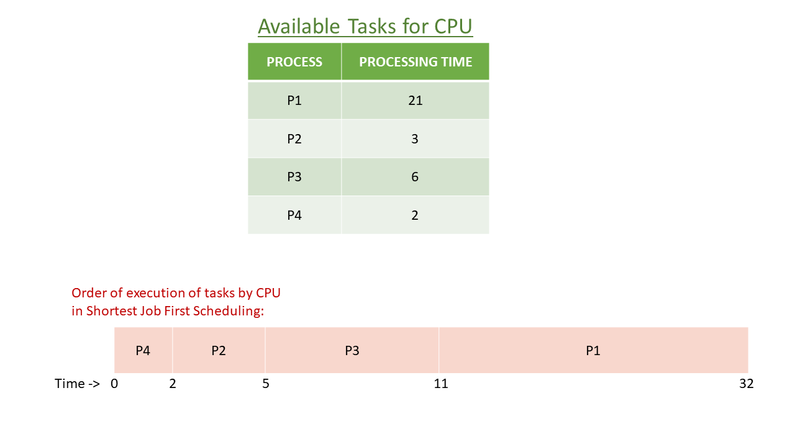

[TOC]

## Solution

---

### Overview

The problem statement asks us to create a scheduling policy that prioritizes the shortest available task; this is known as **Shortest Job First** (SJF) CPU Scheduling. In SJF CPU Scheduling:
- If the CPU is idle and there are available tasks, the CPU will choose the one with the **shortest processing time**. If multiple tasks have the **same shortest processing time**, it will choose the task with the **smallest index** (the task which arrived first).
- Once the CPU starts to execute a task, it will process the entire task without stopping, i.e. it is **non-preemptive**.



</br>

---

### Approach 1: Sorting + Min-Heap

**Intuition**

The CPU can only pick a task for execution after it is enqueued. Thus, we need to keep track of `current time` to see which tasks are available for the CPU and sort the tasks in increasing order of their enqueue time.

Now, we can create a list of tasks available at the `current time` (tasks whose enqueue time is less than or equal to the current time). From this list, we will select the task with the shortest processing time, so we can think of sorting all the available tasks in increasing order of their processing time.
Then after selecting a task, the CPU will run that task until it is complete, and the `current time` will increase by the processing time of the selected task.
After increasing `current time`, some more tasks might become available for execution. We would then add these tasks to our list and again sort the list in increasing order of processing time. This approach will work, but sorting our available task list every time we update it will be costly in terms of runtime.

Thus, this gives us a hint of using a min-heap data structure. If you are new to the heap data structure, we recommend you visit our [Heap Explore Card](https://leetcode.com/explore/featured/card/heap/).
A min-heap is a tree-like data structure that always stores the minimum valued element at the top using some comparison (processing time here, or task index in case of a tie) and where insertion and removal of elements (tasks) take logarithmic time.
Hence, using min-heap will relieve us from the repeated sorting of our list since we can insert new tasks and retrieve the shortest task from the heap in logarithmic time.

Hence, the flow of our approach is something like:
(a) We will insert all the currently available tasks in the min-heap.
(b) Pick the task with the shortest processing time.
(c) Increase the current time by the processing time of the selected task.

Now, one point to note here is that let's say `current time` is `0`, the heap is empty, and the next available task will enqueue at `10`. The CPU will sit idle until `current time` reaches `10`. Instead of incrementing `current time` by `1`, we will update `current time` directly to `10`, which will reduce the number of iterations in our approach and improve the run-time.

This approach can be better understood with the following slideshow:

!?!../Documents/1834/slideshow1.json:960,540!?!

<br />

**Algorithm**

1. Initialize some data-structures:
- `nextTask`, min-heap to store task with minimum processing time on the top.
- `sortedTasks`, array to store tasks in sorted order on the basis of their enqueue time.
- `tasksProcessingOrder`, array to store the order in which the CPU will process the tasks.

2. Add all of the tasks (with their index) to `sortedTasks` and sort the array using the built-in sort function.

3. Initialize `currTime` to `0`.

4. While there are tasks in the `sortedTasks` array that have not been added to the min-heap, or there are tasks remaining in the min-heap:
- Check if the min-heap is empty and if the enqueue time of the next task is greater than `currTime`. If so, then update the `currTime` to the next task's enqueue time.
- Insert all the available tasks (tasks whose enqueue time is less than or equal to `currTime`), into the min-heap.
- Pick the task on the top of the min-heap, increment `currTime` by its processing time, and add its index to the `tasksProcessingOrder` array.

5. Return the `tasksProcessingOrder` array.

<br />

**Implementation**

```python
class Solution:
    def getOrder(self, tasks: List[List[int]]) -> List[int]:
        # Sort based on min task processing time or min task index.
        next_task: List[Tuple[int, int]] = []
        tasks_processing_order: List[int] = []

        # Store task enqueue time, processing time, index.
        sorted_tasks = [(enqueue, process, idx) for idx, (enqueue, process) in enumerate(tasks)]
        sorted_tasks.sort()

        curr_time = 0
        task_index = 0

        # Stop when no tasks are left in array and heap.
        while task_index < len(tasks) or next_task:
            if not next_task and curr_time < sorted_tasks[task_index][0]:
                # When the heap is empty, try updating curr_time to next task's enqueue time.
                curr_time = sorted_tasks[task_index][0]

            # Push all the tasks whose enqueueTime <= currtTime into the heap.
            while task_index < len(sorted_tasks) and curr_time >= sorted_tasks[task_index][0]:
                _, process_time, original_index = sorted_tasks[task_index]
                heapq.heappush(next_task, (process_time, original_index))
                task_index += 1

            process_time, index = heapq.heappop(next_task)

            # Complete this task and increment curr_time.
            curr_time += process_time
            tasks_processing_order.append(index)

        return tasks_processing_order
```

<br />

**Complexity Analysis**

Let $N$ be the number of tasks in the input array.

* Time complexity: $O(N\log N)$.
  - We create `sortedTasks`, which is a deep copy of the `tasks` array. This takes $O(N)$ time.
  - Sorting the `sortedTasks` array takes $O(N \log N)$ time.
  - We push and pop each task once in the min-heap, and both the operations take $O(\log N)$ time for each element. Thus, it takes $O(N \log N)$ time in total.
  - Thus, overall time complexity is, $O(N + N \log N + N \log N)  \approx O(N \log N)$.

* Space complexity: $O(N)$.
  - Our `sortedTasks` array will store all $N$ tasks, and the min-heap will also contain at most $N$ tasks.
  - Thus, we use $O(N + N) \approx O(N)$ extra space.

<br/>

---