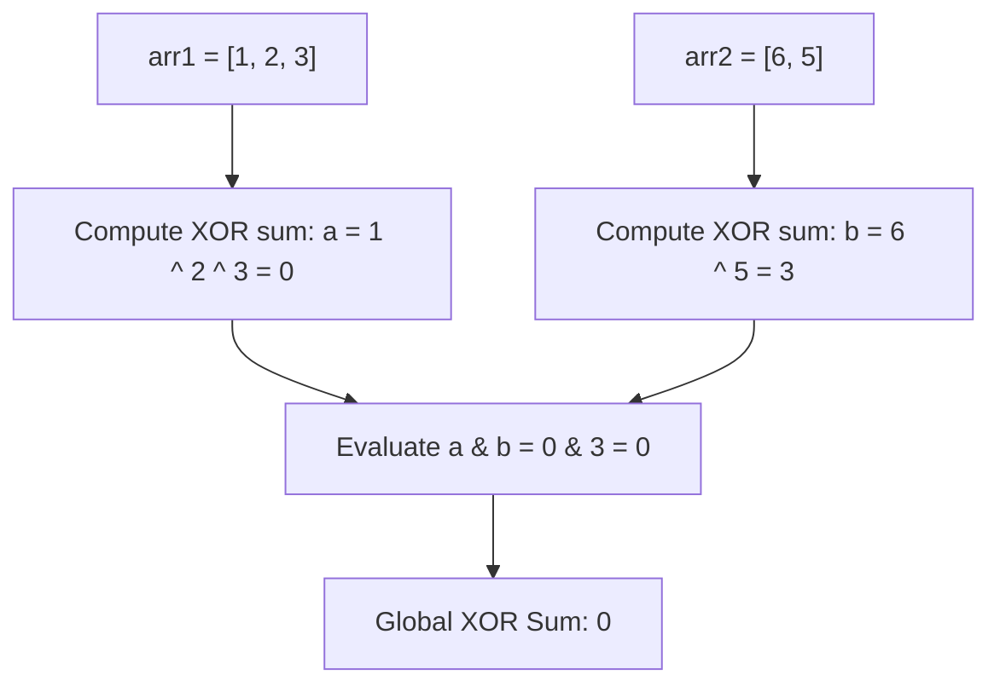

# Guided Example: Find XOR Sum of All Pairs Bitwise AND

We trace the step-by-step evaluation of the Cartesian pair bitwise AND XOR sum via Boolean ring distributivity on a representative problem instance:

- **Input:** `arr1 = [1, 2, 3], arr2 = [6, 5]`
- **Required Output:** `0`

This instance demonstrates how bitwise AND distributes over bitwise XOR, reducing an $\mathcal{O}(n \cdot m)$ all-pairs computation to an $\mathcal{O}(n + m)$ decoupled evaluation.

---

## 1. Instance & Teaching Goal

The **XOR sum** of an array is the bitwise XOR of all its elements.
Given two integer arrays `arr1` and `arr2`:
- Form the list of all bitwise AND values for every pair: $(a \ \& \ b)$ for all $a \in \text{arr1}$ and $b \in \text{arr2}$.
- Compute the XOR sum of this resulting list of size $|\text{arr1}| \times |\text{arr2}|$.

In our instance:
- `arr1 = [1, 2, 3]` ($n = 3$)
- `arr2 = [6, 5]` ($m = 2$)
- All $3 \times 2 = 6$ pairs:
  1. $1 \ \& \ 6 = 0$
  2. $1 \ \& \ 5 = 1$
  3. $2 \ \& \ 6 = 2$
  4. $2 \ \& \ 5 = 0$
  5. $3 \ \& \ 6 = 2$
  6. $3 \ \& \ 5 = 1$
- Cumulative XOR of the pairwise results:
  $$0 \oplus 1 \oplus 2 \oplus 0 \oplus 2 \oplus 1 = (1 \oplus 1) \oplus (2 \oplus 2) = 0 \oplus 0 = 0$$

The teaching goal is to recognize that computing all $n \times m$ pairs takes quadratic time $\mathcal{O}(n \cdot m)$. By recognizing that bitwise AND ($\&$) distributes over bitwise XOR ($\oplus$) identically to how multiplication distributes over addition in standard arithmetic, we factor the entire double XOR sum into $(\bigoplus a_i) \ \& \ (\bigoplus b_j)$, completing the calculation in linear time $\mathcal{O}(n + m)$.

---

## 2. Conceptual Foundation & Invariants

### Boolean Ring Distributivity

In bitwise arithmetic:
- XOR ($\oplus$) acts as addition in the field $\mathbb{F}_2$.
- AND ($\land$) acts as multiplication in the field $\mathbb{F}_2$.

For any three values $x, y, z$:
$$(x \oplus y) \land z = (x \land z) \oplus (y \land z)$$

Extending this to two finite sets $A = \{a_0, \dots, a_{n-1}\}$ and $B = \{b_0, \dots, b_{m-1}\}$:
$$\bigoplus_{i=0}^{n-1} \bigoplus_{j=0}^{m-1} (a_i \land b_j) = \bigoplus_{i=0}^{n-1} \left( a_i \land \bigoplus_{j=0}^{m-1} b_j \right) = \left( \bigoplus_{i=0}^{n-1} a_i \right) \land \left( \bigoplus_{j=0}^{m-1} b_j \right)$$

### Boolean Ring Distributivity Invariant Theorem

> **Boolean Ring Distributivity & Decoupled Cartesian Invariant Theorem.**
> Let $A = [a_0, \dots, a_{n-1}]$ and $B = [b_0, \dots, b_{m-1}]$ be arrays of non-negative integers.
> 1. *Bit-Independence:* For each bit position $k$, let $u_k$ be the parity of the count of elements in $A$ with bit $k$ set, and $v_k$ be the parity of the count in $B$ with bit $k$ set.
> 2. The $k$-th bit of $(a_i \land b_j)$ is $1$ if and only if bit $k$ is $1$ in both $a_i$ and $b_j$.
> 3. The total number of pairs with bit $k$ set is:
>    $$\text{Count}_k = |\{ i : a_{i, k} = 1 \}| \times |\{ j : b_{j, k} = 1 \}|$$
> 4. The parity of this product is:
>    $$\text{Count}_k \bmod 2 = (|\{ i : a_{i, k} = 1 \}| \bmod 2) \times (|\{ j : b_{j, k} = 1 \}| \bmod 2) = u_k \cdot v_k$$
> 5. Consequently:
>    $$\bigoplus_{i=0}^{n-1} \bigoplus_{j=0}^{m-1} (a_i \land b_j) = \left( \bigoplus_{i=0}^{n-1} a_i \right) \ \& \ \left( \bigoplus_{j=0}^{m-1} b_j \right)$$
> Precomputing the XOR sum of each array independently computes the total answer in $\mathcal{O}(n + m)$ time and $\mathcal{O}(1)$ space.

---

## 3. Step-by-Step Worked Execution

We trace `arr1 = [1, 2, 3]` and `arr2 = [6, 5]`.

---

### Step 1: Compute XOR Sum of `arr1`
- Initialize accumulator: $a = 0$.
- Ingest element $0$:
  $$a \to 0 \oplus 1 = 1 = (01)_2$$
- Ingest element $1$:
  $$a \to 1 \oplus 2 = 3 = (11)_2$$
- Ingest element $2$:
  $$a \to 3 \oplus 3 = 0 = (00)_2$$
- Result: $a = 0$.

---

### Step 2: Compute XOR Sum of `arr2`
- Initialize accumulator: $b = 0$.
- Ingest element $0$:
  $$b \to 0 \oplus 6 = 6 = (110)_2$$
- Ingest element $1$:
  $$b \to 6 \oplus 5 = (110)_2 \oplus (101)_2 = (011)_2 = 3$$
- Result: $b = 3$.

---

### Step 3: Combine with Bitwise AND
- Compute:
  $$\text{Result} = a \ \& \ b = 0 \ \& \ 3 = 0$$

Final answer: **`0`**.

---

## 4. Complete Execution Trace

### Contrast: Pairwise Brute Force vs. Distributive Evaluation

**Method A: All Pair Combinations ($3 \times 2 = 6$ operations):**

| Pair $(a_i, b_j)$ | Binary Representations | Bitwise AND Result | Binary AND | Running Pairwise XOR |
|:---:|:---:|:---:|:---:|:---:|
| $(1, 6)$ | $(001)_2 \ \& \ (110)_2$ | $0$ | $(000)_2$ | $0$ |
| $(1, 5)$ | $(001)_2 \ \& \ (101)_2$ | $1$ | $(001)_2$ | $0 \oplus 1 = 1$ |
| $(2, 6)$ | $(010)_2 \ \& \ (110)_2$ | $2$ | $(010)_2$ | $1 \oplus 2 = 3$ |
| $(2, 5)$ | $(010)_2 \ \& \ (101)_2$ | $0$ | $(000)_2$ | $3 \oplus 0 = 3$ |
| $(3, 6)$ | $(011)_2 \ \& \ (110)_2$ | $2$ | $(010)_2$ | $3 \oplus 2 = 1$ |
| $(3, 5)$ | $(011)_2 \ \& \ (101)_2$ | $1$ | $(001)_2$ | $1 \oplus 1 =$ **`0`** |

**Method B: Distributive Reduction ($3 + 2 = 5$ operations):**

| Array | Sequence Elements | Bitwise XOR Sum |
|:---|:---|:---:|
| `arr1` | $[1, 2, 3]$ | $1 \oplus 2 \oplus 3 = 0$ |
| `arr2` | $[6, 5]$ | $6 \oplus 5 = 3$ |
| **Combined** | **$a \ \& \ b$** | **$0 \ \& \ 3 =$ `0`** |

Both methods yield identical results, but Method B scales in linear time.

---

## 5. Algorithmic Correctness

**Soundness.** In any commutative ring with characteristic $2$, multiplication distributes over addition. Because the bitwise operators $(\oplus, \land)$ operate on each bit position as addition and multiplication modulo $2$, the algebraic identity $(\bigoplus a_i) \land (\bigoplus b_j) = \bigoplus_{i, j} (a_i \land b_j)$ is an exact theorem of Boolean algebra.

**Completeness.** Every element of `arr1` and `arr2` is incorporated into the respective reductions. Because the distributive law is bidirectional, no terms are omitted, duplicated, or corrupted.

---

## 6. Traps This Instance Exposes

- **Quadratic Time Limit Exceeded:** When $n = 10^5$ and $m = 10^5$, computing all $10^{10}$ pairs causes a time limit exceeded. Decoupling reduces operations to $2 \times 10^5$.
- **Confusing Bitwise Operators:** Replacing $\&$ with $\oplus$ or assuming XOR distributes over AND (which is false in general rings). AND distributes over XOR, not vice versa.
- **Negative Integer Sign Bits:** All numbers in this problem are non-negative, so sign extension issues do not occur.

---

## 7. Complexity Derivation

- **Time Complexity:** $\mathcal{O}(n + m)$, where $n$ is the length of `arr1` and $m$ is the length of `arr2`. Computing the XOR sum of `arr1` takes $\mathcal{O}(n)$ time, computing the XOR sum of `arr2` takes $\mathcal{O}(m)$ time, and the final bitwise AND takes $\mathcal{O}(1)$ time.
- **Auxiliary Space Complexity:** $\mathcal{O}(1)$, using only two scalar variables to accumulate the XOR sums.
