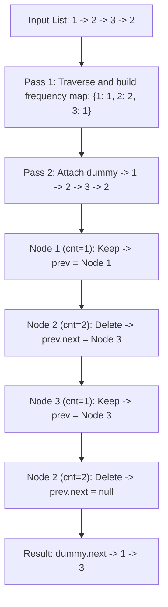

# Guided Example: Remove Duplicates From an Unsorted Linked List

We trace the step-by-step two-pass frequency filtering and in-place sentinel node splicing on a representative singly-linked list instance:

- **Input:** `head = [1, 2, 3, 2]`
- **Required Output:** `[1, 3]`

This instance demonstrates why unsorted duplicate removal requires a two-pass strategy: a global frequency counting pass followed by a sentinel-anchored pointer rewiring pass that purges all occurrences of duplicated values.

---

## 1. Instance & Teaching Goal

We are given the head of a singly-linked list whose values are not sorted.
We must delete **all** nodes whose values appear more than once anywhere in the list (not just adjacent duplicates).
Return the modified linked list.

In our instance:
- `head = 1 -> 2 -> 3 -> 2`
- Node values: $1, 2, 3, 2$.
- Value frequencies:
  - Value $1$: appears $1$ time (unique $\implies$ keep).
  - Value $2$: appears $2$ times (duplicated $\implies$ delete both nodes).
  - Value $3$: appears $1$ time (unique $\implies$ keep).
- Purging all nodes with value $2$ produces `1 -> 3`.

The teaching goal is to recognize that because the list is unsorted, whether the first occurrence of $2$ should be kept or deleted cannot be decided until the second occurrence of $2$ is observed later in the list. This necessitates a two-pass approach:
1. Pass 1: Ingest the entire list into a frequency hash map.
2. Pass 2: Traverse with a sentinel dummy node, rewiring links around any node whose value has frequency $> 1$.

---

## 2. Conceptual Foundation & Invariants

### Two-Pass Separation

Let the list nodes be $N_0, N_1, \dots, N_{n-1}$ with values $v_0, v_1, \dots, v_{n-1}$.
1. **Pass 1 (Frequency Collection):**
   Compute the frequency function for all values:
   $$\text{cnt}[v] = \sum_{k=0}^{n-1} [v_k = v]$$
2. **Pass 2 (Sentinel Filtering):**
   Attach a dummy sentinel node $\text{dummy}$ pointing to the head:
   $$\text{dummy.next} = \text{head}$$
   Maintain two pointers:
   - $\text{prev}$: Points to the last confirmed node in the filtered list (initialized to $\text{dummy}$).
   - $\text{curr}$: Points to the node currently being evaluated (initialized to $\text{head}$).

### Two-Pass Frequency Partition & Sentinel Splicing Theorem

> **Two-Pass Frequency Partition & Sentinel Splicing Theorem.**
> 1. *Non-Locality Invariant:* In an unsorted linked list, duplicate occurrences can appear at arbitrary distances. Hence, complete list traversal is necessary before any deletion decisions can be made.
> 2. *Sentinel Normalization:* Using a sentinel node $\text{dummy}$ ensures that deleting the head node is identical to deleting an internal node, avoiding special-case logic.
> 3. *Rewiring Invariant:* At each step in Pass 2:
>    - If $\text{cnt}[\text{curr.val}] > 1$: rewire $\text{prev.next} = \text{curr.next}$, bypassing $\text{curr}$. The $\text{prev}$ pointer remains stationary.
>    - If $\text{cnt}[\text{curr.val}] == 1$: keep $\text{curr}$, advancing $\text{prev} = \text{curr}$.
>    - In both cases, advance $\text{curr} = \text{curr.next}$.
> 4. After $\text{curr}$ reaches null, $\text{dummy.next}$ points to the head of the filtered list, executing in $\mathcal{O}(n)$ time and $\mathcal{O}(U)$ auxiliary space, where $U$ is the number of distinct values.

---

## 3. Step-by-Step Worked Execution

We trace `head = 1 -> 2 -> 3 -> 2`.

---

### Phase 1: Frequency Collection Pass

Traverse the list from `head` to build frequency map $\text{cnt}$:
- Visit node with value $1 \implies \text{cnt}[1] = 1$.
- Visit node with value $2 \implies \text{cnt}[2] = 1$.
- Visit node with value $3 \implies \text{cnt}[3] = 1$.
- Visit node with value $2 \implies \text{cnt}[2] = 2$.
- End of list.

Final frequency map:
$$\text{cnt} = \{1: 1, \, 2: 2, \, 3: 1\}$$

---

### Phase 2: Sentinel-Anchored Filtering Pass

Attach $\text{dummy} \to \text{head}$.
Initialize:
- $\text{dummy.val} = 0$, $\text{dummy.next} = \text{Node}(1)$
- $\text{prev} = \text{dummy}$
- $\text{curr} = \text{Node}(1)$

---

#### Step 1: Inspect $\text{curr} = \text{Node}(1)$
- Value $v = 1$.
- Check frequency: $\text{cnt}[1] = 1 \le 1$ (Unique).
- Action: Keep node.
  - Advance $\text{prev} = \text{curr} = \text{Node}(1)$.
  - Advance $\text{curr} = \text{curr.next} = \text{Node}(2)$.
- Filtered chain: $\text{dummy} \to 1$.

---

#### Step 2: Inspect $\text{curr} = \text{Node}(2)$ (First occurrence)
- Value $v = 2$.
- Check frequency: $\text{cnt}[2] = 2 > 1$ (Duplicate).
- Action: Delete node by rewiring:
  - $\text{prev.next} = \text{curr.next} = \text{Node}(3)$.
  - $\text{prev}$ remains at $\text{Node}(1)$.
  - Advance $\text{curr} = \text{curr.next} = \text{Node}(3)$.
- Filtered chain: $\text{dummy} \to 1 \to 3$.

---

#### Step 3: Inspect $\text{curr} = \text{Node}(3)$
- Value $v = 3$.
- Check frequency: $\text{cnt}[3] = 1 \le 1$ (Unique).
- Action: Keep node.
  - Advance $\text{prev} = \text{curr} = \text{Node}(3)$.
  - Advance $\text{curr} = \text{curr.next} = \text{Node}(2)$.
- Filtered chain: $\text{dummy} \to 1 \to 3$.

---

#### Step 4: Inspect $\text{curr} = \text{Node}(2)$ (Second occurrence)
- Value $v = 2$.
- Check frequency: $\text{cnt}[2] = 2 > 1$ (Duplicate).
- Action: Delete node by rewiring:
  - $\text{prev.next} = \text{curr.next} = \text{null}$.
  - $\text{prev}$ remains at $\text{Node}(3)$.
  - Advance $\text{curr} = \text{curr.next} = \text{null}$.
- Filtered chain: $\text{dummy} \to 1 \to 3 \to \text{null}$.

---

### Step 5: Termination & Return
- $\text{curr}$ is null. Traversal terminates.
- Return $\text{dummy.next} \implies \text{Node}(1) \to \text{Node}(3)$.

Final filtered list: **`[1, 3]`**.

---

## 4. Complete Execution Trace

| Pass 2 Step | $\text{curr.val}$ | Frequency $\text{cnt}[\text{val}]$ | Decision | $\text{prev}$ Pointer Position | Active Spliced Chain |
|:---:|:---:|:---:|:---:|:---:|:---|
| Init | — | — | Setup | $\text{dummy}$ | $\text{dummy} \to 1 \to 2 \to 3 \to 2$ |
| $1$ | $1$ | $1$ | **Keep** | $\text{Node}(1)$ | $\text{dummy} \to 1$ |
| $2$ | $2$ | $2$ | **Delete** | $\text{Node}(1)$ | $\text{dummy} \to 1 \to 3$ |
| $3$ | $3$ | $1$ | **Keep** | $\text{Node}(3)$ | $\text{dummy} \to 1 \to 3$ |
| $4$ | $2$ | $2$ | **Delete** | $\text{Node}(3)$ | $\text{dummy} \to 1 \to 3 \to \text{null}$ |

Result list: **`[1, 3]`**.

---

## 5. Algorithmic Correctness

**Soundness.** A node is preserved in the list if and only if $\text{cnt}[\text{val}] == 1$. If a value appears multiple times, every node containing that value has $\text{cnt}[\text{val}] > 1$ and is bypassed during Pass 2. The relative order of unique elements is strictly preserved because nodes are traversed in their original sequence.

**Completeness.** Pass 1 scans all nodes, ensuring that every value's count is globally accurate. Pass 2 inspects every node from head to tail, ensuring no duplicate node escapes deletion.

---

## 6. Traps This Instance Exposes

- **Single-Pass Deletion Fallacy:** Attempting to delete duplicates in a single pass without prior frequency counting leaves the first occurrence intact if subsequent duplicates appear later.
- **Head Deletion Without Sentinel:** If the head node itself has duplicates (e.g. `[2, 1, 3, 2]`), `head` must change. The sentinel $\text{dummy}$ node avoids separate conditional logic for updating `head`.
- **Advancing `prev` After Deletion:** When a node is deleted, `prev.next` is updated to skip the node, but `prev` itself must *not* advance, because the newly spliced `prev.next` might also be a duplicate that needs to be deleted in the next step.

---

## 7. Complexity Derivation

- **Time Complexity:** $\mathcal{O}(n)$, where $n$ is the number of nodes in the linked list. Pass 1 takes $n$ steps to populate the frequency map. Pass 2 takes $n$ steps to rewire links. Each hash map operation runs in $\mathcal{O}(1)$ average time.
- **Auxiliary Space Complexity:** $\mathcal{O}(U)$, where $U \le n$ is the number of distinct node values stored in the frequency hash table.