[TOC]

## Solution

---

### Overview

To remove all nodes in a linked list that appear more than once, we need a data structure to track the frequency of each value. Hash maps are ideal for this due to their efficient insertion and lookup operations, both with an average-case time complexity of $O(1)$.

Observe that we will move all instances of the repeated values, not only the duplicate values. For example: if there are two `3`s, we will remove both.

---

### Approach 1: Iterative Two Pass + Hash Map

#### Intuition

The idea is to perform two passes over the linked list:

1. Count Occurrences: Traverse the linked list and count the occurrences of each value using a hash map.

2. Remove Duplicates: Traverse the linked list again and remove the nodes with values appearing more than once, according to the hash map.

To delete a node in a linked list, we'll adjust the pointers to bypass the node to be removed. During the second pass, we'll keep track of the current and previous nodes as we traverse the list.

When a node's value appears more than once, we update the previous node's `next` pointer to skip the current node and point to the node right after the current node. This effectively removes the current node from the list

If the node does not need to be removed, we move the previous pointer to the current node and continue traversing.

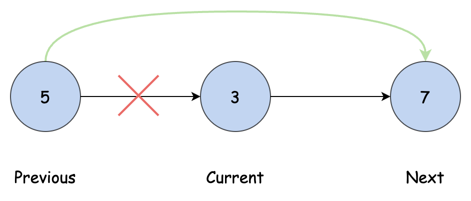

In this approach, we use a dummy node to handle edge cases and simplify the deletion process. A dummy node, added at the beginning of the list, ensures we always have a previous node to refer to, even if the head needs to be removed. This method avoids common mistakes that often occur when modifying linked lists.

Using dummy nodes is a common technique for linked list problems, particularly those that involve modifying the list in-place.

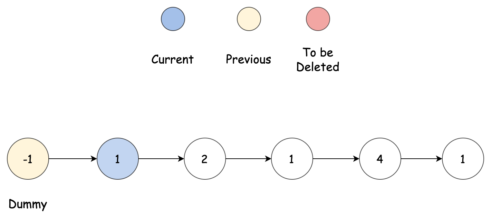

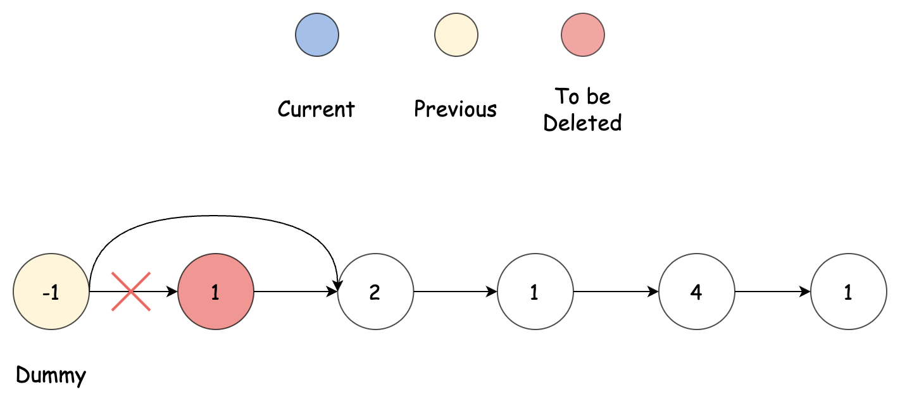

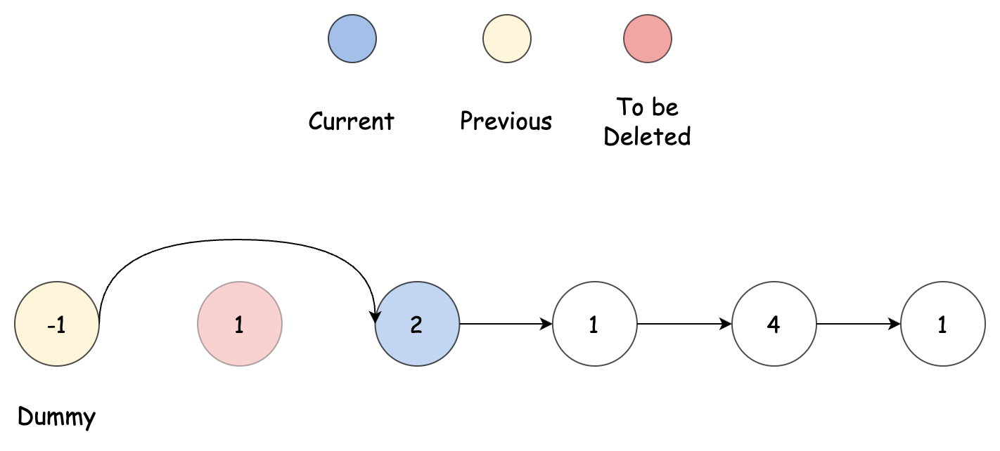

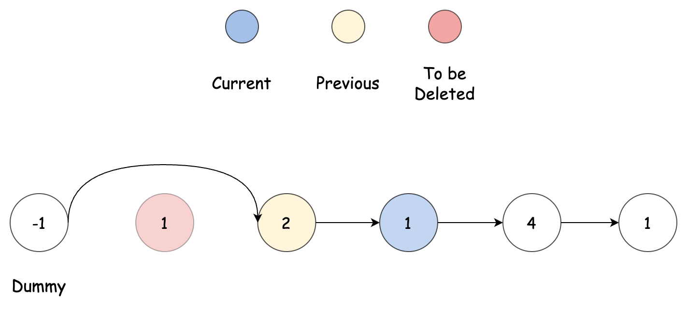

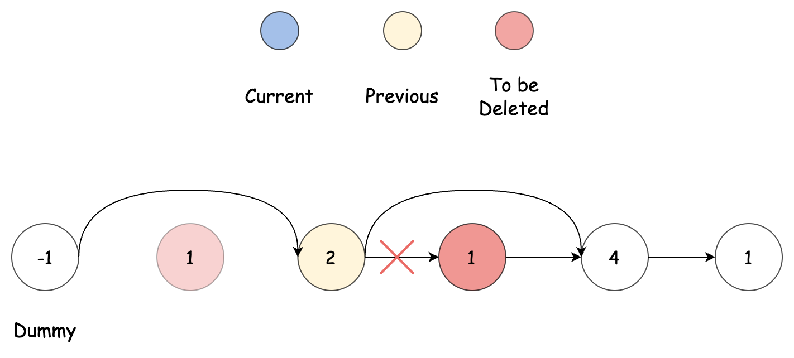

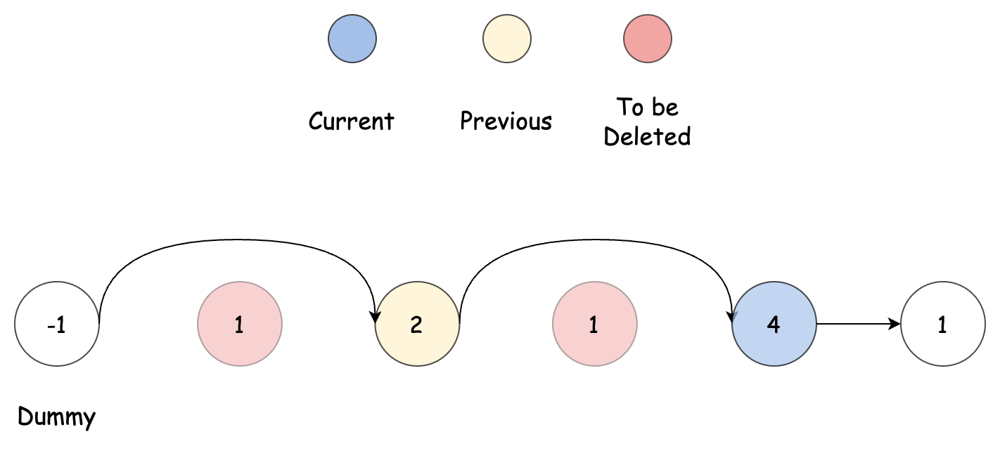

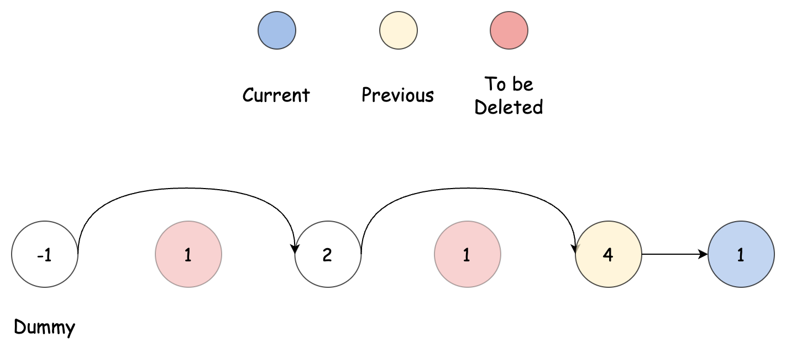

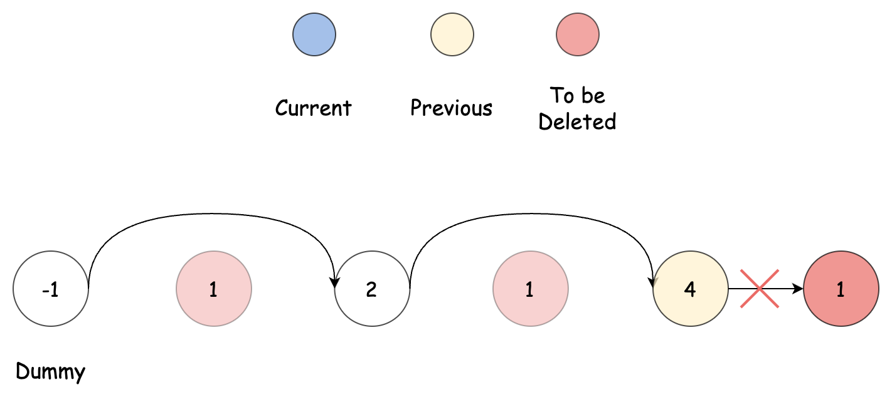

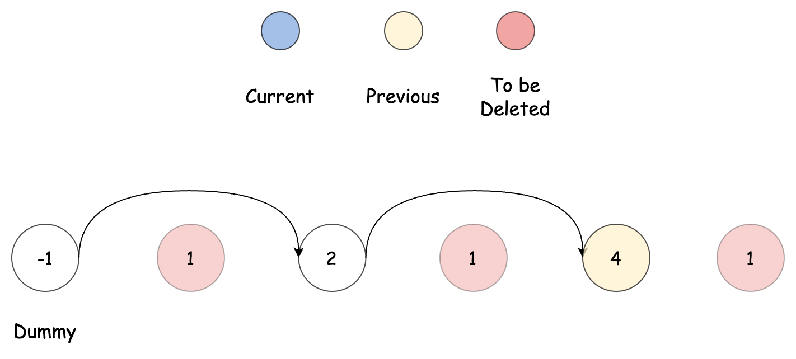

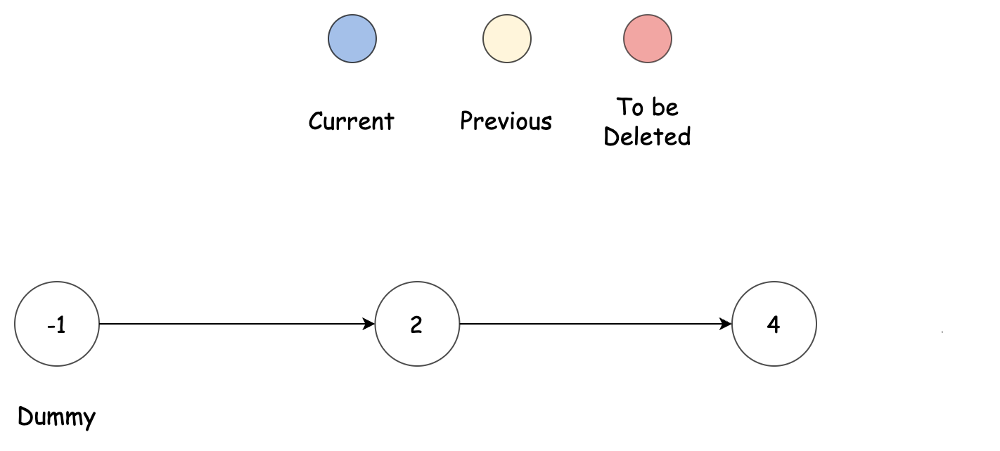

Here are some commonly asked linked list questions in interviews that use dummy nodes:

* [21. Merge Two Sorted Lists](https://leetcode.com/problems/merge-two-sorted-lists/description/)
* [2. Add Two Numbers](https://leetcode.com/problems/add-two-numbers/description/)
* [19. Remove Nth Node From End of List](https://leetcode.com/problems/remove-nth-node-from-end-of-list/description/)
* [23. Merge k Sorted Lists](https://leetcode.com/problems/merge-k-sorted-lists/description/)

If you have a LeetCode Premium subscription, you can learn more about linked lists using this [Linked List Explore Card](https://leetcode.com/explore/learn/card/linked-list/).

#### Algorithm

1. Initialization:
- Create a dummy node `dummy` and set its `next` pointer to the head of the linked list.
- Initialize an empty hash map `frequency` to count the occurrences of each value in the linked list.
- Initialize three pointers: `temp` pointing to the head, `current` pointing to `dummy->next`, and `prev` pointing to `dummy`.
2. Count Occurrences:
- While `temp` is not null:
- Increment the count of `temp->val` in the `frequency` hash map.
- Move `temp` to the next node.
3. Remove Duplicates:
- While `current` is not null:
- If the value of `current` appears more than once in the `frequency` hash map:
- Set `prev->next` to `current->next` to bypass the current node.
- Otherwise:
- Move `prev` to `current`.
- Move `current` to the next node.
4. Return `dummy->next`, which is the head of the modified linked list.

#### Implementation

```python
class Solution:
    def deleteDuplicatesUnsorted(self, head: ListNode) -> ListNode:
        dummy = ListNode(-1, head)
        frequency = {}
        temp = head
        current = dummy.next
        prev = dummy

        # Count occurrences of each value in the linked list.
        while temp:
            if temp.val in frequency:
                frequency[temp.val] += 1
            else:
                frequency[temp.val] = 1
            temp = temp.next

        # Traverse the list and remove nodes with values that appear more than
        # once.
        while current:
            if frequency[current.val] > 1:
                # Delete current node from the list
                prev.next = current.next
            else:
                prev = current
            current = current.next
        return dummy.next
```

#### Complexity Analysis

Let $n$ be the number of nodes in the linked list.

- Time Complexity: $O(n)$

    The first while loop traverses the list once to count the occurrences of each value, resulting in a time complexity of $O(n)$. Hash map operations (insertion and lookup) are $O(1)$.

    The second while loop that removes nodes with duplicate values also traverses the list once, resulting in a time complexity of $O(n)$.

    Therefore, the overall time complexity is $O(n)$.

- Space Complexity: $O(n)$

    The hash map used to store the frequency of each value requires $O(n)$ space in the worst case, where all nodes have distinct values.

    The additional space used by the dummy node and the pointers is constant $O(1)$.

    Therefore, the overall space complexity is $O(n)$.

---

### Approach 2: Recursive + Hash Map

#### Intuition

We can solve this problem using recursion as well. The fundamental idea behind recursion is to break down a problem into smaller subproblems and solve each one, given that we know the solution to the previous subproblems.

In this case, the subproblem is to decide whether or not to delete the current node. We traverse the linked list recursively until we reach the tail. Because the recursion backs up, we can assume that we have already handled the nodes that are after the current node.

> This is why recursion is so powerful; we can assume that each subproblem has been solved and we can use the answer for the subproblem to solve our current problem.

The decision to remove the current node is based on its frequency count, and we use the same hash map from the previous approach to track these frequencies.

A good example of this application of recursion can be round in this problem :

* [24. Swap Nodes in Pairs](https://leetcode.com/problems/swap-nodes-in-pairs/description/)

#### Algorithm

1. Initialization:
- Initialize an empty hash map `frequency` to count the occurrences of each value in the linked list.
- Define a function `countFrequencies` with parameters `head` and `frequency`.
- Define a function `deleteDuplicatesUnsortedHelper` with parameters `head` and `frequency`.
2. Count Occurrences:
- In `countFrequencies` function:
- Initialize a pointer `current` pointing to `head`.
- While `current` is not null:
- Increment the count of `current.val` in the `frequency` hash map.
- Move `current` to the next node.
3. Remove Duplicates:
- In `deleteDuplicatesUnsortedHelper` function:
- If `head` is null:
- Return null.
- Recursively call `deleteDuplicatesUnsortedHelper` and store the result in `updatedNextNode`.
- Set `head.next` to `updatedNextNode`.
- If the value of `head` appears more than once in the `frequency` hash map:
- Return `updatedNextNode` to bypass the current node.
- Otherwise:
- Return `head` to include the current node in the modified list.
4. Main Function:
- In `deleteDuplicatesUnsorted` function:
- Initialize the `frequency` hash map.
- Call `countFrequencies` to populate the `frequency` map.
- Return the result of `deleteDuplicatesUnsortedHelper`, which is the head of the modified linked list.

#### Implementation

```python
class Solution:
    def deleteDuplicatesUnsorted(self, head: ListNode) -> ListNode:
        frequency = {}
        self.count_frequencies(head, frequency)
        return self.delete_duplicates_unsorted_helper(head, frequency)

    # Count the frequency of each value in the list
    def count_frequencies(self, head: ListNode, frequency: dict):
        current = head
        while current is not None:
            frequency[current.val] = frequency.get(current.val, 0) + 1
            current = current.next

    # Recursively delete duplicates based on the frequency map
    def delete_duplicates_unsorted_helper(
        self, head: ListNode, frequency: dict
    ) -> ListNode:
        if head is None:
            return None

        # Recursive call for the next node
        updated_next_node = self.delete_duplicates_unsorted_helper(
            head.next, frequency
        )
        head.next = updated_next_node

        # If the current node is a duplicate, return the updated next node
        if frequency[head.val] > 1:
            return updated_next_node

        # Otherwise, return the current node
        return head
```

#### Complexity Analysis

Let $n$ be the number of nodes in the linked list.

- Time Complexity: $O(n)$

    The `countFrequencies` function traverses the list once to count the occurrences of each value, resulting in a time complexity of $O(n)$. The hash map operations (insertion and lookup) are $O(1)$.

    The `deleteDuplicatesUnsortedHelper` function traverses the linked list to remove nodes with duplicate values. Each node is processed exactly once, resulting in a time complexity of $O(n)$.

    Therefore, the overall time complexity is $O(n)$.

- Space Complexity: $O(n)$

    The hash map used to store the frequency of each value requires $O(n)$ space in the worst case, where all nodes have distinct values.

    The additional space used by the recursion stack in `deleteDuplicatesUnsortedHelper` is $O(n)$ in the worst case.

    Therefore, the overall space complexity is $O(n)$.

---