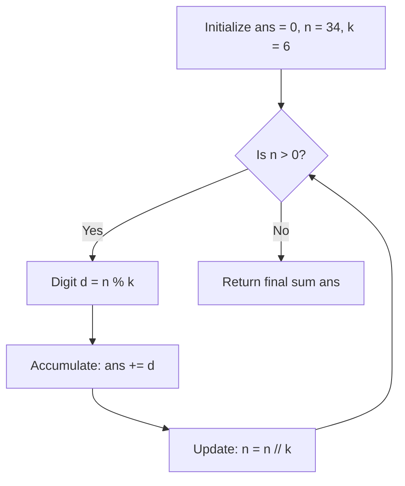

# Guided Example: Sum of Digits in Base K

We trace the step-by-step radix extraction and digit summation via Euclidean division on a representative problem instance:

- **Input:** `n = 34, k = 6`
- **Required Output:** `9`

This instance demonstrates the repeated division-remainder algorithm for base conversion, showing how the digits of $n$ in base $k$ are extracted from least to most significant and accumulated in $\mathcal{O}(\log_k n)$ steps.

---

## 1. Instance & Teaching Goal

We are given an integer $n$ (in decimal base $10$) and a target base $k \ge 2$.
We must convert $n$ into base $k$ and return the arithmetic sum of its digits in that base.

In our instance:
- $n = 34$, base $k = 6$.
- Expressing $34$ as powers of $6$:
  $$34 = 5 \times 6^1 + 4 \times 6^0 = 30 + 4 = 34$$
- The base-$6$ representation is $(54)_6$.
- Digits: $5$ and $4$.
- Sum of digits: $5 + 4 = 9$.

The teaching goal is to observe that we do not need to construct the full string representation of $(54)_6$. Using successive integer division ($n \gets \lfloor n / k \rfloor$) and modulo arithmetic ($d \gets n \bmod k$), each base-$k$ digit is extracted directly and added to a running sum.

---

## 2. Conceptual Foundation & Invariants

### Radix Representation

By the Division Algorithm, any positive integer $n$ has a unique representation in radix $k$:
$$n = \sum_{j=0}^{m} d_j k^j = d_m k^m + d_{m-1} k^{m-1} + \dots + d_1 k^1 + d_0 k^0$$
where each digit $d_j \in \{0, 1, \dots, k - 1\}$ and $d_m \neq 0$.

Taking modulo $k$:
$$n \bmod k = d_0$$
Dividing by $k$:
$$\lfloor n / k \rfloor = \sum_{j=1}^{m} d_j k^{j-1}$$

Repeated application extracts $d_0, d_1, \dots, d_m$ in sequence until the quotient reaches $0$.

### Radix Decomposition & Remainder Accumulation Theorem

> **Radix Decomposition & Remainder Accumulation Theorem.**
> Let $n \in \mathbb{Z}^+$ and integer radix $k \ge 2$.
> 1. *Digit Extraction Invariant:* At each iteration with state $n$, the remainder $r = n \bmod k$ is precisely the lowest remaining base-$k$ digit.
> 2. *Quotient Reduction:* Replacing $n \gets \lfloor n / k \rfloor$ strictly contracts the value of $n$ by at least a factor of $k \ge 2$.
> 3. *Summation Conservation:* The running accumulator $S$ satisfies:
>    $$S_{\text{final}} = \sum_{j=0}^m (n_j \bmod k) = \sum_{j=0}^m d_j$$
> The process terminates in exactly $\lfloor \log_k n \rfloor + 1$ iterations, using $\mathcal{O}(\log_k n)$ time and $\mathcal{O}(1)$ auxiliary space.

---

## 3. Step-by-Step Worked Execution

We trace $n = 34$ and $k = 6$.
Initialize sum accumulator $\text{ans} = 0$.

---

### Step 1: Iteration $1$ ($n = 34$)
- Compute remainder (least significant digit):
  $$d_0 = 34 \bmod 6 = 4$$
- Add to sum:
  $$\text{ans} \to 0 + 4 = 4$$
- Update quotient:
  $$n \to \lfloor 34 / 6 \rfloor = 5$$

---

### Step 2: Iteration $2$ ($n = 5$)
- Compute remainder:
  $$d_1 = 5 \bmod 6 = 5$$
- Add to sum:
  $$\text{ans} \to 4 + 5 = 9$$
- Update quotient:
  $$n \to \lfloor 5 / 6 \rfloor = 0$$

---

### Step 3: Termination
- Quotient $n = 0$.
- Loop terminates.
- Emitted result: **`9`**.

---

## 4. Complete Execution Trace

| Iteration | Current $n$ | Remainder $d = n \bmod 6$ | Quotient $n' = \lfloor n / 6 \rfloor$ | Running Sum $\text{ans}$ | Digit Position in $(54)_6$ |
|:---:|:---:|:---:|:---:|:---:|:---|
| Init | $34$ | — | — | $0$ | — |
| $1$ | $34$ | $4$ | $5$ | $4$ | $6^0$ position (units) |
| $2$ | $5$ | $5$ | $0$ | **`9`** | $6^1$ position (sixes) |
| End | $0$ | — | — | **`9`** | Complete representation: $(54)_6$ |

Final digit sum: **`9`**.

---

## 5. Algorithmic Correctness

**Soundness.** By the uniqueness of radix-$k$ positional notation, every integer $n$ maps to a single sequence of coefficients $d_j \in [0, k - 1]$. The modulo operator $n \bmod k$ mathematically identifies the lowest digit, and integer division shifts the radix polynomial right by one power of $k$. Summing these remainders yields the exact sum of digits.

**Completeness.** Since $k \ge 2$, the quotient $\lfloor n / k \rfloor$ strictly decreases at each step, reaching $0$ in finite time. Every base-$k$ digit is visited and accumulated.

---

## 6. Traps This Instance Exposes

- **Constructing String Representation:** Converting to a string and then converting each character back to an integer introduces unnecessary string allocations and conversions. Direct arithmetic accumulation operates in $\mathcal{O}(1)$ extra space.
- **Floating-Point Division:** Using standard division `/` instead of integer floor division `//` introduces float rounding errors for large integers.
- **Zero Input Handling:** For $n = 0$, the sum of digits is $0$; while the problem specifies $n \ge 1$, the `while n:` loop naturally produces $0$ without error.

---

## 7. Complexity Derivation

- **Time Complexity:** $\mathcal{O}(\log_k n)$. The loop executes $\lfloor \log_k n \rfloor + 1$ times. For $n \le 100$ and $k \ge 2$, at most $7$ divisions occur.
- **Auxiliary Space Complexity:** $\mathcal{O}(1)$, using only scalar accumulator variables.
