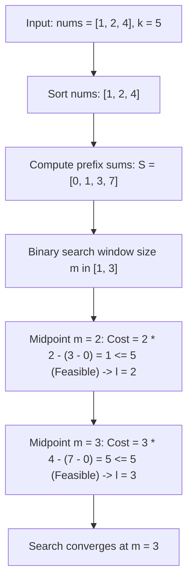

# Guided Example: Frequency of the Most Frequent Element

We trace the step-by-step optimization of element frequency under increment constraints via sorting, prefix sum cost evaluation, and monotonic bisection on a representative problem instance:

- **Input:** `nums = [1, 2, 4], k = 5`
- **Required Output:** `3`

This instance demonstrates how sorting forces optimal target subsets to be contiguous prefixes before the maximum element, allowing the equalization cost of any window to be computed in $\mathcal{O}(1)$ time using prefix sums.

---

## 1. Instance & Teaching Goal

We are given an integer array `nums` and an integer $k$. In one operation, we can pick any index and increment its value by $1$.
We can perform at most $k$ operations in total.
We must return the **maximum possible frequency** of any element in the array after at most $k$ increments.

In our instance:
- `nums = [1, 2, 4]` ($n = 3$), budget $k = 5$.
- If we increment $1$ by $3$ ($1 \to 4$) and $2$ by $2$ ($2 \to 4$), all $3$ elements become equal to $4$.
- Total operations spent: $3 + 2 = 5 \le 5$.
- Resulting array: `[4, 4, 4]` where element $4$ appears $3$ times.
- Maximum achievable frequency: **`3`**.

The teaching goal is to establish two core structural properties:
1. **Target Value Selection:** Because operations only increment values, elements can only be made equal to an element that is already at least as large as all of them. The target value must be the maximum element of the chosen subset.
2. **Contiguity in Sorted Order:** For a chosen target value $a_r$, the cheapest elements to increment up to $a_r$ are those immediately preceding $a_r$ in sorted order. Contiguous window evaluation via prefix sums or two pointers achieves $\mathcal{O}(n \log n)$ time.

---

## 2. Conceptual Foundation & Invariants

### Sorting and Window Equalization Cost

Sort `nums` in non-decreasing order:
$$a_0 \le a_1 \le \dots \le a_{n-1}$$

To form a cluster of $m$ equal elements ending at index $r$, the optimal choice is to pick the contiguous subsegment:
$$[a_{r - m + 1}, \, a_{r - m + 2}, \, \dots, \, a_r]$$
and elevate every element to $a_r$.

The total number of increments needed is:
$$\text{Cost}(r, m) = \sum_{j=r-m+1}^r (a_r - a_j) = m \cdot a_r - \sum_{j=r-m+1}^r a_j$$

Using 0-indexed prefix sums where $S[t] = \sum_{j=0}^{t-1} a_j$:
$$\text{Cost}(r, m) = m \cdot a_r - (S[r + 1] - S[r - m + 1])$$

### Sorted Equalization Cost Monotonicity Theorem

> **Sorted Equalization Cost Monotonicity Theorem (Window Bisection Invariant).**
> Let $A = [a_0, \dots, a_{n-1}]$ be sorted in non-decreasing order.
> 1. *Contiguity Property:* For any fixed target $a_r$, the cost to elevate $m$ elements to $a_r$ is minimized when the chosen elements are $A[r - m + 1 \dots r]$. Any choice that skips an element closer to $a_r$ strictly increases the sum.
> 2. *Feasibility Predicate:* A target frequency $m \in [1, n]$ is feasible if and only if there exists at least one right endpoint $r \in [m - 1, n - 1]$ such that:
>    $$\text{Cost}(r, m) \le k$$
> 3. *Monotonicity:* If frequency $m$ is feasible, then any smaller frequency $m' < m$ is also feasible (by simply discarding elements).
> 4. Binary searching the optimal window length $m$ over $[1, n]$ with $\mathcal{O}(n)$ feasibility checks per midpoint finds the global maximum frequency in $\mathcal{O}(n \log n)$ time.

---

## 3. Step-by-Step Worked Execution

We trace `nums = [1, 2, 4]` with $k = 5$.

---

### Step 1: Sort Array and Compute Prefix Sums

- Sorted array:
  $$A = [1, 2, 4], \quad n = 3$$
- Prefix sum array $S$ of length $n + 1 = 4$:
  $$S[0] = 0$$
  $$S[1] = 1$$
  $$S[2] = 1 + 2 = 3$$
  $$S[3] = 1 + 2 + 4 = 7$$

---

### Step 2: Define Search Domain
The frequency $m$ must satisfy $1 \le m \le 3$.
Initialize binary search range:
$$L = 1, \quad R = 3$$

---

### Step 3: Test Midpoint $m = 2$
- Candidate midpoint:
  $$M = \left\lfloor \frac{1 + 3 + 1}{2} \right\rfloor = 2$$
- Evaluate all candidate windows of length $2$:
  1. Window ending at index $r = 1$ ($A[0 \dots 1] = [1, 2]$):
     $$\text{Target} = A[1] = 2$$
     $$\text{Sum of elements} = S[2] - S[0] = 3 - 0 = 3$$
     $$\text{Cost} = 2 \times 2 - 3 = 4 - 3 = 1$$
     Check budget: $1 \le 5 \implies$ **Feasible!**
- Because $m = 2$ is achievable, set $L = 2$. New range $[2, 3]$.

---

### Step 4: Test Midpoint $m = 3$
- Candidate midpoint:
  $$M = \left\lfloor \frac{2 + 3 + 1}{2} \right\rfloor = 3$$
- Evaluate all candidate windows of length $3$:
  1. Window ending at index $r = 2$ ($A[0 \dots 2] = [1, 2, 4]$):
     $$\text{Target} = A[2] = 4$$
     $$\text{Sum of elements} = S[3] - S[0] = 7 - 0 = 7$$
     $$\text{Cost} = 3 \times 4 - 7 = 12 - 7 = 5$$
     Check budget: $5 \le 5 \implies$ **Feasible!**
- Because $m = 3$ is achievable, set $L = 3$. New range $[3, 3]$.

---

### Step 5: Termination
- Range collapsed to $L = R = 3$.
- Maximal frequency: **`3`**.

---

## 4. Complete Execution Trace

| Tested Window Size $m$ | Candidate Windows Evaluated | Target Value $A[r]$ | Window Sum | Equalization Cost $m \cdot A[r] - \text{Sum}$ | Cost $\le k = 5$? | Binary Search Interval Update |
|:---:|:---|:---:|:---:|:---:|:---:|:---:|
| Init | — | — | — | — | — | $[1, 3]$ |
| $m = 2$ | $[1, 2]$ (ends at $r = 1$) | $2$ | $3$ | $2(2) - 3 = 1$ | **Yes** ($1 \le 5$) | Narrow to $[2, 3]$ |
| $m = 3$ | $[1, 2, 4]$ (ends at $r = 2$) | $4$ | $7$ | $3(4) - 7 = 5$ | **Yes** ($5 \le 5$) | Narrow to $[3, 3]$ |
| Converged | **Optimal Size: 3** | $4$ | $7$ | $5$ | **Yes** | Emits **`3`** |

---

## 5. Algorithmic Correctness

**Soundness.** For any window $[r - m + 1 \dots r]$, elevating all elements to $a_r$ consumes exactly $m \cdot a_r - \sum a_j$ operations. If this cost is $\le k$, all $m$ elements can be transformed into $a_r$ within budget, proving that a frequency of $m$ is valid.

**Completeness.** Any subset of size $m$ elevated to $V$ must have $V \ge \max(S)$. If $V > \max(S)$, cost is strictly higher than setting $V = \max(S)$. Among all subsets with maximum $a_r$, the contiguous block immediately preceding $a_r$ has the largest individual values, minimizing the difference sum. Thus, scanning all contiguous windows of length $m$ explores all candidate minimum-cost sets without omission.

---

## 6. Traps This Instance Exposes

- **64-bit Integer Overflow in Cost:** When elements are up to $10^5$ and $m = 10^5$, the product $m \cdot a_r$ can reach $10^{10}$, exceeding 32-bit signed integers. 64-bit integers must be used for sums and products.
- **Picking an Intermediate Target Value:** Elevating elements to the median or mean is only optimal when both increments and decrements are allowed. With increments only, the target must be the maximum of the subset.
- **Non-Contiguous Subset Pitfall:** Selecting dispersed elements (e.g. $[1, 4]$ instead of $[2, 4]$) wastes operations because $4 - 1 = 3 > 4 - 2 = 2$.

---

## 7. Complexity Derivation

- **Time Complexity:** $\mathcal{O}(n \log n)$. Sorting takes $\mathcal{O}(n \log n)$. Computing prefix sums takes $\mathcal{O}(n)$. Binary search on window size takes $\mathcal{O}(\log n)$ iterations, with each feasibility check scanning up to $n$ windows in $\mathcal{O}(1)$ time each. Total runtime is $\mathcal{O}(n \log n)$.
- **Auxiliary Space Complexity:** $\mathcal{O}(n)$ to store the prefix sum array.