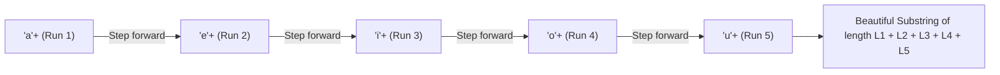

# Guided Example: Longest Substring Of All Vowels in Order

We trace the step-by-step identification of the longest beautiful vowel substring via run-length compression and 5-stage sequential regular matching on a representative problem instance:

- **Input:** `word = "aeiaaioaaaaeiiiiouuuooaauuaeiu"`
- **Required Output:** `13`

This instance demonstrates how identifying contiguous substrings conforming to the regular pattern $a^+ e^+ i^+ o^+ u^+$ reduces to grouping identical consecutive vowels into run-length blocks and locating the 5-block window with maximum cumulative length.

---

## 1. Instance & Teaching Goal

A substring is called **beautiful** if:
1. It contains all 5 English vowels (`'a'`, `'e'`, `'i'`, `'o'`, `'u'`) at least once each.
2. The vowels appear in strictly non-decreasing alphabetical order: all `'a'`s appear before any `'e'`, all `'e'`s before any `'i'`, all `'i'`s before any `'o'`, and all `'o'`s before any `'u'`.
3. It forms a contiguous subsegment of `word`.
We must return the maximum length of a beautiful substring in `word`, or $0$ if none exists.

In our instance:
- `word = "aeiaaioaaaaeiiiiouuuooaauuaeiu"` of length $31$.
- Inspecting candidate segments:
  - Prefix `"aei"`: contains only 3 vowels (missing `'o'` and `'u'`).
  - Next segment `"a"`: single letter.
  - Middle segment `"aaaaeiiiiouuu"`:
    - Four `'a'`s: `"aaaa"` (length 4)
    - One `'e'`: `"e"` (length 1)
    - Four `'i'`s: `"iiii"` (length 4)
    - One `'o'`: `"o"` (length 1)
    - Three `'u'`s: `"uuu"` (length 3)
    - Total length: $4 + 1 + 4 + 1 + 3 = 13$. All 5 vowels present in order.
  - Subsequent segments: `"ooaauuaeiu"` does not contain all 5 vowels in order.
- The maximum beautiful substring length is **`13`**.

The teaching goal is to model the vowel requirement as the regular language $a^+ e^+ i^+ o^+ u^+$. By collapsing runs of identical consecutive vowels into pairs $(\text{character}, \text{count})$, any beautiful substring corresponds to exactly $5$ consecutive runs whose character labels spell `"aeiou"`.

---

## 2. Conceptual Foundation & Invariants

### Regular Pattern and Run-Length Encoding

The condition that all 5 vowels appear in sorted order with non-zero frequency is the definition of the regular expression:
$$\mathcal{L} = a^+ e^+ i^+ o^+ u^+$$

Any string $w \in \mathcal{L}$ consists of:
- A run of $L_1 \ge 1$ copies of `'a'`
- Followed by $L_2 \ge 1$ copies of `'e'`
- Followed by $L_3 \ge 1$ copies of `'i'`
- Followed by $L_4 \ge 1$ copies of `'o'`
- Followed by $L_5 \ge 1$ copies of `'u'`

The total length of this substring is:
$$\text{Length} = L_1 + L_2 + L_3 + L_4 + L_5$$

### Regular Language Substring Invariant Theorem

> **Regular Language Substring & Run-Length Encoding Invariant Theorem.**
> Let `word` be tokenized into maximal contiguous runs of identical characters:
> $$\text{Runs} = [(c_1, L_1), (c_2, L_2), \dots, (c_m, L_m)]$$
> where $c_k \neq c_{k+1}$ for all $1 \le k < m$.
> 1. *Pattern Match:* A contiguous slice of runs $[(c_i, L_i), \dots, (c_{i+4}, L_{i+4})]$ forms a beautiful substring if and only if:
>    $$(c_i, c_{i+1}, c_{i+2}, c_{i+3}, c_{i+4}) = (\text{'a'}, \text{'e'}, \text{'i'}, \text{'o'}, \text{'u'})$$
> 2. *Maximality:* Any longer contiguous run of vowels in order must span additional runs, but any transition between distinct vowels other than $a \to e \to i \to o \to u$ breaks the alphabetical ordering. Hence, every maximal beautiful substring comprises exactly $5$ consecutive runs.
> 3. *Linear Complexity:* Encoding takes $\mathcal{O}(n)$ time and inspecting all windows of size $5$ takes $\mathcal{O}(m)$ time where $m \le n$, finding the global maximum in $\mathcal{O}(n)$ time.

---

## 3. Step-by-Step Worked Execution

We trace `word = "aeiaaioaaaaeiiiiouuuooaauuaeiu"`.

---

### Step 1: Run-Length Compression

Scan `word` and compress consecutive identical vowels:
1. `"a"` $\implies (\text{'a'}, 1)$
2. `"e"` $\implies (\text{'e'}, 1)$
3. `"i"` $\implies (\text{'i'}, 1)$
4. `"aa"` $\implies (\text{'a'}, 2)$
5. `"i"` $\implies (\text{'i'}, 1)$
6. `"o"` $\implies (\text{'o'}, 1)$
7. `"aaaa"` $\implies (\text{'a'}, 4)$
8. `"e"` $\implies (\text{'e'}, 1)$
9. `"iiii"` $\implies (\text{'i'}, 4)$
10. `"o"` $\implies (\text{'o'}, 1)$
11. `"uuu"` $\implies (\text{'u'}, 3)$
12. `"oo"` $\implies (\text{'o'}, 2)$
13. `"aa"` $\implies (\text{'a'}, 2)$
14. `"uu"` $\implies (\text{'u'}, 2)$
15. `"a"` $\implies (\text{'a'}, 1)$
16. `"e"` $\implies (\text{'e'}, 1)$
17. `"i"` $\implies (\text{'i'}, 1)$
18. `"u"` $\implies (\text{'u'}, 1)$

---

### Step 2: Slide a 5-Run Window Across the Run Sequence

Check each 5-run window for the character sequence `("a", "e", "i", "o", "u")`:

- Window $0 \dots 4$: `['a', 'e', 'i', 'a', 'i']` $\implies$ Mismatch.
- Window $1 \dots 5$: `['e', 'i', 'a', 'i', 'o']` $\implies$ Mismatch.
- Window $2 \dots 6$: `['i', 'a', 'i', 'o', 'a']` $\implies$ Mismatch.
- Window $3 \dots 7$: `['a', 'i', 'o', 'a', 'e']` $\implies$ Mismatch.
- Window $4 \dots 8$: `['i', 'o', 'a', 'e', 'i']` $\implies$ Mismatch.
- Window $5 \dots 9$: `['o', 'a', 'e', 'i', 'o']` $\implies$ Mismatch.
- **Window $6 \dots 10$:**
  - Runs: `('a', 4), ('e', 1), ('i', 4), ('o', 1), ('u', 3)`
  - Characters: `"aeiou"` $\implies$ **Match!**
  - Length: $4 + 1 + 4 + 1 + 3 = 13$.
  - Update maximum length: $\text{ans} = \max(0, 13) = 13$.
- Window $7 \dots 11$: `['e', 'i', 'o', 'u', 'o']` $\implies$ Mismatch.
- Window $8 \dots 12$: `['i', 'o', 'u', 'o', 'a']` $\implies$ Mismatch.
- Window $9 \dots 13$: `['o', 'u', 'o', 'a', 'u']` $\implies$ Mismatch.
- Window $10 \dots 14$: `['u', 'o', 'a', 'u', 'a']` $\implies$ Mismatch.
- Window $11 \dots 15$: `['o', 'a', 'u', 'a', 'e']` $\implies$ Mismatch.
- Window $12 \dots 16$: `['a', 'u', 'a', 'e', 'i']` $\implies$ Mismatch.
- Window $13 \dots 17$: `['u', 'a', 'e', 'i', 'u']` $\implies$ Mismatch.

All windows evaluated.

---

### Step 3: Emit Global Maximum
$$\text{ans} = 13$$

Final output: **`13`**.

---

## 4. Complete Execution Trace

| Window Index | 5-Run Character Sequence | Run Lengths | Sequence Matches `"aeiou"`? | Computed Substring Length | Running Max |
|:---:|:---:|:---:|:---:|:---:|:---:|
| $0$ | `"aeiai"` | $1, 1, 1, 2, 1$ | No | — | $0$ |
| $1$ | `"eiaio"` | $1, 1, 2, 1, 1$ | No | — | $0$ |
| $2$ | `"iaioa"` | $1, 2, 1, 1, 4$ | No | — | $0$ |
| $3$ | `"aioae"` | $2, 1, 1, 4, 1$ | No | — | $0$ |
| $4$ | `"ioaei"` | $1, 1, 4, 1, 4$ | No | — | $0$ |
| $5$ | `"oaeio"` | $1, 4, 1, 4, 1$ | No | — | $0$ |
| **$6$** | **`"aeiou"`** | **$4, 1, 4, 1, 3$** | **Yes** | **$4 + 1 + 4 + 1 + 3 = 13$** | **`13`** |
| $7$ | `"eiouo"` | $1, 4, 1, 3, 2$ | No | — | $13$ |
| $8 \dots 13$ | Other windows | Various | No | — | $13$ |

Final maximum length: **`13`**.

---

## 5. Algorithmic Correctness

**Soundness.** A string matches `"aeiou"` across 5 consecutive runs if and only if it starts with one or more `'a'`s, transitions directly to one or more `'e'`s, then `'i'`s, `'o'`s, and finishes with `'u'`s. All 5 vowels are guaranteed to appear at least once and in non-decreasing alphabetical order, satisfying all definitions of a beautiful substring.

**Completeness.** Any beautiful substring consists of 5 contiguous runs of vowels matching `"aeiou"`. Compressing the input into runs and testing every window of length 5 guarantees that every valid candidate beautiful substring is considered.

---

## 6. Traps This Instance Exposes

- **Missing Vowels:** Substrings like `"aaaaeeeeiiiioooo"` have vowels in sorted order but lack `'u'`, making them invalid (length 0).
- **Out-of-Order Vowels:** A sequence like `"aeia"` contains `'a'` after `'i'`, which resets the progression.
- **Adjacent Duplicates:** Counting only vowel transitions without accumulating run lengths would incorrectly report length 5 instead of 13.

---

## 7. Complexity Derivation

- **Time Complexity:** $\mathcal{O}(n)$, where $n$ is the length of `word`. The initial run-length compression traverses each of the $n$ characters once. Evaluating all $m - 4$ windows takes $\mathcal{O}(m) \le \mathcal{O}(n)$ time. Total runtime is strictly $\mathcal{O}(n)$.
- **Auxiliary Space Complexity:** $\mathcal{O}(n)$ to store the compressed runs (or $\mathcal{O}(1)$ if maintained using an online sliding window state machine).