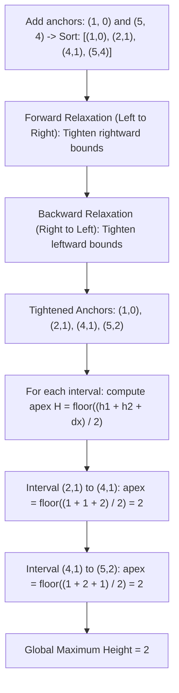

# Guided Example: Maximum Building Height

We trace the step-by-step calculation of maximum building heights via Lipschitz-1 continuity, bidirectional constraint tightening, and triangular apex optimization on a representative problem instance:

- **Input:** `n = 5, restrictions = [[2, 1], [4, 1]]`
- **Required Output:** `2`

This instance demonstrates how height difference constraints ($|h_{i} - h_{i-1}| \le 1$) impose 1-Lipschitz continuity across the city, showing how forward and backward constraint relaxation followed by closed-form peak calculation solves the problem in $\mathcal{O}(M \log M)$ time even when $n = 10^9$.

---

## 1. Instance & Teaching Goal

We plan to build $n$ buildings in a line, indexed from $1$ to $n$.
Rules:
1. $h_1 = 0$ (the first building must have height 0).
2. $h_i \ge 0$ (all heights are non-negative).
3. $|h_i - h_{i-1}| \le 1$ for all $2 \le i \le n$ (adjacent heights cannot differ by more than 1).
4. For specific buildings, height cannot exceed a given ceiling: $h_{\text{id}} \le \text{maxHeight}$.

We want to find the maximum possible height of any building.

In our instance:
- $n = 5$ buildings.
- Restrictions:
  - Building $2$: height $\le 1$
  - Building $4$: height $\le 1$
- Implicit restrictions:
  - Building $1$: height $= 0$
  - Building $5$: no explicit cap, but cannot exceed $0 + (5 - 1) = 4$.
- Feasible height sequence:
  $$h = [0, 1, 2, 1, 2]$$
  - Differences: $|1 - 0| = 1$, $|2 - 1| = 1$, $|1 - 2| = 1$, $|2 - 1| = 1$. All valid!
  - Restrictions: $h_2 = 1 \le 1$, $h_4 = 1 \le 1$. Valid!
- Tallest building: height **`2`** (achieved at building $3$ and building $5$).

The teaching goal is to recognize that because $n$ can be as large as $10^9$, we cannot simulate building heights one by one. Instead, we only track the restricted building anchors, tighten their bounds via a bidirectional relaxation pass, and use the closed-form triangular peak formula between adjacent anchors.

---

## 2. Conceptual Foundation & Invariants

### Lipschitz Continuity & Constraint Propagation

The condition $|h_i - h_{i-1}| \le 1$ means the height function is 1-Lipschitz continuous:
$$|h_x - h_y| \le |x - y|$$

For any two restricted anchors $(x_1, c_1)$ and $(x_2, c_2)$ with $x_1 < x_2$:
- To be reachable from $x_1$, $h_{x_2} \le c_1 + (x_2 - x_1)$.
- To be reachable from $x_2$, $h_{x_1} \le c_2 + (x_2 - x_1)$.

If an anchor's restriction is too loose relative to a neighboring anchor, it must be tightened to the maximum reachable height.

### Lipschitz-1 Continuity & Bidirectional Constraint Relaxation Theorem

> **Lipschitz-1 Continuity & Bidirectional Relaxation Theorem.**
> Let anchors be sorted by coordinate: $(x_0, h_0), (x_1, h_1), \dots, (x_{m-1}, h_{m-1})$ with $x_0 = 1, h_0 = 0$, and $x_{m-1} = n$.
> 1. **Forward Relaxation (Left-to-Right):** For $i = 1, \dots, m - 1$:
>    $$h_i \gets \min(h_i, \, h_{i-1} + (x_i - x_{i-1}))$$
> 2. **Backward Relaxation (Right-to-Left):** For $i = m - 2, \dots, 0$:
>    $$h_i \gets \min(h_i, \, h_{i+1} + (x_{i+1} - x_i))$$
> 3. **Triangular Apex Formula:** Between any two tightened anchors $(x_i, h_i)$ and $(x_{i+1}, h_{i+1})$, the buildings in between can rise from $x_i$ with slope $+1$ and fall toward $x_{i+1}$ with slope $-1$. The maximum height reached at the apex between them is:
>    $$H_{\max}(i) = \left\lfloor \frac{h_i + h_{i+1} + (x_{i+1} - x_i)}{2} \right\rfloor$$
> The global maximum building height is $\max_{0 \le i < m - 1} H_{\max}(i)$, evaluable in $\mathcal{O}(M \log M)$ time.

---

## 3. Step-by-Step Worked Execution

We trace $n = 5$ with `restrictions = [[2, 1], [4, 1]]`.

---

### Step 1: Add Canonical Endpoints and Sort
- Anchor at building $1$: must have height $0 \implies (1, 0)$.
- Anchor at building $n = 5$: unconstrained, so assign theoretical upper bound $5 - 1 = 4 \implies (5, 4)$.
- Complete list of anchors:
  $$R = [(1, 0), (2, 1), (4, 1), (5, 4)]$$
- Number of anchors: $m = 4$.

---

### Step 2: Forward Relaxation Pass (Left-to-Right)
For $i = 1$ to $3$, update $h_i \gets \min(h_i, h_{i-1} + (x_i - x_{i-1}))$:
- $i = 1$ (Building $2$):
  $$h_1 = \min(1, \, 0 + (2 - 1)) = \min(1, 1) = 1$$
- $i = 2$ (Building $4$):
  $$h_2 = \min(1, \, 1 + (4 - 2)) = \min(1, 3) = 1$$
- $i = 3$ (Building $5$):
  $$h_3 = \min(4, \, 1 + (5 - 4)) = \min(4, 2) = 2$$
  *(Note: Building $5$'s bound tightens from $4 \to 2$ because it is adjacent to building $4$ capped at $1$)*

Anchors after forward pass: `[(1, 0), (2, 1), (4, 1), (5, 2)]`.

---

### Step 3: Backward Relaxation Pass (Right-to-Left)
For $i = 2$ down to $1$, update $h_i \gets \min(h_i, h_{i+1} + (x_{i+1} - x_i))$:
- $i = 2$ (Building $4$):
  $$h_2 = \min(1, \, 2 + (5 - 4)) = \min(1, 3) = 1$$
- $i = 1$ (Building $2$):
  $$h_1 = \min(1, \, 1 + (4 - 2)) = \min(1, 3) = 1$$

All anchor bounds are mutually tightened:
$$R = [(1, 0), (2, 1), (4, 1), (5, 2)]$$

---

### Step 4: Compute Apex for Each Interval

Initialize $\text{ans} = 0$.

1. **Interval $0$: between $(1, 0)$ and $(2, 1)$:**
   $$\Delta x = 2 - 1 = 1$$
   $$H = \left\lfloor \frac{0 + 1 + 1}{2} \right\rfloor = \left\lfloor \frac{2}{2} \right\rfloor = 1$$
   Update: $\text{ans} = \max(0, 1) = 1$.

2. **Interval $1$: between $(2, 1)$ and $(4, 1)$:**
   $$\Delta x = 4 - 2 = 2$$
   $$H = \left\lfloor \frac{1 + 1 + 2}{2} \right\rfloor = \left\lfloor \frac{4}{2} \right\rfloor = 2$$
   *(Corresponds to building $3$ with height $2$)*
   Update: $\text{ans} = \max(1, 2) = 2$.

3. **Interval $2$: between $(4, 1)$ and $(5, 2)$:**
   $$\Delta x = 5 - 4 = 1$$
   $$H = \left\lfloor \frac{1 + 2 + 1}{2} \right\rfloor = \left\lfloor \frac{4}{2} \right\rfloor = 2$$
   *(Corresponds to building $5$ with height $2$)*
   Update: $\text{ans} = \max(2, 2) = 2$.

---

### Step 5: Final Result Extraction
$$\text{Max Height} = 2$$

Final output: **`2`**.

---

## 4. Complete Execution Trace

| Interval | Left Anchor $(x_1, h_1)$ | Right Anchor $(x_2, h_2)$ | Distance $\Delta x$ | Peak Formula $\lfloor (h_1 + h_2 + \Delta x) / 2 \rfloor$ | Interval Max Height | Running Global Max |
|:---:|:---:|:---:|:---:|:---:|:---:|:---:|
| $0$ | $(1, 0)$ | $(2, 1)$ | $1$ | $\lfloor (0 + 1 + 1) / 2 \rfloor = 1$ | $1$ | $1$ |
| $1$ | $(2, 1)$ | $(4, 1)$ | $2$ | $\lfloor (1 + 1 + 2) / 2 \rfloor = 2$ | **$2$** (at $x = 3$) | **$2$** |
| $2$ | $(4, 1)$ | $(5, 2)$ | $1$ | $\lfloor (1 + 2 + 1) / 2 \rfloor = 2$ | **$2$** (at $x = 5$) | **`2`** |

Height sequence: `[0, 1, 2, 1, 2]`. Maximum height: **`2`**.

---

## 5. Algorithmic Correctness

**Soundness.** Forward and backward passes enforce that the slope between adjacent anchors never exceeds $1$, ensuring that tightened anchor heights are mutually compatible. In any interval between $(x_1, h_1)$ and $(x_2, h_2)$, the upper envelope formed by rising with slope $+1$ from $x_1$ and descending with slope $-1$ into $x_2$ meets at height $\frac{h_1 + h_2 + \Delta x}{2}$, which is achievable with integer coordinates via floor division.

**Completeness.** Since building heights are bounded by the lower envelope of cones originating from all restrictions, the tightened anchors represent the exact tightest bounds at those locations. The maximum height of any building within the interval $[x_i, x_{i+1}]$ is bounded by the apex of the two endpoint cones. Thus, testing all intervals explores the global maximum height over the entire city.

---

## 6. Traps This Instance Exposes

- **Simulating $n$ Elements:** When $n = 10^9$, allocating an array of size $n$ or iterating $1$ to $n$ crashes with memory or time limit exceeded. Only the $\le 10^5$ restricted anchors need to be processed.
- **Unidirectional Relaxation:** A forward pass alone only propagates constraints from left to right. If a building on the right has a low ceiling (e.g. $(10, 0)$), a backward pass is strictly required to lower preceding buildings.
- **Missing Rightmost Boundary:** If building $n$ has no explicit restriction, an implicit anchor $(n, n - 1)$ must be added to permit buildings to rise past the last restricted building.

---

## 7. Complexity Derivation

- **Time Complexity:** $\mathcal{O}(M \log M)$, where $M$ is the number of restrictions. Sorting the $M + 2$ anchors takes $\mathcal{O}(M \log M)$ time. The forward pass, backward pass, and interval apex scan all run in linear $\mathcal{O}(M)$ time. Total runtime is $\mathcal{O}(M \log M)$, independent of $n$.
- **Auxiliary Space Complexity:** $\mathcal{O}(M)$ to store the augmented array of anchor pairs.
