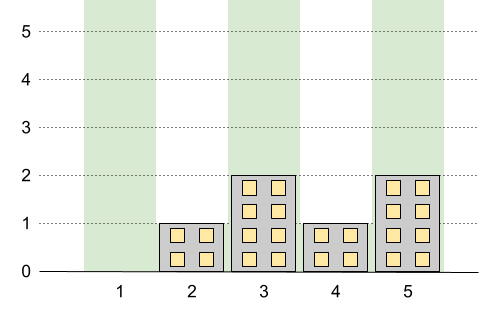
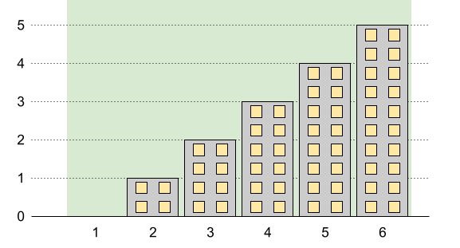
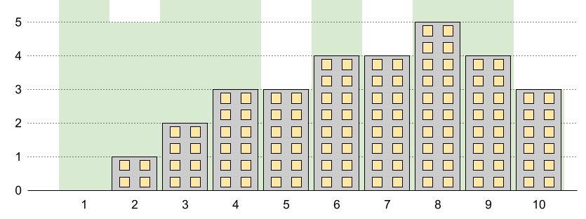

### 1. Description

You want to build `n` new buildings in a city. The new buildings will be built in a line and are labeled from `1` to `n`.

However, there are city restrictions on the heights of the new buildings:

- The height of each building must be a non-negative integer.

- The height of the first building **must** be `0`.

- The height difference between any two adjacent buildings **cannot exceed** `1`.

Additionally, there are city restrictions on the maximum height of specific buildings. These restrictions are given as a 2D integer array `restrictions` where $\text{restrictions}[i] = [\text{id}_{i}, \text{maxHeight}_{i}]$ indicates that building $\text{id}_{i}$ must have a height **less than or equal to** $\text{maxHeight}_{i}$.

It is guaranteed that each building will appear **at most once** in `restrictions`, and building `1` will **not** be in `restrictions`.

Return *the **maximum possible height** of the **tallest** building*.

### 2. Function Contract

- `n`: Input parameter.
- Returns expected result.

### 3. Examples

#### Example 1

- **Input:** $n = 5, restrictions = [[2,1],[4,1]]$
- **Output:** `2`
- **Explanation:** The green area in the image indicates the maximum allowed height for each building.
We can build the buildings with heights [0,1,2,1,2], and the tallest building has a height of 2.
#### Example 2

- **Input:** $n = 6, restrictions = []$
- **Output:** `5`
- **Explanation:** The green area in the image indicates the maximum allowed height for each building.
We can build the buildings with heights [0,1,2,3,4,5], and the tallest building has a height of 5.
#### Example 3

- **Input:** $n = 10, restrictions = [[5,3],[2,5],[7,4],[10,3]]$
- **Output:** `5`
- **Explanation:** The green area in the image indicates the maximum allowed height for each building.
We can build the buildings with heights [0,1,2,3,3,4,4,5,4,3], and the tallest building has a height of 5.

### 4. Constraints

- $2 \le n \le 10^{9}$

- $0 \le \text{restrictions.length} \le min(n - 1, 10^{5})$

- $2 \le \text{id}_{i} \le n$

- $\text{id}_{i}$ is **unique**.

- $0 \le \text{maxHeight}_{i} \le 10^{9}$