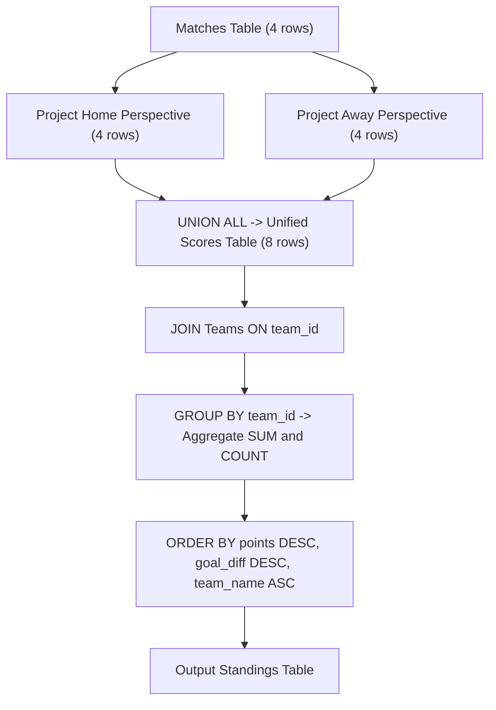

# Guided Example: League Statistics

We trace the step-by-step unpivoting, symmetrical score aggregation, and multi-key ranking for football league standings on a representative database instance:

- **Input:** `Teams` table and `Matches` table recording match results between home and away clubs.
- **Required Output:** Full league table sorted by total points (descending), goal difference (descending), and team name (ascending).

This instance demonstrates bilateral match projection (`UNION ALL`), conditional win/loss/draw scoring, and composite aggregate grouping.

---

## 1. Instance & Teaching Goal

We are given two database tables:
1. `Teams`: containing `team_id` (unique integer) and `team_name` (varchar).
2. `Matches`: containing `home_team_id`, `away_team_id`, `home_team_goals`, and `away_team_goals`.
Scoring rules:
- Win (more goals than opponent): **3 points**.
- Draw (equal goals): **1 point**.
- Loss (fewer goals than opponent): **0 points**.

We must compute the following for each team that played at least one match:
- `team_name`
- `matches_played`
- `points`
- `goal_for` (total goals scored)
- `goal_against` (total goals conceded)
- `goal_diff` (`goal_for - goal_against`)

Order by `points` DESC, then `goal_diff` DESC, then `team_name` ASC.

Consider the representative dataset:

**`Teams` Table:**
| `team_id` | `team_name` |
|:---:|:---|
| $1$ | Ajax |
| $4$ | Dortmund |
| $6$ | Arsenal |

**`Matches` Table:**
| `home_team_id` | `away_team_id` | `home_team_goals` | `away_team_goals` |
|:---:|:---:|:---:|:---:|
| $1$ | $4$ | $0$ | $1$ |
| $1$ | $6$ | $3$ | $3$ |
| $4$ | $1$ | $5$ | $2$ |
| $6$ | $1$ | $0$ | $0$ |

Analysis:
- **Dortmund (ID 4):**
  - Away at Ajax (1): won $1 - 0 \implies 3$ points, $1$ goal for, $0$ conceded.
  - Home vs Ajax (1): won $5 - 2 \implies 3$ points, $5$ goals for, $2$ conceded.
  - Total: $2$ matches, $6$ points, $6$ goals for, $2$ against, diff $+4$.
- **Arsenal (ID 6):**
  - Away at Ajax (1): drew $3 - 3 \implies 1$ point, $3$ goals for, $3$ conceded.
  - Home vs Ajax (1): drew $0 - 0 \implies 1$ point, $0$ goals for, $0$ conceded.
  - Total: $2$ matches, $2$ points, $3$ goals for, $3$ against, diff $0$.
- **Ajax (ID 1):**
  - Played 4 matches: $0$ wins, $2$ draws, $2$ losses $\implies 2$ points, $5$ goals for, $9$ against, diff $-4$.
- Ranking: Dortmund ($6$ pts) $\to$ Arsenal ($2$ pts, diff $0$) $\to$ Ajax ($2$ pts, diff $-4$).

The teaching goal is to unpivot each row of `Matches` into two distinct perspective rows (one for home, one for away) via `UNION ALL`. Grouping the unified perspective table by `team_id` allows standard SQL aggregation functions (`COUNT`, `SUM`) to accumulate points and goals cleanly.

---

## 2. Conceptual Foundation & Invariants

### Bilateral Unpivoting

Each match involves two teams simultaneously.
To treat every team uniformly regardless of home/away venue, each record in `Matches` is projected into two symmetric tuples:
1. **Home perspective:**
   $$(\text{team\_id} = \text{home\_team\_id}, \, g_{\text{for}} = \text{home\_team\_goals}, \, g_{\text{against}} = \text{away\_team\_goals})$$
   $$\text{points} = \begin{cases} 3 & \text{if } g_{\text{for}} > g_{\text{against}} \\ 1 & \text{if } g_{\text{for}} = g_{\text{against}} \\ 0 & \text{if } g_{\text{for}} < g_{\text{against}} \end{cases}$$
2. **Away perspective:**
   $$(\text{team\_id} = \text{away\_team\_id}, \, g_{\text{for}} = \text{away\_team\_goals}, \, g_{\text{against}} = \text{home\_team\_goals})$$
   $$\text{points} = \begin{cases} 3 & \text{if } g_{\text{for}} > g_{\text{against}} \\ 1 & \text{if } g_{\text{for}} = g_{\text{against}} \\ 0 & \text{if } g_{\text{for}} < g_{\text{against}} \end{cases}$$

### Relational Match Unpivoting Invariant Theorem

> **Relational Match Unpivoting Invariant Theorem.**
> Let $M$ be the set of match records.
> 1. *Partition Conservation:* The disjoint union $S = \pi_{\text{home}}(M) \cup_{\text{ALL}} \pi_{\text{away}}(M)$ contains exactly $2 |M|$ tuples, with each team's appearance recorded as an independent performance tuple.
> 2. *Aggregate Additivity:* For each team $u$, the aggregate statistics satisfy:
>    $$\text{matches\_played}(u) = \sum_{t \in S, t.\text{team\_id} = u} 1$$
>    $$\text{points}(u) = \sum_{t \in S, t.\text{team\_id} = u} t.\text{score}$$
>    $$\text{goal\_diff}(u) = \sum_{t \in S, t.\text{team\_id} = u} t.g_{\text{for}} - \sum_{t \in S, t.\text{team\_id} = u} t.g_{\text{against}}$$
> 3. Joining $S$ with `Teams` on `team_id` and sorting the aggregated groups by $(\text{points} \downarrow, \text{goal\_diff} \downarrow, \text{team\_name} \uparrow)$ produces the canonical standings table in $\mathcal{O}(|M| + |T| \log |T|)$ time.

---

## 3. Step-by-Step Worked Execution

We trace the relational transformations across the sample dataset:

---

### Step 1: Generate Home Perspective Tuples
From `Matches`:
- Match 1 ($1$ vs $4$, $0-1$): Team $1$, $g_f = 0, g_a = 1 \implies \text{score} = 0$.
- Match 2 ($1$ vs $6$, $3-3$): Team $1$, $g_f = 3, g_a = 3 \implies \text{score} = 1$.
- Match 3 ($4$ vs $1$, $5-2$): Team $4$, $g_f = 5, g_a = 2 \implies \text{score} = 3$.
- Match 4 ($6$ vs $1$, $0-0$): Team $6$, $g_f = 0, g_a = 0 \implies \text{score} = 1$.

---

### Step 2: Generate Away Perspective Tuples
From `Matches`:
- Match 1 ($1$ vs $4$, $0-1$): Team $4$, $g_f = 1, g_a = 0 \implies \text{score} = 3$.
- Match 2 ($1$ vs $6$, $3-3$): Team $6$, $g_f = 3, g_a = 3 \implies \text{score} = 1$.
- Match 3 ($4$ vs $1$, $5-2$): Team $1$, $g_f = 2, g_a = 5 \implies \text{score} = 0$.
- Match 4 ($6$ vs $1$, $0-0$): Team $1$, $g_f = 0, g_a = 0 \implies \text{score} = 1$.

---

### Step 3: Combine with `UNION ALL`
Unified 8-row table of performances:

| `team_id` | `goals_for` | `goals_against` | `score` |
|:---:|:---:|:---:|:---:|
| $1$ | $0$ | $1$ | $0$ |
| $1$ | $3$ | $3$ | $1$ |
| $4$ | $5$ | $2$ | $3$ |
| $6$ | $0$ | $0$ | $1$ |
| $4$ | $1$ | $0$ | $3$ |
| $6$ | $3$ | $3$ | $1$ |
| $1$ | $2$ | $5$ | $0$ |
| $1$ | $0$ | $0$ | $1$ |

---

### Step 4: Group by `team_id` and Compute Aggregates

1. **Team $4$ (Dortmund):**
   - Matches played: $2$
   - Points: $3 + 3 = 6$
   - Goal for: $5 + 1 = 6$
   - Goal against: $2 + 0 = 2$
   - Goal diff: $6 - 2 = 4$

2. **Team $6$ (Arsenal):**
   - Matches played: $2$
   - Points: $1 + 1 = 2$
   - Goal for: $0 + 3 = 3$
   - Goal against: $0 + 3 = 3$
   - Goal diff: $3 - 3 = 0$

3. **Team $1$ (Ajax):**
   - Matches played: $4$
   - Points: $0 + 1 + 0 + 1 = 2$
   - Goal for: $0 + 3 + 2 + 0 = 5$
   - Goal against: $1 + 3 + 5 + 0 = 9$
   - Goal diff: $5 - 9 = -4$

---

### Step 5: Sort According to League Rules

- Compare `points`: Dortmund ($6$) > Arsenal ($2$) == Ajax ($2$).
- Tie-break for Arsenal and Ajax:
  - Compare `goal_diff`: Arsenal ($0$) > Ajax ($-4$).
- Standings order: Dortmund $\to$ Arsenal $\to$ Ajax.

---

## 4. Complete Execution Trace

| Standings Rank | `team_name` | `matches_played` | `points` | `goal_for` | `goal_against` | `goal_diff` |
|:---:|:---|:---:|:---:|:---:|:---:|:---:|
| **1** | **Dortmund** | $2$ | **$6$** | $6$ | $2$ | **$4$** |
| **2** | **Arsenal** | $2$ | **$2$** | $3$ | $3$ | **$0$** |
| **3** | **Ajax** | $4$ | **$2$** | $5$ | $9$ | **$-4$** |

---

## 5. Algorithmic Correctness

**Soundness.** Unpivoting home and away perspectives preserves every match fact symmetrically. Win, draw, and loss points match FIFA regulations ($3, 1, 0$). Goal difference is computed exactly as $\sum g_{\text{for}} - \sum g_{\text{against}}$.

**Completeness.** Every match in `Matches` generates exactly two rows in the unpivoted table, one for each participating team. Teams that played zero matches do not appear in `Matches` and are correctly omitted from league standings.

---

## 6. Traps This Instance Exposes

- **Using `UNION` Instead of `UNION ALL`:** `UNION` strips duplicate rows. If a team has two identical match results (e.g. two $0-0$ draws yielding identical tuples), `UNION` would discard one match, undercounting `matches_played`. `UNION ALL` is strictly required.
- **Tie-Breaking Precedence:** Sorting must prioritize `points DESC`, then `goal_diff DESC`, then `team_name ASC`. Alphabetical order only breaks ties when both points and goal differences are identical.
- **Separate Home and Away Columns:** Attempting to join without unpivoting leads to awkward double-joins and outer joins; `UNION ALL` unifies the data model into a single dimension.

---

## 7. Complexity Derivation

- **Time Complexity:** $\mathcal{O}(M + T \log T)$, where $M$ is the number of rows in `Matches` and $T$ is the number of distinct teams. Unpivoting scans $M$ rows twice. Hash aggregation runs in $\mathcal{O}(M)$ time, and the final sorting of the $T$ teams takes $\mathcal{O}(T \log T)$ time.
- **Auxiliary Space Complexity:** $\mathcal{O}(M + T)$ to hold the unpivoted intermediate view and aggregate result set.
