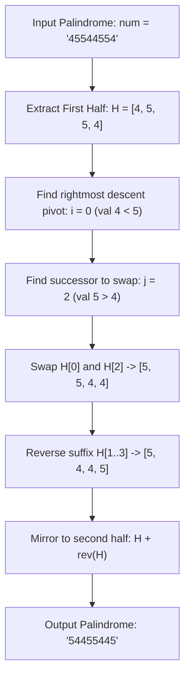

# Guided Example: Next Palindrome Using Same Digits

We trace the step-by-step determination of the next larger palindrome via half-string lexicographical permutation and symmetric mirroring on a representative problem instance:

- **Input:** `num = "45544554"`
- **Required Output:** `"54455445"`

This instance demonstrates how palindrome symmetry constrains digit rearrangements to the first half of the string, reducing the problem to finding the immediate next lexicographical permutation of the prefix and mirroring it across the center.

---

## 1. Instance & Teaching Goal

We are given a numeric string `num` representing a palindrome.
We must return the smallest palindrome strictly larger than `num` that can be created by rearranging its digits. If no such palindrome exists, return the empty string `""`.

In our instance:
- `num = "45544554"` of length $n = 8$.
- It is an even-length palindrome.
- The first half of the digits is $H = \text{"4554"}$ (length $m = 4$).
- The second half is the mirror reflection $\text{rev}(H) = \text{"4554"}$.
- To make the entire palindrome as small as possible while still being strictly larger than `num`, the first half must be increased by the smallest possible amount.
- The smallest string strictly larger than `"4554"` using the same digits is its immediate lexicographical successor: `"5445"`.
- Mirroring `"5445"` produces `"54455445"`.
- Output: `"54455445"`.

The teaching goal is to recognize the order-preserving bijection between a palindrome and its first half: $S_1 <_{\text{lex}} S_2 \iff H_1 <_{\text{lex}} H_2$. The next larger palindrome is found by running the classic `next_permutation` algorithm on the first half $H$ and reflecting the result.

---

## 2. Conceptual Foundation & Invariants

### Half-String Palindrome Isomorphism

Let $S$ be a palindrome of length $n$.
Let $m = \lfloor n / 2 \rfloor$.
The palindrome is uniquely partitioned as:
$$S = H \mathbin{\Vert} M \mathbin{\Vert} \text{rev}(H)$$
where:
- $H = S[0 \dots m - 1]$ is the first half.
- $M = S[m]$ if $n$ is odd, and empty if $n$ is even.
- $\text{rev}(H)$ is the reversed reflection of $H$.

Because any rearranged string must remain a palindrome, the multiset of characters in the first half must remain identical.
Furthermore, the lexicographical comparison between two palindromes of equal length is decided entirely by the first character where their first halves differ:
$$S_1 <_{\text{lex}} S_2 \iff H_1 <_{\text{lex}} H_2$$

### Half-String Palindrome Isomorphism Invariant Theorem

> **Half-String Palindrome Isomorphism & Lexicographical Permutation Theorem.**
> 1. *Order Isomorphism:* The map $H \mapsto H \mathbin{\Vert} M \mathbin{\Vert} \text{rev}(H)$ is a strictly order-preserving bijection from the permutations of $H$ to the palindromic permutations of $S$.
> 2. *Minimal Successor:* The minimal palindrome strictly larger than $S$ corresponds uniquely to $\text{next\_permutation}(H)$, the immediate lexicographical successor of $H$.
> 3. *Non-Existence Condition:* If $H$ is sorted in non-increasing order (e.g. `"54321"`), no strictly larger permutation exists. In this case, no larger palindrome can be formed, and the algorithm returns `""`.
> 4. Finding the pivot, swapping with the successor, reversing the suffix of $H$, and reflecting across the midpoint computes the next palindrome in $\mathcal{O}(n)$ time and $\mathcal{O}(n)$ space.

---

## 3. Step-by-Step Worked Execution

We trace `num = "45544554"`.
Total length $n = 8$. Half length $m = \lfloor 8 / 2 \rfloor = 4$.
Extract the first half:
$$H = [\text{'4'}, \text{'5'}, \text{'5'}, \text{'4'}]$$

---

### Step 1: Find the Rightmost Pivot Index $i$
Scan $H$ from right to left ($m - 2$ down to $0$) to find the first index $i$ where $H[i] < H[i + 1]$:
- $i = 2$: $H[2] = \text{'5'}, H[3] = \text{'4'} \implies 5 \ge 4$. Continue.
- $i = 1$: $H[1] = \text{'5'}, H[2] = \text{'5'} \implies 5 \ge 5$. Continue.
- $i = 0$: $H[0] = \text{'4'}, H[1] = \text{'5'} \implies 4 < 5$. **Descent found!**

Pivot index: $i = 0$ (value `'4'`).

---

### Step 2: Find the Smallest Successor Greater Than $H[i]$
Scan $H$ from right to left ($m - 1$ down to $0$) to find the first index $j$ where $H[j] > H[i] = \text{'4'}$:
- $j = 3$: $H[3] = \text{'4'} \ngtr \text{'4'}$.
- $j = 2$: $H[2] = \text{'5'} > \text{'4'}$. **Successor found!**

Successor index: $j = 2$ (value `'5'`).

---

### Step 3: Swap Pivot and Successor
Swap $H[0]$ and $H[2]$:
$$H[0] = \text{'5'}, \quad H[2] = \text{'4'}$$
Array state after swap:
$$H = [\text{'5'}, \text{'5'}, \text{'4'}, \text{'4'}]$$

---

### Step 4: Reverse the Suffix $H[i + 1 \dots m - 1]$
The suffix after index $0$ is $H[1 \dots 3] = [\text{'5'}, \text{'4'}, \text{'4'}]$.
Reverse this suffix:
$$[\text{'5'}, \text{'4'}, \text{'4'}] \to [\text{'4'}, \text{'4'}, \text{'5'}]$$
Updated first half:
$$H = [\text{'5'}, \text{'4'}, \text{'4'}, \text{'5'}]$$

---

### Step 5: Mirror First Half to Form Full Palindrome
Reflect $H$ to fill indices $n - 1 - k$ for $k \in [0, 3]$:
- $k = 0$: $\text{digits}[7] = H[0] = \text{'5'}$
- $k = 1$: $\text{digits}[6] = H[1] = \text{'4'}$
- $k = 2$: $\text{digits}[5] = H[2] = \text{'4'}$
- $k = 3$: $\text{digits}[4] = H[3] = \text{'5'}$

Full string:
$$\text{"54455445"}$$

Result: **`"54455445"`**.

---

## 4. Complete Execution Trace

| Phase | Target Slice | Array Contents | Action Performed | Resulting State |
|:---:|:---:|:---:|:---|:---:|
| Init | Full String | `"45544554"` | Extract first half of length 4 | $H = [4, 5, 5, 4]$ |
| Step 1 | Scan from right | $H[2]=5, H[1]=5, H[0]=4$ | Identify rightmost descent at $i = 0$ | Pivot $H[0] = 4$ |
| Step 2 | Scan from right | $H[3]=4, H[2]=5$ | Find rightmost element $> 4$ | Successor $H[2] = 5$ |
| Step 3 | Slices at $0, 2$ | $H[0] \leftrightarrow H[2]$ | Swap pivot and successor | $H = [5, 5, 4, 4]$ |
| Step 4 | Suffix $H[1 \dots 3]$ | $[5, 4, 4]$ | Reverse suffix to minimize magnitude | $H = [5, 4, 4, 5]$ |
| Step 5 | Full String | Mirror $H$ | $S[7-k] = H[k]$ | **`"54455445"`** |

---

## 5. Algorithmic Correctness

**Soundness.** Swapping the pivot with the smallest strictly larger element to its right and reversing the remaining suffix is the proven `next_permutation` algorithm. Mirroring this minimal successor generates a valid palindrome that uses the identical digit multiset and is strictly larger than the input.

**Completeness.** Since the second half of any palindrome is strictly determined by its first half, any valid larger palindrome must have a first half that is a larger permutation of $H$. Because `next_permutation` produces the immediate successor in lexicographical order, no smaller valid palindrome can exist between `num` and the output.

---

## 6. Traps This Instance Exposes

- **Odd-Length Palindromes:** When $n$ is odd (e.g. $n = 5$ with center at index $2$), the center element remains fixed at index $\lfloor n / 2 \rfloor$. Only the first $\lfloor n / 2 \rfloor$ elements participate in `next_permutation`.
- **Operating on the Entire String:** Running `next_permutation` on the full palindrome corrupts symmetry, yielding a non-palindromic string.
- **Descending First Half:** If the first half is in non-increasing order (e.g. `"32123"` where $H = \text{"32"}$), $i < 0$ and no next permutation exists. The algorithm must return `""`.

---

## 7. Complexity Derivation

- **Time Complexity:** $\mathcal{O}(n)$, where $n$ is the length of `num`. Finding the pivot, swapping, reversing the suffix of length $n / 2$, and mirroring back to the second half each take $\mathcal{O}(n)$ time.
- **Auxiliary Space Complexity:** $\mathcal{O}(n)$ to store the character array during in-place permutation and reconstruction.
