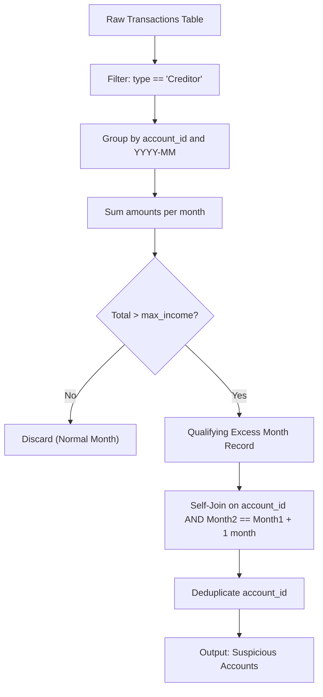

# Guided Example: Suspicious Bank Accounts

We trace the step-by-step detection of suspicious bank accounts by aggregating monthly creditor inflows, applying strict threshold filtering, and identifying consecutive monthly violations:

- **Input:**
  - `Accounts` table:
    - Account `3`: `max_income = 21000`
    - Account `4`: `max_income = 10400`
  - `Transactions` table:
    - Transaction `2`: Account `3`, Creditor, `107100`, `2021-06-02 11:38:14`
    - Transaction `4`: Account `4`, Creditor, `10400`, `2021-06-20 12:39:18`
    - Transaction `11`: Account `4`, Debtor, `58800`, `2021-07-23 12:41:55`
    - Transaction `1`: Account `4`, Creditor, `49300`, `2021-05-03 16:11:04`
    - Transaction `15`: Account `3`, Debtor, `75500`, `2021-05-23 14:40:20`
    - Transaction `10`: Account `3`, Creditor, `102100`, `2021-06-15 10:37:16`
    - Transaction `14`: Account `4`, Creditor, `56300`, `2021-07-21 12:12:25`
    - Transaction `19`: Account `4`, Debtor, `101100`, `2021-05-09 15:21:49`
    - Transaction `8`: Account `3`, Creditor, `64900`, `2021-07-26 15:09:56`
    - Transaction `7`: Account `3`, Creditor, `90900`, `2021-06-14 11:23:07`
- **Required Output:**

| account_id |
|:---:|
| 3 |

This instance demonstrates row filtering (ignoring debtor rows), multi-transaction monthly aggregation, strict inequality threshold evaluation, and the crucial distinction between consecutive calendar months and non-consecutive violation months.

---

## 1. Instance & Teaching Goal

We are given two relational entities: `Accounts` with pre-assigned monthly income caps, and `Transactions` containing timestamped incoming and outgoing payments.
An account is flagged as suspicious if and only if its total incoming creditor transactions strictly exceed its assigned `max_income` for at least two consecutive calendar months.

In our instance:
- **Account 3** receives incoming creditor sums:
  - May 2021: only a debtor withdrawal of 75,500; incoming creditor total = 0.
  - June 2021: three deposits ($107100 + 102100 + 90900 = 300100$). Since $300100 > 21000$, June is a violation month.
  - July 2021: one deposit ($64900$). Since $64900 > 21000$, July is a violation month.
  - Months June 2021 and July 2021 are consecutive calendar months ($m_2 - m_1 = 1\text{ month}$). Thus, Account 3 is suspicious.
- **Account 4** receives incoming creditor sums:
  - May 2021: deposit of 49,300. Since $49300 > 10400$, May is a violation month.
  - June 2021: deposit of 10,400. Since $10400 \ngtr 10400$ (the threshold check requires strict inequality), June is **not** a violation month.
  - July 2021: deposit of 56,300. Since $56300 > 10400$, July is a violation month.
  - Although Account 4 has two violation months (May and July), they are separated by a one-month gap (June). Because they are not consecutive calendar months, Account 4 is excluded.

The teaching goal is to master three sequential relational operations:
1. Filtering by transaction classification (`type = 'Creditor'`).
2. Monthly group aggregation with having-clause pruning against joined account thresholds.
3. Temporal self-join or window lag evaluation asserting exact 1-month difference between successive violation months.

---

## 2. Conceptual Foundation & Invariants

### Monthly Inflow Threshold & Consecutive Temporal Window Invariant Theorem

> **Monthly Inflow Threshold & Consecutive Temporal Window Invariant Theorem.**
> 1. *Transaction Partitioning:* Debtor transactions represent capital outflows and must be partitioned out prior to aggregation. The effective monthly income for account $a$ in calendar month $m$ is:
>    $$\text{Income}(a, m) = \sum_{t \in T, t.a = a, t.m = m, t.\text{type} = \text{'Creditor'}} t.\text{amount}$$
> 2. *Strict Threshold Predicate:* A calendar month $m$ is an excess month for account $a$ if and only if $\text{Income}(a, m) > a.\text{max\_income}$. Equality $\text{Income}(a, m) = a.\text{max\_income}$ is insufficient.
> 3. *Consecutive Temporal Adjacency:* Two excess months $m_1$ and $m_2$ for the same account $a$ constitute a consecutive pair if and only if:
>    $$\text{DateAdd}(m_1, 1\text{ month}) = m_2$$
>    Temporal adjacency requires calendar continuity; an account with excess in months $k$ and $k+2$ lacks consecutive adjacency.

---

## 3. Step-by-Step Worked Execution

We process the dataset step by step through each relational transformation.

---

### Step 1: Filter to Creditor Deposits
We filter out debtor records:
- Discard Transaction `11` (Account `4`, Debtor, `58800`).
- Discard Transaction `15` (Account `3`, Debtor, `75500`).
- Discard Transaction `19` (Account `4`, Debtor, `101100`).

Retained Creditor transactions:
- Transaction `2`: Account `3`, Amount `107100`, Date `2021-06-02` $\to$ Month `2021-06`
- Transaction `4`: Account `4`, Amount `10400`, Date `2021-06-20` $\to$ Month `2021-06`
- Transaction `1`: Account `4`, Amount `49300`, Date `2021-05-03` $\to$ Month `2021-05`
- Transaction `10`: Account `3`, Amount `102100`, Date `2021-06-15` $\to$ Month `2021-06`
- Transaction `14`: Account `4`, Amount `56300`, Date `2021-07-21` $\to$ Month `2021-07`
- Transaction `8`: Account `3`, Amount `64900`, Date `2021-07-26` $\to$ Month `2021-07`
- Transaction `7`: Account `3`, Amount `90900`, Date `2021-06-14` $\to$ Month `2021-06`

---

### Step 2: Aggregate Inflow by Account and Calendar Month

We compute total incoming sums for each `(account_id, month)` pair and retrieve `max_income`:

1. **Account 3, Month `2021-06`:**
   - Inflow sum: $107100 + 102100 + 90900 = 300100$
   - Threshold `max_income`: $21000$
   - Comparison: $300100 > 21000 \implies$ **Qualifies as Excess Month**

2. **Account 3, Month `2021-07`:**
   - Inflow sum: $64900$
   - Threshold `max_income`: $21000$
   - Comparison: $64900 > 21000 \implies$ **Qualifies as Excess Month**

3. **Account 4, Month `2021-05`:**
   - Inflow sum: $49300$
   - Threshold `max_income`: $10400$
   - Comparison: $49300 > 10400 \implies$ **Qualifies as Excess Month**

4. **Account 4, Month `2021-06`:**
   - Inflow sum: $10400$
   - Threshold `max_income`: $10400$
   - Comparison: $10400 > 10400$ is **False** (equality is not strict excess) $\implies$ **Disqualified**

5. **Account 4, Month `2021-07`:**
   - Inflow sum: $56300$
   - Threshold `max_income`: $10400$
   - Comparison: $56300 > 10400 \implies$ **Qualifies as Excess Month**

---

### Step 3: Identify Consecutive Monthly Violations

The set of excess monthly records is:
- Record A: Account `3`, Month `2021-06-01`
- Record B: Account `3`, Month `2021-07-01`
- Record C: Account `4`, Month `2021-05-01`
- Record D: Account `4`, Month `2021-07-01`

We test for adjacent pairs where $\text{Month}_2 = \text{Month}_1 + 1\text{ month}$:
- For Account 3: Record A (`2021-06-01`) and Record B (`2021-07-01`).
  - Difference: $(2021-07-01) - (2021-06-01) = 1\text{ calendar month}$.
  - Condition satisfied! Account 3 is marked **Suspicious**.
- For Account 4: Record C (`2021-05-01`) and Record D (`2021-07-01`).
  - Difference: $(2021-07-01) - (2021-05-01) = 2\text{ calendar months} \neq 1\text{ month}$.
  - Condition fails! Account 4 has no consecutive excess months.

---

### Step 4: Final Selection & Projection

Distinct qualifying account identifiers:
$$\{3\}$$

Output relation:

| account_id |
|:---:|
| 3 |

---

## 4. Complete Execution Trace

| Account ID | Calendar Month | Creditor Amounts Summed | Total Monthly Inflow | Max Income Cap | Strict Excess? | Consecutive With Prior Excess Month? |
|:---:|:---:|:---:|:---:|:---:|:---:|:---:|
| 3 | 2021-06 | $107100 + 102100 + 90900$ | $300100$ | $21000$ | Yes ($300100 > 21000$) | No prior excess month |
| 3 | 2021-07 | $64900$ | $64900$ | $21000$ | Yes ($64900 > 21000$) | **Yes** (follows 2021-06 directly) $\implies$ **Flagged** |
| 4 | 2021-05 | $49300$ | $49300$ | $10400$ | Yes ($49300 > 10400$) | No prior excess month |
| 4 | 2021-06 | $10400$ | $10400$ | $10400$ | **No** ($10400 = 10400$) | Not an excess month |
| 4 | 2021-07 | $56300$ | $56300$ | $10400$ | Yes ($56300 > 10400$) | **No** (gap since 2021-05 is 2 months) |

---

## 5. Algorithmic Correctness

**Soundness.** Every account emitted has at least two records in the excess month set whose dates differ by precisely one calendar month. Because only creditor transactions are summed and debtor withdrawals are purged, non-income movements cannot inflate or deflate the total.

**Completeness.** Any account exceeding its monthly limit in consecutive months $m$ and $m+1$ will produce two rows in the aggregated excess table. The temporal join or window lag operation over the account partition is guaranteed to detect the consecutive step, ensuring zero false negatives.

---

## 6. Traps This Instance Exposes

- **Including Debtor Transactions:** Treating debtor rows as negative income or adding them to deposits alters the monthly sum, corrupting the threshold check.
- **Non-Strict Inequality:** If $\ge$ is used instead of $>$, Account 4 in June 2021 ($10400 = 10400$) would be incorrectly counted as an excess month, erroneously flagging Account 4 as suspicious.
- **Non-Consecutive Count Error:** Simply counting whether an account has $\ge 2$ excess months regardless of their temporal distance fails whenever there are gaps between violation months.
- **Year Boundary Gaps:** Moving between December and January (e.g. December 2021 to January 2022) must be treated as consecutive calendar months, requiring calendar arithmetic rather than naive subtraction of month numbers.

---

## 7. Complexity Derivation

- **Time Complexity:** $\mathcal{O}(R \log R)$, where $R$ is the number of transaction rows. Grouping by account and month and sorting for window or join comparisons takes $\mathcal{O}(R \log R)$ time.
- **Auxiliary Space Complexity:** $\mathcal{O}(M)$, where $M \le R$ is the number of distinct account-month aggregated pairs stored in intermediate memory.
