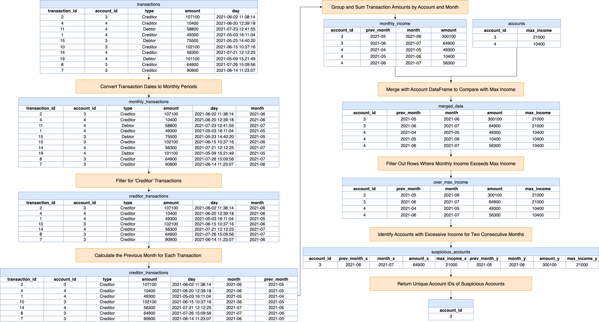

[TOC]

# Solution

---

## pandas

### Approach: Sequential Filtering and Aggregation

At a high level, this approach begins by organizing transaction data into a consistent monthly format, focusing specifically on income-related transactions. It then aggregates this data to calculate monthly incomes for each account and compares these figures against predefined income thresholds. Crucially, the method involves identifying patterns of consecutive months where income exceeds these thresholds, which is key to flagging potential financial irregularities. The final outcome is a concise list of accounts that display suspicious financial behavior over consecutive periods. This approach is characterized by its orderly progression through data transformation, aggregation, and pattern recognition.

**Visualization of Approach:**



#### Intuition

Let's review the intuition behind each step given the following input DataFrames:

Accounts DataFrame (`accounts`):

<table>
    <tr>
        <th>account_id</th>
        <th>max_income</th>
    </tr>
    <tr>
        <td>3</td>
        <td>21000</td>
    </tr>
    <tr>
        <td>4</td>
        <td>10400</td>
    </tr>
</table>
<br>

Transactions DataFrame (`transactions`):

<table>
    <tr>
        <th>transaction_id</th>
        <th>account_id</th>
        <th>type</th>
        <th>amount</th>
        <th>day</th>
    </tr>
    <tr>
        <td>2</td>
        <td>3</td>
        <td>Creditor</td>
        <td>107100</td>
        <td>2021-06-02 11:38:14</td>
    </tr>
    <tr>
        <td>4</td>
        <td>4</td>
        <td>Creditor</td>
        <td>10400</td>
        <td>2021-06-20 12:39:18</td>
    </tr>
    <tr>
        <td>11</td>
        <td>4</td>
        <td>Debtor</td>
        <td>58800</td>
        <td>2021-07-23 12:41:55</td>
    </tr>
    <tr>
        <td>1</td>
        <td>4</td>
        <td>Creditor</td>
        <td>49300</td>
        <td>2021-05-03 16:11:04</td>
    </tr>
    <tr>
        <td>15</td>
        <td>3</td>
        <td>Debtor</td>
        <td>75500</td>
        <td>2021-05-23 14:40:20</td>
    </tr>
    <tr>
        <td>10</td>
        <td>3</td>
        <td>Creditor</td>
        <td>102100</td>
        <td>2021-06-15 10:37:16</td>
    </tr>
    <tr>
        <td>14</td>
        <td>4</td>
        <td>Creditor</td>
        <td>56300</td>
        <td>2021-07-21 12:12:25</td>
    </tr>
    <tr>
        <td>19</td>
        <td>4</td>
        <td>Debtor</td>
        <td>101100</td>
        <td>2021-05-09 15:21:49</td>
    </tr>
    <tr>
        <td>8</td>
        <td>3</td>
        <td>Creditor</td>
        <td>64900</td>
        <td>2021-07-26 15:09:56</td>
    </tr>
    <tr>
        <td>7</td>
        <td>3</td>
        <td>Creditor</td>
        <td>90900</td>
        <td>2021-06-14 11:23:07</td>
    </tr>
</table>
<br>

1. **Convert Transaction Dates to Monthly Periods**:
- To analyze transactions on a monthly basis, we need to convert the transaction dates into a format representing just the year and month.
- The `transactions` DataFrame is modified to include a new column named `month`. This column represents the month of each transaction, formatted as a 'YYYY-MM' period, using $transactions["day"].dt.\text{to}_{period}("M")$.
    ```python
    monthly_transactions = transactions.assign(month=transactions["day"].dt.to_period("M"))
    ```

$\text{monthly}_{transactions}$:
<table>
  <tr>
    <th>transaction_id</th>
    <th>account_id</th>
    <th>type</th>
    <th>amount</th>
    <th>day</th>
    <th>month</th>
  </tr>
  <tr>
    <td>2</td>
    <td>3</td>
    <td>Creditor</td>
    <td>107100</td>
    <td>2021-06-02 11:38:14</td>
    <td>2021-06</td>
  </tr>
  <tr>
    <td>4</td>
    <td>4</td>
    <td>Creditor</td>
    <td>10400</td>
    <td>2021-06-20 12:39:18</td>
    <td>2021-06</td>
  </tr>
  <tr>
    <td>11</td>
    <td>4</td>
    <td>Debtor</td>
    <td>58800</td>
    <td>2021-07-23 12:41:55</td>
    <td>2021-07</td>
  </tr>
  <tr>
    <td>1</td>
    <td>4</td>
    <td>Creditor</td>
    <td>49300</td>
    <td>2021-05-03 16:11:04</td>
    <td>2021-05</td>
  </tr>
  <tr>
    <td>15</td>
    <td>3</td>
    <td>Debtor</td>
    <td>75500</td>
    <td>2021-05-23 14:40:20</td>
    <td>2021-05</td>
  </tr>
  <tr>
    <td>10</td>
    <td>3</td>
    <td>Creditor</td>
    <td>102100</td>
    <td>2021-06-15 10:37:16</td>
    <td>2021-06</td>
  </tr>
  <tr>
    <td>14</td>
    <td>4</td>
    <td>Creditor</td>
    <td>56300</td>
    <td>2021-07-21 12:12:25</td>
    <td>2021-07</td>
  </tr>
  <tr>
    <td>19</td>
    <td>4</td>
    <td>Debtor</td>
    <td>101100</td>
    <td>2021-05-09 15:21:49</td>
    <td>2021-05</td>
  </tr>
  <tr>
    <td>8</td>
    <td>3</td>
    <td>Creditor</td>
    <td>64900</td>
    <td>2021-07-26 15:09:56</td>
    <td>2021-07</td>
  </tr>
  <tr>
    <td>7</td>
    <td>3</td>
    <td>Creditor</td>
    <td>90900</td>
    <td>2021-06-14 11:23:07</td>
    <td>2021-06</td>
  </tr>
</table>
<br>

2. **Filter for 'Creditor' Transactions**:
- The problem statement focuses on income, which in a banking context means 'Creditor' transactions where money is deposited into accounts.
- The transactions are filtered to keep only those with the type 'Creditor', using $query("type = 'Creditor'")$.
    ```python
    creditor_transactions = monthly_transactions.query("type == 'Creditor'")
    ```

$\text{creditor}_{transactions}$:
<table>
  <tr>
    <th>transaction_id</th>
    <th>account_id</th>
    <th>type</th>
    <th>amount</th>
    <th>day</th>
    <th>month</th>
  </tr>
  <tr>
    <td>2</td>
    <td>3</td>
    <td>Creditor</td>
    <td>107100</td>
    <td>2021-06-02 11:38:14</td>
    <td>2021-06</td>
  </tr>
  <tr>
    <td>4</td>
    <td>4</td>
    <td>Creditor</td>
    <td>10400</td>
    <td>2021-06-20 12:39:18</td>
    <td>2021-06</td>
  </tr>
  <tr>
    <td>1</td>
    <td>4</td>
    <td>Creditor</td>
    <td>49300</td>
    <td>2021-05-03 16:11:04</td>
    <td>2021-05</td>
  </tr>
  <tr>
    <td>10</td>
    <td>3</td>
    <td>Creditor</td>
    <td>102100</td>
    <td>2021-06-15 10:37:16</td>
    <td>2021-06</td>
  </tr>
  <tr>
    <td>14</td>
    <td>4</td>
    <td>Creditor</td>
    <td>56300</td>
    <td>2021-07-21 12:12:25</td>
    <td>2021-07</td>
  </tr>
  <tr>
    <td>8</td>
    <td>3</td>
    <td>Creditor</td>
    <td>64900</td>
    <td>2021-07-26 15:09:56</td>
    <td>2021-07</td>
  </tr>
  <tr>
    <td>7</td>
    <td>3</td>
    <td>Creditor</td>
    <td>90900</td>
    <td>2021-06-14 11:23:07</td>
    <td>2021-06</td>
  </tr>
</table>
<br>

3. **Calculate the Previous Month for Each Transaction**:
- To later identify consecutive months of high income, we calculate the previous month for each transaction.
- A new column, $\text{prev}_{month}$, is added to the $\text{creditor}_{transactions}$ DataFrame. This column calculates the previous month for each transaction using $transactions["day"] - \text{pd.DateOffset}(months=1)$.
- This is necessary to identify consecutive months in later steps.
    ```python
    creditor_transactions = creditor_transactions.assign(
        prev_month=(transactions["day"] - pd.DateOffset(months=1)).dt.to_period("M")
    )
    ```

$\text{creditor}_{transactions}$:
<table>
  <tr>
    <th>transaction_id</th>
    <th>account_id</th>
    <th>type</th>
    <th>amount</th>
    <th>day</th>
    <th>month</th>
    <th>prev_month</th>
  </tr>
  <tr>
    <td>2</td>
    <td>3</td>
    <td>Creditor</td>
    <td>107100</td>
    <td>2021-06-02 11:38:14</td>
    <td>2021-06</td>
    <td>2021-05</td>
  </tr>
  <tr>
    <td>4</td>
    <td>4</td>
    <td>Creditor</td>
    <td>10400</td>
    <td>2021-06-20 12:39:18</td>
    <td>2021-06</td>
    <td>2021-05</td>
  </tr>
  <tr>
    <td>1</td>
    <td>4</td>
    <td>Creditor</td>
    <td>49300</td>
    <td>2021-05-03 16:11:04</td>
    <td>2021-05</td>
    <td>2021-04</td>
  </tr>
  <tr>
    <td>10</td>
    <td>3</td>
    <td>Creditor</td>
    <td>102100</td>
    <td>2021-06-15 10:37:16</td>
    <td>2021-06</td>
    <td>2021-05</td>
  </tr>
  <tr>
    <td>14</td>
    <td>4</td>
    <td>Creditor</td>
    <td>56300</td>
    <td>2021-07-21 12:12:25</td>
    <td>2021-07</td>
    <td>2021-06</td>
  </tr>
  <tr>
    <td>8</td>
    <td>3</td>
    <td>Creditor</td>
    <td>64900</td>
    <td>2021-07-26 15:09:56</td>
    <td>2021-07</td>
    <td>2021-06</td>
  </tr>
  <tr>
    <td>7</td>
    <td>3</td>
    <td>Creditor</td>
    <td>90900</td>
    <td>2021-06-14 11:23:07</td>
    <td>2021-06</td>
    <td>2021-05</td>
  </tr>
</table>
<br>

4. **Group and Sum Transaction Amounts by Account and Month**:
- To determine the total income for each account per month, we group the data by account and month and sum the transaction amounts.
- The $\text{creditor}_{transactions}$ DataFrame is grouped by $\text{account}_{id}$, $\text{prev}_{month}$, and `month`. The transaction amounts (`amount`) are then summed up for these groups.
- Note that $\text{prev}_{month}$ is added in the `groupby` since it is used to identify consecutive months later (in step 7).
- This aggregation provides the total income for each account for each month.
    ```python
    monthly_income = creditor_transactions.groupby(
        ["account_id", "prev_month", "month"], as_index=False
    )["amount"].sum()
    ```

$\text{monthly}_{income}$:
<table>
  <tr>
    <th>account_id</th>
    <th>prev_month</th>
    <th>month</th>
    <th>amount</th>
  </tr>
  <tr>
    <td>3</td>
    <td>2021-05</td>
    <td>2021-06</td>
    <td>300100</td>
  </tr>
  <tr>
    <td>3</td>
    <td>2021-06</td>
    <td>2021-07</td>
    <td>64900</td>
  </tr>
  <tr>
    <td>4</td>
    <td>2021-04</td>
    <td>2021-05</td>
    <td>49300</td>
  </tr>
  <tr>
    <td>4</td>
    <td>2021-05</td>
    <td>2021-06</td>
    <td>10400</td>
  </tr>
  <tr>
    <td>4</td>
    <td>2021-06</td>
    <td>2021-07</td>
    <td>56300</td>
  </tr>
</table>
<br>

5. **Merge with Accounts DataFrame to Compare with Max Income**:
- We need to compare each account's monthly income with its maximum allowed income, which requires merging the transaction data with the account data.
- The summed monthly incomes are merged with the `accounts` DataFrame on $\text{account}_{id}$.
- This merge enables the comparison of each account's monthly income with its corresponding $\text{max}_{income}$.
    ```python
    merged_data = monthly_income.merge(accounts, on="account_id")
    ```

$\text{merged}_{data}$:
<table>
  <tr>
    <th>account_id</th>
    <th>prev_month</th>
    <th>month</th>
    <th>amount</th>
    <th>max_income</th>
  </tr>
  <tr>
    <td>3</td>
    <td>2021-05</td>
    <td>2021-06</td>
    <td>300100</td>
    <td>21000</td>
  </tr>
  <tr>
    <td>3</td>
    <td>2021-06</td>
    <td>2021-07</td>
    <td>64900</td>
    <td>21000</td>
  </tr>
  <tr>
    <td>4</td>
    <td>2021-04</td>
    <td>2021-05</td>
    <td>49300</td>
    <td>10400</td>
  </tr>
  <tr>
    <td>4</td>
    <td>2021-05</td>
    <td>2021-06</td>
    <td>10400</td>
    <td>10400</td>
  </tr>
  <tr>
    <td>4</td>
    <td>2021-06</td>
    <td>2021-07</td>
    <td>56300</td>
    <td>10400</td>
  </tr>
</table>
<br>

6. **Filter Out Rows Where Monthly Income Exceeds Max Income**:
- The focus is on identifying accounts where the income exceeds the set maximum income limit.
- The merged DataFrame is filtered to keep only those rows where the monthly income (`amount`) exceeds the $\text{max}_{income}$ for the account, using $query("amount > \text{max}_{income}")$.
    ```python
    over_max_income = merged_data.query("amount > max_income")
    ```

`over_max_income`:
<table>
  <tr>
    <th>account_id</th>
    <th>prev_month</th>
    <th>month</th>
    <th>amount</th>
    <th>max_income</th>
  </tr>
  <tr>
    <td>3</td>
    <td>2021-05</td>
    <td>2021-06</td>
    <td>300100</td>
    <td>21000</td>
  </tr>
  <tr>
    <td>3</td>
    <td>2021-06</td>
    <td>2021-07</td>
    <td>64900</td>
    <td>21000</td>
  </tr>
  <tr>
    <td>4</td>
    <td>2021-04</td>
    <td>2021-05</td>
    <td>49300</td>
    <td>10400</td>
  </tr>
  <tr>
    <td>4</td>
    <td>2021-06</td>
    <td>2021-07</td>
    <td>56300</td>
    <td>10400</td>
  </tr>
</table>
<br>

7. **Identify Accounts with Excessive Income for Two Consecutive Months**:
- The problem statement specifies that an account is suspicious if it exceeds its max income for two or more consecutive months. This step finds such accounts.
- The DataFrame of accounts with income exceeding $\text{max}_{income}$ is merged with itself. The merge conditions are such that it aligns $\text{prev}_{month}$ of one row with the `month` of another for the same $\text{account}_{id}$.
- This merge effectively finds accounts that have exceeded their $\text{max}_{income}$ in two consecutive months.
    ```python
    suspicious_accounts = over_max_income.merge(
        over_max_income, left_on=["account_id", "prev_month"], right_on=["account_id", "month"]
    )
    ```

$\text{suspicious}_{accounts}$:
<table>
    <tr>
        <th>account_id</th>
        <th>prev_month_x</th>
        <th>month_x</th>
        <th>amount_x</th>
        <th>max_income_x</th>
        <th>prev_month_y</th>
        <th>month_y</th>
        <th>amount_y</th>
        <th>max_income_y</th>
    </tr>
    <tr>
        <td>3</td>
        <td>2021-06</td>
        <td>2021-07</td>
        <td>64900</td>
        <td>21000</td>
        <td>2021-05</td>
        <td>2021-06</td>
        <td>300100</td>
        <td>21000</td>
    </tr>
</table>
<br>

8. **Return Unique Account IDs of Suspicious Accounts**:
- Finally, we need to return a list of unique account IDs that have been identified as suspicious.
- The final DataFrame is filtered to include only the $\text{account}_{id}$ column, and duplicates are dropped using $\text{drop}_{duplicates}()$.
    ```python
    return suspicious_accounts[["account_id"]].drop_duplicates()
    ```

<table>
	<tr>
		<th> account_id </th>
	</tr>
	<tr>
		<td> 3 </td>
	</tr>
</table>
<br>

#### Implementation

```python
import pandas as pd

def suspicious_bank_accounts(
    accounts: pd.DataFrame, transactions: pd.DataFrame
) -> pd.DataFrame:
    # Assign a new column 'month' representing the transaction month in 'YYYY-MM' format
    monthly_transactions = transactions.assign(
        month=transactions["day"].dt.to_period("M")
    )

    # Filter for 'Creditor' type transactions
    creditor_transactions = monthly_transactions.query("type == 'Creditor'")

    # Calculate the previous month for each transaction
    creditor_transactions = creditor_transactions.assign(
        prev_month=(transactions["day"] - pd.DateOffset(months=1)).dt.to_period("M")
    )

    # Group by account_id, previous month, and current month, and sum the transaction amounts
    monthly_income = creditor_transactions.groupby(
        ["account_id", "prev_month", "month"], as_index=False
    )["amount"].sum()

    # Merge with the accounts dataframe to compare with max_income
    merged_data = monthly_income.merge(accounts, on="account_id")

    # Filter out rows where the monthly income exceeds the max_income
    over_max_income = merged_data.query("amount > max_income")

    # Merge data with itself to find accounts with excessive income for two consecutive months
    suspicious_accounts = over_max_income.merge(
        over_max_income,
        left_on=["account_id", "prev_month"],
        right_on=["account_id", "month"],
    )

    # Return unique account_ids of suspicious accounts
    return suspicious_accounts[["account_id"]].drop_duplicates()

```

---

## Database

### Approach: CTE and $\text{PERIOD}_{DIFF}$

This approach primarily utilizes a Common Table Expression (CTE) to aggregate and preprocess transaction data, focusing on 'Creditor' transactions to analyze monthly incomes. Within the CTE, each transaction date is formatted to a year-month format, and incomes are summed up for each account per month. This aggregated data is then compared against the maximum allowable incomes for each account. The crucial part of the analysis involves the $\text{PERIOD}_{DIFF}$ function, which is employed to detect consecutive months where an account's income exceeds its maximum limit. By self-joining this preprocessed data on account IDs and using $\text{PERIOD}_{DIFF}$ to find consecutive entries, the query effectively flags accounts that consistently surpass income thresholds over consecutive months. The outcome is a concise list of account IDs that exhibit potentially suspicious financial activity.

#### Intuition

Let's break down the SQL query step by step and explain the intuition behind each part given the following input tables:

`Accounts`:
| account_id | max_income |
| ---------- | ---------- |
| 3          | 21000      |
| 4          | 10400      |
<br>

`Transactions`:
| transaction_id | account_id | type     | amount | day                 |
| -------------- | ---------- | -------- | ------ | ------------------- |
| 2              | 3          | Creditor | 107100 | 2021-06-02 11:38:14 |
| 4              | 4          | Creditor | 10400  | 2021-06-20 12:39:18 |
| 11             | 4          | Debtor   | 58800  | 2021-07-23 12:41:55 |
| 1              | 4          | Creditor | 49300  | 2021-05-03 16:11:04 |
| 15             | 3          | Debtor   | 75500  | 2021-05-23 14:40:20 |
| 10             | 3          | Creditor | 102100 | 2021-06-15 10:37:16 |
| 14             | 4          | Creditor | 56300  | 2021-07-21 12:12:25 |
| 19             | 4          | Debtor   | 101100 | 2021-05-09 15:21:49 |
| 8              | 3          | Creditor | 64900  | 2021-07-26 15:09:56 |
| 7              | 3          | Creditor | 90900  | 2021-06-14 11:23:07 |
<br>

1. **Creating a Common Table Expression (CTE) - `MonthlyIncome`**:
- **Code**:
      ```sql
      WITH MonthlyIncome AS (
        SELECT
          t.account_id,
          DATE_FORMAT(t.day, '%Y%m') AS income_month,
          SUM(t.amount) AS monthly_income,
          a.max_income
        FROM
          Transactions t
          LEFT JOIN Accounts a ON a.account_id = t.account_id
        WHERE
          t.type = 'Creditor'
        GROUP BY
          t.account_id, income_month
        HAVING
          SUM(t.amount) > a.max_income
      )
      ```
- **Explanation**: This CTE, `MonthlyIncome`, aggregates the transactions data. It calculates the total monthly income ($\text{monthly}_{income}$) for each account by summing the amounts of 'Creditor' transactions, and it also includes the $\text{max}_{income}$ from the `Accounts` table. The transactions are grouped by $\text{account}_{id}$ and the month of the transaction. The `HAVING` clause ensures that only those records where the monthly income exceeds the $\text{max}_{income}$ are included in the CTE.

`MonthlyIncome`:
| account_id | income_month | monthly_income | max_income |
| ---------- | ------------ | -------------- | ---------- |
| 3          | 202106       | 300100         | 21000      |
| 4          | 202105       | 49300          | 10400      |
| 4          | 202107       | 56300          | 10400      |
| 3          | 202107       | 64900          | 21000      |
<br>

2. **Self-Join on the CTE to Find Consecutive Months**:
- **Code**:
      ```sql
      SELECT
        Income1.account_id
      FROM
        MonthlyIncome Income1,
        MonthlyIncome Income2
      WHERE
        Income1.account_id = Income2.account_id
        AND PERIOD_DIFF(Income1.income_month, Income2.income_month) = 1
      GROUP BY
        Income1.account_id
      ORDER BY
        Income1.account_id;
      ```
- **Explanation**: In this part of the query, the `MonthlyIncome` CTE is joined with itself. The join condition checks for two things: that the $\text{account}_{id}$ is the same in both instances of the CTE (to ensure we're comparing data for the same account), and that the difference between $\text{income}_{month}$ in both instances is exactly 1 month ($\text{PERIOD}_{DIFF}(...) = 1$). This effectively identifies accounts that have exceeded their $\text{max}_{income}$ for two consecutive months. The `GROUP BY` clause then aggregates these results to return unique account IDs, and the `ORDER BY` clause sorts the output by $\text{account}_{id}$.

| account_id |
| ---------- |
| 3          |
<br>

#### Implementation

```mysql []
-- Common Table Expression (CTE) to calculate monthly income and compare with max_income
WITH MonthlyIncome AS (
  SELECT
    t.account_id,
    DATE_FORMAT(t.day, '%Y%m') AS income_month,
-- Format transaction date to 'YYYYMM'
    SUM(t.amount) AS monthly_income,
-- Calculate total income for the month
    a.max_income -- Include max_income from Accounts table
  FROM
    Transactions t
    LEFT JOIN Accounts a ON a.account_id = t.account_id -- Join with Accounts table
  WHERE
    t.type = 'Creditor' -- Consider only 'Creditor' transactions
  GROUP BY
    t.account_id,
    income_month
  HAVING
    SUM(t.amount) > a.max_income -- Filter months where income exceeds max_income
    ) -- Final query to find accounts with excessive income for two consecutive months
SELECT
  Income1.account_id
FROM
  MonthlyIncome Income1,
  MonthlyIncome Income2
WHERE
  Income1.account_id = Income2.account_id -- Compare the same account
  AND PERIOD_DIFF(
    Income1.income_month, Income2.income_month
  ) = 1 -- Check for consecutive months
GROUP BY
  Income1.account_id
ORDER BY
  Income1.account_id;

```