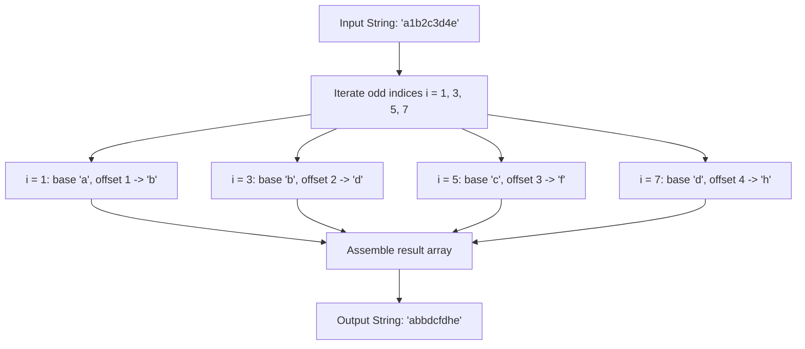

# Guided Example: Replace All Digits with Characters

We trace the step-by-step character-by-character transformation of alternating digit positions into shifted alphabetical characters:

- **Input:** `s = "a1b2c3d4e"`
- **Required Output:** `"abbdcfdhe"`

This representative instance highlights alternating parity indexing, dynamic ASCII code point shifting, handling diverse shift offsets, and correctly preserving trailing unshifted characters in odd-length strings.

---

## 1. Instance & Teaching Goal

We are given a string `s` where every even index ($0, 2, 4, \dots$) contains a lowercase English letter, and every odd index ($1, 3, 5, \dots$) contains a decimal digit character in $[0, 9]$.
We must replace each digit character at odd index $i$ with the character that is $s[i]$ positions forward in the alphabet from the letter at index $i - 1$:
$$\text{shift}(c, d) = \text{chr}(\text{ord}(c) + d)$$
Even-indexed letters remain unchanged.

In our instance:
- Length $n = 9$ (an odd length).
- Even indices: $s[0] = \text{'a'}, s[2] = \text{'b'}, s[4] = \text{'c'}, s[6] = \text{'d'}, s[8] = \text{'e'}$.
- Odd indices with shift values:
  - $i = 1$: digit `'1'` shifts $s[0] = \text{'a'}$ by $1 \to \text{'b'}$.
  - $i = 3$: digit `'2'` shifts $s[2] = \text{'b'}$ by $2 \to \text{'d'}$.
  - $i = 5$: digit `'3'` shifts $s[4] = \text{'c'}$ by $3 \to \text{'f'}$.
  - $i = 7$: digit `'4'` shifts $s[6] = \text{'d'}$ by $4 \to \text{'h'}$.
  - $i = 8$: letter `'e'` has no following digit and remains `'e'`.
- Concatenation: `"a" + "b" + "b" + "d" + "c" + "f" + "d" + "h" + "e" = "abbdcfdhe"`.

The teaching goal is to demonstrate point-wise stream transformations, parity-based index traversal, and character arithmetic without mutating previous base references.

---

## 2. Conceptual Foundation & Invariants

### Local Alphabet Shift & Parity Invariant Theorem

> **Local Alphabet Shift & Inplace Parity Invariant Theorem.**
> 1. *Independent Pairwise Decoupling:* Each odd position $i$ depends strictly on its immediate predecessor $s[i - 1]$ and the numerical value of $s[i]$. Distinct odd positions are mutually independent.
> 2. *Codepoint Bijectivity:* For any base character $c \in [\text{'a'}, \text{'z'}]$ and decimal offset $d \in [0, 9]$ such that $\text{ord}(c) + d \le \text{ord}(\text{'z'})$, the target character is deterministically evaluated as:
>    $$c' = \text{chr}(\text{ord}(c) + d)$$
> 3. *Parity Invariance:* For all even $j$, $s'[j] = s[j]$. For all odd $i$, $s'[i] = \text{shift}(s[i - 1], s[i] - \text{'0'})$.
> 4. *In-Place Mutation Soundness:* Because the shift for index $i$ reads only index $i - 1$ (an even index that is never mutated), the operation can be performed directly in-place across a mutable array in $\mathcal{O}(n)$ time and $\mathcal{O}(1)$ auxiliary space.

---

## 3. Step-by-Step Worked Execution

We walk through the mutable character array representation of $s$:
$$\text{chars} = [\text{'a'}, \text{'1'}, \text{'b'}, \text{'2'}, \text{'c'}, \text{'3'}, \text{'d'}, \text{'4'}, \text{'e'}]$$

---

### Step 1: Process Index $i = 1$
- Preceding base character: $\text{chars}[0] = \text{'a'}$ (ASCII 97).
- Digit character: $\text{chars}[1] = \text{'1'}$ (numerical offset $1$).
- Target ASCII calculation: $97 + 1 = 98$ (corresponds to `'b'`).
- Replacement: $\text{chars}[1] \gets \text{'b'}$.
- Current buffer: `['a', 'b', 'b', '2', 'c', '3', 'd', '4', 'e']`.

---

### Step 2: Process Index $i = 3$
- Preceding base character: $\text{chars}[2] = \text{'b'}$ (ASCII 98).
- Digit character: $\text{chars}[3] = \text{'2'}$ (numerical offset $2$).
- Target ASCII calculation: $98 + 2 = 100$ (corresponds to `'d'`).
- Replacement: $\text{chars}[3] \gets \text{'d'}$.
- Current buffer: `['a', 'b', 'b', 'd', 'c', '3', 'd', '4', 'e']`.

---

### Step 3: Process Index $i = 5$
- Preceding base character: $\text{chars}[4] = \text{'c'}$ (ASCII 99).
- Digit character: $\text{chars}[5] = \text{'3'}$ (numerical offset $3$).
- Target ASCII calculation: $99 + 3 = 102$ (corresponds to `'f'`).
- Replacement: $\text{chars}[5] \gets \text{'f'}$.
- Current buffer: `['a', 'b', 'b', 'd', 'c', 'f', 'd', '4', 'e']`.

---

### Step 4: Process Index $i = 7$
- Preceding base character: $\text{chars}[6] = \text{'d'}$ (ASCII 100).
- Digit character: $\text{chars}[7] = \text{'4'}$ (numerical offset $4$).
- Target ASCII calculation: $100 + 4 = 104$ (corresponds to `'h'`).
- Replacement: $\text{chars}[7] \gets \text{'h'}$.
- Current buffer: `['a', 'b', 'b', 'd', 'c', 'f', 'd', 'h', 'e']`.

---

### Step 5: Finalization
- Index $8$ is even and requires no shift.
- Traversal terminates at $i = 9 \ge n$.
- Join buffer to string: `"abbdcfdhe"`.

---

## 4. Complete Execution Trace

| Index $i$ | Parity | Read Value | Action / Rule | Effective Replacement | Buffer Snapshot |
|:---:|:---:|:---:|:---|:---:|:---|
| 0 | Even | `'a'` | Base anchor | Preserved | `a........` |
| 1 | Odd | `'1'` | $\text{'a'} + 1 \to \text{'b'}$ | `'b'` | `ab.......` |
| 2 | Even | `'b'` | Base anchor | Preserved | `abb......` |
| 3 | Odd | `'2'` | $\text{'b'} + 2 \to \text{'d'}$ | `'d'` | `abbd.....` |
| 4 | Even | `'c'` | Base anchor | Preserved | `abbdc....` |
| 5 | Odd | `'3'` | $\text{'c'} + 3 \to \text{'f'}$ | `'f'` | `abbdcf...` |
| 6 | Even | `'d'` | Base anchor | Preserved | `abbdcfd..` |
| 7 | Odd | `'4'` | $\text{'d'} + 4 \to \text{'h'}$ | `'h'` | `abbdcfdh.` |
| 8 | Even | `'e'` | Base anchor | Preserved | `abbdcfdhe` |

---

## 5. Algorithmic Correctness

**Soundness.** The transformation replaces exclusively the odd-indexed digit positions with the guaranteed valid shifted character within alphabet bounds. Each shift uses the original letter at index $i - 1$, preserving the exact specification.

**Completeness.** Stepping through odd indices $1, 3, \dots, 2k + 1 < n$ visits every digit position exactly once. Because each replacement depends only on index $i - 1$ (which is never modified), the entire sequence of digits is updated without race conditions or cascade errors.

---

## 6. Traps This Instance Exposes

- **Chained Shift Mistake:** Using the newly computed character at $i - 1$ instead of the base letter. (Here base letters are at even positions, so they are not replaced; but writing a generic state tracker could mistakenly treat a previously replaced letter as a base).
- **String Immutability Overhead:** Repeatedly slicing or concatenating immutable strings in a loop incurs quadratic $\mathcal{O}(n^2)$ time; working with a mutable list or array guarantees linear $\mathcal{O}(n)$ execution.
- **Odd vs Even String Length:** An odd-length string terminates on an even index letter (e.g. `'e'` at index 8), meaning loop bounds must avoid index-out-of-range checks when querying $i + 1$.

---

## 7. Complexity Derivation

- **Time Complexity:** $\mathcal{O}(n)$, where $n$ is the length of the string `s`. Each odd index requires one constant-time ASCII addition and character conversion, yielding $\lfloor n / 2 \rfloor$ operations.
- **Auxiliary Space Complexity:** $\mathcal{O}(n)$ in environments with immutable strings to hold the resulting character sequence, or $\mathcal{O}(1)$ auxiliary space if modified in-place within a mutable character array.
