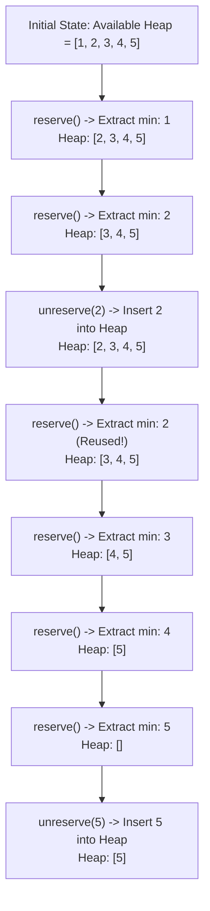

# Guided Example: Seat Reservation Manager

We trace the step-by-step state evolution of a priority-driven seat reservation system maintaining dynamic availability through sequential reservations and unreservations:

- **Input:**
  - Operations: `["SeatManager", "reserve", "reserve", "unreserve", "reserve", "reserve", "reserve", "reserve", "unreserve"]`
  - Arguments: `[[5], [], [], [2], [], [], [], [], [5]]`
- **Required Output:** `[null, 1, 2, null, 2, 3, 4, 5, null]`

This instance demonstrates how releasing a smaller seat number out of sequence causes subsequent reservations to reuse the freed smaller seat prior to advancing to larger numbers.

---

## 1. Instance & Teaching Goal

We are tasked with designing an efficient seat management service for $n$ numbered seats from $1$ through $n$.
All seats begin unreserved.
The system supports two dynamic operations:
1. `reserve()`: Allocates and returns the smallest currently available seat number.
2. `unreserve(seatNumber)`: Releases the specified seat, returning it to the available pool.

In our instance with $n = 5$:
- Initially, all seats $\{1, 2, 3, 4, 5\}$ are available.
- `reserve()` chooses the minimal available seat: `1`.
- `reserve()` chooses the next minimal available seat: `2`.
- `unreserve(2)` returns seat `2` to the pool. The available set becomes $\{2, 3, 4, 5\}$.
- `reserve()` must now choose `2` again (since $2 < 3$).
- Subsequent calls to `reserve()` sequentially consume `3`, `4`, and `5`.
- Finally, `unreserve(5)` makes seat `5` available again.

The teaching goal is to model available resources using a min-heap priority queue to guarantee that finding the minimum available element and restoring a released element both execute in logarithmic time.

---

## 2. Conceptual Foundation & Invariants

### Priority-Queue Allocation Invariant Theorem

> **Min-Heap Priority Order & Dynamic Reallocation Invariant Theorem.**
> 1. *Total Order Availability:* At any point in time, the set of unreserved seats $\mathcal{A} \subseteq \{1, 2, \dots, n\}$ is a non-empty subset of positive integers.
> 2. *Minimal Allocation Guarantee:* The `reserve()` operation deterministically extracts:
>    $$s^* = \min(\mathcal{A})$$
>    and updates $\mathcal{A} \gets \mathcal{A} \setminus \{s^*\}$.
> 3. *Restoration Invariance:* For any valid `unreserve(s)`, $s \notin \mathcal{A}$. The operation updates $\mathcal{A} \gets \mathcal{A} \cup \{s\}$.
> 4. *Heap Invariant:* When $\mathcal{A}$ is structured as a binary min-heap, the root always stores $\min(\mathcal{A})$. Extracting the minimum and inserting a newly released seat each take $\mathcal{O}(\log |\mathcal{A}|)$ time.

---

## 3. Step-by-Step Worked Execution

We trace the min-heap representing the set of available seats.

---

### Step 1: `SeatManager(5)`
Initialize the available pool with seats $1$ through $5$:
$$\text{Heap} = [1, 2, 3, 4, 5]$$
Result: `null`.

---

### Step 2: `reserve()`
- Query heap top: minimum is $1$.
- Pop minimum element $1$.
- Updated heap: $[2, 3, 4, 5]$ (or heap-reorganized equivalent $[2, 3, 5, 4]$).
- Result: **`1`**.

---

### Step 3: `reserve()`
- Query heap top: minimum is $2$.
- Pop minimum element $2$.
- Updated heap: $[3, 4, 5]$.
- Result: **`2`**.

---

### Step 4: `unreserve(2)`
- Seat $2$ is returned to the pool.
- Push $2$ into the min-heap.
- Heap property restores with $2$ at the root:
  $$\text{Heap} = [2, 4, 5, 3]$$
  (Root is $2$, children are $4$ and $5$).
- Result: `null`.

---

### Step 5: `reserve()`
- Query heap top: minimum is $2$.
- Notice that seat $2$ is returned ahead of seats $3, 4, 5$ because $2 < 3$.
- Pop minimum element $2$.
- Updated heap: $[3, 4, 5]$.
- Result: **`2`**.

---

### Step 6: `reserve()`
- Query heap top: minimum is $3$.
- Pop minimum element $3$.
- Updated heap: $[4, 5]$.
- Result: **`3`**.

---

### Step 7: `reserve()`
- Query heap top: minimum is $4$.
- Pop minimum element $4$.
- Updated heap: $[5]$.
- Result: **`4`**.

---

### Step 8: `reserve()`
- Query heap top: minimum is $5$.
- Pop minimum element $5$.
- Updated heap: $\emptyset$ (empty).
- Result: **`5`**.

---

### Step 9: `unreserve(5)`
- Seat $5$ is returned to the pool.
- Push $5$ into the min-heap.
- Updated heap: $[5]$.
- Result: `null`.

---

## 4. Complete Execution Trace

| Op # | Operation Invoked | Argument | Min-Heap Before Op | Action / Transition | Return Value | Min-Heap After Op |
|:---:|:---:|:---:|:---:|:---|:---:|:---:|
| 1 | `SeatManager` | `5` | Uninitialized | Build min-heap for $[1 \dots 5]$ | `null` | $\{1, 2, 3, 4, 5\}$ |
| 2 | `reserve` | - | $\{1, 2, 3, 4, 5\}$ | Extract root $1$ | **`1`** | $\{2, 3, 4, 5\}$ |
| 3 | `reserve` | - | $\{2, 3, 4, 5\}$ | Extract root $2$ | **`2`** | $\{3, 4, 5\}$ |
| 4 | `unreserve` | `2` | $\{3, 4, 5\}$ | Insert $2$ into heap | `null` | $\{2, 3, 4, 5\}$ |
| 5 | `reserve` | - | $\{2, 3, 4, 5\}$ | Extract root $2$ | **`2`** | $\{3, 4, 5\}$ |
| 6 | `reserve` | - | $\{3, 4, 5\}$ | Extract root $3$ | **`3`** | $\{4, 5\}$ |
| 7 | `reserve` | - | $\{4, 5\}$ | Extract root $4$ | **`4`** | $\{5\}$ |
| 8 | `reserve` | - | $\{5\}$ | Extract root $5$ | **`5`** | $\emptyset$ |
| 9 | `unreserve` | `5` | $\emptyset$ | Insert $5$ into heap | `null` | $\{5\}$ |

---

## 5. Algorithmic Correctness

**Soundness.** The min-heap ordering invariant guarantees that the root of the heap always holds the smallest unreserved integer. Calling `reserve()` removes and returns this unique minimal element, directly meeting the specification.

**Completeness.** Since `unreserve` pushes the freed seat directly back into the min-heap, any previously reserved seat becomes immediately candidate for future reservations. No available seat is ever lost or skipped.

---

## 6. Traps This Instance Exposes

- **Linear Unordered Scanning:** Maintaining a simple boolean array of size $n$ and scanning from index $1$ on each `reserve()` takes $\mathcal{O}(n)$ per call, leading to $\mathcal{O}(q \cdot n)$ total time and Time Limit Exceeded when $n, q = 10^5$.
- **LIFO / FIFO Misconception:** Using a stack or simple queue for unreserved seats fails because an unreserved seat must be chosen based on its numeric value, not the order in which it was released.
- **Unreserve Precondition:** Only currently reserved seats may be unreserved. Double unreserving without verification would introduce duplicate entries into the heap.

---

## 7. Complexity Derivation

- **Initialization Time Complexity:** $\mathcal{O}(n)$ to heapify integers $1$ through $n$ at construction time (or $\mathcal{O}(1)$ if using a lazy marker with a heap for recycled seats).
- **Per-Operation Time Complexity:**
  - `reserve()`: $\mathcal{O}(\log k)$ where $k \le n$ is the current number of available seats, due to the heap extraction.
  - `unreserve(seatNumber)`: $\mathcal{O}(\log k)$ to insert the released seat into the min-heap.
- **Auxiliary Space Complexity:** $\mathcal{O}(n)$ to store up to $n$ available seats in the heap structure.
