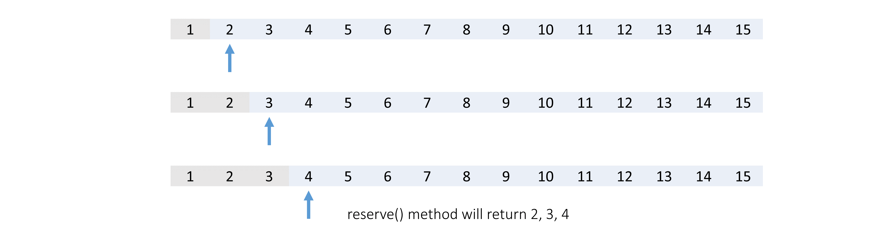
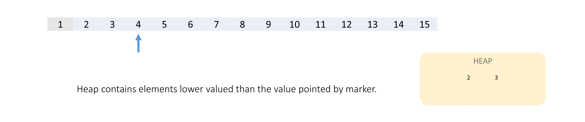

[TOC]

## Solution

---

### Approach 1: Min Heap

#### Intuition

In this problem, we need to keep track of the reserved status of each seat. If a seat is already reserved, we can't reserve it again. We can use a boolean array `availableSeats` of size `n` to indicate whether the seat is available (i.e., not reserved) or not.
- In the `unreserve(seatNumber)` method, we will set $\text{availableSeats}[seatNumber]$ to `true` to mark the seat as unreserved.
- In the `reserve()` method, to find the smallest-numbered unreserved seat, we can iterate over the entire `availableSeats` array from the start index (`0`) to the end, and the first index where $\text{availableSeats}[index]$ is `true` will be the preferred seat, but iterating over the entire array for each `reserve()` method call is not optimal.

**Can we dynamically maintain a collection of numbers and find the smallest number from the collection in the shortest time?**
Yes, we can use a **min-heap** data structure here.

> This data structure is a complete binary tree, where the parent nodes are always smaller than the corresponding child nodes, in order to keep the minimum-valued element at the root node of the tree. Here, pushing an element and popping an element are both logarithmic time operations, but getting the minimum-valued element is a constant time operation.

If you are new to this data structure we recommend that you read [Leetcode's Heap Explore Card](https://leetcode.com/explore/learn/card/heap/).

For this given problem, we can push all available (i.e., unreserved) seats into the min-heap. To get the smallest available seat, we can pop the top element from the heap in logarithmic time. Because of the properties of the min-heap, when we need to maintain this heap in subsequent operations, we can achieve the required operations with a time complexity of only $O(\log n)$.

#### Algorithm

1. Create a min-heap `availableSeats` that initially contains all seats from `1` to `n`.
2. In the `reserve()` method, pop the first element of the `availableSeats` heap and return it.
3. In the `unreserve(seatNumber)` method, we push `seatNumber` into the `availableSeats` heap.

#### Implementation

```python
class SeatManager:
    def __init__(self, n):
        # Min heap to store all unreserved seats.
        self.available_seats = [i for i in range(1, n + 1)]

    def reserve(self):
        # Get the smallest-numbered unreserved seat from the min heap.
        seat_number = heapq.heappop(self.available_seats)
        return seat_number

    def unreserve(self, seat_number):
        # Push the unreserved seat back into the min heap.
        heapq.heappush(self.available_seats, seat_number)
```

#### Complexity Analysis

Let $m$ be the maximum number of calls made.

* Time complexity:  $O((m + n) \cdot \log n)$
- While initializing the `SeatManager` object, we iterate over all `n` seats and push it into our heap, each push operation takes $O(\log n)$ time, thus, overall it will take $O(n \log n)$ time.
- In the `reserve()` method, we pop the minimum-valued element from the `availableSeats` heap, which takes $O(\log n)$ time.
- In the `unreserve(seatNumber)` method, we push the `seatNumber` into the `availableSeats` heap which will also take $O(\log n)$ time.
- There are a maximum of $m$ calls to `reserve()` or `unreserve()` methods, thus the overall time complexity is $O(m \cdot\log n)$.

* Space complexity: $O(n)$
- The `availableSeats` heap contains all $n$ elements, taking $O(n)$ space.

<br />

---

### Approach 2: Min Heap (without pre-initialization)

#### Intuition

In the previous approach, we require initializing the min-heap with all the `n` seats, when the `n` will be large and the number of calls to `reverse` and `unreserve` methods will be small, then the most computationally expensive step will be the initializing of the min-heap.
Therefore, we will try to improve the previous approach by eliminating the pre-initialization of the min-heap.

Let's keep a variable `marker` to indicate that all seats greater than or equal to `marker` have never been reserved.
Whenever the `reserve` method is called, we return the current `marker` seat and move the `marker` to the next seat.

For example, suppose we had 15 seats and called the `reserve` method four times.

Initially the `marker` is equal to `1`, we returned `1` and moved to the next seat.


Similarly, in the subsequent three calls, it will return `2`, `3`, and `4` respectively.



But, what if `unreserve(2)` is called now? Now we can't return the `marker` seat as a seat with a lower number than the `marker` became unreserved.

We can keep these unreserved seats separately in a separate container (data structure).

As it's stated in the problem statement `unreserve(seatNumber)` is only called if `seatNumber` has already been reserved, so the elements in this separate container will always be less than `marker` (Because the `seatNumber` was reserved earlier when the `marker` was on it and now the `marker` would have moved on).
Hence, we can conclude that, if any element is present in this separate container, then it contains the minimum-numbered seat, otherwise, if this separate container is empty then the `marker` points to the minimum-numbered unreserved seat.

To fetch the minimum valued element among all elements from this separate container again we can use a min-heap.



#### Algorithm

1. Create an empty min heap `availableSeats` and `marker` initialized to `1`.
2. In the `reserve()` method, if the `availableSeats` heap is not empty then pop the top element and return it, otherwise, return the value stored by `marker` and increment `marker` by `1`.
3. In the `unreserve(seatNumber)` method, we push `seatNumber` into the `availableSeats` heap.

#### Implementation

```python
class SeatManager:
    def __init__(self, n):
        # Set marker to the first unreserved seat.
        self.marker = 1

        # Min heap to store all unreserved seats.
        self.available_seats = []

    def reserve(self):
        # If min-heap has any element in it, then,
        # get the smallest-numbered unreserved seat from the min heap.
        if self.available_seats:
            seat_number = heapq.heappop(self.available_seats)
            return seat_number

        # Otherwise, the marker points to the smallest-numbered seat.
        seat_number = self.marker
        self.marker += 1
        return seat_number

    def unreserve(self, seat_number):
        # Push unreserved seat in the min heap.
        heapq.heappush(self.available_seats, seat_number)
```

#### Complexity Analysis

Let $m$ be the maximum number of calls made.

* Time complexity:  $O(m \cdot \log n)$
- While initializing the `SeatManager` object, we perform constant time operations.
- In the `reserve()` method, in the worst-case, we will pop the minimum-valued element from the `availableSeats` heap which will take $O(\log n)$.
- In the `unreserve(seatNumber)` method, we push the `seatNumber` into the `availableSeats` heap which will also take $O(\log n)$ time.
- There are a maximum of $m$ calls to `reserve()` or `unreserve()` methods, thus the overall time complexity is $O(m \cdot \log n)$.

* Space complexity: $O(n)$
- The `availableSeats` heap can contain $n$ elements in it. So in the worst case, it will take $O(n)$ space.

<br />

---

### Approach 3: Sorted/Ordered Set

#### Intuition

Like min-heap, we can use another advanced built-in data structure, the sorted set, to help dynamically maintain the ordered state of the reserved seat.

> This data structure internally uses a height-balanced binary search tree (like, a red-black tree, AVL tree, etc.) to keep the data sorted. Thus, pushing an element, popping an element, and getting the minimum-valued element are all logarithmic time operations because the tree balances itself after each operation.

You can read more about [Height-Balanced BST](https://leetcode.com/explore/learn/card/introduction-to-data-structure-binary-search-tree/143/appendix-height-balanced-bst/1021/) in our explore card.

Thus, in this approach, we will implement the previous approach using a sorted set.

> You can also implement the first approach using a sorted set.

> **Note:** The sorted set approach is not expected during the interview, but we are including it here for the completeness of the article and to familiarize you with a built-in advanced data structure.

#### Algorithm

1. Create a sorted set `availableSeats` and `marker` initialized to `1`.
2. In the `reserve()` method, if the `availableSeats` set is not empty, then pop its first element and return it, otherwise, return the value stored by `marker` and increment `marker` by `1`.
3. In the `unreserve(seatNumber)` method, we push `seatNumber` into the `availableSeats` set.

#### Implementation

```python
from sortedcontainers import SortedSet

class SeatManager:
    def __init__(self, n):
        # Set marker to the first unreserved seat.
        self.marker = 1

        # Sorted set to store all unreserved seats.
        self.available_seats = SortedSet()

    def reserve(self):
        # If the sorted set has any element in it, then,
        # get the smallest-numbered unreserved seat from it.
        if self.available_seats:
            seat_number = self.available_seats.pop(0)
            return seat_number

        # Otherwise, the marker points to the smallest-numbered seat.
        seat_number = self.marker
        self.marker += 1
        return seat_number

    def unreserve(self, seat_number):
        # Push the unreserved seat in the sorted set.
        self.available_seats.add(seat_number)
```

#### Complexity Analysis

Let $m$ be the maximum number of calls made.

* Time complexity:  $O(m \cdot \log n)$
- While initializing the `SeatManager` object, we perform constant time operations.
- In the `reserve()` method, we pop the minimum-valued element from the `availableSeats` set which takes $O(\log n)$ time.
- In the `unreserve(seatNumber)` method, we push the `seatNumber` into the `availableSeats` set which will also take $O(\log n)$ time.
- There are a maximum of $m$ calls to `reserve()` or `unreserve()` methods, thus the overall time complexity is $O(m \cdot \log n)$.

* Space complexity: $O(n)$
- The `availableSeats` set can contain $n$ elements in it. So in the worst case, it will take $O(n)$ space.