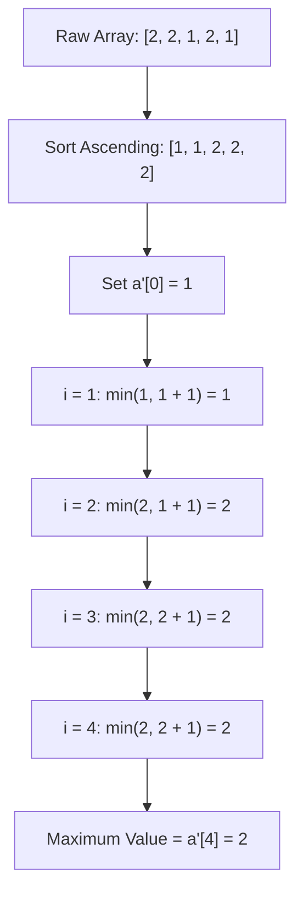

# Guided Example: Maximum Element After Decreasing and Rearranging

We trace the step-by-step sorting, greedy step capping, and maximal endpoint computation for the bounded rearrangement problem:

- **Input:** `arr = [2, 2, 1, 2, 1]`
- **Required Output:** `2`

This instance demonstrates how duplicates and modest initial upper bounds restrict monotonic increments, showing why simply possessing multiple elements cannot guarantee reaching an element value equal to the array length.

---

## 1. Instance & Teaching Goal

We are given an array of positive integers `arr`.
We are allowed to perform two operations:
1. Rearrange the elements in any arbitrary permutation.
2. Decrease any element to any smaller positive integer (elements can never be increased).

The resulting array must satisfy two invariants:
1. The first element must equal $1$: $arr[0] = 1$.
2. The absolute difference between adjacent elements must be at most $1$: $|arr[i] - arr[i - 1]| \le 1$ for all $i \ge 1$.

We seek the maximum possible value achievable by any element in a valid final configuration.

In our instance:
- `arr = [2, 2, 1, 2, 1]` has length $n = 5$.
- Even though the theoretical maximum for an array of length $5$ starting at $1$ with step $\le 1$ is $5$ (achieved by $[1, 2, 3, 4, 5]$), none of the given numbers exceed $2$.
- Because values may only decrease and never increase, no element can ever exceed $\max(\text{arr}) = 2$.
- Sorting `arr` produces $[1, 1, 2, 2, 2]$.
- Enforcing $arr[0] = 1$ and $arr[i] \le arr[i-1] + 1$ yields $[1, 1, 2, 2, 2]$.
- The maximal element achieved is $2$.

The teaching goal is to formulate the greedy sorting property: sorting the array in non-decreasing order maximizes the growth opportunity at each step, and capping each element at $arr[i - 1] + 1$ achieves the global maximum in $\mathcal{O}(n \log n)$ time.

---

## 2. Conceptual Foundation & Invariants

### Greedy Monotonic Capping Invariant Theorem

> **Monotonic Sorted Prefix & Greedy Step Capping Invariant Theorem.**
> 1. *Rearrangement Optimality:* By the rearrangement inequality, sorting `arr` in non-decreasing order ($a_0 \le a_1 \le \dots \le a_{n-1}$) maximizes the prefix capacity at every index $i$.
> 2. *Upper Bound Recurrence:* Let $a'_i$ denote the optimal valid value at index $i$. The optimal sequence satisfies:
>    $$a'_0 = 1$$
>    $$a'_i = \min(a_i, a'_{i-1} + 1) \quad \text{for } 1 \le i < n$$
> 3. *Global Maximality:* Since $a'_i \le a'_{i-1} + 1$, the sequence $a'$ is non-decreasing ($a'_0 \le a'_1 \le \dots \le a'_{n-1}$). Therefore, the maximum element across the entire final array is uniquely located at the final index:
>    $$\max_{0 \le i < n} a'_i = a'_{n-1}$$
> 4. *Decreasing-Only Soundness:* At each step, $a'_i \le a_i$, meaning every element is either unchanged or decreased, never increased.

---

## 3. Step-by-Step Worked Execution

We trace the algorithm on `arr = [2, 2, 1, 2, 1]`.

---

### Step 1: Sort the Array Ascending
Sort all $5$ elements:
$$\text{sorted\_arr} = [1, 1, 2, 2, 2]$$

---

### Step 2: Initialize Base Index $i = 0$
- Original value: $a_0 = 1$.
- Constraint requires $a'_0 = 1$.
- Assigned value: $a'_0 = 1$.

---

### Step 3: Enforce Constraint at Index $i = 1$
- Original value: $a_1 = 1$.
- Maximum allowed step from previous element: $a'_0 + 1 = 1 + 1 = 2$.
- Apply capping rule:
  $$a'_1 = \min(a_1, a'_0 + 1) = \min(1, 2) = 1$$
- Current sequence: $[1, 1]$.

---

### Step 4: Enforce Constraint at Index $i = 2$
- Original value: $a_2 = 2$.
- Maximum allowed step from previous element: $a'_1 + 1 = 1 + 1 = 2$.
- Apply capping rule:
  $$a'_2 = \min(a_2, a'_1 + 1) = \min(2, 2) = 2$$
- Current sequence: $[1, 1, 2]$.

---

### Step 5: Enforce Constraint at Index $i = 3$
- Original value: $a_3 = 2$.
- Maximum allowed step from previous element: $a'_2 + 1 = 2 + 1 = 3$.
- Apply capping rule:
  $$a'_3 = \min(a_3, a'_2 + 1) = \min(2, 3) = 2$$
- Current sequence: $[1, 1, 2, 2]$.

---

### Step 6: Enforce Constraint at Index $i = 4$
- Original value: $a_4 = 2$.
- Maximum allowed step from previous element: $a'_3 + 1 = 2 + 1 = 3$.
- Apply capping rule:
  $$a'_4 = \min(a_4, a'_3 + 1) = \min(2, 3) = 2$$
- Final sequence: $[1, 1, 2, 2, 2]$.

---

### Step 7: Read Maximum Value
Because the sequence is non-decreasing, the global maximum is the final element:
$$a'_4 = 2$$
Output: **`2`**.

---

## 4. Complete Execution Trace

| Index $i$ | Raw $a_i$ | Allowed Upper Bound ($a'_{i-1} + 1$) | Assigned $a'_i = \min(a_i, \text{Bound})$ | Running Maximum |
|:---:|:---:|:---:|:---:|:---:|
| 0 | 1 | 1 (Fixed rule) | 1 | 1 |
| 1 | 1 | $1 + 1 = 2$ | $\min(1, 2) = 1$ | 1 |
| 2 | 2 | $1 + 1 = 2$ | $\min(2, 2) = 2$ | 2 |
| 3 | 2 | $2 + 1 = 3$ | $\min(2, 3) = 2$ | 2 |
| 4 | 2 | $2 + 1 = 3$ | $\min(2, 3) = 2$ | **2** |

---

## 5. Algorithmic Correctness

**Soundness.** Every element $a'_i$ is at most $a_i$, ensuring the operation only decreases values. By induction, $a'_0 = 1$ and $|a'_i - a'_{i-1}| = a'_i - a'_{i-1} \le 1$, satisfying all problem conditions.

**Completeness.** Suppose an optimal permutation achieved a larger value at index $n-1$. Since each step can increase by at most $1$, $a'_{n-1} \le a'_0 + (n - 1) = n$. Furthermore, each element cannot exceed its original value. Sorting places smaller constraints as early as possible, freeing up larger elements for later positions where higher values are legally attainable. Hence, no valid reconfiguration can yield a larger maximum.

---

## 6. Traps This Instance Exposes

- **Assuming Output Equals Array Length:** One might assume that an array of length $5$ can always reach $5$. However, if all numbers in `arr` are $\le 2$, no decrease operation can ever generate values $\ge 3$.
- **Not Sorting First:** Applying the greedy capping rule on an unsorted array (e.g. $[2, 1, 2, 2, 1]$) would mistakenly cap earlier elements unnecessarily and fail to find the optimal arrangement.
- **Forgetting the $a'_0 = 1$ Anchor:** Even if the smallest element in `arr` is $100$, the first element must be decreased to $1$.

---

## 7. Complexity Derivation

- **Time Complexity:** $\mathcal{O}(n \log n)$ to sort the array of $n$ elements, followed by an $\mathcal{O}(n)$ single-pass greedy scan. (Alternatively, using a counting/bucket sort capped at $n$ achieves $\mathcal{O}(n)$ time).
- **Auxiliary Space Complexity:** $\mathcal{O}(1)$ beyond the in-place sorted array (or $\mathcal{O}(n)$ in environments where input arrays are immutable).
