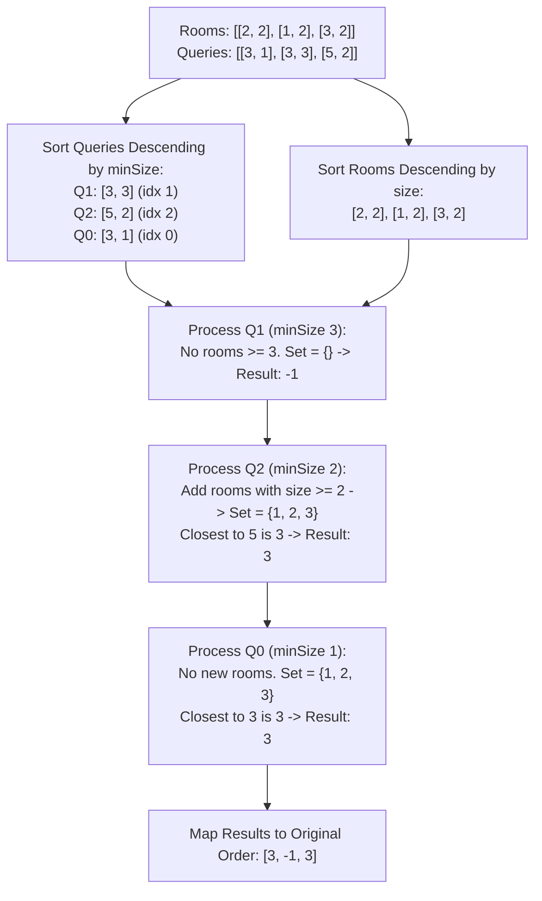

# Guided Example: Closest Room

We trace the step-by-step resolution of size-constrained nearest-room queries using offline sorting, monotonic descending filtration, and dynamic ordered set bisection:

- **Input:**
  - `rooms = [[2, 2], [1, 2], [3, 2]]`
  - `queries = [[3, 1], [3, 3], [5, 2]]`
- **Required Output:** `[3, -1, 3]`

This instance demonstrates handling queries where no candidate room meets the size threshold (returning `-1`), handling exact ID matches, and selecting the nearest boundary room when the preferred ID lies outside the available range.

---

## 1. Instance & Teaching Goal

Each room is characterized by a unique integer `roomId` and an integer `size`.
Each query provides a preferred room ID `preferred` and a minimum acceptable capacity `minSize`.
A room is eligible for a query if and only if $\text{size} \ge \text{minSize}$.
Among all eligible rooms, the goal is to choose the room whose ID minimizes the absolute difference $|\text{roomId} - \text{preferred}|$. In the event of an equidistant tie between two eligible rooms, the smaller `roomId` must be chosen. If no room meets the capacity requirement, the query returns `-1`.

In our instance:
- `rooms` contains three rooms: `[2, 2], [1, 2], [3, 2]`, all having size $2$.
- Query $0$: `preferred = 3, minSize = 1`. Rooms with size $\ge 1$ are $\{1, 2, 3\}$. The closest to $3$ is room $3$ (distance $0$).
- Query $1$: `preferred = 3, minSize = 3`. No room has size $\ge 3$. Eligible set is empty $\to$ returns `-1`.
- Query $2$: `preferred = 5, minSize = 2`. Rooms with size $\ge 2$ are $\{1, 2, 3\}$. The closest to $5$ is room $3$ (distance $|3 - 5| = 2$).
- Mapping answers back to original query indices yields `[3, -1, 3]`.

The teaching goal is to recognize the power of **offline query processing**: by sorting queries and rooms in descending order of size, the candidate room set grows monotonically, avoiding repeated filtering and allowing each query to find its nearest neighbor in logarithmic time via balanced BST bisection.

---

## 2. Conceptual Foundation & Invariants

### Monotonic Filtering & Ordered Set Invariant Theorem

> **Offline Descending Monotonic Filter & Ordered Set Bisection Theorem.**
> 1. *Monotonic Inclusion Property:* Let queries be sorted in non-increasing order of threshold $Q_1.\text{minSize} \ge Q_2.\text{minSize} \ge \dots \ge Q_q.\text{minSize}$. The set of rooms satisfying $\text{size} \ge Q_k.\text{minSize}$ satisfies:
>    $$\mathcal{S}_1 \subseteq \mathcal{S}_2 \subseteq \dots \subseteq \mathcal{S}_q$$
>    Rooms only enter the active candidate pool and are never removed.
> 2. *Ordered Set Bisection:* Maintaining active room IDs in a self-balancing binary search tree (or sorted list) allows testing candidates adjacent to `preferred` in $\mathcal{O}(\log r)$ time. Specifically, let $r_{\text{succ}}$ be the smallest ID $\ge \text{preferred}$ and $r_{\text{pred}}$ be the largest ID $< \text{preferred}$. The optimal room is:
>    $$r^* = \arg\min_{r \in \{r_{\text{pred}}, r_{\text{succ}}\}} (|r - \text{preferred}|, r)$$
> 3. *Total Complexity:* Sorting rooms and queries takes $\mathcal{O}(r \log r + q \log q)$ time. Each room is inserted once ($\mathcal{O}(r \log r)$) and each query performs one bisection ($\mathcal{O}(q \log r)$), reducing the naive $\mathcal{O}(q \cdot r)$ runtime to $\mathcal{O}((r + q) \log (r + q))$.

---

## 3. Step-by-Step Worked Execution

We trace the offline algorithm on the sample instance.

---

### Step 1: Attach Indices and Sort Queries Descending by `minSize`
Original queries:
- Query $0$: `[3, 1]`
- Query $1$: `[3, 3]`
- Query $2$: `[5, 2]`

Sort by `minSize` in descending order:
1. Query $1$: `preferred = 3, minSize = 3, original_index = 1`
2. Query $2$: `preferred = 5, minSize = 2, original_index = 2`
3. Query $0$: `preferred = 3, minSize = 1, original_index = 0`

---

### Step 2: Sort Rooms Descending by `size`
Original rooms: `[[2, 2], [1, 2], [3, 2]]`.
All rooms have size $2$. A stable descending sort keeps them grouped at size $2$:
$$\text{sorted\_rooms} = [[2, 2], [1, 2], [3, 2]]$$
Room pointer $p = 0$.
Active room ID ordered set $\mathcal{S} = \emptyset$.

---

### Step 3: Process Query 1 (`preferred = 3, minSize = 3`, Index 1)
- Condition to ingest rooms: `rooms[p].size >= 3`.
- Current room at $p = 0$ has size $2 < 3$.
- No rooms are added.
- Active set: $\mathcal{S} = \emptyset$.
- Because $\mathcal{S}$ is empty, no eligible room exists.
- Result for query index $1$: **`-1`**.

---

### Step 4: Process Query 2 (`preferred = 5, minSize = 2`, Index 2)
- Condition to ingest rooms: `rooms[p].size >= 2`.
  - Room $0$: `[2, 2]` has size $2 \ge 2$. Insert ID `2` into $\mathcal{S}$. Increment $p \to 1$.
  - Room $1$: `[1, 2]` has size $2 \ge 2$. Insert ID `1` into $\mathcal{S}$. Increment $p \to 2$.
  - Room $2$: `[3, 2]` has size $2 \ge 2$. Insert ID `3` into $\mathcal{S}$. Increment $p \to 3$.
- All rooms are ingested. Active set:
  $$\mathcal{S} = \{1, 2, 3\}$$
- Query bisection for `preferred = 5`:
  - Largest ID $\le 5$: $r_1 = 3$. Distance: $|3 - 5| = 2$.
  - Smallest ID $> 5$: None.
- Candidate is $r = 3$.
- Result for query index $2$: **`3`**.

---

### Step 5: Process Query 0 (`preferred = 3, minSize = 1`, Index 0)
- Condition to ingest rooms: `rooms[p].size >= 1`.
- Pointer $p = 3$ (all rooms already ingested).
- Active set remains $\mathcal{S} = \{1, 2, 3\}$.
- Query bisection for `preferred = 3`:
  - Value $3$ exists directly in $\mathcal{S}$!
  - Distance: $|3 - 3| = 0$.
- Candidate is $r = 3$.
- Result for query index $0$: **`3`**.

---

### Step 6: Assemble Final Results
Map computed answers back to original query indices:
- Index $0$: $3$
- Index $1$: $-1$
- Index $2$: $3$

Final Output: **`[3, -1, 3]`**.

---

## 4. Complete Execution Trace

| Step | Query Target (`pref, minS`) | Orig Idx | Ingested Room IDs | Active BST $\mathcal{S}$ | Nearest Candidate Evaluation | Emitted Answer |
|:---:|:---:|:---:|:---:|:---:|:---|:---:|
| 1 | `[3, 3]` | 1 | None (sizes $< 3$) | $\emptyset$ | Set empty | **`-1`** |
| 2 | `[5, 2]` | 2 | `[2, 1, 3]` | $\{1, 2, 3\}$ | $r_{\text{pred}} = 3$ (diff $2$), no succ | **`3`** |
| 3 | `[3, 1]` | 0 | None (already added) | $\{1, 2, 3\}$ | Exact match $r = 3$ (diff $0$) | **`3`** |

---

## 5. Algorithmic Correctness

**Soundness.** Since queries are ordered by descending `minSize`, any room added to $\mathcal{S}$ has size at least the current query's `minSize` and therefore also satisfies all subsequent queries' lower thresholds. Bisection over the ordered set examines the immediate predecessor and successor of `preferred`, which are guaranteed to contain the minimum absolute difference.

**Completeness.** No room with $\text{size} \ge \text{minSize}$ is omitted because the two-pointer ingestion continues until the next room's size is strictly less than `minSize`. Evaluating both boundary neighbors in the BST guarantees the true global minimum distance is selected.

---

## 6. Traps This Instance Exposes

- **Empty Eligible Set:** When no room meets the capacity requirement, the ordered set is empty and must immediately return `-1` rather than throwing an indexing exception.
- **Tie-Breaking Rule:** If two eligible room IDs achieve the exact same distance (e.g. `preferred = 3` with candidates $2$ and $4$, both distance $1$), the problem specifies choosing the strictly smaller room ID ($2$).
- **Quadratic Naive Execution:** Checking all $r$ rooms for each of the $q$ queries takes $\mathcal{O}(q \cdot r) = 10^{10}$ operations, causing an immediate Time Limit Exceeded. Offline sorting is essential.

---

## 7. Complexity Derivation

- **Time Complexity:**
  - Sorting rooms: $\mathcal{O}(r \log r)$.
  - Sorting queries: $\mathcal{O}(q \log q)$.
  - Ingestion into ordered set: $r$ insertions taking $\mathcal{O}(r \log r)$.
  - Answering queries: $q$ bisections taking $\mathcal{O}(q \log r)$.
  - Total Time: $\mathcal{O}((r + q) \log (r + q))$.
- **Auxiliary Space Complexity:** $\mathcal{O}(r + q)$ to store query indices and the ordered set containing up to $r$ room identifiers.
