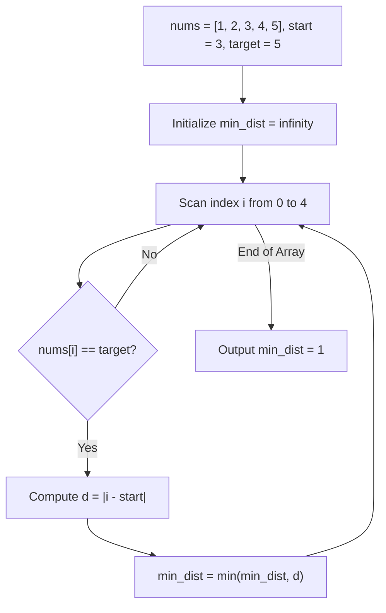

# Guided Example: Minimum Distance to the Target Element

We trace the step-by-step evaluation of the 1D discrete metric distance between a designated starting index and qualifying target occurrences in an array:

- **Input:** `nums = [1, 2, 3, 4, 5], target = 5, start = 3`
- **Required Output:** `1`

This instance demonstrates metric minimization over discrete coordinate indices, evaluating index offsets from a non-zero starting anchor, and distinguishing between linear scans and radially expanding early-termination searches.

---

## 1. Instance & Teaching Goal

We are given an integer array `nums`, a target value `target` guaranteed to be present at least once in `nums`, and an integer index `start` ($0 \le \text{start} < n$).
The metric distance between any index $i$ and `start` is the absolute coordinate difference:
$$d(i, \text{start}) = |i - \text{start}|$$
We must find an index $i$ such that $\text{nums}[i] = \text{target}$ that minimizes $d(i, \text{start})$.

In our instance:
- `nums = [1, 2, 3, 4, 5]` of length $n = 5$.
- `target = 5`.
- `start = 3` (which contains value $\text{nums}[3] = 4$).
- Target $5$ is located at index $4$.
- The distance is $|4 - 3| = 1$.
- No other occurrences of $5$ exist.
- Minimal distance is $1$.

The teaching goal is to formalize index-based metric minimization over finite sets: showing how both a single-pass linear scan and an outward radial expansion correctly identify the nearest neighbor in $\mathcal{O}(n)$ time and $\mathcal{O}(1)$ auxiliary space.

---

## 2. Conceptual Foundation & Invariants

### Discrete 1D Metric Minimization Invariant Theorem

> **Discrete 1D Metric Minimization & Radial Search Theorem.**
> 1. *Target Occurrence Set:* Let $\mathcal{T} = \{i \in [0, n - 1] \mid \text{nums}[i] = \text{target}\}$. The problem guarantees $\mathcal{T} \neq \emptyset$.
> 2. *Global Metric Minimum:* The optimal distance is uniquely defined as:
>    $$d^* = \min_{i \in \mathcal{T}} |i - \text{start}|$$
> 3. *Radial Monotonic Expansion:* If candidates are tested by increasing radius $r = 0, 1, 2, \dots, \max(\text{start}, n - 1 - \text{start})$ by probing $\text{start} - r$ and $\text{start} + r$, the first radius $r$ encountering a target occurrence is guaranteed to be $d^*$, enabling optimal early termination.
> 4. *Linear Scan Soundness:* Alternatively, a single pass from $i = 0$ to $n - 1$ tracking a running minimum $d_{\min} \gets \min(d_{\min}, |i - \text{start}|)$ visits all elements in $\mathcal{O}(n)$ time without additional data structures.

---

## 3. Step-by-Step Worked Execution

We trace the linear evaluation pass across all indices of `nums = [1, 2, 3, 4, 5]` with `target = 5` and `start = 3`.
Initialize $d_{\min} = \infty$.

---

### Step 1: Evaluate Index $i = 0$
- Element: $\text{nums}[0] = 1$.
- Target check: $1 \neq 5$.
- Action: Skip (not a target occurrence).
- Running state: $d_{\min} = \infty$.

---

### Step 2: Evaluate Index $i = 1$
- Element: $\text{nums}[1] = 2$.
- Target check: $2 \neq 5$.
- Action: Skip.
- Running state: $d_{\min} = \infty$.

---

### Step 3: Evaluate Index $i = 2$
- Element: $\text{nums}[2] = 3$.
- Target check: $3 \neq 5$.
- Action: Skip.
- Running state: $d_{\min} = \infty$.

---

### Step 4: Evaluate Index $i = 3$ (Starting Index)
- Element: $\text{nums}[3] = 4$.
- Target check: $4 \neq 5$.
- Action: Skip (the starting index itself is not the target).
- Running state: $d_{\min} = \infty$.

---

### Step 5: Evaluate Index $i = 4$
- Element: $\text{nums}[4] = 5$.
- Target check: $5 == 5$ (Match!).
- Compute metric distance:
  $$d(4, 3) = |4 - 3| = 1$$
- Update running minimum:
  $$d_{\min} = \min(\infty, 1) = 1$$
- Running state: $d_{\min} = 1$.

---

### Step 6: Finalization
- Array boundary reached ($i = 5 = n$).
- Emit minimum distance: $d_{\min} = 1$.
- Result: **`1`**.

---

## 4. Complete Execution Trace

| Index $i$ | Value $\text{nums}[i]$ | Equals Target ($5$)? | Absolute Distance $\lvert i - 3 \rvert$ | Running Minimum $d_{\min}$ | Decision Note |
|:---:|:---:|:---:|:---:|:---:|:---|
| 0 | 1 | No | $\lvert 0 - 3 \rvert = 3$ | $\infty$ | Mismatch, ignore |
| 1 | 2 | No | $\lvert 1 - 3 \rvert = 2$ | $\infty$ | Mismatch, ignore |
| 2 | 3 | No | $\lvert 2 - 3 \rvert = 1$ | $\infty$ | Mismatch, ignore |
| 3 | 4 | No | $\lvert 3 - 3 \rvert = 0$ | $\infty$ | Start position mismatch |
| 4 | 5 | **Yes** | $\lvert 4 - 3 \rvert = 1$ | **1** | First target match found |

---

## 5. Algorithmic Correctness

**Soundness.** For every index $i$ evaluated against $d_{\min}$, $\text{nums}[i] = \text{target}$ holds true. Thus, every candidate distance is realized by a genuine target location, guaranteeing that $d_{\min}$ never reflects an invalid index.

**Completeness.** The traversal exhausts every index from $0$ to $n - 1$. Since the set of all indices containing `target` is a subset of $[0, n - 1]$, no valid occurrence can be skipped, guaranteeing the global minimum is identified.

---

## 6. Traps This Instance Exposes

- **Absolute Value Omission:** Calculating $(i - \text{start})$ without the absolute value produces negative numbers for target occurrences to the left of `start` (e.g. $i < \text{start}$), which would incorrectly evaluate as smaller than positive distances.
- **Early Stopping on First Match:** In an unsorted array with arbitrary order, stopping at the first target seen during a left-to-right scan does not guarantee finding the closest target to `start` if `start` is located toward the right.
- **Start Equal to Target:** When $\text{nums}[\text{start}] = \text{target}$, the distance is $| \text{start} - \text{start} | = 0$, which is the theoretical minimum and allows immediate return.

---

## 7. Complexity Derivation

- **Time Complexity:** $\mathcal{O}(n)$, where $n$ is the length of `nums`. Each index is checked once with $\mathcal{O}(1)$ arithmetic.
- **Auxiliary Space Complexity:** $\mathcal{O}(1)$, requiring only scalar variables for the loop index and running minimum.
