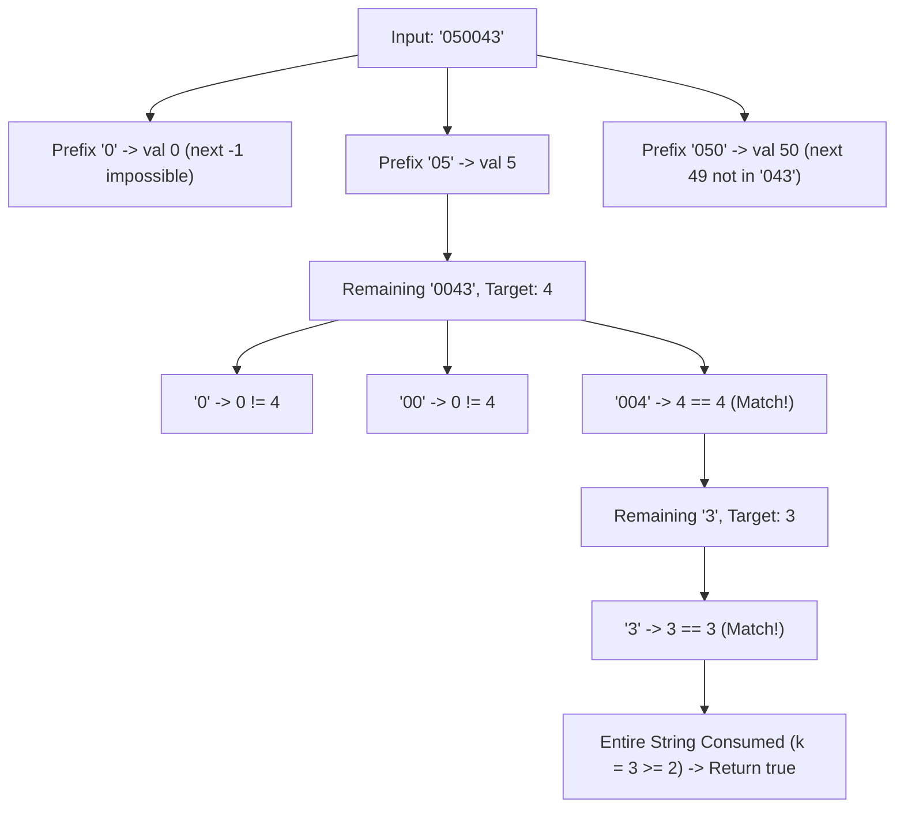

# Guided Example: Splitting a String Into Descending Consecutive Values

We trace the step-by-step backtracking search and numerical decomposition required to partition a digit string into descending consecutive integer values:

- **Input:** `s = "050043"`
- **Required Output:** `true`

This instance demonstrates how leading zeros affect numerical interpretation, how substrings of varying lengths can form unit-decrement sequences, and how backtracking prunes impossible branching paths.

---

## 1. Instance & Teaching Goal

We are given a string `s` containing only decimal digits.
We must determine whether `s` can be partitioned into $k \ge 2$ non-empty substrings $t_1, t_2, \dots, t_k$ such that their parsed numerical values $v_1, v_2, \dots, v_k$ strictly decrease by $1$ at each step:
$$v_{i+1} = v_i - 1 \quad \text{for all } 1 \le i < k$$
Leading zeros in any substring are permitted and evaluate to their normal decimal value (e.g., `"05"` has value $5$, `"004"` has value $4$).

In our instance:
- `s = "050043"` with length $n = 6$.
- Choosing first substring $t_1 = \text{"05"}$ yields $v_1 = 5$.
- Remaining string is `"0043"`. The next target value is $v_2 = 5 - 1 = 4$.
- Taking $t_2 = \text{"004"}$ yields $v_2 = 4$, which matches.
- Remaining string is `"3"`. The next target value is $v_3 = 4 - 1 = 3$.
- Taking $t_3 = \text{"3"}$ yields $v_3 = 3$, which matches.
- The full string is partitioned into $3 \ge 2$ valid substrings with values $(5, 4, 3)$.
- Result is `true`.

The teaching goal is to structure recursive backtracking: enumerating the first number length from $1$ to $n - 1$, and then deterministically checking whether subsequent prefixes match the forced decrement $v - 1$.

---

## 2. Conceptual Foundation & Invariants

### Unit-Decrement Partition Invariant Theorem

> **Digit Parsing & Unit Decrement Branching Invariant Theorem.**
> 1. *First-Choice Degree of Freedom:* Once the initial prefix $s[0 \dots m - 1]$ is fixed with numerical value $v_0$ (where $1 \le m < n$), the sequence of all subsequent values is strictly determined:
>    $$v_j = v_0 - j \quad \text{for } j \ge 1$$
> 2. *Prefix Uniqueness:* Because $v_{j+1} < v_j$ and consecutive positive numbers cannot share identical prefixes when leading zeros are constrained by remaining character length, at each recursive step at most one prefix of the remaining string can match the expected value $v - 1$.
> 3. *Non-Empty Partitioning:* The initial substring must satisfy $m < n$ so that at least two non-empty segments exist ($k \ge 2$).
> 4. *Backtracking Depth:* The length of `s` is at most $20$. Since numbers fit within standard integer limits and branch factor after the first number is $\le 1$, the search space is bounded by $\mathcal{O}(n^2)$ total operations.

---

## 3. Step-by-Step Worked Execution

We trace the search on `s = "050043"` with length $n = 6$.

---

### Phase 1: Try Initial Substring Length $m = 1$
- Slice: $s[0 \dots 0] = \text{"0"}$.
- Numerical value: $v_1 = 0$.
- Expected next value: $v_2 = 0 - 1 = -1$.
- Negative values cannot be formed from decimal digit strings.
- Branch pruned.

---

### Phase 2: Try Initial Substring Length $m = 2$
- Slice: $s[0 \dots 1] = \text{"05"}$.
- Numerical value: $v_1 = 5$.
- Remaining string: $s[2 \dots 5] = \text{"0043"}$.
- Expected next value: $v_2 = v_1 - 1 = 4$.

Now recursively search for $v_2 = 4$ in `"0043"`:
- Candidate prefix of length $1$: `"0"` $\to \text{value } 0 \neq 4$.
- Candidate prefix of length $2$: `"00"` $\to \text{value } 0 \neq 4$.
- Candidate prefix of length $3$: `"004"` $\to \text{value } 4 == 4$ (Match!).
  - Accept $t_2 = \text{"004"}$.
  - Remaining string: $s[5 \dots 5] = \text{"3"}$.
  - Expected next value: $v_3 = v_2 - 1 = 4 - 1 = 3$.

Now recursively search for $v_3 = 3$ in `"3"`:
- Candidate prefix of length $1$: `"3"` $\to \text{value } 3 == 3$ (Match!).
  - Accept $t_3 = \text{"3"}$.
  - Remaining string: $\emptyset$ (empty).

End of string reached!
Total segments formed: $k = 3 \ge 2$.
Valid sequence: $(5, 4, 3)$.
Return **`true`**.

---

## 4. Complete Execution Trace

| Attempted Path | Start Index | Substring Slice | Parsed Value | Target Expected | Comparison | Branch Outcome |
|:---:|:---:|:---:|:---:|:---:|:---:|:---|
| Path 1 | 0 | `"0"` | 0 | Any | Initial choice | Next target $-1$ impossible $\to$ Backtrack |
| Path 2.1 | 0 | `"05"` | 5 | Any | Initial choice | Next target $4$ required |
| Path 2.2 | 2 | `"0"` | 0 | 4 | $0 \neq 4$ | Extend prefix |
| Path 2.3 | 2 | `"00"` | 0 | 4 | $0 \neq 4$ | Extend prefix |
| Path 2.4 | 2 | `"004"` | 4 | 4 | $4 == 4$ | **Match** $\to$ Target $3$ required |
| Path 2.5 | 5 | `"3"` | 3 | 3 | $3 == 3$ | **Match** $\to$ End reached, Return `true` |

---

## 5. Algorithmic Correctness

**Soundness.** Every accepted partition guarantees that each segment parsed as an integer satisfies $v_{i+1} = v_i - 1$. The base case terminates only when all $n$ characters are consumed and $k \ge 2$, ensuring zero false positives.

**Completeness.** The search systematically tests all possible lengths for the first number $1 \le m < n$. For each first number, all potential prefix extensions in the remainder of the string are evaluated. If any valid decomposition exists, the depth-first search will encounter it.

---

## 6. Traps This Instance Exposes

- **Leading Zero Rejection:** Rejecting substrings with leading zeros (e.g. discarding `"05"` or `"004"`) would fail to discover the valid partition $(5, 4, 3)$.
- **Integer Overflow on String Conversion:** With length up to $20$, parsing the entire string or large slices requires 64-bit integer support (since $10^{20} > 2^{63} - 1$). However, the first number can be at most $n - 1$ digits.
- **Single Segment Partition:** Allowing the entire string $s[0 \dots n - 1]$ as one number violates the requirement of at least two non-empty substrings ($k \ge 2$).

---

## 7. Complexity Derivation

- **Time Complexity:** $\mathcal{O}(n^2)$ where $n \le 20$ is the length of `s`. There are $n - 1$ choices for the first number, and for each choice, greedily matching the forced decrement down the remaining string takes $\mathcal{O}(n)$ slicing and arithmetic checks.
- **Auxiliary Space Complexity:** $\mathcal{O}(n)$ call stack depth during recursion.
