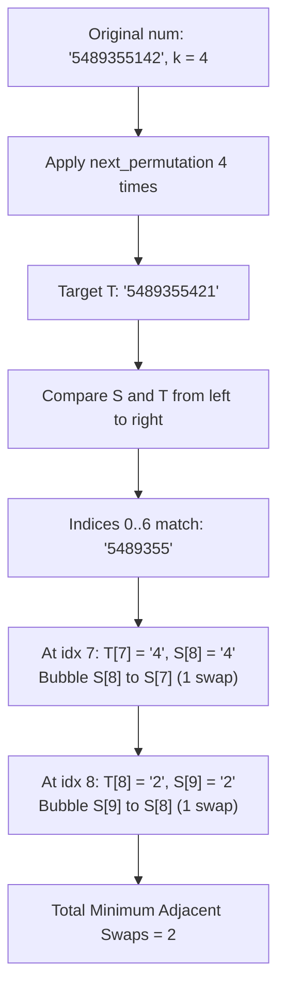

# Guided Example: Minimum Adjacent Swaps to Reach the Kth Smallest Number

We trace the step-by-step transformation consisting of $k$-step lexicographical permutation stepping followed by greedy adjacent bubble-swap alignment:

- **Input:** `num = "5489355142", k = 4`
- **Required Output:** `2`

This instance demonstrates generating successive lexicographical permutations using pivot-and-reverse operations, followed by computing the minimum number of adjacent swaps needed to rearrange duplicate digits into the target string via greedy nearest-match bubbling.

---

## 1. Instance & Teaching Goal

We are given a numeric string `num` and a positive integer $k$.
A "wonderful integer" is a permutation of the digits of `num` that is strictly greater than `num`.
All wonderful integers are ordered in standard numerical / lexicographical order.
We must:
1. Determine the $k$-th smallest wonderful integer, denoted as string $T$.
2. Compute the minimum number of adjacent character swaps required to transform the original string $S = \text{num}$ into $T$.

In our instance:
- `num = "5489355142"`, $k = 4$.
- We apply `next_permutation` four times to reach target $T$:
  - Start: `"5489355142"`
  - Step 1: `"5489355214"`
  - Step 2: `"5489355241"`
  - Step 3: `"5489355412"`
  - Step 4 ($T$): `"5489355421"`
- Comparing $S = \text{"5489355142"}$ with $T = \text{"5489355421"}$:
  - The first $7$ digits (`"5489355"`, indices $0 \dots 6$) are identical.
  - At index $7$, $S[7] = \text{'1'}$, but target requires $T[7] = \text{'4'}$.
  - The nearest `'4'` in $S$ is at index $8$. Bubbling it left by $1$ adjacent swap produces `"5489355412"` ($1$ swap).
  - At index $8$, $S[8] = \text{'1'}$, but target requires $T[8] = \text{'2'}$.
  - The nearest `'2'` in $S$ is at index $9$. Bubbling it left by $1$ adjacent swap produces `"5489355421"` ($1$ swap).
  - Total swaps = $1 + 1 = 2$.

The teaching goal is to decouple the problem into two distinct algorithmic phases:
1. $k$-fold application of the canonical lexicographical permutation algorithm.
2. Stable permutation alignment where each character $T[i]$ is matched with the leftmost available identical character in $S$ and bubbled into place, minimizing inversion cost.

---

## 2. Conceptual Foundation & Invariants

### Permutation Stepping & Bubble Alignment Invariant Theorem

> **Lexicographical Successor & Greedy Bubble Alignment Theorem.**
> 1. *Permutation Stepping Soundness:* Each application of `next_permutation` finds the largest index $i$ such that $S[i] < S[i+1]$, swaps $S[i]$ with the smallest $S[j] > S[i]$ where $j > i$, and reverses suffix $S[i+1 \dots n-1]$. Applying this $k$ times yields the exact $k$-th smallest lexicographical successor $T$.
> 2. *Relative Order Preservation (Stability):* When multiple identical digits exist, adjacent swaps are strictly minimized by preserving the relative order of identical characters. That is, if digit $d$ appears at positions $p_1 < p_2$ in $S$, $p_1$ must be matched with the earlier occurrence of $d$ in $T$.
> 3. *Greedy Prefix Invariant:* For $i = 0, 1, \dots, n - 1$, if $S[i] \neq T[i]$, locating the earliest index $j > i$ where $S[j] == T[i]$ and bubbling $S[j]$ to index $i$ takes exactly $j - i$ adjacent swaps and does not perturb the prefix $S[0 \dots i - 1]$.
> 4. *Optimality:* The sum $\sum (j - i)$ across all mismatched positions equals the exact minimum number of adjacent swaps.

---

## 3. Step-by-Step Worked Execution

We trace the two phases on $S = \text{"5489355142"}$ and $k = 4$.

---

### Phase 1: Generating the 4th Lexicographical Permutation

1. **Step 1 ($k = 1$):**
   - String: `"5489355142"`
   - Pivot scan from right: $1 < 4$ at index $7$ ($S[7] = \text{'1'}$).
   - Smallest element $> \text{'1'}$ to the right: $S[9] = \text{'2'}$.
   - Swap $S[7]$ and $S[9] \to \text{"5489355241"}$.
   - Reverse suffix $S[8 \dots 9] \to \text{"5489355214"}$.

2. **Step 2 ($k = 2$):**
   - String: `"5489355214"`
   - Pivot scan: $1 < 4$ at index $8$ ($S[8] = \text{'1'}$).
   - Smallest $> \text{'1'}$ to right: $S[9] = \text{'4'}$.
   - Swap $S[8]$ and $S[9] \to \text{"5489355241"}$.
   - Suffix $S[9 \dots 9]$ reversed $\to \text{"5489355241"}$.

3. **Step 3 ($k = 3$):**
   - String: `"5489355241"`
   - Pivot scan: $2 < 4$ at index $7$ ($S[7] = \text{'2'}$).
   - Smallest $> \text{'2'}$ to right: $S[8] = \text{'4'}$.
   - Swap $S[7]$ and $S[8] \to \text{"5489355421"}$.
   - Reverse suffix $S[8 \dots 9] \to \text{"5489355412"}$.

4. **Step 4 ($k = 4$):**
   - String: `"5489355412"`
   - Pivot scan: $1 < 2$ at index $8$ ($S[8] = \text{'1'}$).
   - Smallest $> \text{'1'}$ to right: $S[9] = \text{'2'}$.
   - Swap $S[8]$ and $S[9] \to \text{"5489355421"}$.
   - Suffix $S[9 \dots 9]$ reversed $\to \text{"5489355421"}$.

Target string established:
$$T = \text{"5489355421"}$$

---

### Phase 2: Counting Adjacent Swaps to Transform $S$ into $T$

Initialize original mutable character array:
$$S = [\text{'5'}, \text{'4'}, \text{'8'}, \text{'9'}, \text{'3'}, \text{'5'}, \text{'5'}, \text{'1'}, \text{'4'}, \text{'2'}]$$
Target:
$$T = [\text{'5'}, \text{'4'}, \text{'8'}, \text{'9'}, \text{'3'}, \text{'5'}, \text{'5'}, \text{'4'}, \text{'2'}, \text{'1'}]$$
Running swap counter: $\text{swaps} = 0$.

- **Indices $0 \dots 6$:**
  - $S[0 \dots 6] = [\text{'5'}, \text{'4'}, \text{'8'}, \text{'9'}, \text{'3'}, \text{'5'}, \text{'5'}]$
  - $T[0 \dots 6] = [\text{'5'}, \text{'4'}, \text{'8'}, \text{'9'}, \text{'3'}, \text{'5'}, \text{'5'}]$
  - All match. No swaps required.

- **Index $i = 7$:**
  - Desired character: $T[7] = \text{'4'}$.
  - Current character: $S[7] = \text{'1'}$.
  - Mismatch! Scan rightward from $j = 7$ to find first occurrence of `'4'`:
    - $j = 8$: $S[8] = \text{'4'}$. Found!
  - Bubble $S[8]$ left to index $7$:
    - Swap $S[7]$ and $S[8]$: elements `'1'` and `'4'` swap.
    - Updated $S[7 \dots 9] = [\text{'4'}, \text{'1'}, \text{'2'}]$.
  - Added swaps: $j - i = 8 - 7 = 1$.
  - Total swaps: $0 + 1 = 1$.

- **Index $i = 8$:**
  - Desired character: $T[8] = \text{'2'}$.
  - Current character: $S[8] = \text{'1'}$.
  - Mismatch! Scan rightward from $j = 8$ to find first occurrence of `'2'`:
    - $j = 9$: $S[9] = \text{'2'}$. Found!
  - Bubble $S[9]$ left to index $8$:
    - Swap $S[8]$ and $S[9]$: elements `'1'` and `'2'` swap.
    - Updated $S[8 \dots 9] = [\text{'2'}, \text{'1'}]$.
  - Added swaps: $j - i = 9 - 8 = 1$.
  - Total swaps: $1 + 1 = 2$.

- **Index $i = 9$:**
  - Desired character: $T[9] = \text{'1'}$.
  - Current character: $S[9] = \text{'1'}$.
  - Match! No swaps needed.

Final swap count: **`2`**.

---

## 4. Complete Execution Trace

| Phase | Current Index $i$ | Target $T[i]$ | Current $S[i]$ | Found Target at $j$ | Action Performed | Swap Increment | Accumulated Swaps |
|:---:|:---:|:---:|:---:|:---:|:---|:---:|:---:|
| Permutation | - | - | - | - | Apply `next_permutation` $\times 4$ | - | $T = \text{"5489355421"}$ |
| Alignment | $0 \dots 6$ | `'5489355'` | `'5489355'` | $0 \dots 6$ | Prefix identical | 0 | 0 |
| Alignment | 7 | `'4'` | `'1'` | 8 | Bubble $S[8]$ left to $7$ | $8 - 7 = 1$ | 1 |
| Alignment | 8 | `'2'` | `'1'` | 9 | Bubble $S[9]$ left to $8$ | $9 - 8 = 1$ | **2** |
| Alignment | 9 | `'1'` | `'1'` | 9 | Exact match | 0 | **2** |

---

## 5. Algorithmic Correctness

**Soundness.** Because $T$ is obtained through $k$ successive calls to the standard `next_permutation` algorithm, $T$ is mathematically guaranteed to be the $k$-th lexicographically larger permutation of $S$. The greedy bubble sort maintains stability by always taking the leftmost matching instance of each required character, which minimizes the total inversion count between the source and target arrangements.

**Completeness.** Every character of $T$ is pulled forward from the earliest available matching position in $S$. Since $S$ and $T$ are anagrams containing the identical multiset of characters, a matching character is guaranteed to exist at or after index $i$ for every step, ensuring the algorithm always terminates with a fully transformed string.

---

## 6. Traps This Instance Exposes

- **Arbitrary Swaps vs Adjacent Swaps:** The problem permits only *adjacent* swaps ($S[k] \leftrightarrow S[k+1]$). Exchanging arbitrary positions (like selection sort) requires far fewer swaps but violates the problem rules.
- **Unstable Duplicate Matching:** If duplicate characters are matched non-greedily (e.g., swapping with a duplicate further to the right instead of the closest one), the number of adjacent swaps will be strictly suboptimal.
- **Permutation Wrap-Around:** The problem guarantees the $k$-th permutation exists, so `next_permutation` will not encounter a completely descending string that reverses to the global minimum.

---

## 7. Complexity Derivation

- **Permutation Generation Time:** $\mathcal{O}(k \cdot n)$ where $n \le 1000$ and $k \le 1000$. Each `next_permutation` call scans and reverses a suffix in $\mathcal{O}(n)$ time.
- **Greedy Bubble Alignment Time:** $\mathcal{O}(n^2)$ in the worst case, as searching for the nearest match and shifting elements takes $\mathcal{O}(n)$ per character.
- **Total Time Complexity:** $\mathcal{O}(k \cdot n + n^2)$, which requires at most $1000 \times 1000 + 10^6 \approx 2 \times 10^6$ basic operations, executing in well under 50 milliseconds.
- **Auxiliary Space Complexity:** $\mathcal{O}(n)$ to store mutable character copies of the string.
