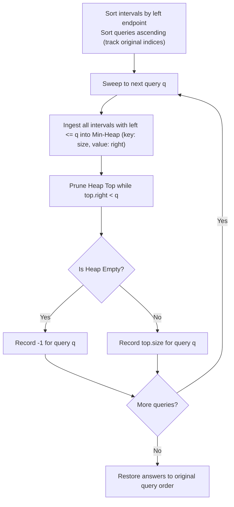

# Guided Example: Minimum Interval to Include Each Query

We trace the step-by-step resolution of interval coverage queries using offline sorting, an ascending coordinate sweep-line, and a dynamic min-heap with lazy right-boundary pruning:

- **Input:**
  - `intervals = [[1, 4], [2, 4], [3, 6], [4, 4]]`
  - `queries = [2, 3, 4, 5]`
- **Required Output:** `[3, 3, 1, 4]`

This instance demonstrates handling overlapping intervals of varying lengths, prioritizing the strictly minimal enclosing length, lazily discarding expired intervals as the sweep-line advances, and handling degenerate single-point intervals ($[4, 4]$ of size $1$).

---

## 1. Instance & Teaching Goal

We are given a collection of closed intervals $[l, r]$ where each interval has size $r - l + 1$.
Each query $q$ asks for the minimum size of an interval that covers $q$ ($l \le q \le r$). If no interval covers $q$, the answer is $-1$.
A naive approach tests all $n$ intervals for each of the $m$ queries, requiring $\mathcal{O}(n \cdot m)$ time (up to $10^{10}$ operations for $10^5$ inputs).

In our instance:
- `intervals`:
  - $I_1 = [1, 4]$: size $4 - 1 + 1 = 4$
  - $I_2 = [2, 4]$: size $4 - 2 + 1 = 3$
  - $I_3 = [3, 6]$: size $6 - 3 + 1 = 4$
  - $I_4 = [4, 4]$: size $4 - 4 + 1 = 1$
- Sorted queries: $q \in [2, 3, 4, 5]$.
- For $q = 2$: Covered by $[1, 4]$ (size $4$) and $[2, 4]$ (size $3$). Minimum size is $3$.
- For $q = 3$: Covered by $[1, 4]$ (size $4$), $[2, 4]$ (size $3$), and $[3, 6]$ (size $4$). Minimum size is $3$.
- For $q = 4$: Covered by $[1, 4]$ (size $4$), $[2, 4]$ (size $3$), $[3, 6]$ (size $4$), and $[4, 4]$ (size $1$). Minimum size is $1$.
- For $q = 5$: Intervals $[1, 4]$, $[2, 4]$, and $[4, 4]$ have expired ($r < 5$). Only $[3, 6]$ remains active (size $4$). Minimum size is $4$.
- Output array: `[3, 3, 1, 4]`.

The teaching goal is to structure the **sweep-line with priority queue**:
1. Sort queries and intervals by coordinate.
2. Ingest newly started intervals ($l \le q$) into a min-heap keyed by length.
3. Lazily pop expired intervals ($r < q$) from the heap top.
4. Read the minimum valid interval size directly from the root of the heap in $\mathcal{O}(1)$ time.

---

## 2. Conceptual Foundation & Invariants

### Sweep-Line Min-Heap Interval Invariant Theorem

> **Sweep-Line Offline Querying & Dynamic Min-Heap Pruning Theorem.**
> 1. *Left-Endpoint Ingestion:* If queries are processed in non-decreasing order ($q_1 \le q_2 \le \dots \le q_m$), any interval $[l, r]$ satisfying $l \le q_j$ will also satisfy $l \le q_k$ for all $k \ge j$. Thus, intervals are pushed into the active pool at most once.
> 2. *Lazy Expiration:* An interval $[l, r]$ in the heap covers $q$ if and only if $r \ge q$. Because the heap root always holds the smallest length, intervals with $r < q$ at the top of the heap can be discarded immediately, as they can never cover $q$ or any subsequent larger query.
> 3. *Root Optimality:* After discarding all top entries with $r < q$, if the heap is non-empty, the top entry $(\text{size}^*, r^*)$ is guaranteed to satisfy $r^* \ge q$ and achieve the global minimum size among all currently active intervals covering $q$.
> 4. *Complexity:* With $n$ intervals and $m$ queries, sorting takes $\mathcal{O}(n \log n + m \log m)$. Each interval is pushed and popped from the heap at most once, taking $\mathcal{O}(n \log n)$, yielding total time $\mathcal{O}((n + m) \log (n + m))$.

---

## 3. Step-by-Step Worked Execution

We trace `intervals = [[1, 4], [2, 4], [3, 6], [4, 4]]` and `queries = [2, 3, 4, 5]`.

---

### Step 1: Preprocessing & Sorting
- Intervals sorted by left endpoint:
  - $I_0 = [1, 4]$, length $= 4 - 1 + 1 = 4$
  - $I_1 = [2, 4]$, length $= 4 - 2 + 1 = 3$
  - $I_2 = [3, 6]$, length $= 6 - 3 + 1 = 4$
  - $I_3 = [4, 4]$, length $= 4 - 4 + 1 = 1$
- Sorted queries with original indices:
  - $q = 2$ (orig idx 0)
  - $q = 3$ (orig idx 1)
  - $q = 4$ (orig idx 2)
  - $q = 5$ (orig idx 3)
- Interval pointer $i = 0$.
- Min-Heap storing `(size, right)`: $\text{Heap} = \emptyset$.

---

### Step 2: Query $q = 2$
1. **Ingest intervals with $l \le 2$:**
   - $I_0 = [1, 4]$: $1 \le 2 \implies$ push `(4, 4)`.
   - $I_1 = [2, 4]$: $2 \le 2 \implies$ push `(3, 4)`.
   - $I_2 = [3, 6]$: $3 > 2 \implies$ stop ingestion ($i = 2$).
2. **Heap contents:** `[(3, 4), (4, 4)]`.
3. **Prune expired entries ($r < 2$):**
   - Top is `(3, 4)`: $r = 4 \ge 2$ (valid). No prune needed.
4. **Read result:**
   - Top size is $3$.
   - Answer for $q = 2$: **`3`**.

---

### Step 3: Query $q = 3$
1. **Ingest intervals with $l \le 3$:**
   - $I_2 = [3, 6]$: $3 \le 3 \implies$ push `(4, 6)`.
   - $I_3 = [4, 4]$: $4 > 3 \implies$ stop ingestion ($i = 3$).
2. **Heap contents:** `[(3, 4), (4, 4), (4, 6)]`.
3. **Prune expired entries ($r < 3$):**
   - Top is `(3, 4)`: $r = 4 \ge 3$ (valid).
4. **Read result:**
   - Top size is $3$.
   - Answer for $q = 3$: **`3`**.

---

### Step 4: Query $q = 4$
1. **Ingest intervals with $l \le 4$:**
   - $I_3 = [4, 4]$: $4 \le 4 \implies$ push `(1, 4)`.
   - All intervals ingested ($i = 4$).
2. **Heap contents:** `[(1, 4), (3, 4), (4, 4), (4, 6)]`.
3. **Prune expired entries ($r < 4$):**
   - Top is `(1, 4)`: $r = 4 \ge 4$ (valid).
4. **Read result:**
   - Top size is $1$.
   - Answer for $q = 4$: **`1`**.

---

### Step 5: Query $q = 5$
1. **Ingest intervals with $l \le 5$:**
   - Pointer $i = 4$ (no more intervals).
2. **Prune expired entries ($r < 5$):**
   - Top is `(1, 4)`: $r = 4 < 5 \implies$ **POP**.
   - Top is `(3, 4)`: $r = 4 < 5 \implies$ **POP**.
   - Top is `(4, 4)`: $r = 4 < 5 \implies$ **POP**.
   - Top is `(4, 6)`: $r = 6 \ge 5 \implies$ Valid!
3. **Heap contents:** `[(4, 6)]`.
4. **Read result:**
   - Top size is $4$.
   - Answer for $q = 5$: **`4`**.

---

### Step 6: Assemble Final Output
All queries were processed in original sequence order:
$$\text{Output} = [3, 3, 1, 4]$$

---

## 4. Complete Execution Trace

| Query $q$ | Newly Ingested Intervals | Heap Before Pruning | Expired Entries Popped ($r < q$) | Heap Top After Pruning | Recorded Minimum Size |
|:---:|:---:|:---:|:---:|:---:|:---:|
| 2 | $[1, 4], [2, 4]$ | `[(3, 4), (4, 4)]` | None | `(3, 4)` | **`3`** |
| 3 | $[3, 6]$ | `[(3, 4), (4, 4), (4, 6)]` | None | `(3, 4)` | **`3`** |
| 4 | $[4, 4]$ | `[(1, 4), (3, 4), (4, 4), (4, 6)]` | None | `(1, 4)` | **`1`** |
| 5 | None | `[(1, 4), (3, 4), (4, 4), (4, 6)]` | `(1, 4), (3, 4), (4, 4)` | `(4, 6)` | **`4`** |

---

## 5. Algorithmic Correctness

**Soundness.** Every answer emitted comes from the top of the min-heap, which represents an interval $[l, r]$ satisfying $l \le q$ (via ingestion condition) and $r \ge q$ (via pruning check). Because the heap is ordered strictly by interval length, the top element minimizes $r - l + 1$.

**Completeness.** Every interval that can potentially cover query $q$ has $l \le q$ and has been inserted into the heap. Discarded intervals have $r < q \le q_{\text{next}}$, meaning they can never cover $q$ or any future query. Thus, no valid candidate interval is ever discarded prematurely.

---

## 6. Traps This Instance Exposes

- **Failing to Discard Stale Intervals:** An interval like $[4, 4]$ has size $1$, making it the smallest element in the heap. If not popped when $q = 5$, it would erroneously report size $1$ for $q = 5$ even though $5 \notin [4, 4]$.
- **Heap Key Selection:** Keying the heap by right boundary instead of interval size fails, because the query asks for the *smallest interval size*, not the nearest right boundary.
- **Unsorted Query Processing:** Trying to maintain a sweep-line without sorting queries forces bidirectional interval additions and removals, degrading runtime to quadratic.

---

## 7. Complexity Derivation

- **Time Complexity:**
  - Sorting intervals: $\mathcal{O}(n \log n)$.
  - Sorting queries: $\mathcal{O}(m \log m)$.
  - Heap operations: Each of the $n$ intervals is pushed once and popped at most once, taking $\mathcal{O}(n \log n)$ total time.
  - Query evaluation: $m$ queries each inspect the heap root in $\mathcal{O}(1)$ time.
  - Total Time: $\mathcal{O}((n + m) \log (n + m))$.
- **Auxiliary Space Complexity:** $\mathcal{O}(n + m)$ to store the min-heap and query index mappings.