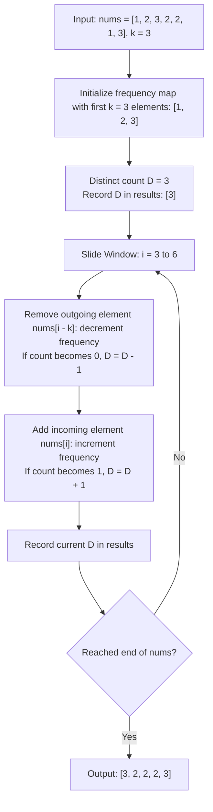

# Guided Example: Distinct Numbers in Each Subarray

We trace the step-by-step maintenance of distinct integer counts across every contiguous sliding window of fixed length $k$ using differential frequency tracking:

- **Input:** `nums = [1, 2, 3, 2, 2, 1, 3], k = 3`
- **Required Output:** `[3, 2, 2, 2, 3]`

This instance demonstrates initializing the frequency state for the primary window, updating distinct cardinality in $\mathcal{O}(1)$ time as elements enter and leave, and observing cardinality changes when duplicate values transition to and from zero occurrences.

---

## 1. Instance & Teaching Goal

We are given an integer array `nums` of length $n$ and a positive integer $k \le n$.
There are exactly $n - k + 1$ contiguous subarrays of length $k$.
For each window $[i, i + k - 1]$, we must count the number of unique integer values present.
A naive approach constructs a set for each window independently, requiring $\mathcal{O}(k)$ time per window and $\mathcal{O}((n - k + 1) \cdot k)$ overall time.

In our instance:
- `nums = [1, 2, 3, 2, 2, 1, 3]`, $n = 7, k = 3$.
- Total windows: $7 - 3 + 1 = 5$.
  - Window $0$ ($[0 \dots 2]$: `[1, 2, 3]`): Unique elements $\{1, 2, 3\} \to$ count $3$.
  - Window $1$ ($[1 \dots 3]$: `[2, 3, 2]`): Unique elements $\{2, 3\} \to$ count $2$.
  - Window $2$ ($[2 \dots 4]$: `[3, 2, 2]`): Unique elements $\{2, 3\} \to$ count $2$.
  - Window $3$ ($[3 \dots 5]$: `[2, 2, 1]`): Unique elements $\{1, 2\} \to$ count $2$.
  - Window $4$ ($[4 \dots 6]$: `[2, 1, 3]`): Unique elements $\{1, 2, 3\} \to$ count $3$.
- Resulting counts: `[3, 2, 2, 2, 3]`.

The teaching goal is to maintain a **frequency map alongside an explicit distinct counter**: when sliding from window $i - 1$ to window $i$, removing the outgoing element $\text{nums}[i - 1]$ and adding the incoming element $\text{nums}[i + k - 1]$ updates the distinct counter in $\mathcal{O}(1)$ operations, achieving linear $\mathcal{O}(n)$ total runtime.

---

## 2. Conceptual Foundation & Invariants

### Differential Frequency Tracking Invariant Theorem

> **Fixed-Size Sliding Window & Differential Cardinality Theorem.**
> 1. *Incremental Window Shift:* Let $W_i = \text{nums}[i \dots i + k - 1]$ be the $i$-th window. Moving to $W_{i+1}$ represents the multiset transformation:
>    $$W_{i+1} = (W_i \setminus \{\text{nums}[i]\}) \cup \{\text{nums}[i + k]\}$$
> 2. *Cardinality Invariant:* Let $\text{count}[x]$ record the frequency of value $x$ in the current window, and let $D = |\{x \mid \text{count}[x] > 0\}|$ be the number of distinct elements.
>    - When removing outgoing value $x_{\text{out}} = \text{nums}[i]$:
>      $$\text{count}[x_{\text{out}}] \gets \text{count}[x_{\text{out}}] - 1$$
>      If $\text{count}[x_{\text{out}}] = 0$, $D \gets D - 1$.
>    - When adding incoming value $x_{\text{in}} = \text{nums}[i + k]$:
>      $$\text{count}[x_{\text{in}}] \gets \text{count}[x_{\text{in}}] + 1$$
>      If $\text{count}[x_{\text{in}}] = 1$, $D \gets D + 1$.
> 3. *Constant-Time Amortization:* Each slide performs exactly one element deletion and one element insertion, evaluating $D$ in $\mathcal{O}(1)$ time. Total runtime across all $n - k + 1$ windows is strictly $\mathcal{O}(n)$.

---

## 3. Step-by-Step Worked Execution

We trace `nums = [1, 2, 3, 2, 2, 1, 3]` with $k = 3$.
Initialize frequency map $\text{freq} = \{\}$ and distinct counter $D = 0$.

---

### Step 1: Ingest Initial Window ($[0 \dots 2]$: `[1, 2, 3]`)
- Process $\text{nums}[0] = 1$: $\text{freq}[1] = 1$ (first occurrence, $D \gets 1$).
- Process $\text{nums}[1] = 2$: $\text{freq}[2] = 1$ (first occurrence, $D \gets 2$).
- Process $\text{nums}[2] = 3$: $\text{freq}[3] = 1$ (first occurrence, $D \gets 3$).
- Window $0$ complete: distinct count is $D = 3$.
- Append to results: `[3]`.

---

### Step 2: Slide to Window 1 ($[1 \dots 3]$: `[2, 3, 2]`)
- **Outgoing element:** $\text{nums}[0] = 1$.
  - Decrement: $\text{freq}[1] \gets 0$.
  - Frequency reached $0 \implies$ value $1$ is no longer in window: $D \gets 3 - 1 = 2$.
- **Incoming element:** $\text{nums}[3] = 2$.
  - Increment: $\text{freq}[2] \gets 1 + 1 = 2$.
  - Count was already $> 0 \implies$ duplicate entry, $D$ remains $2$.
- Window $1$ complete: $D = 2$.
- Append to results: `[3, 2]`.

---

### Step 3: Slide to Window 2 ($[2 \dots 4]$: `[3, 2, 2]`)
- **Outgoing element:** $\text{nums}[1] = 2$.
  - Decrement: $\text{freq}[2] \gets 2 - 1 = 1$.
  - Frequency is $1 > 0 \implies$ value $2$ is still present, $D$ remains $2$.
- **Incoming element:** $\text{nums}[4] = 2$.
  - Increment: $\text{freq}[2] \gets 1 + 1 = 2$.
  - Count was already $> 0 \implies$ duplicate entry, $D$ remains $2$.
- Window $2$ complete: $D = 2$.
- Append to results: `[3, 2, 2]`.

---

### Step 4: Slide to Window 3 ($[3 \dots 5]$: `[2, 2, 1]`)
- **Outgoing element:** $\text{nums}[2] = 3$.
  - Decrement: $\text{freq}[3] \gets 0$.
  - Frequency reached $0 \implies$ value $3$ exits window: $D \gets 2 - 1 = 1$.
- **Incoming element:** $\text{nums}[5] = 1$.
  - Increment: $\text{freq}[1] \gets 1$.
  - Count was $0 \implies$ value $1$ newly enters window: $D \gets 1 + 1 = 2$.
- Window $3$ complete: $D = 2$.
- Append to results: `[3, 2, 2, 2]`.

---

### Step 5: Slide to Window 4 ($[4 \dots 6]$: `[2, 1, 3]`)
- **Outgoing element:** $\text{nums}[3] = 2$.
  - Decrement: $\text{freq}[2] \gets 2 - 1 = 1$.
  - Frequency is $1 > 0 \implies$ value $2$ still present, $D$ remains $2$.
- **Incoming element:** $\text{nums}[6] = 3$.
  - Increment: $\text{freq}[3] \gets 1$.
  - Count was $0 \implies$ value $3$ newly enters window: $D \gets 2 + 1 = 3$.
- Window $4$ complete: $D = 3$.
- Append to results: `[3, 2, 2, 2, 3]`.

---

### Step 6: Finalization
All $5$ windows processed.
Emitted answer: **`[3, 2, 2, 2, 3]`**.

---

## 4. Complete Execution Trace

| Window Index | Slice Range | Outgoing Element ($x_{\text{out}}$) | Incoming Element ($x_{\text{in}}$) | Updated Frequency Map | Distinct Count $D$ | Recorded Result |
|:---:|:---:|:---:|:---:|:---:|:---:|:---:|
| 0 | `nums[0..2]` | None (Init) | $1, 2, 3$ | $\{1:1, 2:1, 3:1\}$ | 3 | `[3]` |
| 1 | `nums[1..3]` | $\text{nums}[0] = 1$ ($\text{cnt} \to 0$) | $\text{nums}[3] = 2$ ($\text{cnt} \to 2$) | $\{2:2, 3:1\}$ | 2 | `[3, 2]` |
| 2 | `nums[2..4]` | $\text{nums}[1] = 2$ ($\text{cnt} \to 1$) | $\text{nums}[4] = 2$ ($\text{cnt} \to 2$) | $\{2:2, 3:1\}$ | 2 | `[3, 2, 2]` |
| 3 | `nums[3..5]` | $\text{nums}[2] = 3$ ($\text{cnt} \to 0$) | $\text{nums}[5] = 1$ ($\text{cnt} \to 1$) | $\{1:1, 2:2\}$ | 2 | `[3, 2, 2, 2]` |
| 4 | `nums[4..6]` | $\text{nums}[3] = 2$ ($\text{cnt} \to 1$) | $\text{nums}[6] = 3$ ($\text{cnt} \to 1$) | $\{1:1, 2:1, 3:1\}$ | 3 | **`[3, 2, 2, 2, 3]`** |

---

## 5. Algorithmic Correctness

**Soundness.** At every step, $D$ tracks the exact cardinality of keys in the frequency map with count strictly greater than zero. When an element count reaches zero, it is pruned or discounted, ensuring no departed value falsely inflates $D$.

**Completeness.** Every window from $i = 0$ to $n - k$ is visited consecutively. The sliding-window transition preserves the invariant that the multiset in the tracker matches the elements $\text{nums}[i \dots i + k - 1]$, guaranteeing the emitted array contains the true distinct count for every valid subarray.

---

## 6. Traps This Instance Exposes

- **Premature Cardinality Decrement:** Decrementing the distinct count whenever any element is removed, without checking if its remaining frequency is zero. When `2` is removed from `[2, 3, 2]`, another `2` remains, so the distinct count must not decrement.
- **Rebuilding Sets From Scratch:** Re-populating a set for each window takes $\mathcal{O}(n \cdot k)$ time, which for $n = 10^5$ and $k = 5 \times 10^4$ leads to $2.5 \times 10^9$ operations and Time Limit Exceeded.
- **Hash Table vs Direct Array:** Since maximum element value is $\le 10^5$, using a fixed-size integer array for frequency counting provides cache-friendly $\mathcal{O}(1)$ direct indexing.

---

## 7. Complexity Derivation

- **Time Complexity:** $\mathcal{O}(n)$, where $n$ is the length of `nums`. The first window takes $\mathcal{O}(k)$ operations, and each of the subsequent $n - k$ window shifts takes $\mathcal{O}(1)$ time.
- **Auxiliary Space Complexity:** $\mathcal{O}(\min(k, U))$ where $U$ is the number of distinct values in any window (at most $\min(k, 10^5)$), plus $\mathcal{O}(n - k + 1)$ to store the output array.
