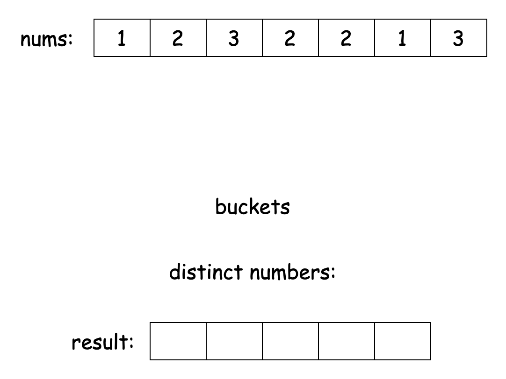
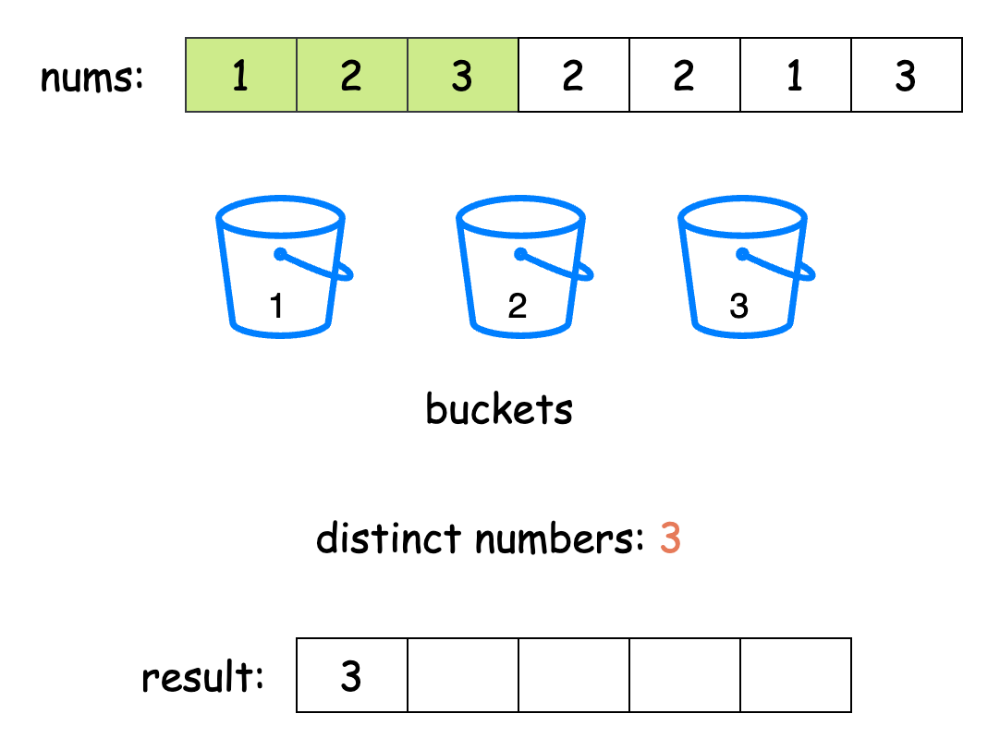
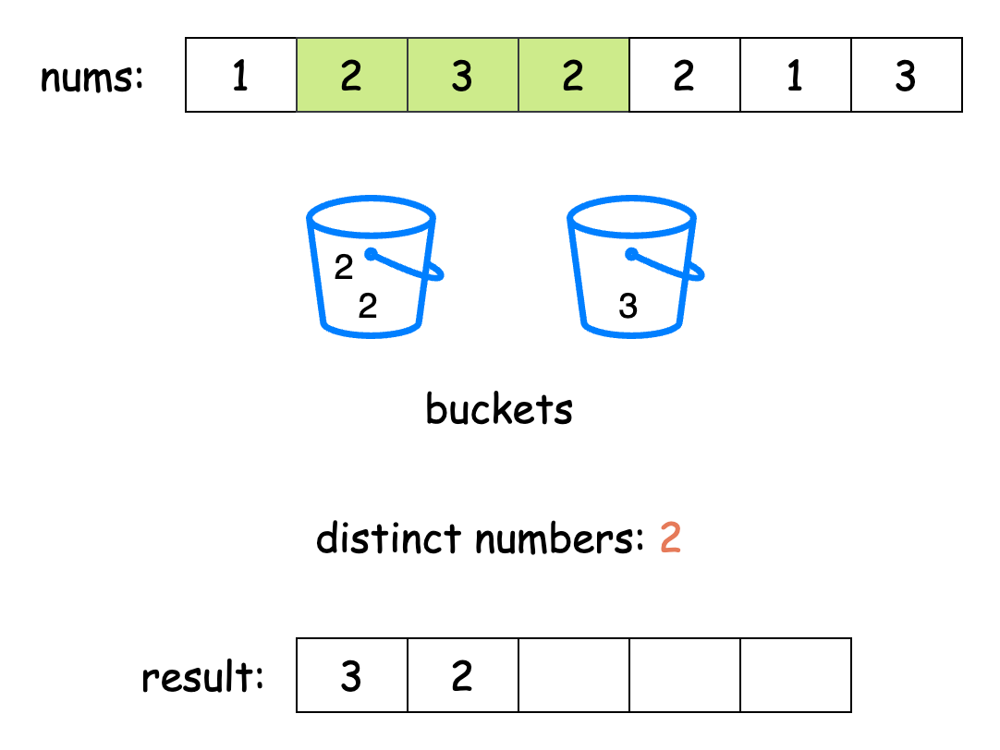
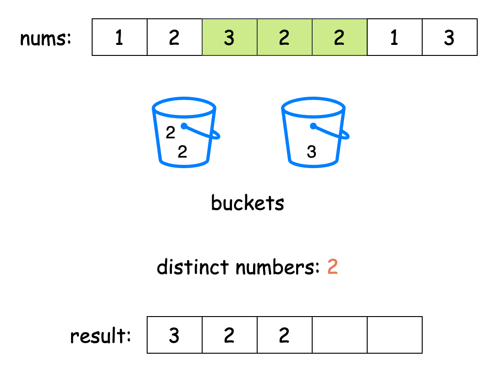
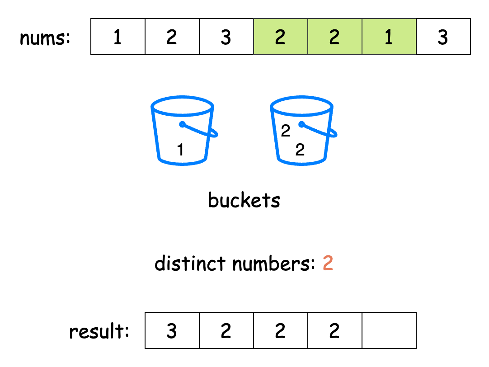
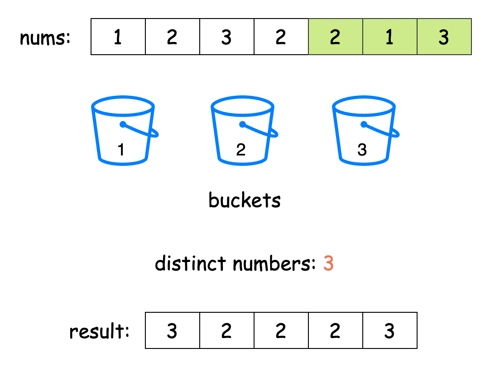

[TOC]

## Solution

---

### Approach 1: Hash Map

#### Intuition

We are asked to find the number of distinct numbers in every `k`-size subarray of the input array `nums`. This problem can be broken down into two main challenges we have to optimally solve:
1. Find each subarray efficiently.
2. Gather all the distinct numbers in the subarray.

Let's focus on the first one. Notice that each subarray is actually a fixed-size window in the array, which keeps moving. For example, the first subarray contains elements from index `0` to $k - 1$. When we slide this window one position right, we get the second subarray, which spans from index `1` to `k`. This technique is called the fixed-size [sliding window](https://leetcode.com/explore/learn/card/array-and-string/204/sliding-window/) approach. It's efficient because getting the next subarray only requires removing the leftmost element and adding one new element, instead of creating entirely new subarrays.

Now that we can efficiently identify each subarray, how do we count all distinct numbers in it? Imagine assigning a bucket to each number we encounter, grouping all instances of the same number into their respective buckets. After grouping the numbers in a subarray, the total number of distinct elements equals the number of buckets. Moving to the next subarray is now straightforward: remove the number that leaves the window from its bucket and add the new number in the window to its bucket. If a bucket becomes empty during this process, we can simply discard it.

The slideshow below demonstrates this idea:













We can simulate this process using a hash map to keep track of the frequency of each element in the current subarray. First, we initialize the hash map by counting the frequency of elements in the initial window of `k` elements. For each subsequent window, we perform two operations:
1. We decrement the count of the number leaving the window (the leftmost element) from the hash map. If its count drops to zero, we remove it from the hash map, since it no longer contributes to the distinct count.
2. We increment the count of the number entering the window (the rightmost element) in the hash map. If this number wasn’t already in the hash map, we add it with a count of `1`.

As we slide this window across the array, the size of our hash map at each step tells us how many distinct elements are in that window. We store these counts in our `answer` array and return it when we're done.

> For a more comprehensive understanding of hash maps, check out the [Hash Table Explore Card 🔗](https://leetcode.com/explore/learn/card/hash-table/). This resource provides an in-depth look at hash maps, explaining their key concepts and applications with a variety of problems to solidify understanding of the pattern.

#### Algorithm

- Initialize:
  - a variable `len` to store the length of the input array `nums`.
  - an `answer` array of size $len - k + 1$ to store the results for each window.
  - a frequency map `freqMap` to store the count of each number in the current window.
- Process the first window by iterating from position (`pos`) `0` to $k - 1$:
   - For each number, increment its count in `freqMap` or initialize it to `1` if not present.
- Store the size of the frequency map at index `0` of the `answer` array, representing the count of distinct numbers in the first window.
- Process the remaining windows by iterating from position `k` to $len - 1$:
  - Get the leftmost number from the previous window, i.e. $nums[pos - k]$.
  - Decrement its count in the frequency map.
  - If its count becomes `0`, remove the number from the frequency map.
  - Get the rightmost number of the current window, i.e. $\text{nums}[pos]$.
  - Increment its count in the frequency map, initializing to `1` if not present.
  - Store the size of the frequency map at the appropriate index in the `answer` array.
- Return the `answer` array containing the count of distinct numbers for each window.

#### Implementation

```python
class Solution:
    def distinctNumbers(self, nums: List[int], k: int) -> List[int]:
        len_nums = len(nums)
        answer = [0] * (len_nums - k + 1)

        # Track frequency of numbers in current window
        freq = {}

        # Process first window
        for num in nums[:k]:
            freq[num] = freq.get(num, 0) + 1
        answer[0] = len(freq)

        # Slide window and update counts
        for pos in range(k, len_nums):
            # Remove leftmost element
            left = nums[pos - k]
            freq[left] -= 1
            if freq[left] == 0:
                del freq[left]

            # Add rightmost element
            right = nums[pos]
            freq[right] = freq.get(right, 0) + 1

            answer[pos - k + 1] = len(freq)

        return answer
```

#### Complexity Analysis

Let $n$ be the length of the input array `nums`.

- Time complexity: $O(n)$

    The algorithm processes each element exactly once. For the first window, we process `k` elements to build the initial frequency map, which takes $O(k)$ time. For subsequent windows, we process the remaining $(n - k)$ elements, performing constant time operations (map updates and size checks) for each. Thus, the total time complexity is $O(k + (n - k)) = O(n)$.

- Space complexity: $O(\text{maxValue})$

    The space complexity is determined by the frequency dictionary `freq`, which stores the count of unique elements in the current window. The size of this dictionary depends on the maximum value in the input (`maxValue`), as the keys in the dictionary are the distinct values from `nums`. In the worst case, if all elements in the window are unique, the dictionary will store up to $k$ key-value pairs. However, since the values in `nums` can range up to `maxValue`, the space required for the frequency dictionary is $O(\text{maxValue})$.

    Note that the output list `answer` is not counted in the space complexity, as it is part of the required output and not auxiliary space. Therefore, the overall space complexity is $O(\text{maxValue})$.

---

### Approach 2: Frequency Array

#### Intuition

While we typically think of hash map operations as taking constant time, this isn't always true. In reality, these operations are amortized $O(1)$, meaning they usually take constant time but can sometimes slow down to $O(n)$, especially with large datasets. Hash maps also carry extra overhead due to their hash functions and pointer management.

This is why sometimes it's better to use a frequency array instead of a hash map. A frequency array works similarly to a map, with the index of the array serving as the key and the element stored at that index as the value. In this problem, using such an array is possible, as the largest value in `nums` is relatively small ($\text{nums}[i] <= 10^5$). Overall, this approach is more time-efficient because array operations are guaranteed to take constant time and don't have the extra overhead that hash maps do.

We create a frequency array called `freq` to track how often each number appears. As we slide our window across the array `nums`, we update these frequencies just like we did with the hash map approach.

However, since we can't simply check the size of our data structure to count distinct elements anymore, we need a new strategy. We'll use a variable called `distinctCount` to keep track of how many different numbers we have. When we add a new number and its frequency becomes `1`, we increase `distinctCount` because we've found a new unique number. Similarly, when we remove a number and its frequency drops to `0`, we decrease `distinctCount` because we've lost a unique number.

After each window moves, we store the current value of `distinctCount` in our answer array. Once we've checked all windows, we return this array as our final answer.

#### Algorithm

- Find the maximum value in the input array `nums` and store it in `maxValue`.
- Initialize:
  - an array `freq` of size $maxValue + 1$ to store the frequency of each number.
  - a variable `distinctCount` to `0` to track the count of distinct numbers in the current window.
  - an `answer` array of size $\text{nums.length} - k + 1$ to store the results for each window.
- Iterate through the input array from index `0` to $\text{nums.length} - 1$:
  - Increment the frequency of the current number in the `freq` array.
  - If the frequency becomes `1`, increment `distinctCount` as we found a new distinct number.
  - If the current position is greater than or equal to `k`:
- Decrement the frequency of the number that's leaving the window.
- If its frequency becomes `0`, decrement `distinctCount` as we lost a distinct number.
  - If the current position plus 1 is greater than or equal to `k`:
- Store the current `distinctCount` in the answer array.
- Return the `answer` array containing the count of distinct numbers for each window.

#### Implementation

```python
class Solution:
    def distinctNumbers(self, nums: List[int], k: int) -> List[int]:
        # Find the maximum value in nums
        max_value = max(nums)

        # Create a frequency array based on the maximum value
        freq = [0] * (max_value + 1)
        distinct = 0
        answer = []

        for pos in range(len(nums)):
            # Add new number
            freq[nums[pos]] += 1
            if freq[nums[pos]] == 1:
                distinct += 1

            # Remove old number
            if pos >= k:
                freq[nums[pos - k]] -= 1
                if freq[nums[pos - k]] == 0:
                    distinct -= 1

            # Store result for complete window
            if pos + 1 >= k:
                answer.append(distinct)

        return answer
```

#### Complexity Analysis

Let $n$ be the length of the input array `nums`.

- Time complexity: $O(n)$

    The algorithm processes each element in the array exactly once in a single pass. For each element, we perform constant time operations: incrementing/decrementing frequencies, updating `distinctCount`, and storing results in the `answer` array.

    Therefore, the time complexity is linear with respect to the input size, $O(n)$.

- Space complexity: $O(\text{maxValue})$

    The space complexity is determined by the frequency array `freq`, which has a size of $\text{maxValue} + 1$. This array is used to store the count of each unique value in the current window. Since the size of this array depends on the maximum value in `nums` and not on the size of the input list `nums`, the space complexity is $O(\text{maxValue})$.

    Note that the output list `answer` is not counted in the space complexity, as it is part of the required output and not auxiliary space. Therefore, the overall space complexity is $O(\text{maxValue})$.

---