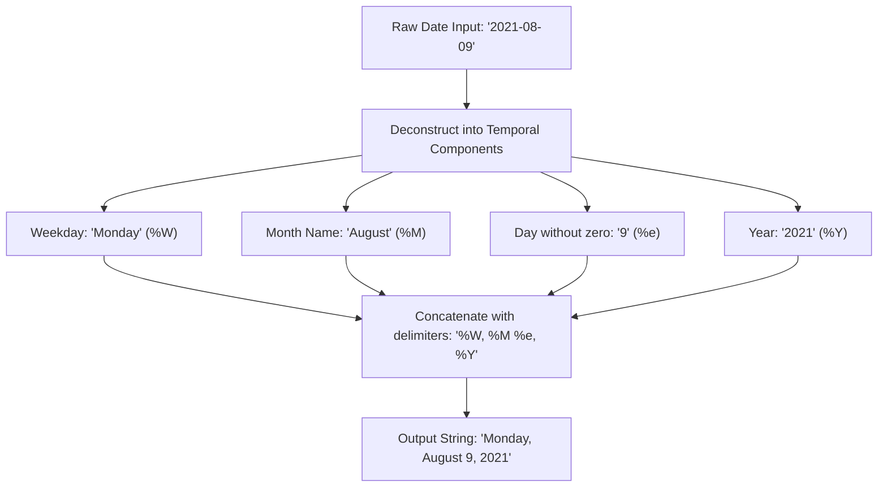

# Guided Example: Convert Date Format

We trace the step-by-step projection and text serialization of calendar dates into formatted English strings:

- **Input:**
  - `Days` table:
    - Row 1: `day = 2022-04-12`
    - Row 2: `day = 2021-08-09`
    - Row 3: `day = 2020-06-26`
- **Required Output:**

| day |
|:---|
| Tuesday, April 12, 2022 |
| Monday, August 9, 2021 |
| Friday, June 26, 2020 |

This instance demonstrates decomposing standard ISO dates (`YYYY-MM-DD`) into calendar components (day of week, full month name, unpadded day of month, four-digit year) and formatting them with exact punctuation.

---

## 1. Instance & Teaching Goal

We are given a database relation `Days` containing individual date records.
We must project each date into a formatted string adhering to the pattern:
$$\text{"day\_name, month\_name day, year"}$$
Key formatting requirements include:
1. Full English weekday name (e.g., `"Tuesday"`, `"Monday"`, `"Friday"`).
2. Full English month name (e.g., `"April"`, `"August"`, `"June"`).
3. Day of the month as an unpadded integer without leading zeros (e.g., `"9"` instead of `"09"`, `"12"`, `"26"`).
4. Four-digit Gregorian calendar year (e.g., `"2022"`, `"2021"`, `"2020"`).
5. Exact punctuation: a comma and space following the weekday name, a space following the month name, and a comma and space following the day of the month.

The teaching goal is to understand temporal projection functions (`DATE_FORMAT` in MySQL or `TO_CHAR` with trimming in PostgreSQL/Oracle) and their component specifiers without altering table cardinality or row identities.

---

## 2. Conceptual Foundation & Invariants

### Temporal Serialization Invariant Theorem

> **Temporal Component Projection & String Formatting Invariant Theorem.**
> 1. *Bijective Calendar Mapping:* Every valid calendar date $D = (Y, M, d)$ deterministically maps to a unique 4-tuple:
>    $$\phi(D) = (\text{WeekdayName}(D), \text{MonthName}(M), d, Y)$$
> 2. *Zero-Padding Invariant:* The day of the month $d \in [1, 31]$ must be represented as its raw decimal integer without leading zero padding ($d$, not $0d$).
> 3. *Cardinality Preservation:* Because date formatting is a pure unary row-level projection ($f: \text{Date} \to \text{String}$), no filtering, deduplication, or grouping is performed. The output relation retains the exact cardinality of the input table:
>    $$|\text{Output}| = |\text{Days}|$$

---

## 3. Step-by-Step Worked Execution

We trace each date in the sample relation:

---

### Step 1: Process Date `2022-04-12`
- Year: $Y = 2022$.
- Month: $M = 04 \implies$ full English month name is `"April"`.
- Day of month: $d = 12 \implies$ integer representation without leading zeros is `"12"`.
- Day of week calculation for April 12, 2022: `"Tuesday"`.
- Apply punctuation template:
  $$\text{"Tuesday"} + \text{", "} + \text{"April"} + \text{" "} + \text{"12"} + \text{", "} + \text{"2022"} = \text{"Tuesday, April 12, 2022"}$$

---

### Step 2: Process Date `2021-08-09`
- Year: $Y = 2021$.
- Month: $M = 08 \implies$ full English month name is `"August"`.
- Day of month: $d = 09 \implies$ stripped of leading zero becomes `"9"`.
- Day of week calculation for August 9, 2021: `"Monday"`.
- Apply punctuation template:
  $$\text{"Monday"} + \text{", "} + \text{"August"} + \text{" "} + \text{"9"} + \text{", "} + \text{"2021"} = \text{"Monday, August 9, 2021"}$$

---

### Step 3: Process Date `2020-06-26`
- Year: $Y = 2020$.
- Month: $M = 06 \implies$ full English month name is `"June"`.
- Day of month: $d = 26 \implies$ unpadded integer is `"26"`.
- Day of week calculation for June 26, 2020: `"Friday"`.
- Apply punctuation template:
  $$\text{"Friday"} + \text{", "} + \text{"June"} + \text{" "} + \text{"26"} + \text{", "} + \text{"2020"} = \text{"Friday, June 26, 2020"}$$

---

### Step 4: Relation Assembly
The formatted rows are projected under the required output column name `day`:

| day |
|:---|
| Tuesday, April 12, 2022 |
| Monday, August 9, 2021 |
| Friday, June 26, 2020 |

---

## 4. Complete Execution Trace

| Input ISO Date | Weekday Name | Month Name | Unpadded Day | 4-Digit Year | Assembled Formatted String |
|:---:|:---:|:---:|:---:|:---:|:---|
| `2022-04-12` | `Tuesday` | `April` | `12` | `2022` | `"Tuesday, April 12, 2022"` |
| `2021-08-09` | `Monday` | `August` | `9` (no zero) | `2021` | `"Monday, August 9, 2021"` |
| `2020-06-26` | `Friday` | `June` | `26` | `2020` | `"Friday, June 26, 2020"` |

---

## 5. Algorithmic Correctness

**Soundness.** Each output value strictly conforms to the exact specification: English weekday spelled in full, English month spelled in full, day without leading zeros, and four-digit year, delimited by commas and spaces as specified.

**Completeness.** A unary projection evaluates every row in `Days` independently, ensuring no date is dropped or modified beyond the requested formatting.

---

## 6. Traps This Instance Exposes

- **Leading Zero in Day Format:** Using `%d` (which outputs two digits like `"09"`) instead of `%e` (which outputs unpadded `"9"`). For August 9, `%d` would produce `"Monday, August 09, 2021"`, which fails string equality against `"Monday, August 9, 2021"`.
- **Abbreviated Month or Weekday:** Using `%a` (e.g. `"Tue"`) or `%b` (e.g. `"Apr"`) rather than the full names `%W` and `%M`.
- **Column Alias Missing:** Omitting the column alias `AS day` causes SQL engines to name the output column after the expression (e.g. `DATE_FORMAT(...)`), failing schema validation.

---

## 7. Complexity Derivation

- **Time Complexity:** $\mathcal{O}(R)$ where $R$ is the number of rows in the `Days` table. Each date undergoes a constant-time string serialization.
- **Auxiliary Space Complexity:** $\mathcal{O}(1)$ beyond the memory required to buffer the output stream.
