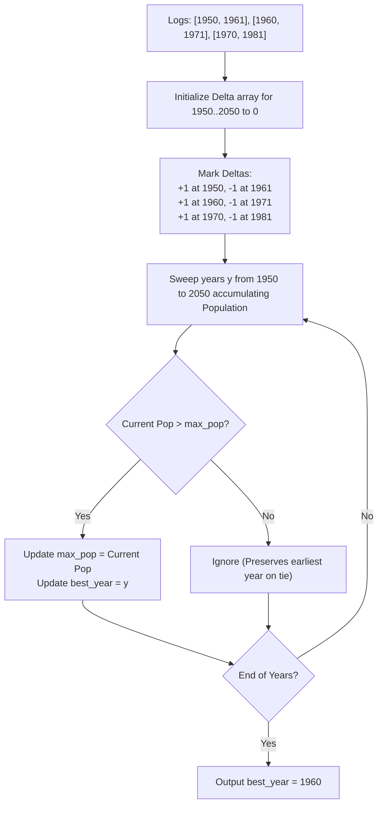

# Guided Example: Maximum Population Year

We trace the step-by-step calculation of annual population counts using a 1D difference array (sweep-line) and prefix accumulation to identify the earliest year of peak population:

- **Input:** `logs = [[1950, 1961], [1960, 1971], [1970, 1981]]`
- **Required Output:** `1960`

This instance illustrates lifetime interval coverage where birth years are included while death years are excluded, overlapping lifespan transitions, and breaking peak population ties by selecting the strictly earliest calendar year.

---

## 1. Instance & Teaching Goal

We are given a list of lifetime logs where each entry $[b, d]$ represents a person born in year $b$ and dying in year $d$.
A person is counted as alive in all years $y$ such that:
$$b \le y \le d - 1$$
In the year of death $d$, the person is no longer alive.
We seek the earliest year that achieves the maximum alive population.

In our instance:
- Person 1 ($[1950, 1961]$): Alive during years $1950, 1951, \dots, 1960$. (Expires at start of 1961).
- Person 2 ($[1960, 1971]$): Alive during years $1960, 1961, \dots, 1970$. (Expires at start of 1971).
- Person 3 ($[1970, 1981]$): Alive during years $1970, 1971, \dots, 1980$. (Expires at start of 1981).
- Year analysis:
  - $1950 \dots 1959$: Only Person 1 is alive $\implies$ population $= 1$.
  - $1960$: Both Person 1 and Person 2 are alive $\implies$ population $= 2$.
  - $1961 \dots 1969$: Person 1 has died; only Person 2 is alive $\implies$ population $= 1$.
  - $1970$: Both Person 2 and Person 3 are alive $\implies$ population $= 2$.
  - $1971 \dots 1980$: Person 2 has died; only Person 3 is alive $\implies$ population $= 1$.
- Maximum population attained is $2$, occurring in years $1960$ and $1970$.
- By the tie-breaking rule, the earliest year wins: $\min(1960, 1970) = 1960$.

The teaching goal is to use a **difference array**: recording a $+1$ delta at year $b$ and a $-1$ delta at year $d$, followed by a running prefix sum scan over the bounded interval $[1950, 2050]$.

---

## 2. Conceptual Foundation & Invariants

### Difference Array Sweep-Line Invariant Theorem

> **Difference Array Sweep-Line & Prefix Accumulation Theorem.**
> 1. *Delta Encoding:* Adding $1$ to every year in $[b, d - 1]$ is equivalent to setting:
>    $$\Delta[b] \gets \Delta[b] + 1, \quad \Delta[d] \gets \Delta[d] - 1$$
> 2. *Prefix Reconstruction:* The exact population living in calendar year $y$ is the cumulative sum of all deltas up to and including $y$:
>    $$\text{Pop}(y) = \sum_{t = 1950}^y \Delta[t]$$
> 3. *Earliest Maximizer Invariant:* As the sweep advances from $y = 1950$ to $2050$, maintaining the running maximum $\text{Pop}_{\max}$ and updating $y^* \gets y$ strictly when $\text{Pop}(y) > \text{Pop}_{\max}$ guarantees that $y^*$ stores the earliest year achieving $\text{Pop}_{\max}$. Ties ($\text{Pop}(y) = \text{Pop}_{\max}$) are ignored, preserving the minimal year.
> 4. *Bounded Domain Efficiency:* Because years span $1950$ to $2050$ (a fixed domain of $101$ integers), constructing and accumulating deltas takes $\mathcal{O}(n + Y)$ time and $\mathcal{O}(Y)$ space where $Y = 101$.

---

## 3. Step-by-Step Worked Execution

We trace the difference array offset by baseline year $1950$: index $i = \text{year} - 1950$.

---

### Step 1: Populate the Delta Array
Initialize $\Delta[0 \dots 100] = 0$.

1. **Log 1 (`[1950, 1961]`):**
   - Birth: $\text{year } 1950 \implies \Delta[1950] \gets \Delta[1950] + 1 = +1$.
   - Death: $\text{year } 1961 \implies \Delta[1961] \gets \Delta[1961] - 1 = -1$.
2. **Log 2 (`[1960, 1971]`):**
   - Birth: $\text{year } 1960 \implies \Delta[1960] \gets \Delta[1960] + 1 = +1$.
   - Death: $\text{year } 1971 \implies \Delta[1971] \gets \Delta[1971] - 1 = -1$.
3. **Log 3 (`[1970, 1981]`):**
   - Birth: $\text{year } 1970 \implies \Delta[1970] \gets \Delta[1970] + 1 = +1$.
   - Death: $\text{year } 1981 \implies \Delta[1981] \gets \Delta[1981] - 1 = -1$.

Non-zero entries in $\Delta$:
- $\Delta[1950] = +1$
- $\Delta[1960] = +1$
- $\Delta[1961] = -1$
- $\Delta[1970] = +1$
- $\Delta[1971] = -1$
- $\Delta[1981] = -1$

---

### Step 2: Sweep and Accumulate Running Population
Initialize $\text{running\_pop} = 0$, $\text{max\_pop} = 0$, $\text{best\_year} = 1950$.

- **Year 1950:** $\text{running\_pop} = 0 + 1 = 1$.
  - $1 > 0 \implies \text{max\_pop} \gets 1, \text{best\_year} \gets 1950$.
- **Years 1951–1959:** Deltas are $0$.
  - $\text{running\_pop} = 1$. Not strictly greater than $\text{max\_pop} = 1$.
- **Year 1960:** $\Delta[1960] = +1 \implies \text{running\_pop} = 1 + 1 = 2$.
  - $2 > 1 \implies \text{max\_pop} \gets 2, \text{best\_year} \gets 1960$.
- **Year 1961:** $\Delta[1961] = -1 \implies \text{running\_pop} = 2 - 1 = 1$.
  - $1 \ngtr 2 \implies$ unchanged.
- **Years 1962–1969:** Deltas are $0 \implies \text{running\_pop} = 1$.
- **Year 1970:** $\Delta[1970] = +1 \implies \text{running\_pop} = 1 + 1 = 2$.
  - Compare with $\text{max\_pop} = 2$: $2 \ngtr 2$ (tie).
  - Condition for update requires strict inequality ($>$) to keep the earliest year.
  - $\text{best\_year}$ remains $1960$.
- **Year 1971:** $\Delta[1971] = -1 \implies \text{running\_pop} = 2 - 1 = 1$.
- **Year 1981:** $\Delta[1981] = -1 \implies \text{running\_pop} = 1 - 1 = 0$.
- **Years 1982–2050:** $\text{running\_pop} = 0$.

---

### Step 3: Final Selection
Maximum population: $2$.
Earliest year: **`1960`**.

---

## 4. Complete Execution Trace

| Calendar Year | Delta Encountered $\Delta[y]$ | Running Population $\text{Pop}(y)$ | Is Strict New Max? | $\text{max\_pop}$ | Current $\text{best\_year}$ |
|:---:|:---:|:---:|:---:|:---:|:---:|
| 1950 | $+1$ | $1$ | **Yes** ($1 > 0$) | 1 | 1950 |
| $1951 \dots 1959$ | $0$ | $1$ | No | 1 | 1950 |
| 1960 | $+1$ | $2$ | **Yes** ($2 > 1$) | **2** | **1960** |
| 1961 | $-1$ | $1$ | No | 2 | 1960 |
| $1962 \dots 1969$ | $0$ | $1$ | No | 2 | 1960 |
| 1970 | $+1$ | $2$ | No (Tie: $2 \ngtr 2$) | 2 | **1960** (Retained) |
| 1971 | $-1$ | $1$ | No | 2 | 1960 |
| $1972 \dots 1980$ | $0$ | $1$ | No | 2 | 1960 |
| 1981 | $-1$ | $0$ | No | 2 | 1960 |

---

## 5. Algorithmic Correctness

**Soundness.** Marking $+1$ at $b$ and $-1$ at $d$ mathematically adds $1$ to the prefix sum on the half-open interval $[b, d)$, which coincides exactly with the set of years $\{b, b + 1, \dots, d - 1\}$ during which the person is alive.

**Completeness.** Every log entry is incorporated into the difference array. The cumulative sweep evaluates the true living population for every year from $1950$ to $2050$. Requiring strict inequality $\text{running\_pop} > \text{max\_pop}$ guarantees that the earliest year attaining the maximum is retained when ties occur.

---

## 6. Traps This Instance Exposes

- **Including Death Year in Population:** Decrementing at $d + 1$ instead of $d$ would incorrectly count the person as alive in year $d$.
- **Tie-Breaking with $\ge$ Instead of $>$:** If the condition $\text{running\_pop} \ge \text{max\_pop}$ is used, year $1970$ would overwrite year $1960$, returning the latest peak year rather than the earliest.
- **Array Bounds Offset:** Years range from $1950$ to $2050$. Forgetting to offset indices by $-1950$ would require a large sparse array or cause negative/out-of-bounds indexing.

---

## 7. Complexity Derivation

- **Time Complexity:** $\mathcal{O}(n + Y)$, where $n$ is the number of logs ($n \le 100$) and $Y = 2050 - 1950 + 1 = 101$ is the calendar year range. Marking deltas takes $\mathcal{O}(n)$ time and sweeping the fixed-size array takes $\mathcal{O}(Y)$ time.
- **Auxiliary Space Complexity:** $\mathcal{O}(Y) = \mathcal{O}(1)$ space, utilizing a fixed-size array of $101$ elements.
